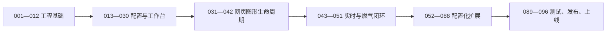

# 电力全流程平台前端原子任务总览

**依据：**《电力全流程平台-前端架构设计》、燃气网页图形三维交互开发计划、燃气发电场景模型与流程映射表，以及当前 Unity 桥接实现。  
**任务粒度：** 每个编号均应可由一名负责人独立领取、独立验收；页面配置按“一个页面定义一项任务”，禁止为页面复制工作台组件。  
**状态：** 全部未开始。

## 一、范围与不可违反约束

1. 普通前端工程应独立于 Unity 工程；普通页面不得写入 `Assets` 目录。
2. 同一时刻最多一个激活的网页图形实例；不得以隐藏页面、组件保活或 iframe 池规避释放。
3. 场景模式仅允许网页图形、静态预览、空态三档。未通过资源、协议、映射校验的页面不得启用网页图形。
4. 页面、拓扑、导览、详情、三维映射必须使用同一配置版本原子发布。
5. 页面、工艺、步骤、节点、路径、运行时和指标必须使用稳定业务标识；禁止将 Unity 层级名、资源文件名、展示文案用作接口参数。
6. 业务组件不得直接发送窗口消息；只能通过统一网页图形连接器。
7. 三维不可用时，二维拓扑、导览和详情必须保持可用，并展示可诊断原因。
8. 每个标签页只允许一条实时连接；指标订阅必须去重并引用计数。

## 二、任务文档目录

| 文档 | 任务编号 | 目标 |
| --- | --- | --- |
| [01-工程与基础能力](01-工程与基础能力.md) | 001—012 | 建立独立工程、应用壳、路由、权限和普通模块边界 |
| [02-配置中心与工艺工作台](02-配置中心与工艺工作台.md) | 013—030 | 建立配置驱动、三栏工作台、导览和二维拓扑能力 |
| [03-网页图形与Unity改造](03-网页图形与Unity改造.md) | 031—042 | 建立单实例网页图形生命周期，并改造现有 Unity 桥接 |
| [04-实时数据与燃气闭环](04-实时数据与燃气闭环.md) | 043—051 | 建立领域服务、实时订阅，并打通燃气三维闭环 |
| [05-页面配置与后续工艺域](05-页面配置与后续工艺域.md) | 052—088 | 完成其余 31 个工艺页和 5 个专题入口的配置化交付 |
| [06-测试性能与发布](06-测试性能与发布.md) | 089—096 | 完成自动化测试、性能、安全发布和上线回归 |

## 三、实施顺序与放行门槛

| 放行阶段 | 必须完成 | 放行结果 |
| --- | --- | --- |
| 工程骨架 | 001—012 | 门户、基础后台入口、路由与布局可运行 |
| 协议与工作台 | 013—042 | 34 个工艺页可由配置访问，网页图形可安全创建与释放 |
| 燃气闭环 | 043—051 | 燃气总览、进气处理、燃机发电完成三处联动 |
| 后续工艺域 | 052—088 | 每个工艺域独立验收、独立发布 |
| 上线 | 089—096 | 满足性能、安全、回滚和端到端回归门槛 |

## 四、当前前置确认项

以下事项不阻塞工程骨架，但会阻塞对应任务的完成验收：

1. 正式前端与 Unity 网页图形的部署域名，以及是否同源部署。
2. 后端接口、鉴权方式、角色权限码、实时数据协议与告警等级。
3. 非燃气工艺域的 Unity 场景包及稳定节点、步骤、路径映射表。
4. 大屏分辨率、目标浏览器、终端硬件基线和并发用户目标。
5. 燃气正式运行时标识、构建标识、映射版本、资源摘要、回滚版本。
6. 框架来源限制、父框架限制、资源内容类型、压缩编码与缓存部署策略。

## 五、统一验收记录要求

每项任务关闭前必须提交：实现说明、变更文件清单、自动化验证结果、手工验证记录、失败场景截图或日志、未解决风险。涉及配置和网页图形的任务还必须记录配置版本、运行时标识、构建标识与关联标识。
