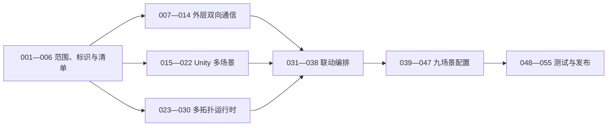

# 九场景三维与多拓扑嵌入模块原子任务总览

**依据：** [电力九场景三维与多拓扑嵌入模块前端架构设计](../电力全流程平台-前端架构设计.md)、[外层内嵌框架双向通信协议](外层内嵌框架双向通信协议.md)、[场景拓扑动作映射规范](场景拓扑动作映射规范.md)、[Codex 开发模型与提示词规范](08-Codex开发模型与提示词规范.md)。

**任务范围：** 只包含三维容器、多拓扑容器、九场景 Unity 单实例运行时、外层双向通信和联动。

**最后更新：** 2026-08-05。

**当前状态：** 新架构的前端模块、Unity 基线和测试夹具已有局部实现。正式 Bootstrap、九场景目录、构建登记和真实编辑器资产测试已经就绪；生产嵌入壳、场景切换协议、拓扑、动作和设备映射仍未装配为可运行主链，旧实现只可作为局部基础。

---

## 一、范围结论

旧版 96 项任务围绕门户、34 个工艺页面、三栏工作台、业务详情、实时接口和系统管理拆分，已不符合当前分工，全部退出当前执行清单。Git 历史可恢复旧文件，本目录只保留新职责范围的有效任务。

当前唯一交付物是一个可被其他前端通过内嵌框架（iframe）加载的可视化子应用，页面仅包含：

1. Unity 三维场景容器。
2. 多拓扑容器。
3. 外部父页面双向通信桥。
4. 场景、拓扑和动作联动协调器。

---

## 二、不可违反约束

1. 同一时刻最多一个 Unity 网页图形构建（WebGL）实例和一个活动业务场景。
2. 同一时刻最多一个活动拓扑画布，不创建隐藏画布池。
3. 九个场景使用同一个 Unity 运行包和同一个内部内嵌框架；场景切换通过 Unity 内部 `switchScene`，不得释放重建运行包。
4. “一个包”指一个发布版本和目录，不代表九场景全部进入首屏单一数据文件。
5. 外层 `power-scene-topology-shell` 与内层 `power3d-unity` 必须使用不同通道和连接器。
6. 外部父页面不得直接向 Unity 转发任意消息；必须先经过动作映射和运行时字段校验。
7. 场景与拓扑作为同一个事务切换；切换期间禁止出现可操作的错配组合。
8. 拓扑节点单击立即本地选中并按映射聚焦三维；双击额外向父页面上报 `deviceId`。
9. `nodeId`、`deviceId` 和 `sceneNodeId` 分别表示二维节点、外部设备和三维节点，不能隐式混用。
10. 场景、拓扑、动作、设备映射和 Unity 构建版本必须原子发布。
11. 未提供正式映射时不得根据标题、截图、模型名、文件名或坐标关系猜测。
12. 所有新增或修改代码必须有与实现一致的详细中文注释，采用 UTF-8 编码。
13. 所有缓存、队列、监听器、计时器和资源句柄必须有容量上限和释放路径。
14. 当前工作区存在用户未提交修改，实施时只能增量重构，禁止覆盖或回退无关改动。

---

## 三、任务文档目录

| 文档 | 编号 | 目标 |
| --- | --- | --- |
| [01-范围收缩与嵌入运行壳](01-范围收缩与嵌入运行壳.md) | 001—006 | 删除无关页面职责，建立单一嵌入入口、标识和清单基础 |
| [02-外层内嵌框架双向通信](02-外层内嵌框架双向通信.md) | 007—014 | 建立父页面与当前子应用的安全双向协议和联调环境 |
| [03-Unity多场景运行时](03-Unity多场景运行时.md) | 015—022 | 建立启动场景、九场景单实例切换、流程动作和资源治理 |
| [04-多拓扑运行时](04-多拓扑运行时.md) | 023—030 | 建立多图注册、切换、单击、双击、缓存和释放 |
| [05-场景拓扑联动编排](05-场景拓扑联动编排.md) | 031—038 | 建立原子切换事务、回环阻断、失败恢复和状态同步 |
| [06-九场景配置与映射](06-九场景配置与映射.md) | 039—047 | 九个场景分别交付 Unity、拓扑、动作和设备映射 |
| [07-测试性能与发布](07-测试性能与发布.md) | 048—055 | 完成协议、联动、性能、安全、部署和回滚验收 |
| [08-Codex开发模型与提示词规范](08-Codex开发模型与提示词规范.md) | 执行规范 | 为每个任务指定模型、推理强度、升级规则和可复制提示词 |

配套规范：

- [拓扑容器与多图切换规范](拓扑图/拓扑容器与多图切换规范.md)
- [多拓扑与 Unity 多场景联动规范](拓扑图/多拓扑与Unity多场景联动规范.md)
- [图元与设备状态规范](拓扑图/图元与设备状态规范.md)

---

## 四、任务完成进度表

**统计日期：** 2026-08-05。

**当前执行任务：** 任务-013、020、022、025、027—029、033—038、040、049—052存在可验证的局部实施；任务-051已通过真实编辑器、播放模式、开发与正式 WebGL 构建验证，任务-052已用真实燃气网页图形完成最小三层联调，仍等待正式九场景内容与映射资料；任务-021的独立回归和正式部署来源仍待核验。001—012、014—019、023—024、026、031—032、048 已完成，可按依赖进入外层通信、Unity 多场景与多拓扑三条主线。

**规划完成：** 55 / 55（100%）。

**已完成：** 25 / 55（45%）。

**已实现待验收：** 0 / 55（0%）。

**进行中：** 16 / 55（29%）。

**未开始：** 13 / 55（24%）。

**已阻塞：** 1 / 55（2%）。

**实施完成度：** 67%（按任务要求、生产接线、自动测试和真实资料四类证据加权；独立模块、合成夹具和旧燃气实现只计局部进度）。
**当前阻塞任务：** 1 / 55；任务-021的 Unity 批处理验证当前被许可客户端签名校验失败和访问令牌缺失阻断。用户在 Unity Hub 中重新登录、修复匹配版本许可客户端并确认项目锁已由正常 Unity 生命周期清理后，可立即恢复编辑器与播放模式回归。正式部署来源、场景资源与动作映射等资料缺失时，也会阻塞对应任务最终关闭。

本次核对证据：任务-002已通过推荐与最小分辨率下的双容器、全屏和无外层滚动条验证；任务-003已在删除前建立两个本地 Git 贮藏保护未提交的旧工作台与旧配置测试改动；任务-004已验证九个固定场景目录、资源与路径拒绝、会话和切换事务标识，以及领域标识的编译期不可互换性；任务-005已验证缺场景、默认拓扑跨场景、动作目标错误、双击缺少设备标识、三维映射缺少三维节点和发布版本错配均会阻止加载；任务-006已通过应用内浏览器验证部署配置错误和清单网络错误均显示脱敏说明、稳定错误码与关联标识，且不白屏；任务-007已校验六类命令、八类事件、通道、版本、实例、会话、消息标识、响应关联、时间戳、消息体、数组与字符串边界，并修正“未声明能力”受控错误码的出站校验遗漏；任务-009已验证部署白名单、精确父来源、当前父窗口、实例和会话隔离，以及出站精确目标来源，伪造来源、同源其他窗口、错误实例和旧会话均在业务入口前拒绝；任务-010已验证 ready、init、ack 的顺序与关联、清单版本拒绝、15 秒等待后补初始化、释放计时器清理以及未初始化业务命令门禁；任务-011已验证 64 条待确认上限、256 条近期结果缓存策略、重复消息、replyTo 关联、十秒超时、迟到结果忽略和释放清理；任务-015已由 Unity 编辑器生成 Bootstrap、九场景目录、构建设置和映射资产，旧 `SampleScene` 已安全迁移为 `GasPower` 并保留 GUID；当前 Unity 编辑模式完整测试 14 项全部通过。任务-018已验证 `switchScene` 的场景、事务、映射版本和原请求关联，非法进度、旧事务回调、伪造来源或错误子窗口均不能进入前端业务回调；内置浏览器的三层本地夹具已完成握手、尺寸、场景切换、释放和重复进入回归。任务-019已在真实 Bootstrap 与桥接管理器上依次执行九个目录场景请求，验证单实例、单协调器订阅、活动控制器重绑、首次与重复释放以及释放后禁止对象回调；运行模式 3 项、编辑模式 14 项全部通过。任务-021已补齐流程、聚焦、四态状态、路径流动、显隐与复位的内层协议白名单、前后端载荷校验和当前场景控制器转发；燃气未登记四态和路径能力时明确返回 `capability-unsupported`，不伪造资源实现。前端 20 个测试文件、79 项测试、类型检查与生产构建通过；Unity 编辑模式 15 项通过；应用内浏览器本地三层夹具已验证新增六类动作的能力协商与逐请求回执，控制台无错误。新运行模式用例因用户当前打开 Unity 工程占用项目锁，尚待重跑。浏览器已验证任务-025的旧燃气面板布局，但该面板与新多拓扑类型未接线，不能作为九场景验收；本地回归页仍绕过当前嵌入壳直连模拟 Unity，不能计作完整三层端到端验收。

状态口径：

| 状态 | 进度 | 判定标准 |
| --- | ---: | --- |
| 未开始 | 0% | 尚未阅读任务和实施材料，未产生本任务变更 |
| 进行中 | 10%—80% | 已启动实施；进度按“阅读与方案、核心实现、异常与释放、验证”四阶段如实更新 |
| 待验收 | 90% | 代码和资料已提交，待执行全部验证或等待外部资料确认 |
| 已完成 | 100% | 已满足任务需求、交付和验收，验证结果已记录 |
| 已阻塞 | 保留原进度 | 缺少外部资料、权限或环境；必须写明阻塞项和恢复条件 |

### 分组进度

| 任务组 | 完成 / 总数 | 进度 | 当前状态 | 下一项 | 主要前置或阻塞 |
| --- | ---: | ---: | --- | --- | --- |
| 001—006 范围收缩与嵌入运行壳 | 6 / 6 | 100% | 6已完成 | 007 | 三条后续主线可按稳定标识、清单和部署边界继续接入 |
| 007—014 外层内嵌框架双向通信 | 7 / 8 | 98% | 7已完成、1进行中 | 013 | 受控发送器、真实外层桥组合、握手、命令回包、`view.open` 事务回调和受控三维反向选择事件已接线；三层夹具已自动回归查询关联、重复结果回放、旧会话/伪造来源拒绝、快速取代、异常恢复、十秒超时、迟到回调隔离、释放及三维选择；仍缺真实发布环境联调 |
| 015—022 Unity 多场景运行时 | 5 / 8 | 88% | 5已完成、2进行中、1已阻塞 | 020 | 已接入九场景资产包构建、哈希缓存与租约释放；八个场景仍仅有显式“释放”占位能力，正式四态/路径映射仍待完成。任务-051的编辑器、播放模式和两类 WebGL 构建均已通过；任务-021仍需独立回归核验 |
| 023—030 多拓扑运行时 | 5 / 8 | 90% | 5已完成、3进行中 | 027 | 正式清单注册表、投影端口、唯一预备画布、配置化面板、受控图元登记与释放边界已接入嵌入壳；合法外层初始化可激活当前拓扑，设备双击、单击显式三维聚焦及有限设备状态缓存均已验证；真实正式清单联调尚未完成 |
| 031—038 场景拓扑联动编排 | 2 / 8 | 81% | 2已完成、6进行中 | 033 | `view.open`、流程动作、设备状态与三维反向选择已接入真实拓扑、Unity受控端口、外层桥和组合根；状态与选择均具有限制容量、失败隔离和回环阻断；仍缺正式映射与真实网页图形构建联调 |
| 039—047 九场景配置与映射 | 0 / 9 | 8% | 1进行中、8未开始 | 040 | 燃气现有三维与 24 节点、23 连线拓扑已在真实网页图形联调包中验证；缺九个正式场景、动作、设备和资源映射 |
| 048—055 测试性能与发布 | 1 / 8 | 54% | 1已完成、4进行中、3未开始 | 049 | 两层协议单元套件已逐项覆盖并关闭；发布契约命令、有限 JSON 报告、GitHub Actions 门禁和无效清单构建前阻断已交付；任务-051已通过 19 项编辑器模式、4 项播放模式、开发与正式 WebGL 构建，正式包含九场景资源目录和内容摘要；双容器已补充最小尺寸、全屏重复开关、缩放、Esc 退出、唯一画布和无嵌入壳滚动条浏览器证据，并纳入常规与带鱼屏视觉基准及自动差异阈值门禁；真实燃气网页图形联调包已通过三层初始化、16:9 画布与无内部滚动条验证；仍缺正式九场景映射、其余八场景网页图形联调与发布资料 |

### 原子任务进度明细

| 编号 | 任务 | 状态 | 进度 | 最后更新 | 阻塞项 / 下一动作 |
| --- | --- | --- | ---: | --- | --- |
| 001 | 旧职责清理清单与保护性基线 | 已完成 | 100% | 2026-08-04 | 已形成保护性基线、文件清理清单、复用映射和风险清单 |
| 002 | 单一嵌入入口与双容器壳 | 已完成 | 100% | 2026-08-05 | 唯一生产路由和双容器壳已验证：无旧导航与详情、无外层滚动条；三维容器固定 16:9，按实际嵌入内容宽度与动态可视高度的比例约束等比缩放并居中，不使用 1280×720 等固定像素上限，适配 2K、4K、8K 和带鱼屏；拓扑容器占用剩余高度。内部浏览器实测全高清、2K、4K与带鱼屏下三维均为精确 1.778、拓扑约保留 42% 高度且无外层滚动；浏览器单边上限为 4096，8K 在此上限内保持 16:9，完整 8K 由相同无像素上限公式连续缩放。拓扑全屏已单独复核：解除常规态同宽限制后，面板按子应用视口边距自适应展开，画布填充标题和状态摘要之外的全部剩余高度；真实父页与 Unity 联调属于后续通信和多场景任务 |
| 003 | 旧页面、路由与依赖收缩 | 已完成 | 100% | 2026-08-04 | 删除前已贮藏用户改动；旧页面、布局、导航、权限、请求、实时和图表职责已清除；保留仍被生产入口使用的路由、状态库和临时燃气配置；类型检查、62 项测试、构建和产物扫描通过 |
| 004 | 稳定标识类型重构 | 已完成 | 100% | 2026-08-04 | 场景、拓扑、动作、二维节点、设备、三维节点、会话和切换事务均有严格品牌类型、工厂函数和运行时校验；九场景固定目录、资源与路径拒绝、类型隔离已通过回归验证 |
| 005 | 场景拓扑原子清单模型 | 已完成 | 100% | 2026-08-04 | 已交付场景、拓扑、动作、设备与 Unity 映射的原子清单类型、加载器、校验器和错误编码；缺场景、默认拓扑跨场景、动作目标、设备双击、三维映射及版本错配均有阻断回归；正式场景内容由 039—047 逐项交付 |
| 006 | 部署配置与基础诊断状态 | 已完成 | 100% | 2026-08-04 | 外层父页面来源、Unity直接父页面来源、Unity入口、清单地址和最小尺寸均由构建环境读取；内外两层父来源使用独立精确配置，避免跨域三层嵌入时误用。嵌入壳以省略凭据方式读取并校验清单，超时、取消、配置、尺寸、Unity、拓扑与释放状态均显示稳定错误码和关联标识；单元与三层浏览器回归通过 |
| 007 | 外层协议类型与载荷校验 | 已完成 | 100% | 2026-08-04 | 已交付统一信封、六类命令、八类事件、错误码、容量限制、类型守卫与逐类型运行时校验；未知类型、超长标识、超大消息和无效载荷均有回归验证。桥接订阅与生产组合属于 008—012 |
| 008 | 统一窗口消息路由器 | 已完成 | 100% | 2026-08-04 | 唯一路由器已按 `power-scene-topology-shell` 与 `power3d-unity` 分流；外层桥和 Unity 连接器均以订阅方式接入，未知通道仅保留 50 条受限诊断，订阅释放后移除全局监听 |
| 009 | 父来源、父窗口与会话隔离 | 已完成 | 100% | 2026-08-04 | 已交付部署白名单与启动参数双重校验、每次启动会话、精确来源和父窗口校验、实例与会话隔离及精确目标来源发送；伪造来源、同源其他窗口、错误实例和旧会话均无法进入业务回调。生产组合属于 010—012 |
| 010 | 就绪、初始化与能力握手 | 已完成 | 100% | 2026-08-04 | 已交付 ready、init、ack 握手状态机、固定九场景目录、清单版本与能力声明、15 秒等待状态及释放清理；版本错配和未初始化业务命令均被拒绝。生产组合属于 011、012 |
| 011 | 命令确认、去重、超时与容量控制 | 已完成 | 100% | 2026-08-04 | 已交付 64 条待确认表、256 条近期结果缓存、replyTo 关联、十秒超时、重复消息拒绝、容量拒绝与释放清理；迟到结果无法重新提交。生产组合属于 012 |
| 012 | 外部命令入口 | 已完成 | 100% | 2026-08-04 | 已交付外层命令白名单与分派器：仅转交已校验的 view.open、workflow.trigger 和设备状态意图；state.get 只读快照，dispose 仅提交协调器释放；未声明能力、旧版本和已释放状态均返回结构化结果。具体事务端口属于 033、034、038 |
| 013 | 外部事件上报 | 进行中 | 80% | 2026-08-05 | 已交付受控发送器、真实桥/握手/生命周期组合、命令和状态关联、稳定视图变更、正式设备双击转换及任务-037三维反向选择事件；三层浏览器夹具已验证映射后的 `scene.object.selected` 且不回发聚焦。真实发布环境联调仍待完成；详见 `02-任务-013-外部事件上报-实施状态.md` |
| 014 | 三层本地联调环境 | 已完成 | 100% | 2026-08-04 | 已建立并浏览器实测外层宿主页 → 当前嵌入壳 → Unity 模拟页的初始化、切换、状态查询、双击与释放；两类自动回归覆盖查询关联、重复命令结果回放、旧会话和同源伪造来源拒绝、快速取代、最终失败恢复、十秒超时、迟到回调隔离与释放，且已修复内外父来源混用和过早释放确认。正式 WebGL、九场景资源、动作与三维反向选择归属 020—022、037、039—047；详见 `02-任务-014-三层本地联调环境-实施状态.md` |
| 015 | 常驻启动场景与构建设置 | 已完成 | 100% | 2026-08-04 | 已创建轻量 Bootstrap 和八个空业务场景；已将用户确认的旧 SampleScene 安全改名为 GasPower 并保留 GUID；九项 sceneId → unitySceneKey → scenePath 目录、构建索引零和真实资产编辑器测试已完成。八个场景目前仅声明幂等释放，业务内容由 039、041—047 逐项补充 |
| 016 | 统一业务场景控制接口 | 已完成 | 100% | 2026-08-04 | 已交付 IBusinessSceneController、能力位、目录一致性校验、控制器基类、统一注册表、八个空场景显式占位控制器和燃气组合适配器；桥接仅依赖统一接口。已验证九个真实场景均由注册表解析且能力与目录一致；未声明或漏实现能力均返回结构化失败，不会静默成功 |
| 017 | 多场景异步加载协调器 | 已完成 | 100% | 2026-08-04 | 已交付目录校验、串行异步卸载/加载/初始化、事务取代、迟到场景清理、失败恢复和幂等释放；实际 Bootstrap、燃气与燃煤占位场景运行模式测试验证成功切换、内容失败后恢复及旧事务不可改写当前场景 |
| 018 | 内部场景切换协议 | 已完成 | 100% | 2026-08-04 | 已交付 `switchScene`、`sceneLoadProgress`、`sceneChanged` 的网页和 C# 载荷模型、版本与能力声明、请求确认、原请求关联、事务/进度校验及浏览器桥接白名单；前端 77 项、Unity 编辑模式 14 项、运行模式 2 项和内置浏览器本地回归通过 |
| 019 | 桥接管理器跨场景生命周期 | 已完成 | 100% | 2026-08-04 | 已交付一次浏览器桥接初始化、场景加载时的延迟协调器重绑、单订阅保护和释放解除；真实 Bootstrap 运行模式已依次覆盖九个目录请求、控制器重绑、单实例/单订阅、首次与重复释放及释放后禁止回调。实际 WebGL 发布包构建与浏览器性能数据归入 020、022 |
| 020 | 单发布版本与场景资源拆分 | 进行中 | 70% | 2026-08-04 | 已交付只含 Bootstrap 的主播放器构建、九个独立场景资产包、共享依赖分包、发布标识、内容摘要、哈希与循环冗余校验目录、同版本缓存和租约释放；已修复资源包误调用场景加载方法导致的 CS1061，并由当前 Unity 编辑器强制同步重编译验证。正式目录不可覆盖，尚待真实开发/正式包构建、浏览器缓存回归及九个正式资源容量复核 |
| 021 | 流程、聚焦、状态和路径动作适配 | 已阻塞 | 60% | 2026-08-05 | 已补齐流程、聚焦、四态状态、路径流动、显隐和复位的协议白名单、稳定载荷校验、当前控制器转发与结构化结果；燃气可复用流程/聚焦/显隐/复位，四态和路径因正式映射未交付而明确拒绝。此前编辑器占锁已解除，但本轮批处理因 Unity 许可客户端签名校验失败、访问令牌缺失而未启动测试框架；需在 Unity Hub 恢复许可证后重跑 |
| 022 | Unity 资源释放与运行诊断 | 进行中 | 75% | 2026-08-04 | 已交付单事务受限诊断快照，覆盖加载耗时、首帧、峰值内存、失败阶段与当前场景；阶段去重避免逐帧采样，旧事务和迟到首帧不能回写；开发/正式 WebGL 构建入口已分离。当前 Unity 编辑器持锁，尚待编辑器/运行模式回归与真实开发包、正式包构建；正式九场景资源所有者清单仍等待020、039—047 |
| 023 | 多拓扑类型与注册表 | 已完成 | 100% | 2026-08-04 | 已交付场景默认拓扑、多套可切换拓扑、节点、设备、三维节点与双击行为类型；注册表仅从完整校验清单建立索引，跨场景拓扑被拒绝，双击设备标识缺失由发布校验阻断。正式内容由 039—047 提供 |
| 024 | 单画布多拓扑运行时 | 已完成 | 100% | 2026-08-04 | 已交付单画布 prepare/activate 运行时、事务校验、有限准备与视图缓存、选择增量、缩放平移恢复和幂等释放；准备与跨场景/旧事务均不会改写当前画布。组件接线属于 025 |
| 025 | 拓扑面板配置化与容器布局 | 已完成 | 100% | 2026-08-05 | 标题、四类连线图例和四态状态摘要均由当前拓扑配置生成；空拓扑与空白标题不猜测业务名称，唯一预备画布复用不创建第二实例。已将用户确认的燃气拓扑视觉、分层、文字避让、响应式同宽与全屏基线固化至 `拓扑图/拓扑容器与多图切换规范.md`，后续场景仅可替换正式配置，不得复制燃气专有数据。31 个测试文件、132 项测试、构建及内部浏览器 600×600、1280×720常规/全屏回归通过；详见 `04-任务-025-拓扑面板配置化实施记录.md` |
| 026 | 拓扑更新性能修复 | 已完成 | 100% | 2026-08-04 | 定义、选择、状态和尺寸已走独立可测试通道；状态增量不重建路径缓存、未知节点不缓存且同帧合并重绘；专项回归、类型检查和生产构建通过。真实状态流性能预算由 054 验收 |
| 027 | 拓扑节点双击设备事件 | 进行中 | 80% | 2026-08-05 | 已实现画布双击命中、显式设备意图、幂等选择及外层 `topology.node.dblclick` 上报；新增设备映射逐节点闭环校验，映射存在但未引用二维节点也会拒绝发布。内部浏览器真实双击燃气测试节点只上报一次 `device.gas-turbine`，概念/未知/上下文错配节点不发送；正式九场景清单与目标浏览器联调仍缺失；详见 `04-任务-027-拓扑节点双击设备事件-实施状态.md` |
| 028 | 拓扑单击与三维聚焦 | 进行中 | 85% | 2026-08-05 | 二维选择先提交、显式且已在所属 Unity 场景登记的 `sceneNodeId`、并协商能力时才发送 `focusNode`；Unity 来源阻断回写，关联标识固定容量去重，三维失败不回滚二维选择。专项、全量 134 项、构建和内置浏览器“0→1→1”重复点击回归通过；用户已在真实燃气网页图形中确认拓扑节点点击后 Unity 模型聚焦并描边。正式九场景映射、其余八场景真实网页图形验证、失败回执与任务-037反向选择仍待完成；详见 `04-任务-028-拓扑单击与三维聚焦-实施状态.md` |
| 029 | 设备状态增量与多图状态缓存 | 进行中 | 80% | 2026-08-05 | 已交付按显式 `deviceId` 合并、时间戳丢弃、非法状态离线化、二维/三维映射快照和固定容量缓存；基线状态保留受限空快照，避免活动图重复扫描设备映射；状态更新不改写拓扑、选择或视图。任务-038已接通组合根、Unity 实发和有限诊断；正式九场景映射待交付；详见 `04-任务-029-设备状态增量与多图状态缓存-实施状态.md` |
| 030 | 图元资源迁移与拓扑释放验收 | 已完成 | 100% | 2026-08-05 | 已将登记表实际引用的 52 个 SVG 迁入前端资产目录，13 个受控键按四态解析；生产源码与构建产物无文档资源依赖。图片缓存固定上限 52，释放时断开回调并归零画布缓冲；31 个测试文件、130 项测试、构建及内部浏览器全屏单画布回归通过；详见 `04-任务-030-图元资源迁移与拓扑释放-实施状态.md` |
| 031 | 可视化稳定上下文状态 | 已完成 | 100% | 2026-08-04 | 已交付只含场景、拓扑、动作、选择、上下文版本、事务、运行状态和受限诊断的可序列化仓库；生产场景面板已移除旧工艺状态镜像，窗口、画布、计时器、命令表和资源句柄均不进入新仓库。未引用旧仓库列入后续贮藏后文件清理 |
| 032 | 唯一联动协调器 | 已完成 | 100% | 2026-08-04 | 已交付事务、状态、选择、诊断和释放的唯一协调器与冻结门面；嵌入壳作为唯一组合根创建仓库、协调器并注入门面，销毁时统一释放上下文；协调器不依赖窗口消息、画布或 Unity 对象 |
| 033 | `view.open` 原子切换事务 | 进行中 | 80% | 2026-08-04 | 已实现清单校验、预解析、可选切场景和动作、拓扑激活、单次提交、失败恢复、内层最终回执等待、真实嵌入壳/外层桥组合，以及基于完整活动事务的双容器遮罩与可访问状态；内部浏览器已通过合成三层快速取代、失败恢复、超时、迟到隔离和释放回归，仍缺正式映射及真实网页图形构建联调 |
| 034 | 同场景流程动作 | 进行中 | 70% | 2026-08-04 | 已接入按实际安装状态声明的 `workflow.trigger`、当前场景与动作交叉校验、原子事务复用、默认保持上下文与显式带警告提交策略；内部浏览器合成燃气重置动作确认未切换场景。正式动作、参数字段映射和真实网页图形构建验收仍缺失；详见 `03-任务-034-同场景流程动作-实施状态.md` |
| 035 | 跨场景动作 | 进行中 | 70% | 2026-08-04 | 已接入根据清单目标与当前稳定场景的显式范围路由；跨场景流程动作复用“预解析→切场景→动作→激活→提交”原子事务，内部浏览器合成燃气→风电动作通过。正式参数映射、真实网页图形构建阶段反馈、资源取消与九场景验收仍缺失；详见 `03-任务-035-跨场景动作-实施状态.md` |
| 036 | 快速切换取代与失败恢复 | 进行中 | 70% | 2026-08-04 | 已验证连续三次 `view.open` 仅最后一次提交、场景与动作阶段的迟到回调均被取代、目标场景后的动作/拓扑失败会物理回切三维与单画布；回退无法确认时清空稳定上下文并进入明确错误态。内部浏览器合成三层回归通过；仍缺真实网页图形资源取消与正式动作映射验收 |
| 037 | 三维反向选择与外部事件 | 进行中 | 80% | 2026-08-05 | 已交付场景+三维节点常数时间映射、当前拓扑选择同步、64 条重复回调阻断、受限诊断与外层 `scene.object.selected` 上报；33 个测试文件、147 项测试、类型检查、构建及内置浏览器三层映射链路通过。真实 Unity 正式节点映射与任务-021播放模式验证仍待完成；详见 `03-任务-037-三维反向选择与外部事件-实施状态.md` |
| 038 | 设备状态批量协调与可观测性 | 进行中 | 80% | 2026-08-05 | 已接入 `device.states.update`、二维/Unity 独立结算、最多八路受限下发、异常隔离和 64 条脱敏诊断；32 个测试文件、141 项测试、类型检查、构建及内置浏览器合成状态链路通过。真实 Unity 四态能力和九场景正式映射待交付；详见 `03-任务-038-设备状态批量协调与可观测性-实施状态.md` |
| 039 | 燃煤发电场景配置与映射 | 未开始 | 0% | — | 等待模板接口和正式映射 |
| 040 | 燃气发电场景复验与模板冻结 | 进行中 | 70% | 2026-08-05 | 用户已确认 `GasPower` 现有场景即为燃气发电，故保持稳定场景键与资源路径；现有三维及 24 节点、23 连线燃气拓扑已在真实 WebGL 联调包完成三层初始化，嵌入模板已固定为响应式画布。设备、对象、三维路由与正式动作/状态映射仍待真实资料确认 |
| 041 | 风力发电场景配置与映射 | 未开始 | 0% | — | 等待 040 模板冻结和正式映射 |
| 042 | 光伏发电场景配置与映射 | 未开始 | 0% | — | 等待 040 模板冻结和正式映射 |
| 043 | 变电站场景配置与映射 | 未开始 | 0% | — | 等待 040 模板冻结和正式映射 |
| 044 | 配电网场景配置与映射 | 未开始 | 0% | — | 等待 040 模板冻结和正式映射 |
| 045 | 用能侧场景配置与映射 | 未开始 | 0% | — | 等待 040 模板冻结和正式映射 |
| 046 | 微电网场景配置与映射 | 未开始 | 0% | — | 等待 040 模板冻结和正式映射 |
| 047 | 调度运行场景配置与映射 | 未开始 | 0% | — | 等待 040 模板冻结和正式映射 |
| 048 | 外层与内层协议单元测试 | 已完成 | 100% | 2026-08-05 | 两层信封、逐类型载荷、来源、窗口、实例、会话、能力、确认、去重、超时、容量和释放均已有直接单元覆盖；错误来源与旧会话在进入协调器前被拒绝，响应按原请求关联，未知类型和超大载荷被阻断。真实浏览器端到端与正式 WebGL 验收属于任务-052，不构成单元测试未完成项；详见 `07-任务-048-外层与内层协议单元测试-实施状态.md` |
| 049 | 清单与动作映射契约测试 | 进行中 | 80% | 2026-08-05 | 已交付复用运行时校验器的清单契约命令、有限 JSON 报告、`build:release` 发布门禁和 GitHub Actions 工作流；有效九场景夹具可完成生产构建，缺场景等无效清单在构建前以退出码 1 阻断。正式九场景清单与首次远端工作流运行尚缺；详见 `07-任务-049-清单与动作映射契约测试-实施状态.md` |
| 050 | 双容器与多拓扑组件测试 | 进行中 | 80% | 2026-08-05 | 单画布循环切换、图元缓存上限与释放、配置化面板、最小尺寸、全屏、缩放、平移、双击基础、单击—显式三维聚焦及状态增量映射测试存在；内部浏览器补充 600×600 无嵌入壳溢出、1280×720 连续六次全屏进出、Esc 退出、缩放复位与唯一画布回归，状态更新不重建拓扑、选择和视图；常规与带鱼屏视觉基准、受限 JPEG 自动差异阈值门禁和不可覆盖的差异图输出均已纳入版本库。仍缺正式多图组件与真实网页图形验收；详见 `07-任务-050-双容器与多拓扑组件测试-实施状态.md` |
| 051 | Unity 多场景编辑器与构建测试 | 进行中 | 80% | 2026-08-05 | 真实批处理已验证编辑器模式 19 / 19、播放模式 4 / 4 通过；开发与正式 WebGL 均构建成功，正式发布 `task051-20260805-1400` 含九个独立场景资源包、哈希目录和内容摘要，且不启用开发构建。已修复构造期性能采样异常和过期事务遗留隐藏场景；八个场景仍缺正式动作、状态、路径与资源映射，详见 `07-任务-051-Unity多场景编辑器与构建测试-实施状态.md` |
| 052 | 三层通信端到端测试 | 进行中 | 90% | 2026-08-05 | 内部浏览器已实际通过初始化、同/跨场景动作、画布双击、三维选择、设备状态、连续三次取代、失败恢复、十秒超时、旧会话/伪造来源拒绝与释放；2K、4K、8K 请求与带鱼屏均保持三维 16:9、拓扑占余量且无外层纵向滚动条，8K 请求受测试浏览器约 4096 像素可用高度限制。新增真实燃气 WebGL 联调包已验证外层宿主页→嵌入壳→Unity、现有 24 节点/23 连线拓扑、740×416 等比画布及无内部滚动条；正式九场景资料、八个未交付场景联调及失败截图归档仍缺；详见 `07-任务-052-三层通信端到端测试-实施状态.md` |
| 053 | 九场景逐项验收 | 未开始 | 0% | — | 等待 039—047 完成 |
| 054 | 长时间运行与性能预算 | 未开始 | 0% | — | 等待 052、053 完成和目标硬件基线 |
| 055 | 安全部署、版本发布与接入说明 | 未开始 | 0% | — | 等待 048—054 完成和正式部署来源 |

进度维护规则：

1. 开始原子任务时，先把对应行更新为“进行中”、10%，并写入日期和当前动作；旧实现或孤立源码不能自动计入新任务进度。
2. 完成核心正向流程后更新为 60%；补齐异常、超时、释放、生产接线和回归验证后更新为 80%。
3. 代码、正式资料和验收环境均已齐备，仅待执行最终验收时才更新为“待验收”、90%；不得因单元测试通过标为“已完成”。
4. 每次任务关闭必须同步更新本表、分组进度和顶部四项统计；状态更新是任务关闭的一部分，并应写入对应实施记录的验证证据。
5. 任务被外部资料阻塞时改为“已阻塞”，保留原进度，并在“阻塞项 / 下一动作”列写明恢复条件。

---

## 五、依赖关系

实施规则：

1. 任务 001—006 完成后，外层通信、Unity 多场景和多拓扑三条主线可并行。
2. 任务 031—038 依赖三条主线的稳定接口，不依赖九场景全部完成。
3. 任务 039—047 彼此独立，可由多名负责人并行；燃气发电任务 040 优先冻结模板。
4. 单元和组件测试随对应任务同步完成，最终端到端和长时间性能测试进入 048—055。
5. 每次 Codex 会话只执行一个原子任务；发送前必须按[模型与推理强度矩阵](08-Codex开发模型与提示词规范.md#四任务模型与推理强度矩阵)确认最低配置。当前模型和推理强度均不低于任务要求时可以继续；任一项低于要求时必须停止并切换。
6. 默认使用 `5.6 Terra`＋高（`high`）；复杂 Unity 生命周期、竞态、恢复、安全和性能任务按矩阵使用 `5.6 Sol`＋高（`high`）或超高（`xhigh`）。
7. 最高（`max`）和极致（`ultra`）只在连续两次修复失败后按升级规则使用，不得作为日常默认值。

---

## 六、旧实现复用映射

| 现有能力 | 新任务去向 | 状态 |
| --- | --- | --- |
| 稳定标识和配置校验 | 004—005 | 待删除页面、权限、导览和详情语义后复验 |
| 单一动作协调器和来源防回环 | 031—037 | 保留思想，重写为场景拓扑事务 |
| Unity 单实例宿主和安全连接器 | 015—019 | 保留，固定统一运行包并新增场景切换 |
| Unity 释放、尺寸和本地内嵌框架回归 | 019、022、014 | 保留并升级三层联调 |
| 拓扑画布、全屏、缩放和路径缓存 | 023—030 | 保留，新增多图和双击并修复重复重建 |
| 燃气三维、拓扑和流程映射 | 040 | 作为首个完整模板复验 |
| 其余 33 个空页面配置 | 不复用 | 删除，不再保留页面空壳 |

---

## 七、统一任务关闭要求

每项任务关闭前必须提交：

1. 实现说明和变更文件清单。
2. 与代码一致的详细中文注释。
3. 单元、组件、Unity 编辑器或联调验证结果。
4. 正向、失败、超时、重复和释放场景记录。
5. 性能影响和资源释放说明。
6. 未解决风险和外部依赖。
7. 涉及协议时记录协议版本、实例、会话、消息和关联标识。
8. 涉及场景时记录 Unity 构建标识、场景映射版本和资源版本。
9. 涉及拓扑时记录拓扑版本、节点数、边数、设备映射和性能基线。

---

## 八、当前阻塞资料

以下资料缺失不阻塞基础代码，但阻塞对应场景最终关闭：

1. 外部父页面、当前子应用和 Unity 子页的正式部署来源。
2. 九个 Unity 场景文件的正式名称和资源清单。
3. 每个场景的默认拓扑和可切换拓扑清单。
4. 外部菜单、按钮、子项到 `actionId` 的正式清单。
5. 动作到场景、拓扑、流程步骤和三维节点的映射。
6. 拓扑节点到正式 `deviceId` 的映射。
7. 目标浏览器、终端硬件、内存和带宽基线。
8. 场景重资源采用 Unity 资产包（AssetBundle）还是引入可寻址资源系统（Addressables）。
