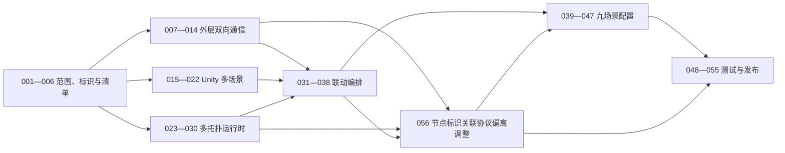

# 九场景三维与多拓扑嵌入模块原子任务总览

**依据：** [电力九场景三维与多拓扑嵌入模块前端架构设计](../电力全流程平台-前端架构设计.md)、[外层内嵌框架双向通信协议](外层内嵌框架双向通信协议.md)、[场景模型节点与拓扑节点命名规范](场景模型节点与拓扑节点命名规范.md)、[场景拓扑动作映射规范](场景拓扑动作映射规范.md)、[Codex 开发模型与提示词规范](08-Codex开发模型与提示词规范.md)。

**任务范围：** 只包含三维容器、多拓扑容器、九场景 Unity 单实例运行时、外层双向通信和联动。

**最后更新：** 2026-08-15。

**当前状态：** 正式 Bootstrap、九场景目录、生产嵌入壳、场景切换协议、燃气拓扑、Unity 聚焦链路、拓扑双击框架与场景级资源治理均已装配为可运行主链。2026-08-15最新会议已纠正此前对接偏差：平台不向我方注入 `deviceId`、`deviceMappings` 或 `platformBindingCount`，只读取结构清单中的 `nodeId` 并在平台内部维护 `nodeId → 真实设备编号`。任务-056已完成双击事件、完整状态快照、三维反向选择、递归旧职责拒绝、正向发布摘要、同源结构清单、持续集成和产物门禁修正；新5556本地包的真实燃气23/22总览、三个关键流程、总览复位、两类原生全屏和单实例复用均通过。合作方联调包和正式包现支持运行时同源模式，启动后可用局域网实际地址独立访问，不再把未知服务 IP 作为构建阻塞；当前仍待生成新包并完成合作方独立服务端到端验收，任务-056保持进行中80%。完整快照、来源修订仅诊断、二维提交决定外层成功、本地快照序号迟到隔离和三维失败不影响回执等能力继续保留。

---

## 一、范围结论

旧版 96 项任务围绕门户、34 个工艺页面、三栏工作台、业务详情、实时接口和系统管理拆分，已不符合当前分工，全部退出当前执行清单。Git 历史可恢复旧文件，本目录只保留新职责范围的有效任务。

当前唯一交付物是一个可被其他前端通过内嵌框架（iframe）加载的可视化子应用，页面仅包含：

1. Unity 三维场景容器。
2. 多拓扑容器。
3. 外部父页面双向通信桥。
4. 场景、拓扑和动作联动协调器。

---

## 二、不可违反约束

1. 同一时刻最多一个 Unity 网页图形构建（WebGL）实例和一个活动业务场景。
2. 同一时刻最多一个活动拓扑画布，不创建隐藏画布池。
3. 九个场景使用同一个 Unity 运行包和同一个内部内嵌框架；场景切换通过 Unity 内部 `switchScene`，不得释放重建运行包。
4. “一个包”指一个发布版本和目录，不代表九场景全部进入首屏单一数据文件。
5. 外层 `power-scene-topology-shell` 与内层 `power3d-unity` 必须使用不同通道和连接器。
6. 外部父页面不得直接向 Unity 转发任意消息；必须先经过动作映射和运行时字段校验。
7. 场景与拓扑作为同一个事务切换；切换期间禁止出现可操作的错配组合。
8. 拓扑节点单击立即本地选中并按映射聚焦三维；双击额外向父页面上报 `sceneId + topologyId + nodeId`。
9. `nodeId` 是二维、状态、双击和平台内部设备绑定的唯一逻辑关联键；`deviceId` 不进入我方清单、消息、缓存或发布产物；`sceneNodeId` 只用于我方三维映射。
10. 结构清单、场景、拓扑、动作、节点到三维映射和 Unity 构建版本必须原子发布；平台内部设备绑定不得修改我方清单，也不得成为壳启动前置条件。
11. 未提供正式映射时不得根据标题、截图、模型名、文件名或坐标关系猜测。
12. 所有新增或修改代码必须有与实现一致的详细中文注释，采用 UTF-8 编码。
13. 所有缓存、队列、监听器、计时器和资源句柄必须有容量上限和释放路径。
14. 当前工作区存在用户未提交修改，实施时只能增量重构，禁止覆盖或回退无关改动。
15. Unity `webGLDataCaching`（网页图形离线数据缓存）必须关闭；构建入口必须强制关闭，旧站点数据需人工清理，禁止以开启离线缓存解决网页程序集内存不足。

---

## 三、任务文档目录

| 文档 | 编号 | 目标 |
| --- | --- | --- |
| [01-范围收缩与嵌入运行壳](01-范围收缩与嵌入运行壳.md) | 001—006 | 删除无关页面职责，建立单一嵌入入口、标识和清单基础 |
| [02-外层内嵌框架双向通信](02-外层内嵌框架双向通信.md) | 007—014 | 建立父页面与当前子应用的安全双向协议和联调环境 |
| [03-Unity多场景运行时](03-Unity多场景运行时.md) | 015—022 | 建立启动场景、九场景单实例切换、流程动作和资源治理 |
| [04-多拓扑运行时](04-多拓扑运行时.md) | 023—030 | 建立多图注册、切换、单击、双击、缓存和释放 |
| [05-场景拓扑联动编排](05-场景拓扑联动编排.md) | 031—038 | 建立原子切换事务、回环阻断、失败恢复和状态同步 |
| [06-九场景配置与映射](06-九场景配置与映射.md) | 039—047 | 九个场景分别交付 Unity、拓扑、动作、`doubleClickBehavior` 和二维到三维结构映射 |
| [07-测试性能与发布](07-测试性能与发布.md) | 048—055 | 完成协议、联动、性能、安全、部署和回滚验收 |
| [任务-056：节点标识关联协议偏离调整](08-任务-056-节点标识关联协议偏离调整.md) | 056 | 将旧设备编号注入模型迁移为 `nodeId` 直连协议，并重做相关门禁与回归 |
| [08-Codex开发模型与提示词规范](08-Codex开发模型与提示词规范.md) | 执行规范 | 为每个任务指定模型、推理强度、升级规则和可复制提示词 |

配套规范：

- [场景模型节点与拓扑节点命名规范](场景模型节点与拓扑节点命名规范.md)
- [拓扑容器与多图切换规范](拓扑图/拓扑容器与多图切换规范.md)
- [多拓扑与 Unity 多场景联动规范](拓扑图/多拓扑与Unity多场景联动规范.md)
- [图元与设备状态规范](拓扑图/图元与设备状态规范.md)

---

## 四、任务完成进度表

**统计日期：** 2026-08-15。

**当前执行任务：** 任务-014、025、037—040、041—047、049、050、052、055、056存在局部实施或外部验收缺口。任务-056本地工程链路已经闭合；当前受控内网阶段不要求固定平台来源，仍待合作方完成独立访问、节点读取、内部绑定和状态联调，当前为进行中80%。当前正式燃气视觉与交互基线为 `Builds/Releases/燃气发电场景与拓扑图联动包0813`，其23/22总图、三个关键流程过滤视图、紧凑直线路由、三维聚焦、空白清除和总览复位全部保留。旧“运行时设备编号清单 + 设备编号状态”代码和测试只作历史证据；任务-039—047只等待九场景内容、动作、节点双击能力和 `nodeId → 可选 sceneNodeId` 结构资料。

**规划完成：** 56 / 56（100%）。

**已完成：** 36 / 56（64%）。

**已实现待验收：** 1 / 56（2%）。

**进行中：** 17 / 56（30%）。

**未开始：** 2 / 56（4%）。

**已阻塞：** 0 / 56（0%）。

**实施完成度：** 79%（56条任务明细合计4445%，算术平均值79.38%，按整数四舍五入显示；任务-056按核心迁移和本地浏览器证据计80%，发布链及合作方验收未计入完成）。
**当前阻塞任务：** 0 / 56。任务-056不依赖平台补充设备编号注入资料，可继续修正清单防御、发布门禁、持续集成和合作方包；之后仍需合作方读取结构清单与内部绑定联调、真实节点状态到模型四态回归。正式部署来源、其余八场景资源、动作与结构映射、目标硬件和生产安全签字仍是对应后续任务最终关闭的外部依赖。

> **历史证据阅读规则：** 下列2026-08-13至2026-08-14记录按当时协议形成。视觉、布局、Unity实例隔离、完整快照、失败隔离和发布安全证据继续有效；凡涉及 `deviceId`、`emit-device`、平台运行时清单、设备映射、绑定计数或500/501绑定门禁的结论均已被最新会议废止，只能作为任务-056迁移前基线。

> **2026-08-13 视觉证据边界：** `task061-webgl-switch-ack-fixed-20260813-0036` 与 `task064-clear-selection-20260813-1610` 分别保留为场景切换、视觉交互的历史基线；后者结构版本3完整声明11项下行命令能力。燃气联调包 `gas-power-smoke-topology-compact-straight-final-5548-20260813-191145` 复用该视觉基线，已在内置浏览器真实验证总图、三个关键流程、紧凑直线路由、原生全屏、返回总览、拓扑节点聚焦描边和空白点击清除交互描边。该燃气最小包仍明确排除设备绑定、设备状态、三维路径映射和其余八场景内容，不能替代最终平台状态契约或九场景验收；5544保留为旧视觉基线，不被覆盖。当前状态协议基线以8月14日结构版本4证据为准。

> **2026-08-13 平台交付入口隔离：** 最终平台测试包 `gas-power-platform-release-5550-20260813-2015` 默认只生成根入口 `index.html`，目录内不存在 `self-test.html`；根入口只保留嵌入壳、`system.ready → system.init`（系统就绪到系统初始化）握手以及燃气总场景/总拓扑初始化，不显示或携带“外部流程触发测试”按钮、测试标题和状态诊断。内部验证包 `gas-power-platform-clean-topology-5549-20260813-2005` 通过显式开关生成自测页，仅用于自动回归，不交付平台。入口隔离不改变外部通信协议、清单、节点标识、Unity 基线或拓扑交互。任务-040仍为80%、任务-050仍为80%、任务-052仍为65%，本次没有新增完整业务闭环证据，不上调进度。

> **2026-08-14 任务-050状态快照与恢复补测：** 组件层已补齐连续完整快照替换、跨场景/跨拓扑无需平台重推的权威重投影、派生缓存淘汰重建、缺失设备配置基线恢复、未绑定 `emit-device` 节点不发送设备事件、物理失败恢复后的新实例重投影、三维清除回执丢失的一次幂等重试、首次激活失败上下文清空，以及初始化/成功视图切换/成功流程动作后的单次重投影门禁。前端全量41个测试文件267项通过，类型检查和生产构建通过；真实组件挂载链、真实平台运行时清单、真实燃气状态模型和三层状态端到端仍未验收，因此任务-050维持80%。

> **2026-08-13 随包文档边界：** 中文交付目录 `燃气发电场景与拓扑图联动包0813` 与当前 `gas-power-platform-task038-v4-5551-20260813-2330` 包内的 `README.md` 均只保留平台联调需要的版本识别、运行环境、启动与停止、根入口内嵌、全屏授权、成功判据、当前联动能力、联调边界和启动排障；内部构建过程、自测入口、测试证据及任务进度继续保留在工程文档中。后续打包模板已同步该边界，本次只修订交付说明，任务百分比不变。

> **2026-08-14 0813现行基线确认：** 用户确认 `Builds/Releases/燃气发电场景与拓扑图联动包0813` 中的拓扑布局、直线优先路由、关键流程过滤、二维节点聚焦三维、空白清除交互描边、原生全屏和总览复位为后续制作标准。5544、5548、5549只保留为分项或内部回归证据。该确认不包含平台动态设备绑定、真实四态状态、三维路径和其余八个场景，因此任务-040维持80%、任务-050维持80%、任务-052维持65%、任务-055维持35%。

> **2026-08-14 0813设备联调反馈回复：** 用户确认0813包原定用途是燃气设备绑定联调，燃气总览23个源节点均需声明 `emit-device`，三个关键环节过滤视图复用总览绑定。现包全部声明 `none` 且发布元数据排除设备映射与设备状态，属于待由新发布标识修正的交付缺口；0813历史目录不覆盖。双方会议已确认平台服务与我方可视化服务独立部署，平台只通过内嵌框架加载我方服务，不应改写我方压缩构建产物；运行时清单跨服务读取需使用平台提供的精确接口和父页面来源，跨域与缓存响应约束按既有协议验收。状态缺失恢复基础值，只有平台显式发送 `offline` 才显示离线。正式回复见[0813版联动包核查问题回复](0813版联动包核查问题-回复.md)，已复核删除内部问答、平台自检项和重复资料要求。本次没有新增平台运行时清单或端到端证据，任务-040、049、052、055进度均不提高。

> **2026-08-14 后续包输出门禁（历史设备编号口径）：** 当时构建器已将燃气23个源节点改为 `emit-device`，并新增三类包配置、独立服务来源、自测页、本机地址、设备能力和产物完整性门禁。最新会议已废止设备编号注入目标，这些结果只作为任务-056迁移基线；当时新增任务后的阶段性完成度为78%，当前值以顶部统计为准。

> **2026-08-14 独立服务入口纠偏：** 交叉审查确认历史平台根页会再嵌套一层我方宿主，使协议壳的直接父来源从平台变成我方公开来源，与独立服务精确来源白名单冲突。构建器现已将合作方联调包和正式包的根页改为保留 `parentOrigin`、`instanceId`、`protocolVersion` 后同窗口进入协议壳，且发布产物门禁会阻断再嵌套宿主和交付包代发初始化命令。本地测试包仍可使用同源宿主自动初始化。该安全能力继续保留；当时阶段性完成度为78%，当前值以顶部统计为准。

> **2026-08-14 新本地包证据（历史设备编号口径）：** 不可变本地测试包 `Builds/Releases/gas-power-local-test-v4-5553-20260814-161000` 已复用结构版本4 Unity基线生成，发布后只读复核为0问题；根入口、内部自测页和Unity协议能力文件的服务响应均为200。其设备映射能力、零绑定运行时清单和 `emit-device` 语义已被最新会议结论废止，该包只能作为视觉、Unity和发布隔离迁移基线，不得交付平台或作为任务-056验收证据。

> **2026-08-15 节点协议偏离迁移与运行时来源修正：** 任务-056已完成前端生产类型、结构清单、双击事件、状态缓存、三维反向选择、递归旧职责拒绝、正向发布摘要、同源结构清单、持续集成和产物门禁的 `nodeId` 迁移；本地45个测试文件280项、类型检查、96模块生产构建、真实持续集成命令和结构清单校验通过。新运行时同源合作方包 `gas-power-partner-runtime-origin-20260815-1220` 与正式包 `gas-power-formal-runtime-origin-20260815-1225` 均通过工程侧产物门禁，启动后可用局域网实际地址独立访问；平台嵌入时再通过 `parentOrigin` 等参数建立通信。新不可变内部包 `task056-nodeid-offset-fixed-5556-20260815-040037` 的发布摘要无旧设备字段，包含节点事件、节点状态和节点到三维映射三项能力；旧5554包被新门禁稳定拒绝3项。内置浏览器确认真实燃气23/22总览、三个关键流程、总览复位、严格三字段双击、唯一聚焦、唯一清除、单Unity、单画布、业务资源和控制台错误均符合要求。合作方真实平台消息与状态验收尚未完成，因此任务-056保持进行中80%。

> **2026-08-15 局域网 HTTP 构建修正与双包回归：** 排查发现旧 Unity 基线的 `insecureHttpOption: 0` 会在局域网 HTTP 下载 `SceneBundles` 时直接报 `Insecure connection not allowed`，导致根页面可打开但三维场景为空。Unity 构建入口现仅在构建期设置 `InsecureHttpOption.AlwaysAllowed`，完成后恢复项目原值；离线数据缓存仍保持关闭。新基线 `task056-http-lan-20260815-1340` 已生成合作方联调包 `gas-power-partner-http-lan-20260815-1355`（5565）和正式包 `gas-power-formal-http-lan-20260815-1355`（5566），两包均监听 `0.0.0.0`、启动日志动态打印实际局域网 IPv4 地址、不含自测页，内置浏览器访问两个局域网地址均显示燃气三维模型和23/22拓扑，控制台无该错误，产物完整性复核均为0问题。任务-056仍为80%，因为合作方独立服务的真实节点绑定、状态和来源验收尚未完成。

> **2026-08-15 最新 Unity 场景重建与联调包：** 已基于当前工作区最新 `GasPower.unity`、场景控制器和 WebGL 模板重新生成正式网页图形 `task051-v5-latest-20260815-1615`，并以该资源生成合作方联调包 `gas-power-partner-runtime-origin-20260815-1615`（端口5575）。结构清单23个节点、22条连线，资源完整性和发布门禁均为0问题；新包页面不含“错误代码”“错误码”“关联标识”等可见错误信息，旧1436包只保留为回滚对照。该包仍属于合作方联调，不代表真实平台来源、设备绑定、动态状态或正式上线验收。

> **2026-08-14 状态协议闭合：** Unity构建 `task038-state-clear-v4-20260813-232422` 的协议元数据为结构版本4，声明12项下行命令、`setNodeVisualState`结构版本3及 `clearNodeVisualState`结构版本1；状态字段固定为 `sceneNodeId`、`visualState`、`snapshotSequence`、`statusUpdatedAt`、`sourceRevision`。前端专项回归3个文件、29项通过，证明二维立即结算、单槽位最新快照、八路受限工作池、迟到序号跳过、清除动态状态与三维失败隔离。平台包 `gas-power-platform-task038-v4-5551-20260813-2330` 不含内部自测页，直接请求其 `/self-test.html` 的404属于交付入口隔离，四流程回归仅在内部验证包执行。任务-038从50%更新到80%；任务-048、052、055只更新证据和旧协议描述，不因尚无平台动态状态端到端验收而上调。

> **2026-08-14 任务-051关闭：** 结构版本4正式网页图形 `task051-v4-reverify-20260814-1100` 已归档并声明12项下行命令；首轮编辑器模式为22 / 22、播放模式为11 / 11。补充真实燃气三模型四态登记资产测试后，当前源码的编辑器模式报告更新为23 / 23。构建入口关闭离线数据缓存，并核验256MB初始内存、768MB最大内存和64MB几何增长上限。任务-051自身的测试和构建交付已经闭合，因此更新为100%；真实平台动态状态与运行时清单验收仍归任务-038、049、052。

> **2026-08-14 清单请求缓存门禁：** 嵌入壳读取平台完整运行时清单时新增浏览器请求级 `cache: no-store`（禁止缓存），并拒绝响应中缺少 `Cache-Control: no-cache`（禁止缓存）令牌的服务；继续省略凭据并保留十秒超时和生命周期取消。前端全量41个测试文件268项、类型检查和96模块生产构建通过。该项只补强绑定变化后的本地重载边界，不提高任务-052或任务-055进度，真实平台接口和动态状态证据仍缺失。

> **2026-08-14 本地夹具缓存响应对齐：** 任务-014测试服务的 `/manifest.json` 已改为返回 `Cache-Control: no-cache, max-age=0, must-revalidate`，与生产服务和壳端门禁一致；其他测试响应继续使用 `no-store`。本地夹具不改变合成清单或外层协议，任务-014、052、055进度均不因该保护性调整上调。

> **2026-08-14 拓扑全屏复测：** 内部验证包5549经当前浏览器回归脚本确认拓扑原生全屏进出、三个关键环节、返回23节点/22连线总览、单Unity实例和单拓扑画布均通过，控制台及业务资源请求错误为0。任务-025仍为95%、任务-050仍为80%、任务-052仍为65%，因为合作方平台各层内嵌框架的全屏授权、动态清单和真实状态链路尚未验收。

> **2026-08-14 清单404边界：** 运行时清单读取器新增合作方约定的“联动包不存在”和“清单文件缺失”两类404固定失败码，未知404仍使用通用错误且不透传正文；前端全量41个测试文件269项、类型检查和96模块生产构建通过。任务-049、052、055仍等待真实平台接口、500/501台门禁和运行时清单归档，进度不变。

> **2026-08-14 本地清单合同夹具：** 任务-014新增独立端口测试服务，提供合法空绑定和两类404固定响应，并由正式清单读取器实际贯通；42个测试文件、272项通过，类型检查和96模块生产构建通过，端口无残留监听。该证据只完善本地协议边界，不提高任务-014、049、052、055进度，真实平台响应和500/501台门禁仍未验收。

> **2026-08-14 任务-014单在途状态重试：** 本地测试宿主页新增五秒检查、单状态命令在途跳过、十秒截止后重新读取最新完整快照并使用新 `messageId`（消息标识）重试的真实三层回归；内置浏览器通过，控制器自动测试覆盖释放后停止轮询和计时器清理。该证据仍是父页面确认丢失模拟，不代表合作方平台实现，因此任务-014在该阶段由70%谨慎更新为75%，真实动态绑定、500/501台门禁、平台网络异常和模型状态验收仍未关闭。

> **2026-08-14 任务-014失败重试边界复核：** 本地父页面控制器收到显式不可恢复失败后，会阻断相同设备状态内容的重发，单纯变更来源修订号或消息标识不能绕过；状态内容变化后才生成新标识发送。内置浏览器已实际确认正常重试完成；状态命令在途时收到释放结果后，轮询和十秒计时器停止、超过十秒不再发送第二条命令，页面以正常取消结束。前端最新全量43个测试文件、275项均通过；该阶段任务-014维持75%、任务-052维持65%，因为这些仍是受控夹具证据，合作方真实平台端到端验收尚未完成。

历史核对快照（截至2026-08-13）：任务-002已通过推荐与最小分辨率下的双容器、全屏和无外层滚动条验证；任务-003已在删除前建立两个本地 Git 贮藏保护未提交的旧工作台与旧配置测试改动；任务-004已验证九个固定场景目录、资源与路径拒绝、会话和切换事务标识，以及领域标识的编译期不可互换性；任务-005已验证缺场景、默认拓扑跨场景、动作目标错误和发布版本错配均会阻止加载；任务-006已通过应用内浏览器验证部署配置错误和清单网络错误均显示脱敏说明、稳定错误码与关联标识，且不白屏；任务-007已完成六类命令、八类事件、通用信封、设备号专属格式、带时区真实日历时间、必填诊断修订号、500项通过与501项整体拒绝校验，上行设备事件复用同一设备号门禁，详见 `02-任务-007-外层协议类型与载荷校验-实施状态.md`；任务-009已验证部署白名单、精确父来源、当前父窗口、实例和会话隔离，以及出站精确目标来源，伪造来源、同源其他窗口、错误实例和旧会话均在业务入口前拒绝；任务-010已验证 ready、init、ack 的顺序与关联、清单版本拒绝、15秒等待后补初始化、释放计时器清理以及未初始化业务命令门禁；任务-011已完成所有外部命令统一静默去重、64条待确认、最近256标识窗口、状态命令单槽位、十秒总截止、初始化与释放迟到隔离及释放禁发，详见 `02-任务-011-命令确认去重超时与容量控制-实施状态.md`；任务-029已完成合法空绑定、运行时二维引用派生多个三维目标、最多500项权威完整快照、缺失恢复基线、跨场景重投影、有限派生缓存重建和画布失败不半提交；前端39个测试文件、219项测试、类型检查和95模块生产构建通过，详见 `04-任务-029-设备状态增量与多图状态缓存-实施状态.md`；任务-015已由Unity编辑器生成Bootstrap、九场景目录、构建设置和映射资产，旧 `SampleScene` 已安全迁移为 `GasPower` 并保留GUID；当时合并Unity验证为编辑器模式22 / 22、播放模式7 / 7。任务-018已验证 `switchScene` 的场景、事务、映射版本和原请求关联，非法进度、旧事务回调、伪造来源或错误子窗口均不能进入前端业务回调；内置浏览器的三层本地夹具已完成握手、尺寸、场景切换、释放和重复进入回归。任务-019已在真实Bootstrap运行模式上依次覆盖九个目录请求、控制器重绑、单实例、单订阅、首次与重复释放及释放后禁止回调。任务-020已用正式发布 `task020-final-v2-20260805-231247` 验证主播放器只含Bootstrap的九个独立场景包、结构版本2、内容版本、真实字节数、冷缓存传输体积、哈希与循环冗余校验、同版本缓存、租约释放和不可覆盖旧版本目录；编辑模式20 / 20、播放模式7 / 7及应用内浏览器初次与刷新三层初始化通过。任务-021已完成流程、聚焦、四态、路径、显隐与复位的内层协议、控制器转发和结构化结果；前端36个测试文件、168项测试、Unity编辑器模式21 / 21、播放模式7 / 7及生产构建通过，用户已确认真实燃气拓扑节点可驱动Unity聚焦描边。任务-022新增统一场景资源作用域，九次目录请求验证运行时材质、活动场景、桥接实例和五类事件订阅不累积；Unity编辑模式22 / 22、播放模式7 / 7、前端168项测试及正式发布通过。任务-055新增本地原子发布安全基线，正式HTTPS、生产来源和一键回滚仍未验收。

上段仅保留各任务形成时的历史验证快照，其中较早的测试数量不得解释为当前回归统计。截至2026-08-13的历史统一口径为：Unity编辑器模式22 / 22、播放模式11 / 11；前端全量40个测试文件、243项通过，类型检查、生产构建和发布清单校验通过；结构版本3正式Unity网页图形与燃气三流程联调包已构建。内置浏览器确认中文0813平台交付包（包内标识5550）不含自测页，仍正常显示总图23节点、22连线和真实燃气模型；内部5549验证包继续证明燃气轮机、余热锅炉、蒸汽轮机三个资料视图分别为16/13、13/6、15/10（节点/连线），并保持单Unity实例和单拓扑画布。真实模型已验证 `focusNode → clearSelection`，清除后镜头保持聚焦位置且三维交互描边消失。当前结构版本4的Unity编辑器模式23 / 23、播放模式11 / 11和正式构建证据以任务-051为准；后续专项数量不得冒充上述历史全量统计。

状态口径：

| 状态 | 进度 | 判定标准 |
| --- | ---: | --- |
| 未开始 | 0% | 尚未阅读任务和实施材料，未产生本任务变更 |
| 进行中 | 10%—80% | 已启动实施；进度按“阅读与方案、核心实现、异常与释放、验证”四阶段如实更新 |
| 待验收 | 90% | 代码和资料已提交，待执行全部验证或等待外部资料确认 |
| 已完成 | 100% | 已满足任务需求、交付和验收，验证结果已记录 |
| 已阻塞 | 保留原进度 | 缺少外部资料、权限或环境；必须写明阻塞项和恢复条件 |

### 分组进度

| 任务组 | 完成 / 总数 | 进度 | 当前状态 | 下一项 | 主要前置或阻塞 |
| --- | ---: | ---: | --- | --- | --- |
| 001—006 范围收缩与嵌入运行壳 | 6 / 6 | 100% | 6已完成 | 007 | 三条后续主线可按稳定标识、清单和部署边界继续接入 |
| 007—014 外层内嵌框架双向通信 | 7 / 8 | 98% | 7已完成、1进行中 | 014 | 外层协议、握手、统一静默去重、64条待确认、最近256标识窗口、状态命令单槽位和十秒释放截止已关闭；本地夹具已覆盖结构清单、节点双击、五秒检查与新标识重试、较小来源修订、同批最后项、跨场景重投影、三维失败隔离和三维清除，仍需合作方结构清单读取、平台内部绑定、网络异常和模型状态验收 |
| 015—022 Unity 多场景运行时 | 8 / 8 | 100% | 8已完成 | 033 | 启动壳、九场景单实例切换、资源拆分、控制器动作适配、统一资源作用域、卸载前主动释放、受限运行诊断和开发/正式构建分离均已关闭；九次目录请求验证运行时材质、活动场景、桥接实例和事件订阅不累积。八场景正式业务内容和映射归任务-039、040—047，不回退阻塞本组已完成原子任务 |
| 023—030 多拓扑运行时 | 7 / 8 | 99% | 7已完成、1进行中 | 025 | 总拓扑过滤、显式链路、总图坐标投影、单画布复用、最新权威状态恢复、有限缓存和释放已关闭；任务-025仍等待合作方平台全屏权限与最终视觉确认 |
| 031—038 场景拓扑联动编排 | 6 / 8 | 96% | 6已完成、1待验收、1进行中 | 037、038 | 视图事务、实例隔离、回环阻断、完整快照、二维立即结算、本地快照序号迟到隔离、动态状态清除和三维失败有限诊断继续有效；任务-056已完成设备编号索引到 `nodeId` 与静态三维反查的本地迁移，真实模型四态验收前不提高进度 |
| 039—047 九场景配置与映射 | 0 / 9 | 18% | 9进行中 | 正式结构资料 | 当前燃气测试基线为真实三维、23/22总图和三个流程动作；其余八场景为空占位。场景任务只交付动作、`doubleClickBehavior` 及 `nodeId → 可选 sceneNodeId` 结构映射，不再等待我方编写正式设备标识；平台内部自行维护 `nodeId → 真实设备编号` |
| 048—055 测试性能与发布 | 2 / 8 | 58% | 2已完成、4进行中、2未开始 | 049、050、052 | 任务-048、051已完成；当前正式Unity和燃气三流程浏览器回归已通过，本地序号迟到隔离和三维失败不改回执已有专项与构建证据。任务-055已补齐工程侧部署交接、回滚与上线检查材料。旧平台运行时清单、500/501台绑定门禁、设备编号注入和固定平台来源都不再是当前内网协议验收条件；当前等待节点唯一性、节点状态和平台内部绑定联调的真实验收，以及目标硬件和回滚演练资料。 |
| 056 节点标识关联协议偏离调整 | 0 / 1 | 80% | 1进行中 | 合作方独立服务联调 | 本地 `nodeId` 协议、清单防御、发布门禁、持续集成和浏览器回归已闭合；当前受控内网阶段采用运行时同源，不要求真实平台父源或我方固定公开来源；仍需合作方独立访问、节点读取、内部绑定、双击和状态验收，详见 `08-任务-056-节点标识关联协议偏离调整.md` |

### 原子任务进度明细

| 编号 | 任务 | 状态 | 进度 | 最后更新 | 阻塞项 / 下一动作 |
| --- | --- | --- | ---: | --- | --- |
| 001 | 旧职责清理清单与保护性基线 | 已完成 | 100% | 2026-08-04 | 已形成保护性基线、文件清理清单、复用映射和风险清单 |
| 002 | 单一嵌入入口与双容器壳 | 已完成 | 100% | 2026-08-13 | 唯一生产路由和双容器壳已验证：无旧导航与详情、无外层滚动条；三维容器固定16:9，按实际嵌入内容宽度与动态可视高度等比缩放并居中，不使用固定像素上限，适配2K、4K、8K和带鱼屏；拓扑占用剩余高度。拓扑全屏已改为与三维一致的浏览器原生全屏，自动回归确认拓扑面板成为真实全屏元素，退出后恢复且不重建唯一画布或Unity内嵌框架；合作方平台每层内嵌框架仍须授予全屏权限。 |
| 003 | 旧页面、路由与依赖收缩 | 已完成 | 100% | 2026-08-04 | 删除前已贮藏用户改动；旧页面、布局、导航、权限、请求、实时和图表职责已清除；保留仍被生产入口使用的路由、状态库和临时燃气配置；类型检查、62 项测试、构建和产物扫描通过 |
| 004 | 稳定标识类型重构 | 已完成 | 100% | 2026-08-15 | 场景、拓扑、动作、二维逻辑节点、三维节点、会话和切换事务均有严格品牌类型、工厂函数和运行时校验；九场景固定目录、资源与路径拒绝、类型隔离已通过回归验证。平台真实设备编号不进入我方标识体系 |
| 005 | 场景拓扑原子清单模型 | 已完成 | 100% | 2026-08-15 | 原子清单类型、加载器、校验器和错误编码框架已交付；旧基础/运行时清单双阶段扩展已删除，`nodeId` 全局唯一性和静态三维反查已由任务-056完成本地迁移，不回退本任务的基础框架完成结论 |
| 006 | 部署配置与基础诊断状态 | 已完成 | 100% | 2026-08-04 | 外层父页面来源、Unity直接父页面来源、Unity入口、清单地址和最小尺寸均由构建环境读取；内外两层父来源使用独立精确配置，避免跨域三层嵌入时误用。嵌入壳以省略凭据方式读取并校验清单，超时、取消、配置、尺寸、Unity、拓扑与释放状态均显示稳定错误码和关联标识；单元与三层浏览器回归通过 |
| 007 | 外层协议类型与载荷校验 | 已完成 | 100% | 2026-08-15 | 已交付 `nodeId`、带时区且真实有效的状态时间、必填但仅诊断的来源修订号、500项通过与501项整体拒绝，以及出站节点事件一致校验；旧设备字段仅作为拒绝用例。详见 `02-任务-007-外层协议类型与载荷校验-实施状态.md` |
| 008 | 统一窗口消息路由器 | 已完成 | 100% | 2026-08-04 | 唯一路由器已按 `power-scene-topology-shell` 与 `power3d-unity` 分流；外层桥和 Unity 连接器均以订阅方式接入，未知通道仅保留 50 条受限诊断，订阅释放后移除全局监听 |
| 009 | 父来源、父窗口与会话隔离 | 已完成 | 100% | 2026-08-04 | 已交付部署白名单与启动参数双重校验、每次启动会话、精确来源和父窗口校验、实例与会话隔离及精确目标来源发送；伪造来源、同源其他窗口、错误实例和旧会话均无法进入业务回调。生产组合属于 010—012 |
| 010 | 就绪、初始化与能力握手 | 已完成 | 100% | 2026-08-04 | 已交付 ready、init、ack 握手状态机、固定九场景目录、清单版本与能力声明、15 秒等待状态及释放清理；版本错配和未初始化业务命令均被拒绝。生产组合属于 011、012 |
| 011 | 命令确认、去重、超时与容量控制 | 已完成 | 100% | 2026-08-11 | 已交付所有外部命令统一静默去重、64条待确认、最近256标识滑动窗口、状态单槽位、十秒总截止、初始化与释放迟到隔离及释放清理；39个测试文件215项、类型检查和95模块生产构建通过；平台五秒检查与新标识重试由014、052验证；详见 `02-任务-011-命令确认去重超时与容量控制-实施状态.md` |
| 012 | 外部命令入口 | 已完成 | 100% | 2026-08-15 | 已交付外层命令白名单与分派器：仅转交已校验的 view.open、workflow.trigger 和按 `nodeId` 关联的节点状态意图；state.get 只读快照，dispose 仅提交协调器释放；未声明能力、旧版本和已释放状态均返回结构化结果。具体事务端口属于033、034、038 |
| 013 | 外部事件上报 | 已完成 | 100% | 2026-08-05 | 六类普通上行事件已接入唯一发送器和生产组合根；初始化、打开视图、流程动作、状态查询及命令结果均保持正确原请求关联。事件载荷改为逐字段白名单投影，命令与系统错误按错误码生成固定脱敏说明，运行时附加层级路径、凭据和原始载荷不会外泄。36个测试文件、168项测试、类型检查、生产构建及应用内浏览器三层回归通过，控制台0警告0错误；正式环境联调归任务-052；详见 `02-任务-013-外部事件上报-实施状态.md` |
| 014 | 三层本地联调环境 | 进行中 | 80% | 2026-08-15 | 已用两个合成节点完成连续完整快照、同批最后项、燃气→风电→燃气重投影、三维失败隔离、结构清单合同和单在途状态重试：较小来源修订仍覆盖、缺失节点恢复二维基线并下发三维清除；同批重复仅保留最后故障，三维模拟失败仍只返回一次二维成功；五秒检查跳过在途命令，十秒截止后重读最新快照并以新标识成功重试，释放后停止轮询。内置浏览器已补齐原生全屏授权、节点双击和三维反选；正式协议仍拒绝空数组，合作方网络异常和真实模型验收仍待补齐；详见 `02-任务-014-三层本地联调环境-实施状态.md` |
| 015 | 常驻启动场景与构建设置 | 已完成 | 100% | 2026-08-04 | 已创建轻量 Bootstrap 和八个空业务场景；已将用户确认的旧 SampleScene 安全改名为 GasPower 并保留 GUID；九项 sceneId → unitySceneKey → scenePath 目录、构建索引零和真实资产编辑器测试已完成。八个场景目前仅声明幂等释放，业务内容由 039、041—047 逐项补充 |
| 016 | 统一业务场景控制接口 | 已完成 | 100% | 2026-08-04 | 已交付 IBusinessSceneController、能力位、目录一致性校验、控制器基类、统一注册表、八个空场景显式占位控制器和燃气组合适配器；桥接仅依赖统一接口。已验证九个真实场景均由注册表解析且能力与目录一致；未声明或漏实现能力均返回结构化失败，不会静默成功 |
| 017 | 多场景异步加载协调器 | 已完成 | 100% | 2026-08-04 | 已交付目录校验、串行异步卸载/加载/初始化、事务取代、迟到场景清理、失败恢复和幂等释放；实际 Bootstrap、燃气与燃煤占位场景运行模式测试验证成功切换、内容失败后恢复及旧事务不可改写当前场景 |
| 018 | 内部场景切换协议 | 已完成 | 100% | 2026-08-04 | 已交付 `switchScene`、`sceneLoadProgress`、`sceneChanged` 的网页和 C# 载荷模型、版本与能力声明、请求确认、原请求关联、事务/进度校验及浏览器桥接白名单；前端 77 项、Unity 编辑模式 14 项、运行模式 2 项和内置浏览器本地回归通过 |
| 019 | 桥接管理器跨场景生命周期 | 已完成 | 100% | 2026-08-04 | 已交付一次浏览器桥接初始化、场景加载时的延迟协调器重绑、单订阅保护和释放解除；真实 Bootstrap 运行模式已依次覆盖九个目录请求、控制器重绑、单实例/单订阅、首次与重复释放及释放后禁止回调。实际 WebGL 发布包构建与浏览器性能数据归入 020、022 |
| 020 | 单发布版本与场景资源拆分 | 已完成 | 100% | 2026-08-05 | 正式发布 `task020-final-v2-20260805-231247` 已验证只含 Bootstrap 的主播放器、九个独立场景资产包、共享依赖分包算法、结构版本 2、发布标识、内容版本、真实字节数、冷缓存传输体积、哈希与循环冗余校验、同版本缓存、租约释放和不可覆盖旧版本目录；编辑模式 20 / 20、播放模式 7 / 7及应用内浏览器初次与刷新三层初始化通过。八场景正式内容和生产一键回滚分别归039、041—047与055，不构成本任务未完成项；详见 `03-任务-020-单发布版本与场景资源拆分-实施状态.md` |
| 021 | 流程、聚焦、状态和路径动作适配 | 已完成 | 100% | 2026-08-05 | 已完成流程、聚焦、四态、路径、显隐和复位的协议白名单、双端载荷校验、当前活动控制器转发与结构化结果；新增通用四态视觉注册表，全生命周期复用一个材质属性块，连续128次更新不克隆共享材质；未知节点和未知路径分别返回明确错误。前端36个测试文件、168项测试、Unity编辑器模式21 / 21、播放模式7 / 7、生产构建和应用内浏览器双画布三层初始化通过，用户已确认真实燃气拓扑节点可驱动Unity聚焦描边。未交付场景映射继续返回结构化不支持，归后续逐场景任务；详见 `03-任务-021-流程聚焦状态路径动作适配-实施状态.md` |
| 022 | Unity 资源释放与运行诊断 | 已完成 | 100% | 2026-08-06 | 已交付统一场景资源作用域，覆盖事件退订、精确协程、动画、独占/临时渲染纹理、资源句柄和运行时对象；燃气控制器在卸载前主动还原并销毁临时材质、停用高亮，协调器整体释放资源包索引与五类事件订阅。诊断覆盖加载耗时、首帧、峰值内存、失败阶段与当前场景，开发/正式构建入口严格分离。编辑器模式22 / 22、播放模式7 / 7、前端168项测试、正式发布与应用内浏览器三层初始化通过；真实逐场景资源资料与目标硬件长测归039、041—047、054，不构成本任务阻塞；详见 `03-任务-022-资源治理运行诊断与构建脚本-实施状态.md` |
| 023 | 多拓扑类型与注册表 | 已完成 | 100% | 2026-08-13 | 已交付总拓扑和过滤视图类型、同场景来源、禁止嵌套与复制、节点连线存在性、资料显式孤立节点精确集合校验、总图坐标完整投影及一次索引投影；燃气23/22总图和16/13、13/6、15/10三个关键环节已按资料更新，发布契约已逐项锁定节点、连线和孤立节点标识，不再只校验数量；详见 `04-任务-023至024-总拓扑过滤与单画布运行时实施状态.md` |
| 024 | 单画布多拓扑运行时 | 已完成 | 100% | 2026-08-13 | 已交付准备、事务激活、过滤投影、视图状态、有限缓存、权威状态恢复和幂等释放；真实燃气最终包已验证总览23/22 → 三流程16/13、13/6、15/10 → 受控总览动作恢复23/22，全程只有一个Unity内嵌框架和一个拓扑画布；详见 `04-任务-023至024-总拓扑过滤与单画布运行时实施状态.md` |
| 025 | 拓扑面板配置化与容器布局 | 进行中 | 95% | 2026-08-14 | 已交付图标优先节点、小字与完整提示、空白取消、拖拽阈值、Cisco风资源和离线透明虚线徽标；拓扑已使用与三维一致的浏览器原生全屏。用户已确认中文0813联动包为后续视觉与交互标准；燃气受控总览动作可从任一关键流程原子恢复23节点、22连线总图和Unity整厂总览，单画布和单Unity实例不变。仍待合作方实际平台确认逐层全屏权限；详见 `04-任务-025-拓扑面板配置化实施记录.md` |
| 026 | 拓扑更新性能修复 | 已完成 | 100% | 2026-08-04 | 定义、选择、状态和尺寸已走独立可测试通道；完整快照提交后的二维差异投影不重建路径缓存，未知节点不缓存且同帧合并重绘；专项回归需随任务-050补新快照语义，性能机制本身已完成 |
| 027 | 拓扑节点双击节点事件 | 已完成 | 100% | 2026-08-15 | 已完成画布双击命中、`emit-node`能力、稳定上下文复核和外层 `topology.node.dblclick` 唯一上报；载荷严格为 `sceneId + topologyId + nodeId`，不依赖设备绑定。当前内置浏览器真实双击只上报1次 `node.gas-turbine`，双击派生的两次单击仍只下发1次 `focusNode`；正式节点资料归任务-039—047，不阻塞本框架任务关闭；详见 `04-任务-027-拓扑节点双击设备事件-实施状态.md` |
| 028 | 拓扑单击与三维聚焦 | 已完成 | 100% | 2026-08-13 | 已完成二维/三维双向选择：拓扑节点和Unity鼠标命中模型均更新交互描边，并共用 `_focusOnSelection` 自动聚焦开关；`sceneNodeId + selectionId + isolate` 聚焦协议、稳定上下文复核、前端和Unity各64项固定容量幂等、三维失败隔离及Unity来源回环阻断均已完成。拓扑空白下发 `clearSelection`，Unity空白/地面/未映射对象上行 `selectionCleared`，两条链路分别清理对端选择且不回环；前端选择清除专项3个文件、29项通过。正式逐场景映射归任务-039—047，不阻塞本框架关闭；详见 `04-任务-028-拓扑单击与三维聚焦-实施状态.md` |
| 029 | 节点状态全量快照与多图状态缓存 | 已完成 | 100% | 2026-08-15 | 已交付按 `nodeId` 和到达顺序原子替换的最多500项权威快照、同批最后一项、未知节点忽略、缺失恢复基线、静态三维目标派生、跨场景重投影、有限派生缓存重建及画布失败不半提交；详见 `04-任务-029-设备状态增量与多图状态缓存-实施状态.md` |
| 030 | 图元资源迁移与拓扑释放验收 | 已完成 | 100% | 2026-08-05 | 已将登记表实际引用的 52 个 SVG 迁入前端资产目录，13 个受控键按四态解析；生产源码与构建产物无文档资源依赖。图片缓存固定上限 52，释放时断开回调并归零画布缓冲；31 个测试文件、130 项测试、构建及内部浏览器全屏单画布回归通过；详见 `04-任务-030-图元资源迁移与拓扑释放-实施状态.md` |
| 031 | 可视化稳定上下文状态 | 已完成 | 100% | 2026-08-04 | 已交付只含场景、拓扑、动作、选择、上下文版本、事务、运行状态和受限诊断的可序列化仓库；生产场景面板已移除旧工艺状态镜像，窗口、画布、计时器、命令表和资源句柄均不进入新仓库。未引用旧仓库列入后续贮藏后文件清理 |
| 032 | 唯一联动协调器 | 已完成 | 100% | 2026-08-04 | 已交付事务、状态、选择、诊断和释放的唯一协调器与冻结门面；嵌入壳作为唯一组合根创建仓库、协调器并注入门面，销毁时统一释放上下文；协调器不依赖窗口消息、画布或 Unity 对象 |
| 033 | `view.open` 原子切换事务 | 已完成 | 100% | 2026-08-07 | 已完成清单校验、先预解析、可选切场景、可选动作、拓扑激活、单次稳定提交、失败恢复和双容器统一遮罩。专项19项、全量173项前端测试、类型检查和生产构建通过；内部浏览器复核真实燃气嵌入壳仅含一个Unity内嵌框架、一个拓扑画布且稳定态无遮罩。正式映射不属于本机制关闭条件，交由034、035、039—047和052 |
| 034 | 同场景流程动作 | 已完成 | 100% | 2026-08-08 | 已完成按清单动作门禁发布能力、同场景原子事务复用、总览→明细拓扑切换、版本冲突/跨场景拒绝、两种失败策略和不重建Unity验收。专项35项、全量191项测试、构建及内部浏览器三层回归通过；正式动作和参数映射归039—047、049与052，详见 `03-任务-034-同场景流程动作-实施状态.md` |
| 035 | 跨场景动作 | 已完成 | 100% | 2026-08-08 | 已完成显式范围路由、原子时序、目标场景最终就绪门禁、加载阶段与百分比反馈、动作等待期交互阻断、失败策略及应用内浏览器合成燃气→风电回归；专项37项、全量191项测试通过。正式动作、参数与九场景资源映射归039—047、049与052；详见 `03-任务-035-跨场景动作-实施状态.md` |
| 036 | 快速切换取代与失败恢复 | 已完成 | 100% | 2026-08-08 | 已完成新事务取代、外层十秒超时撤销、`forceReload` 强制补偿回切、失败自动恢复激活标识透传、迟到结果隔离、回退失败错误态和 32 条固定容量终态摘要。当前前端39个文件205项、Unity编辑器22 / 22与播放模式9 / 9、类型检查及95模块生产构建通过；正式九场景资源取消与动作映射归039—047、049与052，详见 `03-任务-036-快速切换取代与失败恢复-实施状态.md` |
| 037 | 三维反向选择与外部事件 | 待验收 | 90% | 2026-08-15 | 物理场景激活标识、旧实例拒绝、单次上报、二维选择同步、Unity来源回环阻断和静态 `sceneNodeId → nodeId` 反查已完成本地迁移；新增Unity空白/地面/未映射对象的 `selectionCleared` 上行清除二维选择链路，并通过当前场景实例门禁；仍需合作方节点事件和真实三维联调验收。详见 `03-任务-037-三维反向选择与外部事件-实施状态.md` |
| 038 | 设备状态批量协调与可观测性 | 进行中 | 80% | 2026-08-15 | 完整快照、二维立即成功、单槽位、八路工作池、本地快照序号迟到隔离、动态状态清除、恢复重投影和有限诊断机制继续保留，状态主键已迁移为 `nodeId`；仍需真实平台状态到材质端到端验收。详见 `03-任务-038-设备状态批量协调与可观测性-实施状态.md` |
| 039 | 燃煤发电场景配置与映射 | 进行中 | 60% | 2026-08-18 | Unity 燃煤模型和属性面板绑定已建立；前端已交付 27/27 燃煤总图、11/10/9/8/11/10 三个过滤流程、四个动作及 `nodeId → 可选 sceneNodeId` 清单契约，支持 `--scene coal-power` 生成独立包；仍待真实平台状态、节点双击、三层切换失败恢复和资源版本归档；详见 `06-任务-039-燃煤发电场景配置与映射-实施状态.md` |
| 040 | 燃气发电场景复验与模板冻结 | 进行中 | 80% | 2026-08-15 | 0813包的23/22总图、16/13、13/6、15/10三个关键流程、总图坐标投影、紧凑直线路由、总览复位及三个可单击聚焦三维节点继续作为视觉交互基线。当前源配置和新发布门禁已统一为 `emit-node`、资源内唯一 `nodeId`、节点状态和静态三维反查；0813旧包仅作视觉基线，新的合作方包待任务-056验收后生成。任务进度保持80%。详见 `06-任务-040-燃气发电模板冻结-映射基线.md` |
| 041 | 风力发电场景配置与映射 | 进行中 | 10% | 2026-08-14 | `WindPower.unity` 仅为受控空占位；等待正式 Unity、拓扑、动作、风机/升压/并网结构、`emit-node` 节点能力和资源内唯一 `nodeId`；平台内部自行绑定真实设备编号；详见 `06-任务-041至047-场景资料准备与占位边界.md` |
| 042 | 光伏发电场景配置与映射 | 进行中 | 10% | 2026-08-14 | `SolarPower.unity` 仅为受控空占位；等待光伏阵列、汇流、逆变、并网结构、`emit-node` 节点能力和资源内唯一 `nodeId`；平台内部自行绑定真实设备编号；详见 `06-任务-041至047-场景资料准备与占位边界.md` |
| 043 | 变电站场景配置与映射 | 进行中 | 10% | 2026-08-14 | `Substation.unity` 仅为受控空占位；等待一次、二次、保护多图结构关系、`emit-node` 节点能力和资源内唯一 `nodeId`；跨图同一逻辑节点复用编号，平台内部自行绑定真实设备；详见 `06-任务-041至047-场景资料准备与占位边界.md` |
| 044 | 配电网场景配置与映射 | 进行中 | 10% | 2026-08-14 | `Distribution.unity` 仅为受控空占位；等待正式规模、性能基线、拓扑结构、动作、`emit-node` 节点能力和资源内唯一 `nodeId`；平台内部自行绑定真实设备编号；详见 `06-任务-041至047-场景资料准备与占位边界.md` |
| 045 | 用能侧场景配置与映射 | 进行中 | 10% | 2026-08-14 | `Consumption.unity` 仅为受控空占位；等待楼宇、负荷、充电节点双击能力、结构映射、资源内唯一 `nodeId` 和外层详情边界；平台内部自行绑定真实设备编号；详见 `06-任务-041至047-场景资料准备与占位边界.md` |
| 046 | 微电网场景配置与映射 | 进行中 | 10% | 2026-08-14 | `Microgrid.unity` 仅为受控空占位；等待分布式电源、储能、负荷、并离网动作、状态优先级、资源内唯一 `nodeId`、结构映射和 `emit-node` 节点能力；平台内部自行绑定真实设备；详见 `06-任务-041至047-场景资料准备与占位边界.md` |
| 047 | 调度运行场景配置与映射 | 进行中 | 10% | 2026-08-14 | `Dispatch.unity` 仅为受控空占位；等待概念节点与 `emit-node` 业务节点、动作、资源内唯一 `nodeId` 和结构映射；节点双击直接上报 `nodeId`，平台内部自行绑定真实设备编号；详见 `06-任务-041至047-场景资料准备与占位边界.md` |
| 048 | 外层与内层协议单元测试 | 已完成 | 100% | 2026-08-15 | 全量回归已覆盖 `nodeId` 状态主键、节点双击、无设备字段结构清单、静态三维反查和旧字段拒绝；旧设备编号用例只保留为防回归断言。详见 `07-任务-048-外层与内层协议单元测试-实施状态.md` |
| 049 | 清单与动作映射契约测试 | 进行中 | 80% | 2026-08-15 | 单结构清单、资源内 `nodeId` 全局唯一、过滤视图引用闭环、`emit-node`、静态三维反查、任意层级旧职责拒绝和真实持续集成命令已通过；仍需合作方正式清单读取和平台内部绑定证据。详见 `07-任务-049-清单与动作映射契约测试-实施状态.md` |
| 050 | 双容器与多拓扑组件测试 | 进行中 | 80% | 2026-08-15 | 七种尺寸、紧凑直线路由、全屏、四图切换、聚焦、空白清除、连续完整快照、缺失基线、跨图重投影、派生缓存恢复、物理恢复重投影、清除幂等重试、释放后夹具重建和三维失败隔离均已有本地证据；中文0813包继续作为视觉交互标准。`nodeId` 双击、状态组件和当前真实燃气组件挂载回归已通过，仍需合作方平台容器权限、节点状态到真实模型材质和正式三层端到端验收；保持80%。详见 `07-任务-050-双容器与多拓扑组件测试-实施状态.md` |
| 051 | Unity 多场景编辑器与构建测试 | 已完成 | 100% | 2026-08-14 | 结构版本4首轮归档为编辑器模式22 / 22、播放模式11 / 11和正式网页图形构建 `task051-v4-reverify-20260814-1100`；新增真实燃气三模型四态登记资产测试后，当前编辑器模式为23 / 23通过。协议能力文件声明12项下行命令、`setNodeVisualState`结构版本3、`clearNodeVisualState`结构版本1，且构建强制关闭离线数据缓存并使用256MB初始内存、768MB最大内存和64MB几何增长上限。真实平台节点状态验收归038、049、052；详见 `07-任务-051-Unity多场景编辑器与构建测试-实施状态.md` |
| 052 | 三层通信端到端测试 | 进行中 | 65% | 2026-08-15 | 本地三层夹具已迁移为结构清单、节点双击和按 `nodeId` 状态链路，并继续证明快照替换、缺失节点清除、释放后重建、单在途重试和三维失败隔离；仍需合作方独立服务、平台内部绑定、真实节点状态和真实模型四态验收。详见 `07-任务-052-三层通信端到端测试-实施状态.md` |
| 053 | 九场景逐项验收 | 未开始 | 0% | — | 等待 039—047 完成 |
| 054 | 长时间运行与性能预算 | 未开始 | 0% | — | 等待 052、053 完成和目标硬件基线 |
| 055 | 安全部署、版本发布与接入说明 | 进行中 | 35% | 2026-08-15 | 独立内网服务、运行时同源、消息来源校验、同源结构清单、内存防错、离线缓存关闭、嵌套自测与诊断内容拒绝、产物完整性摘要和节点协议交接边界已形成；固定来源、证书和精确嵌入祖先留待后续安全加固。仍需真实节点状态验收和回滚演练。详见 `测试包与正式包输出标准.md` 与 `07-任务-055-安全部署版本发布与接入说明-实施状态.md` |
| 056 | 节点标识关联协议偏离调整 | 进行中 | 80% | 2026-08-15 | 本地 `nodeId` 协议、递归旧职责拒绝、正向发布摘要、同源结构清单、持续集成、产物门禁和5556浏览器回归已闭合；当前内网阶段不再等待固定来源配置，仍需合作方包独立访问、节点读取、内部绑定、双击和状态验收，详见 `08-任务-056-节点标识关联协议偏离调整.md` |

进度维护规则：

1. 开始原子任务时，先把对应行更新为“进行中”、10%，并写入日期和当前动作；旧实现或孤立源码不能自动计入新任务进度。
2. 完成核心正向流程后更新为 60%；补齐异常、超时、释放、生产接线和回归验证后更新为 80%。
3. 代码、正式资料和验收环境均已齐备，仅待执行最终验收时才更新为“待验收”、90%；不得因单元测试通过标为“已完成”。
4. 每次任务关闭必须同步更新本表、分组进度和顶部四项统计；状态更新是任务关闭的一部分，并应写入对应实施记录的验证证据。
5. 任务被外部资料阻塞时改为“已阻塞”，保留原进度，并在“阻塞项 / 下一动作”列写明恢复条件。

---

## 五、依赖关系

实施规则：

1. 任务 001—006 完成后，外层通信、Unity 多场景和多拓扑三条主线可并行。
2. 任务 031—038 依赖三条主线的稳定接口，不依赖九场景全部完成。
3. 任务 039—047 彼此独立，可由多名负责人并行；燃气发电任务 040 优先冻结模板。
4. 单元和组件测试随对应任务同步完成，最终端到端和长时间性能测试进入 048—055；任务-056依赖已有清单、通信、拓扑和联动框架，完成后才允许九场景和新合作方协议包按节点编号继续验收。
5. 每次 Codex 会话只执行一个原子任务；发送前必须按[模型与推理强度矩阵](08-Codex开发模型与提示词规范.md#四任务模型与推理强度矩阵)确认最低配置。当前模型和推理强度均不低于任务要求时可以继续；任一项低于要求时必须停止并切换。
6. 默认使用 `5.6 Terra`＋高（`high`）；复杂 Unity 生命周期、竞态、恢复、安全和性能任务按矩阵使用 `5.6 Sol`＋高（`high`）或超高（`xhigh`）。
7. 最高（`max`）和极致（`ultra`）只在连续两次修复失败后按升级规则使用，不得作为日常默认值。

---

## 六、旧实现复用映射

| 现有能力 | 新任务去向 | 状态 |
| --- | --- | --- |
| 稳定标识和配置校验 | 004—005 | 待删除页面、权限、导览和详情语义后复验 |
| 单一动作协调器和来源防回环 | 031—037 | 保留思想，重写为场景拓扑事务 |
| Unity 单实例宿主和安全连接器 | 015—019 | 保留，固定统一运行包并新增场景切换 |
| Unity 释放、尺寸和本地内嵌框架回归 | 019、022、014 | 保留并升级三层联调 |
| 拓扑画布、全屏、缩放和路径缓存 | 023—030 | 保留，新增多图和双击并修复重复重建 |
| 燃气三维、拓扑、流程和节点结构映射 | 040、056 | 作为首个结构清单模板复验；平台内部自行绑定真实设备编号，壳只消费 `nodeId` |
| 其余 33 个空页面配置 | 不复用 | 删除，不再保留页面空壳 |

---

## 七、统一任务关闭要求

每项任务关闭前必须提交：

1. 实现说明和变更文件清单。
2. 与代码一致的详细中文注释。
3. 单元、组件、Unity 编辑器或联调验证结果。
4. 正向、失败、超时、重复和释放场景记录。
5. 性能影响和资源释放说明。
6. 未解决风险和外部依赖。
7. 涉及协议时记录协议版本、实例、会话、消息和关联标识。
8. 涉及场景时记录 Unity 构建标识、场景映射版本和资源版本。
9. 涉及拓扑时记录 `resourceKey`、清单版本、节点数、边数、`nodeId` 全局唯一证据、过滤视图引用闭环、`nodeId → 可选 sceneNodeId` 反向唯一性、内容摘要、平台内部绑定联调版本和性能基线；不得登记不存在的设备映射或绑定修订号。

---

## 八、当前阻塞资料

以下资料缺失不阻塞基础代码，但阻塞对应场景最终关闭：

1. 后续外网或安全加固阶段的外部父页面、当前子应用和 Unity 子页固定部署来源；当前受控内网阶段默认使用运行时同源，不作为阻塞资料。
2. 九个 Unity 场景文件的正式名称和资源清单。
3. 每个场景的默认拓扑和可切换拓扑清单。
4. 外部菜单、按钮、子项到 `actionId` 的正式清单。
5. 动作到场景、拓扑、流程步骤和三维节点的映射。
6. 实际局域网访问、十秒清单读取时限、节点状态和平台内部绑定的联调证据，以及回滚执行责任人；固定平台主机、反向代理、精确来源和生产安全确认负责人留待后续外网或安全加固阶段。接口路径、`resourceKey`、无绑定修订和重载刷新规则已确认。
7. 合作方最新节点协议联调证据：平台可读取我方 `nodeId`，平台内部完成 `nodeId → 真实设备编号` 绑定，双击和状态链路均按 `nodeId` 工作；平台不向我方注入设备编号或绑定计数。
8. 目标浏览器、终端硬件、内存和带宽基线。
9. 场景重资源采用 Unity 资产包（AssetBundle）还是引入可寻址资源系统（Addressables）。
