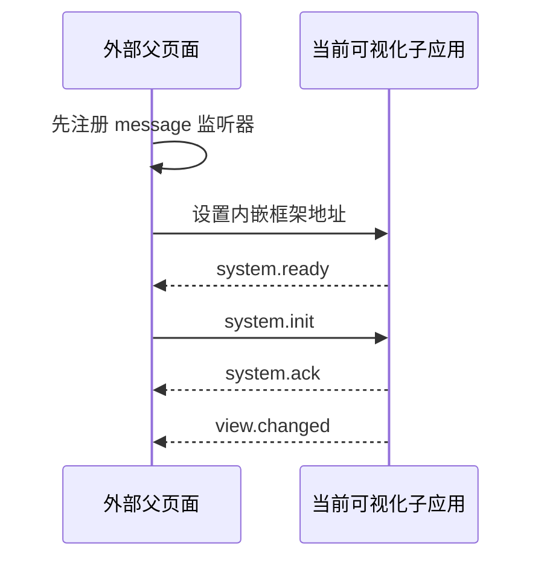

# 外层内嵌框架双向通信协议

**协议名称：** 电力场景与拓扑可视化子应用协议

**固定通道：** `power-scene-topology-shell`

**协议版本：** `1`

**通信双方：** 外部业务前端与当前 `power-data-web` 可视化子应用

**通信方式：** 浏览器跨窗口消息（`window.postMessage`）

本协议只处理外部父页面与当前可视化子应用。当前子应用与 Unity 网页图形构建（WebGL）继续使用内部 `power3d-unity` 协议，两套协议不得混用。

---

## 一、通信职责

### 1.1 外部父页面负责

- 页面导航、菜单和子项点击。
- 用户权限、业务数据和设备状态来源。
- 创建当前子应用内嵌框架（iframe）。
- 指定初始场景和初始拓扑。
- 发送场景切换、拓扑切换和流程动作。
- 接收拓扑节点双击、三维对象选择、切换结果和错误。

### 1.2 当前子应用负责

- 校验父页面来源、窗口、协议、实例、会话和消息类型。
- 将外部动作转换为受控的 Unity 和拓扑操作。
- 保证场景与拓扑按一个事务提交。
- 回传命令结果、稳定上下文和设备事件。
- 隔离外部消息与 Unity 内部消息。

### 1.3 禁止事项

- 父页面不得直接发送 Unity 方法名、场景文件路径或模型层级路径。
- 当前子应用不得无校验地透传父页面的 `payload` 给 Unity。
- 任一方向发送消息时不得使用通配目标来源 `*`。
- 消息体不得携带长期令牌、密码、密钥、函数、文档对象模型（DOM）对象或二进制资源。

---

## 二、加载参数与握手

### 2.1 子应用地址参数

父页面创建内嵌框架时只允许附加以下启动参数：

| 参数 | 必填 | 说明 |
| --- | --- | --- |
| `parentOrigin` | 是 | 父页面精确来源，只包含协议、域名和端口 |
| `instanceId` | 是 | 当前可视化组件实例标识，同一父页面内必须唯一 |
| `protocolVersion` | 是 | 固定为 `1` |

示例：

```text
https://visual.example.com/embed
  ?parentOrigin=https%3A%2F%2Fportal.example.com
  &instanceId=visual-shell-01
  &protocolVersion=1
```

`parentOrigin` 只是通信匹配参数。当前子应用仍必须从部署配置读取允许父来源白名单，并通过内容安全策略（CSP）的 `frame-ancestors` 限制可嵌入来源。

### 2.2 握手顺序



规则：

1. 父页面必须先注册监听器，再设置内嵌框架地址，避免缓存命中时丢失 `system.ready`。
2. 当前子应用每次加载生成新的 `sessionId`，并在 `system.ready` 中返回。
3. 父页面后续发送的所有消息必须携带该 `sessionId`。
4. 当前子应用未完成 `system.init` 前，只接受 `system.init` 和 `system.dispose`。
5. 初始化超时建议为 15 秒；超时后子应用显示“等待父页面初始化”，但可继续接受一次合法初始化。

---

## 三、通用消息信封

### 3.1 数据结构

```ts
/**
 * 外层跨窗口消息的唯一信封。
 * replyTo 只用于响应消息，必须等于被响应命令的 messageId。
 */
interface HostMessageEnvelope<TType extends string, TPayload> {
  channel: 'power-scene-topology-shell'
  version: 1
  instanceId: string
  sessionId: string
  messageId: string
  replyTo?: string
  type: TType
  timestamp: number
  payload: TPayload
}
```

### 3.2 字段规则

| 字段 | 规则 |
| --- | --- |
| `channel` | 必须等于 `power-scene-topology-shell` |
| `version` | 必须等于数字 `1` |
| `instanceId` | 必须与内嵌框架启动参数一致，建议不超过 128 字符 |
| `sessionId` | 必须等于当前 `system.ready` 返回值，建议不超过 128 字符 |
| `messageId` | 当前发送方生成，当前会话内唯一，建议不超过 128 字符 |
| `replyTo` | 响应消息必填，等于原命令 `messageId` |
| `type` | 必须出现在对应方向的白名单 |
| `timestamp` | 毫秒时间戳，仅用于诊断和过期辅助判断，不作为单独授权依据 |
| `payload` | 必须按具体消息类型再次校验，不能信任任意对象 |

### 3.3 容量限制

建议首版固定以下上限：

| 项目 | 上限 |
| --- | ---: |
| 单条消息序列化后大小 | 256 KiB |
| `messageId` 去重缓存 | 最近 256 条 |
| 外层待确认命令 | 64 条 |
| 单次设备状态更新 | 500 个设备 |
| 单个字符串字段 | 512 字符；显示说明字段可单独放宽 |
| 单次命令超时 | 10 秒 |
| 初始化握手超时 | 15 秒 |

达到上限时必须拒绝新消息并返回结构化错误，不能扩展为无界数组或映射表。

---

## 四、消息类型总表

### 4.1 父页面发送给子应用

| 类型 | 用途 | 是否需要最终结果 |
| --- | --- | --- |
| `system.init` | 初始化场景、拓扑和可选动作 | 是，返回 `system.ack` |
| `view.open` | 原子打开指定场景和拓扑 | 是，返回 `command.result` 和 `view.changed` |
| `workflow.trigger` | 按受控 `actionId` 触发流程和拓扑切换 | 是，返回 `command.result` 和 `view.changed` |
| `device.states.update` | 批量更新设备四态 | 是，返回 `command.result` |
| `state.get` | 获取当前状态快照 | 是，返回 `state.snapshot` |
| `system.dispose` | 释放子应用内部运行资源 | 是，返回 `command.result` |

### 4.2 子应用发送给父页面

| 类型 | 用途 | `replyTo` |
| --- | --- | --- |
| `system.ready` | 子应用基础能力已就绪 | 无 |
| `system.ack` | 初始化完成 | 指向 `system.init` |
| `command.result` | 命令成功、失败或被替代 | 指向原命令 |
| `view.changed` | 场景和拓扑稳定上下文已提交 | 指向触发命令；内部事件可为空 |
| `topology.node.dblclick` | 双击拓扑设备节点 | 无 |
| `scene.object.selected` | Unity 对象被选中 | 无 |
| `state.snapshot` | 当前状态和能力快照 | 指向 `state.get` |
| `system.error` | 无法归属到正常结果的结构化错误 | 有原命令时必须填写 |

---

## 五、父页面命令格式

### 5.1 初始化 `system.init`

父页面必须明确指定初始场景和初始拓扑。可选 `actionId` 只能引用发布清单中已经登记且目标场景、拓扑一致的动作。

```json
{
  "channel": "power-scene-topology-shell",
  "version": 1,
  "instanceId": "visual-shell-01",
  "sessionId": "session-7f8b",
  "messageId": "parent-1",
  "type": "system.init",
  "timestamp": 1785811200000,
  "payload": {
    "sceneId": "gas-power",
    "topologyId": "gas-power.overview",
    "actionId": null,
    "expectedManifestVersion": "2026.08.04.1"
  }
}
```

载荷定义：

```ts
/** 初次进入只接受受控场景、拓扑和动作标识，不接受资源地址。 */
interface SystemInitPayload {
  sceneId: SceneId
  topologyId: string
  actionId?: string | null
  expectedManifestVersion?: string
}
```

### 5.2 原子打开视图 `view.open`

适用于父页面直接知道目标场景和目标拓扑的情况。`actionId` 可选；如果提供，其映射结果必须与 `sceneId + topologyId` 一致。

```json
{
  "channel": "power-scene-topology-shell",
  "version": 1,
  "instanceId": "visual-shell-01",
  "sessionId": "session-7f8b",
  "messageId": "parent-2",
  "type": "view.open",
  "timestamp": 1785811210000,
  "payload": {
    "sceneId": "wind-power",
    "topologyId": "wind-power.overview",
    "actionId": null,
    "expectedContextRevision": 1
  }
}
```

```ts
/**
 * expectedContextRevision 用于阻止旧页面状态发出的动作误操作新上下文。
 * 未提供时仍可执行，但父页面无法获得乐观并发保护。
 */
interface ViewOpenPayload {
  sceneId: SceneId
  topologyId: string
  actionId?: string | null
  expectedContextRevision?: number
}
```

### 5.3 触发业务动作 `workflow.trigger`

适用于父页面点击菜单子项或场景入口。父页面只发送稳定 `actionId`；目标场景、目标拓扑和 Unity 流程命令由当前子应用的受控映射解析。

```json
{
  "channel": "power-scene-topology-shell",
  "version": 1,
  "instanceId": "visual-shell-01",
  "sessionId": "session-7f8b",
  "messageId": "parent-3",
  "type": "workflow.trigger",
  "timestamp": 1785811220000,
  "payload": {
    "actionId": "gas-power.turbine",
    "parameters": {
      "unitId": "unit-01"
    },
    "expectedContextRevision": 2
  }
}
```

```ts
/** 参数必须由动作定义声明白名单；首版仅建议允许 unitId 等稳定业务范围标识。 */
interface WorkflowTriggerPayload {
  actionId: string
  parameters?: Readonly<Record<string, string | number | boolean | null>>
  expectedContextRevision?: number
}
```

同场景子项和跨场景按钮使用同一种消息：

- 动作目标场景等于当前场景：保持 Unity 实例和业务场景，只触发流程并切换拓扑。
- 动作目标场景不同：先切换 Unity 业务场景，再触发动作并切换拓扑。

### 5.4 批量设备状态 `device.states.update`

设备状态由父页面的业务数据层提供。当前子应用按 `deviceId` 映射到当前拓扑节点和当前 Unity 场景节点。

```json
{
  "channel": "power-scene-topology-shell",
  "version": 1,
  "instanceId": "visual-shell-01",
  "sessionId": "session-7f8b",
  "messageId": "parent-4",
  "type": "device.states.update",
  "timestamp": 1785811230000,
  "payload": {
    "sourceRevision": 1024,
    "items": [
      {
        "deviceId": "DEVICE-001",
        "deviceStatus": "alarm",
        "statusUpdatedAt": "2026-08-04T14:20:30.000+08:00"
      }
    ]
  }
}
```

```ts
/** 四态之外的值必须拒绝；缺失或过期状态由状态适配器归一为离线。 */
interface DeviceStateUpdateItem {
  deviceId: string
  deviceStatus: 'normal' | 'alarm' | 'fault' | 'offline'
  statusUpdatedAt: string
}

interface DeviceStatesUpdatePayload {
  sourceRevision?: number
  items: readonly DeviceStateUpdateItem[]
}
```

处理规则：

1. 同一批次相同 `deviceId` 只保留最后一条。
2. 时间早于当前缓存的更新直接丢弃。
3. 当前不可见拓扑只更新有限状态缓存，不创建隐藏画布。
4. 当前 Unity 场景未映射的设备不发送三维命令。
5. 同一动画帧内同一三维节点只发送一次最新状态。

### 5.5 获取状态 `state.get`

```json
{
  "channel": "power-scene-topology-shell",
  "version": 1,
  "instanceId": "visual-shell-01",
  "sessionId": "session-7f8b",
  "messageId": "parent-5",
  "type": "state.get",
  "timestamp": 1785811240000,
  "payload": {}
}
```

### 5.6 释放 `system.dispose`

```json
{
  "channel": "power-scene-topology-shell",
  "version": 1,
  "instanceId": "visual-shell-01",
  "sessionId": "session-7f8b",
  "messageId": "parent-6",
  "type": "system.dispose",
  "timestamp": 1785811250000,
  "payload": {
    "reason": "parent-unmount"
  }
}
```

释放开始后不再接受业务命令。重复释放按幂等成功处理。

---

## 六、子应用事件格式

### 6.1 就绪 `system.ready`

```json
{
  "channel": "power-scene-topology-shell",
  "version": 1,
  "instanceId": "visual-shell-01",
  "sessionId": "session-7f8b",
  "messageId": "shell-ready-1",
  "type": "system.ready",
  "timestamp": 1785811195000,
  "payload": {
    "manifestVersion": "2026.08.04.1",
    "sceneIds": [
      "coal-power",
      "gas-power",
      "wind-power",
      "solar-power",
      "substation",
      "distribution",
      "consumption",
      "microgrid",
      "dispatch"
    ],
    "commandCapabilities": [
      "system.init",
      "view.open",
      "workflow.trigger",
      "device.states.update",
      "state.get",
      "system.dispose"
    ],
    "eventCapabilities": [
      "system.ack",
      "command.result",
      "view.changed",
      "topology.node.dblclick",
      "scene.object.selected",
      "state.snapshot",
      "system.error"
    ]
  }
}
```

### 6.2 初始化确认 `system.ack`

```json
{
  "channel": "power-scene-topology-shell",
  "version": 1,
  "instanceId": "visual-shell-01",
  "sessionId": "session-7f8b",
  "messageId": "shell-ack-1",
  "replyTo": "parent-1",
  "type": "system.ack",
  "timestamp": 1785811205000,
  "payload": {
    "success": true,
    "context": {
      "sceneId": "gas-power",
      "topologyId": "gas-power.overview",
      "actionId": null,
      "contextRevision": 1,
      "status": "ready"
    }
  }
}
```

### 6.3 命令结果 `command.result`

```json
{
  "channel": "power-scene-topology-shell",
  "version": 1,
  "instanceId": "visual-shell-01",
  "sessionId": "session-7f8b",
  "messageId": "shell-result-3",
  "replyTo": "parent-3",
  "type": "command.result",
  "timestamp": 1785811228000,
  "payload": {
    "success": true,
    "status": "completed",
    "transitionId": "transition-12",
    "contextRevision": 3,
    "error": null
  }
}
```

`status` 只允许：

| 值 | 含义 |
| --- | --- |
| `completed` | 命令已完成并提交稳定状态 |
| `failed` | 命令执行失败 |
| `superseded` | 命令被更新的切换事务取代 |
| `disposed` | 释放命令已完成 |

### 6.4 视图已变更 `view.changed`

```json
{
  "channel": "power-scene-topology-shell",
  "version": 1,
  "instanceId": "visual-shell-01",
  "sessionId": "session-7f8b",
  "messageId": "shell-view-3",
  "replyTo": "parent-3",
  "type": "view.changed",
  "timestamp": 1785811228000,
  "payload": {
    "sceneId": "gas-power",
    "topologyId": "gas-power.turbine-control",
    "actionId": "gas-power.turbine",
    "contextRevision": 3,
    "transitionId": "transition-12"
  }
}
```

只有 Unity 场景、可选动作和目标拓扑全部满足提交条件后才能发送该事件。

### 6.5 拓扑节点双击 `topology.node.dblclick`

```json
{
  "channel": "power-scene-topology-shell",
  "version": 1,
  "instanceId": "visual-shell-01",
  "sessionId": "session-7f8b",
  "messageId": "shell-topology-dblclick-1",
  "type": "topology.node.dblclick",
  "timestamp": 1785811260000,
  "payload": {
    "sceneId": "gas-power",
    "topologyId": "gas-power.overview",
    "nodeId": "node.gas-turbine.01",
    "deviceId": "DEVICE-001",
    "sceneNodeId": "node.gas-turbine.01",
    "deviceType": "gas-turbine",
    "contextRevision": 3,
    "correlationId": "topology-dblclick-1"
  }
}
```

规则：

1. `deviceId` 必填；缺失时不得发送设备双击事件。
2. `sceneNodeId` 和 `deviceType` 可选。
3. 双击不撤销或替换单击产生的本地选中状态。
4. 双击产生的重复单击不得导致相同三维聚焦命令重复进入待确认表。

### 6.6 三维对象选择 `scene.object.selected`

```json
{
  "channel": "power-scene-topology-shell",
  "version": 1,
  "instanceId": "visual-shell-01",
  "sessionId": "session-7f8b",
  "messageId": "shell-scene-selected-1",
  "type": "scene.object.selected",
  "timestamp": 1785811270000,
  "payload": {
    "sceneId": "gas-power",
    "sceneNodeId": "node.gas-turbine.01",
    "deviceId": "DEVICE-001",
    "topologyId": "gas-power.overview",
    "nodeIds": ["node.gas-turbine.01"],
    "contextRevision": 3,
    "correlationId": "unity-selection-1"
  }
}
```

该事件属于可选能力。未在 `system.ready.eventCapabilities` 中声明时，父页面不得依赖它。

### 6.7 状态快照 `state.snapshot`

```json
{
  "channel": "power-scene-topology-shell",
  "version": 1,
  "instanceId": "visual-shell-01",
  "sessionId": "session-7f8b",
  "messageId": "shell-state-1",
  "replyTo": "parent-5",
  "type": "state.snapshot",
  "timestamp": 1785811241000,
  "payload": {
    "manifestVersion": "2026.08.04.1",
    "context": {
      "sceneId": "gas-power",
      "topologyId": "gas-power.overview",
      "actionId": null,
      "contextRevision": 3,
      "status": "ready"
    },
    "unityStatus": "ready",
    "topologyStatus": "ready"
  }
}
```

---

## 七、错误格式与错误码

### 7.1 错误载荷

```ts
/** 错误只暴露稳定业务信息，不暴露内部对象路径或完整不可信载荷。 */
interface HostProtocolError {
  code: string
  message: string
  stage:
    | 'handshake'
    | 'validation'
    | 'preparing-topology'
    | 'switching-scene'
    | 'executing-action'
    | 'activating-topology'
    | 'disposing'
  recoverable: boolean
  sceneId?: SceneId
  topologyId?: string
  actionId?: string
  transitionId?: string
}
```

### 7.2 首版错误码

| 错误码 | 含义 |
| --- | --- |
| `protocol.origin.rejected` | 父页面来源不在允许白名单 |
| `protocol.source.rejected` | 消息不是当前父窗口发送 |
| `protocol.envelope.invalid` | 通道、版本、实例、会话或基础信封无效 |
| `protocol.payload.invalid` | 具体消息载荷无效 |
| `protocol.capability.undeclared` | 当前子应用未在 `system.ready.commandCapabilities` 中声明该命令能力 |
| `protocol.message.duplicate` | 当前会话重复 `messageId` |
| `protocol.capacity.exceeded` | 消息体、数组或待确认表超过上限 |
| `manifest.version.mismatch` | 父页面期望版本与当前清单不一致 |
| `scene.unknown` | 场景未登记 |
| `topology.unknown` | 拓扑未登记 |
| `topology.scene.mismatch` | 拓扑不属于目标场景 |
| `action.unknown` | 动作未登记 |
| `action.context.mismatch` | 动作目标与指定场景拓扑不一致 |
| `context.revision.conflict` | 父页面基于旧上下文发出命令 |
| `scene.switch.failed` | Unity 场景切换失败 |
| `action.execute.failed` | Unity 流程或聚焦动作失败 |
| `topology.prepare.failed` | 拓扑预解析失败 |
| `topology.activate.failed` | 拓扑激活失败 |
| `command.timeout` | 命令等待超时 |
| `command.superseded` | 命令被更新切换取代 |
| `runtime.disposed` | 子应用已释放，不能继续操作 |

---

## 八、顺序、幂等和超时

1. 所有外部命令按 `messageId` 去重；重复消息不重新执行，返回第一次执行结果或 `protocol.message.duplicate`。
2. `view.open` 和 `workflow.trigger` 会创建新的 `transitionId`。
3. 新切换命令到达时，旧切换进入 `superseded`；旧场景进度、命令结果和拓扑回调只能清理资源，不能提交状态。
4. 状态型命令 `device.states.update` 可按 `deviceId` 合并；操作型命令不得静默覆盖。
5. 命令默认超时 10 秒；场景加载可由场景清单声明独立上限，但必须有总上限和可见进度。
6. 只有确认幂等的命令允许使用同一 `messageId` 重试一次；场景切换和流程动作默认不自动重试。
7. `contextRevision` 每次成功提交场景、拓扑或动作上下文后递增。
8. 父页面可携带 `expectedContextRevision`；不一致时拒绝执行，防止旧组件状态操作新场景。

---

## 九、安全校验顺序

当前子应用接收父页面消息时按以下固定顺序执行，任一失败立即结束：

1. `event.origin` 等于部署白名单中的精确父来源。
2. `event.source === window.parent`。
3. 消息为普通对象，且序列化体积未超过上限。
4. `channel` 和 `version` 正确。
5. `instanceId` 与启动参数一致。
6. `sessionId` 与当前加载会话一致。
7. `messageId` 格式合法且未重复。
8. `type` 在父页面下行白名单内。
9. `payload` 通过对应类型的运行时字段校验。
10. 当前状态允许执行该命令。

拒绝日志只记录原因、时间、来源、类型和截断后的消息标识，不保存完整不可信载荷。

---

## 十、父页面接入要求

父页面接入实现必须满足：

1. 注册监听器早于设置内嵌框架地址。
2. 从子应用地址解析精确 `targetOrigin`，并核对其与配置来源一致。
3. 只接受 `event.source === iframe.contentWindow` 的消息。
4. 保存当前 `sessionId`，内嵌框架重新加载后清空旧会话待确认命令。
5. 以 `replyTo` 关联请求，不使用响应自身的 `messageId` 查找请求。
6. 页面或组件卸载时移除监听器、清除计时器和待确认表。
7. 不把任意用户输入直接作为 `sceneId`、`topologyId`、`actionId` 或子应用地址。

---

## 十一、协议验收清单

- [ ] 完成 `system.ready → system.init → system.ack`。
- [ ] 九个场景均可作为初始场景进入。
- [ ] 合法 `view.open` 可原子切换场景和拓扑。
- [ ] 合法 `workflow.trigger` 可按动作映射切换流程和拓扑。
- [ ] 同场景动作不重建 Unity 实例。
- [ ] 跨场景动作只切换 Unity 内部业务场景。
- [ ] 双击拓扑设备节点可上报正确 `deviceId`。
- [ ] 错误来源、窗口、通道、版本、实例和会话均被拒绝。
- [ ] 重复 `messageId` 不重复执行。
- [ ] 连续切换只提交最后一个有效事务。
- [ ] 旧会话和旧事务的迟到消息不能覆盖当前状态。
- [ ] 所有成功、失败、被替代和释放结果都可通过 `replyTo` 关联。
- [ ] 单条消息、数组、待确认表和日志缓存均有上限。
