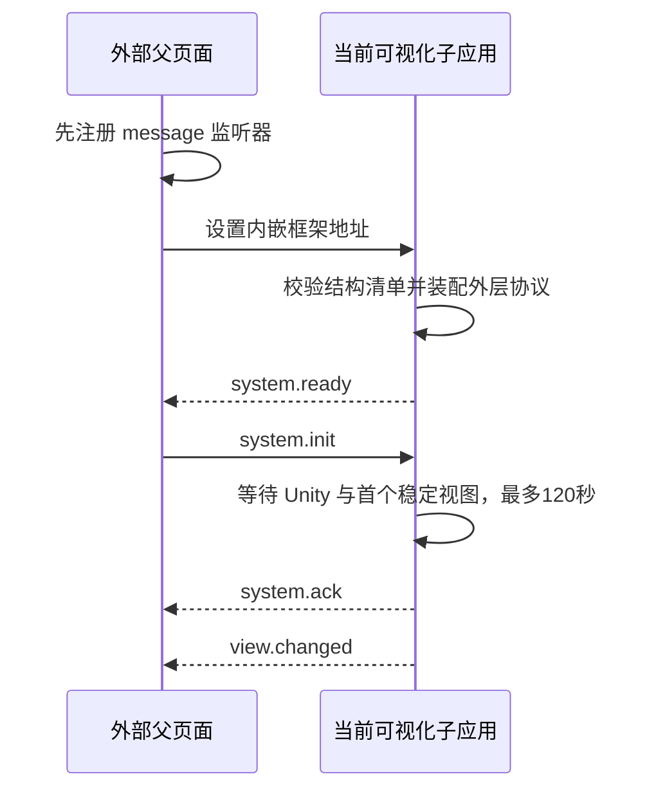

# 外层内嵌框架双向通信协议

**协议名称：** 电力场景与拓扑可视化子应用协议

**固定通道：** `power-scene-topology-shell`

**协议版本：** `2`

**通信双方：** 外部业务前端与当前 `power-data-web` 可视化子应用

**通信方式：** 浏览器跨窗口消息（`window.postMessage`）

本协议只处理外部父页面与当前可视化子应用。当前子应用与 Unity 网页图形构建（WebGL）继续使用内部 `power3d-unity` 协议，两套协议不得混用。

> **2026-08-15 最新会议修正（优先于本文旧版设备绑定段落）：** 平台不会向我方注入 `deviceId`、`deviceMappings` 或绑定计数。平台只读取我方结构清单中的 `nodeId`，并在平台内部维护 `nodeId → 真实设备编号`。双击事件和状态快照均以 `nodeId` 为关联键；真实设备编号不进入本协议。本文中出现的设备编号注入内容只作为历史实现记录，不得用于新包验收。

> **2026-08-30 三层展示规则：** 沙盘和关键环节为全屏三维且无拓扑，厂区为三维与拓扑并存。`topologyId` 按稳定视图模式条件校验：厂区必填，沙盘和关键环节必须省略；关键环节上下文改携带 `processDetailId`。该规则纳入协议版本 2，不允许父页面直接传 Unity 方法名。

> **2026-09-01 早期握手规则：** 配置、结构清单校验、唯一拓扑运行时和外层协议装配完成后立即发送 `system.ready`，不得等待 Unity 运行时就绪。平台可立即发送一条 `system.init`；子应用使用单槽等待 Unity 和首个稳定视图，最长120秒。Unity 提前就绪时立即继续初始化，不等待剩余时间；仅在满120秒仍未就绪时显示超时提示并返回失败。成功的 `system.ack` 与 `view.changed` 只能在真实稳定视图提交后发送。

> **2026-09-02 合作方接入兼容性冻结：** 合作方平台已经按当前载荷完成接入。九项业务场景继续由 `system.ready.payload.sceneIds` 返回，沙盘只通过独立必填字段 `overviewSceneId: "overview"` 返回；`overview` 不进入 `scene-topology-manifest.json.scenes` 或 `sceneIds`。该字段名、固定值和目录分离关系均不得在协议版本 2 内改变。

---

## 一、通信职责

### 1.1 外部父页面负责

- 页面导航、菜单和子项点击。
- 用户权限、业务数据和设备状态来源。
- 创建当前子应用内嵌框架（iframe）。
- 指定初始沙盘或厂区；厂区同时指定初始拓扑。
- 发送场景、视图模式、可选拓扑和关键环节动作。
- 接收拓扑节点双击、三维对象选择、切换结果和错误。
- 提供我方结构清单可读取的受控地址或随包入口，并在平台内部维护 `nodeId → 真实设备编号` 关系；不向我方注入设备编号。

### 1.2 当前子应用负责

- 校验父页面来源、窗口、协议、实例、会话和消息类型。
- 将外部动作转换为受控的 Unity、视图模式和可选拓扑操作。
- 保证场景、视图模式、可选拓扑和三维目标按一个事务提交。
- 回传命令结果、稳定上下文和节点事件。
- 隔离外部消息与 Unity 内部消息。
- 校验结构清单，建立 `nodeId → 二维节点 / 可选三维节点` 索引；不维护、不推断、不硬编码平台内部的真实设备绑定。

### 1.3 禁止事项

- 父页面不得直接发送 Unity 方法名、场景文件路径或模型层级路径。
- 当前子应用不得无校验地透传父页面的 `payload` 给 Unity。
- 任一方向发送消息时不得使用通配目标来源 `*`。
- 消息体不得携带长期令牌、密码、密钥、函数、文档对象模型（DOM）对象或二进制资源。
- 平台不得通过注入改写结构清单已经固定的 `sceneNodeId`，也不得注入 Unity 方法名、资源路径或模型层级路径。

### 1.4 结构清单与平台内部绑定

1. 我方交付的结构清单固定 `sceneId`、`topologyId`、`nodeId`、可选 `sceneNodeId`、动作和 Unity 结构映射；不得出现 `deviceId`、`deviceMappings`、`platformBindingCount` 或绑定修订字段。
2. 平台读取 `nodeId` 后，在平台自身数据库或绑定服务中维护 `nodeId → 真实设备编号`；该关系不注入清单、不通过跨窗口消息传给我方，也不改变清单版本。
3. 新业务源拓扑节点使用 `doubleClickBehavior: 'emit-node'` 表示允许上报节点双击；说明、分组和层级标题不得作为业务节点进入清单。`none` 仅保留为兼容解析和防御测试值。
4. 壳只建立 `nodeId → topologyId + 可选 sceneNodeId` 索引。过滤视图引用总图同一 `nodeId`，不得复制节点定义；同一 `resourceKey` 内 `nodeId` 必须全局唯一。
5. 当前燃气合作方包固定读取包内同源 `scene-topology-manifest.json`，不得指向平台设备绑定或运行时清单接口。其他场景以后如采用远程读取，只能指向我方拥有且受控的不可变静态清单地址，并校验版本与摘要；地址必须由部署配置提供，不能由外层普通消息任意指定。响应必须有 `Cache-Control: no-cache`，并继续使用十秒超时、精确来源和无凭据请求。
6. 平台绑定变化不通过增量绑定消息通知我方；平台自行刷新其内部映射，必要时由父页面重新加载或重新初始化我方壳。壳不得维护旧设备绑定缓存。
7. 合作方设备状态 HTTP 自测接口只用于联调，生产状态通道仍为本协议的 `device.states.update` 跨窗口推送。

实现边界：清单加载器只消费结构清单并执行唯一性校验；`loadBase`、`loadRuntime` 和运行时绑定对照入口属于迁移前历史实现，不能作为启动前置条件。平台只读取我方结构清单中的 `nodeId`，内部绑定不进入壳侧协议。

---

## 二、加载参数与握手

### 2.1 子应用地址参数

父页面创建内嵌框架时只允许附加以下启动参数：

| 参数 | 必填 | 说明 |
| --- | --- | --- |
| `parentOrigin` | 是 | 父页面精确来源，只包含协议、域名和端口 |
| `instanceId` | 是 | 当前可视化组件实例标识，同一父页面内必须唯一 |
| `protocolVersion` | 是 | 固定为 `2` |

示例：

```text
https://visual.example.com/embed
  ?parentOrigin=https%3A%2F%2Fportal.example.com
  &instanceId=visual-shell-01
  &protocolVersion=2
```

`parentOrigin` 只是通信匹配参数。当前子应用仍必须从部署配置读取允许父来源白名单，并通过内容安全策略（CSP）的 `frame-ancestors` 限制可嵌入来源。

### 2.2 握手顺序



规则：

1. 父页面必须先注册监听器，再设置内嵌框架地址，避免缓存命中时丢失 `system.ready`。
2. 当前子应用每次加载生成新的 `sessionId`，并在 `system.ready` 中返回。
3. 父页面后续发送的所有消息必须携带该 `sessionId`。
4. 当前子应用未完成 `system.init` 前，只接受 `system.init` 和 `system.dispose`；只允许一条初始化命令在途，后续初始化必须立即收到容量失败确认，禁止覆盖、排队或静默丢弃。
5. 子应用必须在页面加载后15秒内完成结构清单校验、唯一拓扑运行时和外层协议装配，并立即发送 `system.ready`；该事件不得等待 Unity，也不得解除覆盖三维和拓扑区域的启动遮罩。
6. `system.ready` 只返回清单版本、九项业务场景目录、独立沙盘标识和能力摘要；完整结构清单继续从同源 `/scene-topology-manifest.json` 读取，不通过跨窗口消息复制。`sceneIds` 必须与结构清单 `scenes` 数组一致且不含 `overview`，`overviewSceneId` 必须存在并固定为 `overview`。
7. 平台收到 `system.ready` 后可立即发送合法 `system.init`。子应用从收到该命令开始，最长等待120秒完成 Unity、目标场景和对应拓扑或关键环节的稳定初始化；提前完成时立即进入并返回成功，不得固定等待至120秒，仅超出上限时显示提示并返回失败。
8. 成功的 `system.ack` 与 `view.changed` 必须在首个稳定视图真实提交后发送；Unity 尚在准备时不得提前成功确认。
9. `system.init` 失败时，子应用必须同时发送关联的 `system.ack success:false` 和 `system.error`，两者使用相同 `replyTo`；超时后迟到 Unity 回调不得补发成功确认。

---

## 三、通用消息信封

### 3.1 数据结构

```ts
/**
 * 外层跨窗口消息的唯一信封。
 * replyTo 只用于响应消息，必须等于被响应命令的 messageId。
 */
interface HostMessageEnvelope<TType extends string, TPayload> {
  channel: 'power-scene-topology-shell'
  version: 1
  instanceId: string
  sessionId: string
  messageId: string
  replyTo?: string
  type: TType
  timestamp: number
  payload: TPayload
}
```

### 3.2 字段规则

| 字段 | 规则 |
| --- | --- |
| `channel` | 必须等于 `power-scene-topology-shell` |
| `version` | 必须等于数字 `1` |
| `instanceId` | 必须与内嵌框架启动参数一致，建议不超过 128 字符 |
| `sessionId` | 必须等于当前 `system.ready` 返回值，建议不超过 128 字符 |
| `messageId` | 当前发送方生成，当前会话内唯一，建议不超过 128 字符 |
| `replyTo` | 响应消息必填，等于原命令 `messageId` |
| `type` | 必须出现在对应方向的白名单 |
| `timestamp` | 毫秒时间戳，仅用于诊断和过期辅助判断，不作为单独授权依据 |
| `payload` | 必须按具体消息类型再次校验，不能信任任意对象 |

### 3.3 容量限制

建议首版固定以下上限：

| 项目 | 上限 |
| --- | ---: |
| 单条消息序列化后大小 | 256 KiB |
| `messageId` 去重缓存 | 最近 256 条 |
| 外层待确认命令 | 64 条 |
| 单次节点状态更新 | 1至500个节点；没有节点状态时不发送该命令 |
| 单个字符串字段 | 512 字符；显示说明字段可单独放宽 |
| 单次命令超时 | 10 秒 |
| 页面加载至外层 `system.ready` | 15 秒；不包含 Unity 启动 |
| Unity 与首个稳定视图初始化 | 收到 `system.init` 后120秒 |

单条消息、待确认表、状态数组和字符串达到上限时必须拒绝新消息并返回结构化错误。`messageId` 去重缓存是最近256条的滑动窗口，第257条合法新标识进入时淘汰最早项，不能因窗口已满永久拒绝后续会话内命令；任何表都不得扩展为无界数组或映射。

---

## 四、消息类型总表

### 4.1 父页面发送给子应用

| 类型 | 用途 | 是否需要最终结果 |
| --- | --- | --- |
| `system.init` | 初始化沙盘或厂区；可在 Unity 准备中接收，厂区携带拓扑 | 是，稳定视图提交后返回 `system.ack` |
| `view.open` | 原子打开沙盘或指定厂区与拓扑 | 是，返回 `command.result` 和 `view.changed` |
| `workflow.trigger` | 按受控 `actionId` 触发厂区动作或全屏三维关键环节 | 是，返回 `command.result` 和 `view.changed` |
| `device.states.update` | 批量更新设备四态 | 是，返回 `command.result` |
| `state.get` | 获取当前状态快照 | 是，返回 `state.snapshot` |
| `system.dispose` | 释放子应用内部运行资源 | 是，返回 `command.result` |

### 4.2 子应用发送给父页面

| 类型 | 用途 | `replyTo` |
| --- | --- | --- |
| `system.ready` | 外层通信、清单摘要和能力声明已就绪；不表示 Unity 或目标视图就绪 | 无 |
| `system.ack` | Unity、目标场景及对应拓扑或关键环节已稳定初始化 | 指向 `system.init` |
| `command.result` | 命令成功、失败或被替代 | 指向原命令 |
| `view.changed` | 场景、视图模式、可选拓扑和三维目标稳定上下文已提交 | 指向触发命令；内部事件可为空 |
| `topology.node.dblclick` | 双击拓扑设备节点 | 无 |
| `scene.object.selected` | Unity 对象被选中 | 无 |
| `state.snapshot` | 当前状态和能力快照 | 指向 `state.get` |
| `system.error` | 无法归属到正常结果的结构化错误 | 有原命令时必须填写 |

---

## 五、父页面命令格式

### 5.1 初始化 `system.init`

父页面必须明确指定初始视图：`sceneId="overview"` 进入沙盘并省略 `topologyId`；九个业务 `sceneId` 进入第二层厂区并携带合法 `topologyId`。可选 `actionId` 只能引用发布清单中已经登记且目标场景、视图模式和可选拓扑一致的动作。

```json
{
  "channel": "power-scene-topology-shell",
  "version": 2,
  "instanceId": "visual-shell-01",
  "sessionId": "session-7f8b",
  "messageId": "parent-1",
  "type": "system.init",
  "timestamp": 1785811200000,
  "payload": {
    "sceneId": "gas-power",
    "topologyId": "gas-power.overview",
    "actionId": null,
    "expectedManifestVersion": "2026.08.04.1"
  }
}
```

载荷定义：

```ts
/** 初次进入只接受受控视图场景、条件可选拓扑和动作标识，不接受资源地址。 */
interface SystemInitPayload {
  sceneId: SceneId | 'overview'
  topologyId?: string
  actionId?: string | null
  expectedManifestVersion?: string
}
```

### 5.2 原子打开视图 `view.open`

适用于父页面直接打开沙盘或第二层厂区。`actionId` 可选；如果提供，其映射结果必须与目标场景、视图模式和可选拓扑一致。第三层关键环节必须通过 `workflow.trigger` 进入，不能用 `view.open` 绕过动作映射。

```json
{
  "channel": "power-scene-topology-shell",
  "version": 2,
  "instanceId": "visual-shell-01",
  "sessionId": "session-7f8b",
  "messageId": "parent-2",
  "type": "view.open",
  "timestamp": 1785811210000,
  "payload": {
    "sceneId": "wind-power",
    "topologyId": "wind-power.overview",
    "actionId": null,
    "expectedContextRevision": 1
  }
}
```

```ts
/**
 * expectedContextRevision 用于阻止旧页面状态发出的动作误操作新上下文。
 * 未提供时仍可执行，但父页面无法获得乐观并发保护。
 */
interface ViewOpenPayload {
  sceneId: SceneId | 'overview'
  topologyId?: string
  actionId?: string | null
  expectedContextRevision?: number
}
```

### 5.3 触发业务动作 `workflow.trigger`

适用于父页面点击菜单子项或关键环节入口。父页面只发送稳定 `actionId`；目标场景、目标视图模式、可选目标拓扑、`processDetailId` 和 Unity 命令由当前子应用的受控映射解析。父页面不得直接传 `processDetailId`。

```json
{
  "channel": "power-scene-topology-shell",
  "version": 2,
  "instanceId": "visual-shell-01",
  "sessionId": "session-7f8b",
  "messageId": "parent-3",
  "type": "workflow.trigger",
  "timestamp": 1785811220000,
  "payload": {
    "actionId": "gas-power.turbine",
    "parameters": {
      "unitId": "unit-01"
    },
    "expectedContextRevision": 2
  }
}
```

```ts
/** 参数必须由动作定义声明白名单；首版仅建议允许 unitId 等稳定业务范围标识。 */
interface WorkflowTriggerPayload {
  actionId: string
  parameters?: Readonly<Record<string, string | number | boolean | null>>
  expectedContextRevision?: number
}
```

同场景子项和跨场景按钮使用同一种消息：

- 动作目标场景等于当前场景：保持 Unity 实例和业务场景，只触发流程并切换拓扑。
- 动作目标场景不同：先切换 Unity 业务场景，再触发动作并切换拓扑。

### 5.4 批量节点状态 `device.states.update`

状态由父页面的业务数据层提供。为兼容已约定的消息类型，命令名仍为 `device.states.update`；但 `items` 表示当前联动资源全部已上报节点的完整四态快照，关联键固定为 `nodeId`，不是跨批增量。

```json
{
  "channel": "power-scene-topology-shell",
  "version": 2,
  "instanceId": "visual-shell-01",
  "sessionId": "session-7f8b",
  "messageId": "parent-4",
  "type": "device.states.update",
  "timestamp": 1785811230000,
  "payload": {
    "sourceRevision": 1024,
    "items": [
      {
        "nodeId": "asset.gas-turbine.1",
        "deviceStatus": "alarm",
        "statusUpdatedAt": "2026-08-04T14:20:30.000+08:00"
      }
    ]
  }
}
```

```ts
/** 四态之外的值必须在协议入口拒绝；只有平台明确发送 offline 才显示离线。 */
interface DeviceStateUpdateItem {
  nodeId: string
  deviceStatus: 'normal' | 'alarm' | 'fault' | 'offline'
  statusUpdatedAt: string
}

interface DeviceStatesUpdatePayload {
  sourceRevision: number
  items: readonly DeviceStateUpdateItem[]
}
```

`nodeId` 必须符合我方结构清单格式，并在当前 `resourceKey` 内全局唯一；`statusUpdatedAt` 必须是带时区的国际标准时间字符串；`sourceRevision` 必须是非负安全整数。

处理规则：

1. 每个合法批次使用一次遍历构建最多500项的新状态表，并原子替换上一批状态表，不得跨批次按节点合并。同批出现重复 `nodeId` 时以最后一项为准，整批仍可成功。
2. 上一批存在、本批未出现的节点必须清除动态覆盖并恢复拓扑发布基线；不得因缺失自行推断为离线。
3. 清单中不存在的 `nodeId` 直接忽略，不保存、不报错，也不使命令失败。
4. 壳始终有限保存当前 `resourceKey` 最新一份完整快照；当前不可见拓扑不创建隐藏画布，场景或拓扑切换后从该快照重新投影，平台不因切换重新推送。
5. 外层 `command.result: completed` 只由载荷合法且二维全量状态成功提交决定；即使没有命中已登记节点，完成原子替换后仍返回成功。
6. 壳按结构清单中的 `nodeId → 可选 sceneNodeId` 派生当前场景三维目标；二维提交后向对应目标尽力同步四态，同一动画帧内同一三维节点只发送一次最新状态。没有三维映射的节点只更新二维。
7. Unity 未就绪、能力缺失、单节点失败、超时、容量拒绝或释放竞争只记录有限脱敏诊断；不得回滚二维、延迟或改变外层成功回执，也不得为此发送会被平台理解为整批失败的 `system.error`。
8. Unity 恢复或场景重新激活时只允许重放最新完整快照，禁止重放已被替换的旧批次。
9. `sourceRevision` 是必填非负安全整数，仅用于批次观测和诊断。它是所有联动包共享的内存计数器，服务重启后可从较小值重新开始；壳必须直接应用每份合法快照，禁止按它或 `statusUpdatedAt` 判断批次新旧、拒绝或合并快照。
10. 平台正常情况下不发送 `items: []`；没有节点状态时不发送状态命令。结构清单始终可以独立启动。
11. 壳为每份已接受快照分配会话内单调递增的本地 `snapshotSequence`，仅用它隔离三维异步队列中的迟到写入；该内部字段不进入外层协议，也不能延迟二维成功回执。

### 5.5 获取状态 `state.get`

```json
{
  "channel": "power-scene-topology-shell",
  "version": 2,
  "instanceId": "visual-shell-01",
  "sessionId": "session-7f8b",
  "messageId": "parent-5",
  "type": "state.get",
  "timestamp": 1785811240000,
  "payload": {}
}
```

### 5.6 释放 `system.dispose`

```json
{
  "channel": "power-scene-topology-shell",
  "version": 2,
  "instanceId": "visual-shell-01",
  "sessionId": "session-7f8b",
  "messageId": "parent-6",
  "type": "system.dispose",
  "timestamp": 1785811250000,
  "payload": {
    "reason": "parent-unmount"
  }
}
```

释放开始后不再接受业务命令。重复释放按幂等成功处理。

---

## 六、子应用事件格式

### 6.1 就绪 `system.ready`

```json
{
  "channel": "power-scene-topology-shell",
  "version": 2,
  "instanceId": "visual-shell-01",
  "sessionId": "session-7f8b",
  "messageId": "shell-ready-1",
  "type": "system.ready",
  "timestamp": 1785811195000,
  "payload": {
    "manifestVersion": "2026.08.04.1",
    "sceneIds": [
      "coal-power",
      "gas-power",
      "wind-power",
      "solar-power",
      "substation",
      "distribution",
      "consumption",
      "microgrid",
      "dispatch"
    ],
    "overviewSceneId": "overview",
    "commandCapabilities": [
      "system.init",
      "view.open",
      "workflow.trigger",
      "device.states.update",
      "state.get",
      "system.dispose"
    ],
    "eventCapabilities": [
      "system.ack",
      "command.result",
      "view.changed",
      "topology.node.dblclick",
      "scene.object.selected",
      "state.snapshot",
      "system.error"
    ]
  }
}
```

`system.ready` 的载荷是结构清单摘要，不包含完整结构清单。`sceneIds` 只表示 `scene-topology-manifest.json.scenes` 中的九项业务场景；`overviewSceneId` 独立声明可打开但不进入业务场景清单的沙盘，固定值为 `overview`。平台必须以两个字段的并集判断可打开场景，不得要求 `overview` 同时出现在 `sceneIds` 或结构清单中。该事件提前发送不会解除启动遮罩，也不表示 Unity 已可执行命令；平台应使用其中的 `manifestVersion`、场景目录和能力声明构造唯一 `system.init`。

### 6.2 初始化确认 `system.ack`

```json
{
  "channel": "power-scene-topology-shell",
  "version": 2,
  "instanceId": "visual-shell-01",
  "sessionId": "session-7f8b",
  "messageId": "shell-ack-1",
  "replyTo": "parent-1",
  "type": "system.ack",
  "timestamp": 1785811205000,
  "payload": {
    "success": true,
    "context": {
      "sceneId": "gas-power",
      "viewMode": "plant-split",
      "topologyId": "gas-power.overview",
      "actionId": null,
      "contextRevision": 1,
      "status": "ready"
    }
  }
}
```

成功确认必须晚于 Unity 和首个稳定视图提交。收到 `system.init` 后120秒仍未稳定时，子应用发送 `success:false` 的确认及同一 `replyTo` 的 `system.error`，并禁止迟到结果补发成功事件。

### 6.3 命令结果 `command.result`

```json
{
  "channel": "power-scene-topology-shell",
  "version": 2,
  "instanceId": "visual-shell-01",
  "sessionId": "session-7f8b",
  "messageId": "shell-result-3",
  "replyTo": "parent-3",
  "type": "command.result",
  "timestamp": 1785811228000,
  "payload": {
    "success": true,
    "status": "completed",
    "transitionId": "transition-12",
    "contextRevision": 3,
    "error": null
  }
}
```

`status` 只允许：

| 值 | 含义 |
| --- | --- |
| `completed` | 命令已完成并提交稳定状态 |
| `failed` | 命令执行失败 |
| `superseded` | 命令被更新的切换事务取代 |
| `disposed` | 释放命令已完成 |

对 `device.states.update`，`completed` 的业务边界固定为“载荷校验通过，完整快照已经替换并完成当前模式要求的状态投影”。厂区投影当前拓扑；沙盘和关键环节更新有限状态缓存并投影当前三维目标，不触发隐藏拓扑重绘。只有协议校验失败、缓存提交失败或当前模式的必要投影失败才返回 `failed`。异步三维状态同步失败不得改变、补发或撤销已经形成的回执。

### 6.4 视图已变更 `view.changed`

```json
{
  "channel": "power-scene-topology-shell",
  "version": 2,
  "instanceId": "visual-shell-01",
  "sessionId": "session-7f8b",
  "messageId": "shell-view-3",
  "replyTo": "parent-3",
  "type": "view.changed",
  "timestamp": 1785811228000,
    "payload": {
    "sceneId": "gas-power",
    "viewMode": "process-3d",
    "processDetailId": "gas-power.gas-turbine",
    "actionId": "gas-power.turbine",
    "contextRevision": 3,
    "transitionId": "transition-12"
  }
}
```

只有 Unity 场景、目标视图模式、可选动作和该模式要求的拓扑或关键环节细节全部满足提交条件后才能发送该事件。厂区事件必须包含 `topologyId`；沙盘和关键环节事件必须省略 `topologyId`，关键环节必须包含 `processDetailId`。

### 6.5 拓扑节点双击 `topology.node.dblclick`

```json
{
  "channel": "power-scene-topology-shell",
  "version": 2,
  "instanceId": "visual-shell-01",
  "sessionId": "session-7f8b",
  "messageId": "shell-topology-dblclick-1",
  "type": "topology.node.dblclick",
  "timestamp": 1785811260000,
  "payload": {
    "sceneId": "gas-power",
    "topologyId": "gas-power.overview",
    "nodeId": "asset.gas-turbine.1"
  }
}
```

规则：

1. 载荷只包含 `sceneId`、`topologyId` 和 `nodeId`；不得包含或等待 `deviceId`。
2. `nodeId` 必须来自当前活动结构清单，并与用户实际双击的节点一致。
3. 双击不撤销或替换单击产生的本地选中状态。
4. 双击产生的重复单击不得导致相同三维聚焦命令重复进入待确认表，外层双击事件也只能发送一次。

### 6.6 三维对象选择 `scene.object.selected`

```json
{
  "channel": "power-scene-topology-shell",
  "version": 2,
  "instanceId": "visual-shell-01",
  "sessionId": "session-7f8b",
  "messageId": "shell-scene-selected-1",
  "type": "scene.object.selected",
  "timestamp": 1785811270000,
  "payload": {
    "sceneId": "gas-power",
    "sceneNodeId": "node.gas-turbine.01",
    "topologyId": "gas-power.overview",
    "nodeId": "asset.gas-turbine.1",
    "contextRevision": 3,
    "correlationId": "unity-selection-1"
  }
}
```

该事件属于可选能力。未在 `system.ready.eventCapabilities` 中声明时，父页面不得依赖它。

### 6.7 状态快照 `state.snapshot`

```json
{
  "channel": "power-scene-topology-shell",
  "version": 2,
  "instanceId": "visual-shell-01",
  "sessionId": "session-7f8b",
  "messageId": "shell-state-1",
  "replyTo": "parent-5",
  "type": "state.snapshot",
  "timestamp": 1785811241000,
  "payload": {
    "manifestVersion": "2026.08.04.1",
    "context": {
      "sceneId": "gas-power",
      "viewMode": "plant-split",
      "topologyId": "gas-power.overview",
      "actionId": null,
      "contextRevision": 3,
      "status": "ready"
    },
    "unityStatus": "ready",
    "topologyStatus": "ready"
  }
}
```

---

## 七、错误格式与错误码

### 7.1 错误载荷

```ts
/** 错误只暴露稳定业务信息，不暴露内部对象路径或完整不可信载荷。 */
interface HostProtocolError {
  code: string
  message: string
  stage:
    | 'handshake'
    | 'validation'
    | 'preparing-topology'
    | 'switching-scene'
    | 'executing-action'
    | 'switching-view-mode'
    | 'activating-topology'
    | 'disposing'
  recoverable: boolean
  sceneId?: SceneId | 'overview'
  topologyId?: string
  processDetailId?: string
  actionId?: string
  transitionId?: string
}
```

### 7.2 首版错误码

| 错误码 | 含义 |
| --- | --- |
| `protocol.origin.rejected` | 父页面来源不在允许白名单 |
| `protocol.source.rejected` | 消息不是当前父窗口发送 |
| `protocol.envelope.invalid` | 通道、版本、实例、会话或基础信封无效 |
| `protocol.payload.invalid` | 具体消息载荷无效 |
| `protocol.capability.undeclared` | 当前子应用未在 `system.ready.commandCapabilities` 中声明该命令能力 |
| `protocol.message.duplicate` | 当前会话重复 `messageId` |
| `protocol.capacity.exceeded` | 消息体、数组或待确认表超过上限 |
| `manifest.version.mismatch` | 父页面期望版本与当前清单不一致 |
| `scene.unknown` | 场景未登记 |
| `topology.unknown` | 拓扑未登记 |
| `topology.scene.mismatch` | 拓扑不属于目标场景 |
| `action.unknown` | 动作未登记 |
| `action.context.mismatch` | 动作目标与指定场景拓扑不一致 |
| `context.revision.conflict` | 父页面基于旧上下文发出命令 |
| `scene.switch.failed` | Unity 场景切换失败 |
| `action.execute.failed` | Unity 流程或聚焦动作失败 |
| `topology.prepare.failed` | 拓扑预解析失败 |
| `topology.activate.failed` | 拓扑激活失败 |
| `command.timeout` | 命令等待超时 |
| `command.superseded` | 命令被更新切换取代 |
| `runtime.startup.timeout` | 页面未在15秒内发出外层就绪，或收到初始化后120秒内未完成 Unity 与首个稳定视图准备 |
| `runtime.disposed` | 子应用已释放，不能继续操作 |

---

## 八、顺序、幂等和超时

1. 所有外部命令按 `messageId` 去重；重复消息直接丢弃，不重新执行，也不发送第二份业务回执。父页面需要重试时必须生成新的 `messageId`。
2. `view.open` 和 `workflow.trigger` 会创建新的 `transitionId`。
3. 新切换命令到达时，旧切换进入 `superseded`；旧场景进度、命令结果和拓扑回调只能清理资源，不能提交状态。
4. 状态型命令 `device.states.update` 按批次原子全量替换，不得跨批按 `nodeId` 合并；三维发送队列可以在同一动画帧内按 `sceneNodeId` 合并，但不能延迟外层回执。
5. 普通命令默认超时10秒；`system.init`、场景切换和关键环节事务总上限为120秒，且必须保持可见遮罩和受控失败结果。
6. 任何重试都必须使用新的 `messageId`；场景切换和流程动作默认不自动重试。
7. 同一壳实例同时最多存在一条未完成的 `device.states.update`。平台可每5秒检查状态，但上一条仍等待10秒回执时必须跳过本轮；超时或网络异常结束后，下一次发送前重新读取最新快照并使用新 `messageId`。
8. 显式不可恢复失败不得重发完全相同的载荷；下一次状态内容变化后再发送新的完整快照。内嵌框架重载、`sessionId` 变化或组件释放时，旧会话在途命令和重试全部作废。
9. `contextRevision` 每次成功提交场景、视图模式、可选拓扑或动作上下文后递增。
10. 父页面可携带 `expectedContextRevision`；不一致时拒绝执行，防止旧组件状态操作新场景。

---

## 九、安全校验顺序

当前子应用接收父页面消息时按以下固定顺序执行，任一失败立即结束：

1. `event.origin` 等于部署白名单中的精确父来源。
2. `event.source === window.parent`。
3. 消息为普通对象，且序列化体积未超过上限。
4. `channel` 和 `version` 正确。
5. `instanceId` 与启动参数一致。
6. `sessionId` 与当前加载会话一致。
7. `messageId` 格式合法；重复标识在有限诊断中记一次后静默结束，不进入业务处理。
8. `type` 在父页面下行白名单内。
9. `payload` 通过对应类型的运行时字段校验。
10. 当前状态允许执行该命令。

拒绝日志只记录原因、时间、来源、类型和截断后的消息标识，不保存完整不可信载荷。

---

## 十、父页面接入要求

父页面接入实现必须满足：

1. 注册监听器早于设置内嵌框架地址。
2. 从子应用地址解析精确 `targetOrigin`，并核对其与配置来源一致。
3. 只接受 `event.source === iframe.contentWindow` 的消息。
4. 保存当前 `sessionId`，内嵌框架重新加载后清空旧会话待确认命令。
5. 以 `replyTo` 关联请求，不使用响应自身的 `messageId` 查找请求。
6. 页面或组件卸载时移除监听器、清除计时器和待确认表。
7. 不把任意用户输入直接作为 `sceneId`、`topologyId`、`actionId` 或子应用地址。

---

## 十一、协议验收清单

- [ ] 完成 `system.ready → system.init → system.ack → view.changed`，且成功确认与视图事件指向同一初始化命令。
- [x] 子应用在配置、结构清单、唯一拓扑运行时和外层协议装配完成后立即发送 `system.ready`，不等待 Unity；收到合法初始化后只保留一条在途命令，并在120秒内提交稳定视图或发送关联失败确认和结构化错误。
- [x] `system.ready.payload.sceneIds` 只包含结构清单中的九项业务场景，`overviewSceneId` 以固定值 `overview` 独立声明沙盘；合作方现有接入不依赖沙盘出现在 `scene-topology-manifest.json.scenes` 中。
- [ ] 结构清单不含 `deviceId`、`deviceMappings`、`platformBindingCount` 或绑定修订；`nodeId` 在同一 `resourceKey` 内全局唯一。
- [ ] 双击能力使用 `emit-node`，壳只上报 `sceneId + topologyId + nodeId`；平台内部自行完成节点编号与真实设备编号的绑定。
- [ ] 状态快照使用 `nodeId` 主键，二维完整提交与三维失败隔离符合约定；不依赖平台运行时注入清单。
- [ ] 全局沙盘和九个业务场景均可作为初始视图进入；沙盘省略拓扑，业务场景以厂区模式携带合法拓扑。
- [ ] 合法 `view.open` 可原子切换沙盘全屏三维或厂区三维拓扑并存视图。
- [ ] 合法 `workflow.trigger` 可按动作映射进入关键环节全屏三维且不提交拓扑，或返回厂区并恢复拓扑。
- [ ] 同场景动作不重建 Unity 实例。
- [ ] 跨场景动作只切换 Unity 内部业务场景。
- [ ] 双击拓扑节点可上报正确 `nodeId`，消息中不出现 `deviceId`。
- [ ] 连续完整快照会清除上一批缺失设备的动态状态，但不会自行推断离线。
- [ ] `sourceRevision` 变小或重复时，后到的合法完整快照仍直接应用；同批重复设备按最后一项生效。
- [ ] 未识别设备被忽略，当前视图模式要求的状态投影成功后外层仍只返回一次成功结果。
- [ ] 存在 `sceneNodeId` 时实际尝试同步三维；三维失败不回滚二维、不延迟也不改变外层成功回执。
- [ ] 切换场景或拓扑后从最新完整快照重新投影；同一实例最多一条状态命令在途，旧会话重试不会泄漏。
- [ ] 错误来源、窗口、通道、版本、实例和会话均被拒绝。
- [ ] 重复 `messageId` 不重复执行。
- [ ] 连续切换只提交最后一个有效事务。
- [ ] 旧会话和旧事务的迟到消息不能覆盖当前状态。
- [ ] 所有成功、失败、被替代和释放结果都可通过 `replyTo` 关联。
- [ ] 单条消息、数组、待确认表和日志缓存均有上限。
