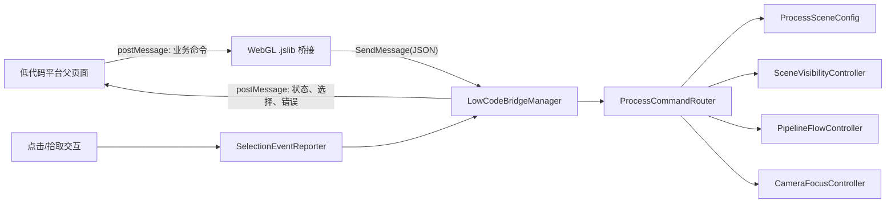

# 燃气发电 WebGL 三维交互与低代码 iframe 集成开发计划

**文档状态：** 已完成本期交付（主流程交互、半透明上下文、iframe 桥接、流程镜头、自由相机及最终 Brotli WebGL 包均已完成并通过本地 iframe 回归）  
**场景：** `Assets/Scenes/SampleScene.unity`  
**目标：** 将已摆放完成的燃气发电厂三维场景打包为 Unity WebGL，嵌入模拟低代码平台的 iframe 后，由平台指令驱动流程下钻、周边模型的半透明上下文显示、相应管线的流动材质效果，并将三维对象交互事件回传给平台。

## 1. 需求理解与边界

依据提供的流程表和示意图，本期对应“燃气发电”画面：

- 上游：燃气管网。
- 主流程：进口烟道 / 炉体（余热锅炉）/ 汽包 / 烟囱 / 燃气轮机 / 蒸汽轮机 / 发电机。
- 下游：电网。
- 表现方式：写实 3D 工艺场景配合 2D/8D 拓扑，由低代码平台下发当前流程节点；Unity 自动聚焦目标，保持地面完整显示、将无关周边降为半透明上下文，并使对应管段呈现定向流动效果。

本期交付的是**可被 iframe 父页面控制的三维运行时**，不在 Unity 内重复开发低代码平台的导航、表格或详情面板。Unity 仍应保留必要的加载、错误与调试提示，以方便独立排障。

## 2. 已读取的项目现状

### 2.1 工程与场景

- 引擎为 **Unity 2022.3.33f1c1**，使用 **URP 14.0.12**；`SampleScene` 已启用并加入 Build Settings。
- 场景根对象为“场景”，当前模型均以 FBX Prefab 实例直接挂在该根对象下；只有 `Main Camera`、`Directional Light`、`Global Volume` 和“场景”四个直接 GameObject，尚无“流程/设备/周边物”语义分组。
- 已放入两台燃气轮机、两套余热锅炉、两台汽轮机、两套发电机、进气室、冷凝器、升/降压站、电网和 **8 段管道模型（编号为 1–7、9；场景中不存在管道 8）**等资产。部分名称是“建筑 N”“管道 N”，不能作为业务接口标识。
- `Assets` 共约 **728.7 MB**，其中 FBX 约 **602.9 MB**；配电变电站、余热锅炉、启动马达、控制站等单文件较大。WebGL 性能与首包体积需要单列验收，不能只在编辑器里验证。

### 2.2 已有 iframe 通信基础

项目已经具备可复用的通信验证基线：

- `Assets/Plugins/WebGL/Power3dUnityBridge.jslib` 使用 `window.postMessage` 接收/回传消息。
- `Assets/Scripts/UnityIframeBridgeManager.cs` 使用协议通道 `power3d-unity`、版本 `1` 和 `instanceId` 做校验；目前仅实现 `init`、`test-command`、`resize` 和测试立方体的 `object-click`。
- `F:/WorkSpace/DLPro/local-iframe-test/` 含父页面模拟器、Unity 模拟页面，以及可正确处理 Unity Brotli 构建产物响应头的 `serve_webgl.py`。
- 当前 `UnityIframeTestBootstrap` 会在运行时创建测试立方体；该逻辑只适用于联调基线，正式功能接入时应移除或仅编译进开发环境，避免出现在厂区画面和生产包中。

现有桥接已经采用“精确来源 + 父窗口 + 通道 + 版本 + 实例标识”的过滤方式。正式开发应继承这一安全边界，而不是改为 `*` 或直接暴露 Unity GameObject 名称。

### 2.3 管道流动材质基础

- 已有 URP Shader：`Assets/Shaders/PipelineFlowURP.shader`（`自定义/URP/管道流动`）。其流动条带由 `_FlowTiling`、`_FlowSpeed`、`_FlowAxis`、`_Spiral`、`_FlowColor` 等参数控制，并保留底色、法线、金属度与光照能力。
- 已有预设：`PipelineFlow_Gas.mat`（蓝色、高速）和 `PipelineFlow_Oil.mat`（青色、低速）。二者目前没有被场景或其他资产引用。
- 这两个材质的原始贴图槽为空。因此不能直接批量覆盖管道 Renderer 后就认为保留了原有质感；实施时需按每段管道复制/配置其原材质的底色、法线、金属度信息，并针对 UV 朝向校正流动方向。

## 3. 实施原则

1. **配置驱动，不依赖层级名称。** 流程、设备、管段、相机机位和材质参数均以稳定 ID 配置，不能让低代码平台发送“管道 4”或 Unity 层级路径。
2. **高层业务指令优先。** 平台应发送“进入燃机流程第 N 步”，Unity 自行决定哪些模型保持完整显示、哪些周边降为半透明、使用哪几段管道和什么视角；仅保留受限的底层调试指令。
3. **可逆且幂等。** 任意下钻或高亮状态可由 `resetScene` 恢复全景，重复下发同一命令不会叠加材质实例、相机动画或隐藏状态。
4. **WebGL 优先。** 交互、材质、透明度、加载与通信都以目标浏览器实测为准；编辑器仅用于快速开发验证。
5. **安全最小化。** 只接收配置的父页面 Origin 与当前 iframe 父窗口的消息，所有指令进入执行层前做白名单、字段、长度和业务 ID 校验。

### 3.1 下钻上下文显示规则（已调整）

- 下钻时，`地面1`、`地面2`始终保持原始不透明材质和可见状态，不参与隔离或淡化。
- 当前步骤的目标设备、同一步骤必需的辅助设备和激活管段保持原始不透明材质；激活管段再叠加流动效果。
- 其余原本可见的场景一级模型不再 `SetActive(false)`，而是替换为运行时半透明材质实例，默认不透明度为 **0.22**。这样保留厂区体量、空间关系和遮挡参照，避免画面显得空。
- 切换步骤、复位、停止流动或销毁运行时对象时，必须先回收运行时流动/半透明材质，并完整恢复每个 Renderer 的原始材质数组与原始 active 状态。
- 该透明度作为 `PowerPlantProcessController._contextOpacity` 的可调配置；验收阶段可在 0.18–0.35 内按画面效果确定最终值。

## 4. 目标架构



### 4.1 Unity 模块划分

| 模块 | 建议职责 | 关键约束 |
| --- | --- | --- |
| `ProcessSceneConfig`（ScriptableObject） | 保存流程、步骤、节点组、管线路由、机位和材质配置的唯一映射 | 资产化、可在 Inspector 审核；不写死在 JS 或字符串 switch 中 |
| `SceneNodeId` / `SceneGroup` | 绑定设备或周边模型根节点，声明稳定 ID、类别、可见性参与方式 | 一个业务节点可关联多个 Renderer/子模型 |
| `ProcessCommandRouter` | 校验并路由 `enterProcessStep`、`resetScene` 等业务命令 | 对未知 ID 返回错误，不访问任意 GameObject |
| `SceneVisibilityController` | 计算概览/隔离/下钻状态，保持地面、执行焦点完整显示与周边半透明效果 | 缓存初始 active 状态和材质数组，保证可完整恢复 |
| `PipelineFlowController` | 恢复原材质、启停流动材质、按方向和工质设置参数 | 不在消息处理时无界创建 `renderer.material` 实例 |
| `CameraFocusController` | 全景、流程步骤与设备近景之间的平滑转场 | 机位由配置提供；不依赖鼠标拖拽得到的临时位置 |
| `SceneRaycastInteractor` | 鼠标/触摸拾取、悬停、点击与选中反馈 | 使用代理 Collider 或设备根节点，回传稳定业务 ID |
| `LowCodeBridgeManager` | 延续现有桥接协议，负责握手、命令入口、回执和事件出口 | WebGL 特有 API 受编译条件保护，编辑器可模拟测试 |

### 4.2 推荐的场景分组

在“场景”根节点下新增仅用于管理的空对象；已有 FBX 实例保持其资源引用不变：

```text
场景
├─ PlantOverview                 # 全局可见内容
├─ ProcessNodes                  # 可被下钻的设备/工艺节点
│  ├─ gas-network
│  ├─ inlet-duct
│  ├─ gas-turbine-1 / 2
│  ├─ hrsg-1 / 2
│  ├─ steam-turbine-1 / 2
│  ├─ generator-1 / 2
│  └─ grid
├─ ProcessPipelines              # 现有管道 1–7、9 的稳定别名与实际 Renderer 引用
├─ PeripheralModels              # 建筑、屋顶、辅助设备、非当前流程模型
├─ InteractionProxies            # 点击用 Collider/热点；不改变写实模型网格
└─ RuntimeManagers               # 桥接、流程、相机、选中控制器
```

“流程节点”和“周边物”可重叠：例如某设备在总览中可见，但进入另一设备下钻时应被纳入要淡化的周边集合。最终状态以当前 `ProcessStep` 配置的 `visibleNodeIds`、`contextFadeNodeIds`、`focusNodeId` 与 `routeIds` 为准；地面节点不进入 `contextFadeNodeIds`。

## 5. 流程与配置建模

### 5.1 业务 ID 建议

以下是接口建议命名，不等同于现有 FBX 名称；实施前应由业务和美术共同填写真实映射表。

| 类型 | 建议 ID 示例 | 场景绑定示例 |
| --- | --- | --- |
| 流程 | `gas-power-generation` | 燃气发电总流程 |
| 步骤 | `gas-inlet`、`gas-turbine`、`hrsg`、`steam-turbine`、`generator`、`grid-output` | 当前下钻节点与机位 |
| 设备 | `unit.gas-turbine.1`、`unit.hrsg.1`、`unit.grid` | 一个或多个模型根节点 |
| 管段 | `pipe.gas-inlet.01`、`pipe.steam.01`、`pipe.power-output.01` | 已映射管段的具体 Renderer 集合 |
| 路由 | `route.gas-to-turbine`、`route.steam-to-generator`、`route.generator-to-grid` | 有序管段列表、工质、方向、流动参数 |
| 机位 | `camera.overview`、`camera.gas-turbine` | 位置、朝向、FOV、过渡时间 |

### 5.2 每个流程步骤至少应配置

- `stepId`、中文名称、目标设备 ID。
- 默认机位、可选的最小/最大观察距离。
- 保留显示、隐藏、半透明显示的节点集合。
- 激活路由列表与每条路由的方向；无流动时明确声明，不沿用上一步状态。
- 可点击热点和回传的 `assetId` / `assetName`。
- 进入、退出时是否显示设备标签、边界高亮或说明提示。

建议先制作一个覆盖整条主流程的配置，再逐步补齐双机组差异。模型空间位置已形成一份初步映射，见第 12 节；其中中/低置信度管段仍需业务确认后再固化为最终材质路由。

## 6. iframe 通信协议

### 6.1 通用消息包

保留现有通信通道，以便直接复用 `local-iframe-test`：

```json
{
  "channel": "power3d-unity",
  "version": 1,
  "instanceId": "gas-plant-001",
  "messageId": "uuid-or-request-id",
  "type": "enterProcessStep",
  "payload": {},
  "timestamp": 1780000000000
}
```

- 父页面在 iframe URL 中写入 `parentOrigin` 和 `instanceId`；Unity 读取后只接受该 Origin 且 `event.source === window.parent` 的消息。
- Unity 的 `ready` 到达后，父页面再发 `init`；每条会改变场景的命令都必须得到 `commandResult` 或 `error`。
- `messageId` 用于关联回执、日志和幂等去重。协议版本升级时新增版本，不静默改变既有字段含义。

### 6.2 父页面 → Unity 的正式命令

| `type` | 核心 `payload` | Unity 行为 |
| --- | --- | --- |
| `init` | `sceneId`、可选初始 `processId` / `stepId` | 完成会话初始化，返回能力、场景版本与当前状态 |
| `enterProcessStep` | `processId`、`stepId`、`isolate`、可选 `transitionMs` | 聚焦步骤、按配置保持地面/焦点并淡化周边、停旧流动、启新路由流动 |
| `setRouteFlow` | `routeId`、`enabled`、可选 `speed`、`direction` | 只控制已配置路由；适用于实时运行状态变化 |
| `setNodeVisibility` | `nodeIds`、`visible` | 仅用于平台明确需要的受限覆盖；不得传 Unity 路径 |
| `focusNode` | `nodeId`、可选 `cameraId` | 聚焦已登记设备，不改变未声明的流程状态 |
| `resetScene` | 可选 `cameraId: "camera.overview"` | 恢复总览可见性、原始材质和全景机位 |
| `resize` | `width`、`height` | 维持现有画布布局协作能力 |

示例：低代码平台进入燃气轮机步骤。

```json
{
  "channel": "power3d-unity",
  "version": 1,
  "instanceId": "gas-plant-001",
  "messageId": "request-001",
  "type": "enterProcessStep",
  "payload": {
    "processId": "gas-power-generation",
    "stepId": "gas-turbine",
    "isolate": true,
    "transitionMs": 650
  },
  "timestamp": 1780000000000
}
```

### 6.3 Unity → 父页面的事件

| `type` | 触发时机 | 关键字段 |
| --- | --- | --- |
| `ready` | WebGL 桥接监听器完成注册 | `capabilities`、`runtime` |
| `commandResult` | 合法命令完成或幂等命中 | `requestId`、`success`、`sceneState` |
| `sceneStateChanged` | 下钻、复位、显隐或流动状态改变 | `processId`、`stepId`、`activeRouteIds` |
| `objectSelected` | 用户点击设备/管道热点 | `nodeId`、`assetId`、`assetName`、`screenPosition` |
| `error` | 协议、ID、配置或运行错误 | `requestId`、`code`、`message` |

父页面保持现有“精确 Origin、iframe window、通道、版本、实例 ID”五层校验，且 `postMessage` 的 `targetOrigin` 必须是具体 Origin，不使用通配符。

## 7. 管道流动效果方案

1. **管段盘点。** 在编辑器中依次确认现有 8 段管道（1–7、9）的实际工艺含义、Renderer 数量、UV 长轴、原材质与正反流向；形成“管段 ID → Renderer → 路由”的配置表。
2. **保留原样式。** 为每类管段建立流动材质变体，继承原 `_BaseMap`、法线、金属度、光滑度和基础色，再叠加 `PipelineFlowURP` 的发光流带。原材质数组在初始化时缓存，以用于 `resetScene` 和路由切换后的可靠还原。
3. **按工质区分。** 燃气路由使用 `PipelineFlow_Gas` 的蓝色参数作为起点；蒸汽、水、油或电力若需不同表现，建立明确的 `MaterialProfile`，不以“油材质”代替尚未确认的蒸汽流程。
4. **按模型校正方向。** 对每条管段配置 `flowAxis`（U/V）、`flowSpeed` 正负、`tiling`、`spiral`。若 UV 不沿管长方向，优先制作该管段专属变体；必要时使用流动覆盖网格，不在运行时修改 FBX 网格。
5. **控制批次与实例。** 运行期仅切换预建材质或受控的材质实例；避免在每次 iframe 消息中访问 `Renderer.material`，以免产生未释放的材质副本和 WebGL 内存增长。
6. **可读性验收。** 远景能看出流向，近景不遮盖原有管壁细节；停止流程后不残留亮带；透明管道应在 WebGL 中检查排序问题。

## 8. 开发阶段与交付物

| 阶段 | 工作内容 | 交付物 / 完成标准 |
| --- | --- | --- |
| 0. 业务映射确认 | 基于场景模型映射表确认总流程、现有管道 1–7、9 的对应关系、双机组规则、每个下钻点机位与“周边”定义 | 评审通过的流程—设备—管道—相机映射表 |
| 1. 场景语义化 | 新建管理根节点、稳定 ID 组件、交互代理与 `ProcessSceneConfig`；不修改 FBX 源资产 | 场景可在 Inspector 看出每个步骤控制的对象 |
| 2. 交互核心 | 实现总览/下钻/复位、地面常显、周边半透明与原材质恢复、相机平滑聚焦、鼠标/触摸拾取和对象选中反馈 | 编辑器 Play Mode 按配置完成整条流程切换 |
| 3. 管道效果 | 盘点 Renderer，建立材质变体与路由控制器，完成原材质恢复 | 每条已映射管段在正确步骤和方向流动 |
| 4. 正式桥接 | 将现有测试协议扩展为正式命令、回执和错误模型；清理测试立方体逻辑 | iframe 父页可控制完整场景且能收到选择事件 |
| 5. WebGL 构建与调优 | 配置构建模板/压缩/内存，检查 Shader 变体、加载、帧率和包体 | 可部署 WebGL Build 与性能记录 |
| 6. 联调与验收 | 用本地模拟器及真实低代码页面进行安全、异常和回归测试 | 联调记录、协议说明、交付 Build |

建议先以“总览 → 燃气轮机 → 余热锅炉 → 汽轮机 → 发电机 → 电网 → 复位”这一条主路径打通，再扩展双机组、分支管路和实时状态。这样能在管道映射尚未完全确认时尽早验证平台接口与交互框架。

## 9. WebGL 构建与性能计划

- 以当前 URP 场景建立 **WebGL Development Build** 联调包和 **Release Build** 交付包。发布包关闭不需要的诊断与测试逻辑，保留结构化错误回传。
- 已完成精确网格审计与复用：场景中识别出 13 组完全相同的网格，已将 `启动马达2`、`顶部2`、`管道9`、`娶她建筑2`、`建筑6`、`建筑2`、`启动马达外壳2` 等 7 个重复 FBX 的场景引用改为复用对应源网格；原始资产保留，不删除用户文件。该操作保持 Transform、材质与交互根节点不变。
- 当前四个关键模型均保持原始网格显示质量：`地面2`、`控制站1`、`控制站2`、`配电变电站` 的 **Mesh Compression 均为 Off**；其余参与构建模型维持既定压缩策略。`webGLInitialMemorySize` 为 **768 MB**、最大值 **2048 MB**、增长模式为几何增长。若目标终端仍超限，优先实施 LOD、模型减面或按流程拆包/按需加载，不再单纯提高堆内存。
- Release 包使用 Brotli。`local-iframe-test/serve_webgl.py` 和正式服务器必须为 `.data.br`、`.framework.js.br` 返回 `Content-Encoding: br`，为 `.wasm.br` 同时返回 `Content-Type: application/wasm`；普通静态服务不可直接替代。
- 首次实测记录：Build 体积、首屏加载时间、内存、概览与下钻状态帧率、Draw Calls / Batches、材质与纹理内存。以实测结果决定模型压缩、纹理尺寸、Mipmap、LOD、静态批处理和按需加载策略。
- 流动 Shader 仅编译实际使用的 URP 变体；保证所有自定义材质在 WebGL 的 shader stripping 后仍被引用或收录到 Variant Collection。
- 初期以现代桌面 Chrome/Edge 作为基准浏览器。若要支持移动端、低配置终端或多实例同页嵌入，需要在阶段 0 明确并按目标重做内存和包体预算。

### 9.1 已完成的 WebGL 构建与实测记录（2026-07-31）

| 项目 | 结果 |
| --- | --- |
| 重复网格复用 | 已解除 7 个重复 FBX 的场景构建依赖，复用完全相同源网格；未删除原始资产 |
| 当前压缩策略 | `地面2`、`控制站1`、`控制站2`、`配电变电站` 均为 Off；其余模型为 High |
| Development 构建 | `Builds/WebGL-Development-960-Substation-ControlStation1Compressed` 成功，**286.74 MB**；此前 Development 运行时仍在 `GlobalMetadata` 阶段出现 `memory access out of bounds` |
| 当前诊断包 | `Builds/WebGL-Release-768-AllOriginalModels-CameraDiagnostic`，构建 `build-0592557b13` 成功，**328.74 MB**，0 error、12 warning；为缩短验证周期临时关闭发布压缩，数据缓存关闭 |
| 诊断包静态服务校验 | `5514` 下 `.wasm` 为 `application/wasm`、无 `Content-Encoding`；与关闭压缩配置一致 |
| iframe 实测状态 | `5514` 已收到 `ready`、`init`、`ack`，并成功下发 `enterProcessStep(gas-turbine, all)`；画面进入包含半透明周边的燃机双机组流程视图 |
| 已关闭的渲染阻塞 | 当前内嵌浏览器已创建 WebGL 2 上下文并渲染场景，不再出现阻塞场景进入的内存越界或压缩响应头错误；仍会输出不影响运行的 URP 内部调试 Shader 不支持提示 |
| 最终 Release 包 | `Builds/WebGL-Release-768-AllOriginalModels-Camera`，构建 `build-a62bfa5606` 成功，**175.10 MB**，耗时 **1411.77 秒**，0 error、12 warning；四个关键模型保持 Mesh Compression Off，WebGL 初始内存为 768 MB，数据缓存关闭 |
| 最终包静态服务校验 | `5515` 下 `.data.br`=`application/octet-stream; Content-Encoding: br`，`.framework.js.br`=`application/javascript; Content-Encoding: br`，`.wasm.br`=`application/wasm; Content-Encoding: br` |
| 最终 iframe 回归 | `5515` 已完成 `ready → init → ack`；`enterProcessStep(gas-turbine, all)` 返回“已进入 gas-turbine（机组：all）”，`resetScene` 返回“已恢复全景场景”，场景可视画面正常 |

本地联调时父页面运行于 `http://127.0.0.1:5500/`；诊断包使用 `http://127.0.0.1:5514/`，最终发布包使用 `http://127.0.0.1:5515/`。端口仅作为本机测试记录，正式部署应改为低代码平台给定的 HTTPS Origin。

### 9.2 已实现的相机交互约定

- 低代码平台下发有效 `enterProcessStep` 或 `resetScene` 后，`PowerPlantProcessController` 在 **1.45 秒**内以平滑缓入缓出曲线，将主相机推进到当前流程可见对象（单机组时为目标设备，双机组时为两套已显示设备的聚合边界）。不会直接跳转镜头。
- 下钻目标之外的对象降为半透明，`地面1`、`地面2` 继续保持不透明显示；流程动画期间再收到新的步骤或复位命令时，新的转场会从当前相机状态重新开始，保证最终状态可预测。
- `Main Camera` 已挂载 `PowerPlantFreeCameraController`。画布取得焦点后，`W/A/S/D` 为前/左/后/右，`Q/E` 为下降/上升，按住 `Shift` 为 3 倍移动速度；按住鼠标右键并移动可旋转视角。任意手动移动或右键旋转会取消尚未结束的流程转场，避免输入与镜头动画互相覆盖。
- 已在 iframe 诊断中确认流程指令回执与可见的中间推进帧、结束帧；键盘组合可发送至已获焦的 Unity 画布。最终 Brotli 发布包亦已完成进入流程与复位回归。

## 10. 测试与验收清单

### 功能验收

- 父页面收到 `ready` 后可初始化；每个合法命令有对应的成功或失败回执。
- 从总览进入各已配置步骤时，目标设备、相应管段、相机机位、地面常显和周边半透明效果均与映射表一致。
- 连续切换步骤、重复发送同一请求、在动画中发送复位，最终状态一致且不会叠加动画或材质。
- 所有激活管段流向正确；停流、切换、复位均恢复原材质和原始显隐状态。
- 点击设备或管道热点向平台回传稳定业务 ID；拖拽观察和点击可区分，不误触发选择。

### 安全与稳定性验收

- 非配置 Origin、非父窗口、错误 `instanceId`、未知消息类型和未知业务 ID 均不改变场景状态。
- `payload` 缺字段、超长字段、错误类型、重复 `messageId` 和过期会话有明确错误处理，不抛出未捕获异常。
- iframe 改变尺寸、切换标签页、画布失焦/恢复焦点后，仍可处理下一条合法命令。
- 使用 `local-iframe-test` 先验证正向通信与错误 Origin 拒绝，再接入真实低代码平台。

### WebGL 验收

- 通过正确配置响应头的静态服务器加载压缩包，不出现 wasm/data/framework 解压或 MIME 错误。
- 控制台没有自定义 Shader 丢失、粉色材质、非法 WebGL API、通信异常或持续内存增长。
- 以约定目标浏览器和终端完成加载、总览、连续下钻、复位、刷新重进 iframe 的回归测试。

## 11. 实施前待确认项

1. 现有管道 1–7、9 分别对应哪一段真实工艺，以及每段的正向流动方向；是否存在燃气、蒸汽、水、油等多工质显示要求。
2. 图中“炉体 / 汽包 / 烟囱”分别对应现有哪一个 FBX 或子节点；目前资产名称能确认余热锅炉，但不能单凭文件名确认所有工艺部件。
3. 下钻的最终层级、每一级目标机位、要淡化/保留的周边范围，以及双机组是同步展示还是独立选择。
4. 低代码平台的正式部署 Origin、iframe URL 参数能力、认证/登录限制，以及是否需要多个 WebGL 实例同页运行。
5. 是否需要实时工况数据驱动颜色、流速、告警和设备状态；本计划预留 `setRouteFlow`，但不假设已经有数据接口。
6. 目标浏览器、分辨率、最低硬件能力和首屏加载时限。这些决定是否在本期实施 LOD、资源拆包或 Addressables。

---

## 12. 已验证的场景模型与流程映射

本节基于 Unity 编辑器中已加载的 `SampleScene` 整理：检查了场景层级、Transform、`MeshFilter` 和 `MeshRenderer` 的世界包围盒与材质引用，而非仅按 FBX 文件名推断。

### 12.1 扫描结论

- “场景”根节点下有 55 个模型实例；核心设备及管道都是其一级子对象。
- 大多数核心对象是单一 `MeshFilter + MeshRenderer`，当前没有 Collider；后续对象点击需添加运行时代理 Collider 或交互热点。
- 现有 8 段管道为 `管道1–7` 与 `管道9`，不存在 `管道8`。管道 1–4 的原材质是 `17 - Default.mat`，管道 5–7、9 的原材质是 `10 - Default.mat`，替换流动材质前须缓存并能还原。
- 两个余热锅炉均为单一 MeshRenderer，炉体、汽包、烟囱不能直接作为独立模型控制；本期可先用同一锅炉模型的不同相机热点表示，若要独立显隐/点击则需拆模或补充热点。
- 场景内没有可明确识别的“燃气管网”实体，也没有发电机至升压站的独立连接段。这两部分只能先由拓扑/高亮表达，不能伪造为已有流动管道。

### 12.2 双机组与公共送出区

| 分区 | 已识别模型 | 推荐稳定业务 ID |
| --- | --- | --- |
| 1 号燃机岛 | `进气室1`、`燃气轮机1`、`燃机发电机1`、`余热锅炉1`、`管道5/6` | `unit.ccgt.1.gas-train` |
| 1 号汽机岛 | `汽轮机1`、`汽轮发电机1`、`冷凝器1`、`管道1/2` | `unit.ccgt.1.steam-train` |
| 2 号燃机岛 | `进气室2`、`燃气轮机2`、`燃机发电机2`、`余热锅炉2`、`管道7/9` | `unit.ccgt.2.gas-train` |
| 2 号汽机岛 | `汽轮机2`、`汽轮发电机2`、`冷凝器2`、`管道3/4` | `unit.ccgt.2.steam-train` |
| 公共送出区 | `升压站`、`电网打组`、`电网电线`、`配电变电站`、`开关站+降压站`、`降压变电站` | `utility.grid` |

注意：`进气室支架2`实际位于 1 号燃机岛、`进气室支架1`实际位于 2 号燃机岛；配置必须使用稳定 ID 或对象引用，不可仅按尾号配对。

### 12.3 设备节点映射

| 业务节点 | 1 号对象 | 2 号对象 | 下钻与交互策略 |
| --- | --- | --- | --- |
| 进气 / 进口烟道 | `进气室1`、外壳、`进气室支架2` | `进气室2`、外壳、`进气室支架1` | 聚焦进气室，保留对应燃机和入气段；它是空气通道，不自动等同为燃气管网 |
| 燃气轮机 | `燃气轮机1` | `燃气轮机2` | 聚焦燃机，联动入口与排烟段 |
| 燃机发电机 | `燃机发电机1` | `燃机发电机2` | 作为燃机轴系的独立选择节点 |
| 余热锅炉 | `余热锅炉1` | `余热锅炉2` | 聚焦锅炉，联动燃机排烟段；炉体/汽包/烟囱先使用热点细分 |
| 汽轮机 | `汽轮机1` | `汽轮机2` | 聚焦汽轮机，联动冷凝器连接段 |
| 汽轮发电机 | `汽轮发电机1` | `汽轮发电机2` | 作为独立选择节点，转入电力送出步骤 |
| 冷凝器 | `冷凝器1` | `冷凝器2` | 汽机排汽/凝结水子步骤的聚焦节点 |
| 电力送出 | 公共送出区模型 | 公共送出区模型 | 显示升压/开关/配电/电网；机组至升压站的连接效果待补充模型或拓扑规则 |

### 12.4 管段映射与材质策略

“高”表示两个模型的包围盒相接或重叠且名称符合工艺关系；“中”表示位于同一工艺走廊，但仍需业务确认连接细节。

| 场景对象 | 已确认的空间连接 | 推荐 ID | 初步工艺含义 | 置信度 | 材质策略 |
| --- | --- | --- | --- | --- | --- |
| `管道1` | `汽轮机1` ↔ `汽轮发电机1` | `shaft.steam-turbine.1` | 汽机—发电机传动联轴段 | 高 | 不用流体材质；可选旋转/电力高亮 |
| `管道2` | `冷凝器1` ↔ `汽轮机1` | `pipe.steam-condenser.1` | 汽机排汽或凝结水连接 | 高（连接关系） | 新建蒸汽/水材质；方向待确认 |
| `管道3` | `汽轮机2` ↔ `汽轮发电机2` | `shaft.steam-turbine.2` | 汽机—发电机传动联轴段 | 高 | 不用流体材质；可选旋转/电力高亮 |
| `管道4` | `冷凝器2` ↔ `汽轮机2` | `pipe.steam-condenser.2` | 汽机排汽或凝结水连接 | 高（连接关系） | 新建蒸汽/水材质；方向待确认 |
| `管道5` | 位于 `进气室1` 与 `燃气轮机1` 的同一走廊 | `duct.intake.1` | 1 号机进气/进口烟道局部段 | 中 | 空气/进气效果；若业务确认是燃气管，再使用燃气材质 |
| `管道6` | `燃气轮机1` ↔ `余热锅炉1`，两端相接 | `duct.exhaust-to-hrsg.1` | 燃机排气至余热锅炉的烟道 | 高 | 使用 `PipelineFlow_Gas`，逻辑方向为燃机 → 锅炉 |
| `管道7` | 位于 `进气室2` 与 `燃气轮机2` 的同一走廊 | `duct.intake.2` | 2 号机进气/进口烟道局部段 | 中 | 空气/进气效果；若业务确认是燃气管，再使用燃气材质 |
| `管道9` | `燃气轮机2` ↔ `余热锅炉2`，两端相接 | `duct.exhaust-to-hrsg.2` | 燃机排气至余热锅炉的烟道 | 高 | 使用 `PipelineFlow_Gas`，逻辑方向为燃机 → 锅炉 |

当前可以直接实现的路由是 `route.exhaust-to-hrsg.1`（管道 6）和 `route.exhaust-to-hrsg.2`（管道 9）。`管道1/3`必须从 `PipelineFlowController` 的流体路由中排除。

### 12.5 建议的完整显示 / 半透明上下文集合与步骤

| 集合 / 步骤 | 内容与策略 |
| --- | --- |
| `peripheral.ground` | `地面1`、`地面2`；总览和全部下钻步骤中始终保持原始不透明显示，不参与隔离或淡化 |
| `peripheral.buildings` | `建筑1–7`、`建筑21`、`厂房2/5`、其他建筑、顶部；下钻设备时调整为默认 0.22 的半透明上下文，总览恢复原样 |
| `unit.1.auxiliary` / `unit.2.auxiliary` | 对应启动马达、外壳、控制站；当前机组下钻时可保留完整显示，另一机组下钻时调整为半透明上下文 |
| `overview` | 全部模型显示，无流动路由 |
| `inlet-duct` | 显示选中机组的进气室、燃机和管道 5/7；待确认其介质后启动流动 |
| `gas-turbine` / `hrsg` | 当前燃机岛完整显示，启动当前机组的管道 6/9 流动；地面保持不透明，周边和另一机组半透明 |
| `steam-turbine` | 显示当前汽机、汽轮发电机、冷凝器与管道 2/4；待确认介质方向后启动流动 |
| `generator` / `grid-output` | 显示发电机和公共送出区；当前无可确认的机组直连管段，先使用选中/高亮效果 |

### 12.6 实施前仍需确认的最小项

1. 管道 5/7 是进气/入口烟道还是燃气管；管道 2/4 的介质与正向流动方向。
2. 炉体、汽包、烟囱是否必须被分别点击、隐藏或换材质；若必须，需提供拆分模型或确认热点位置。
3. 燃气管网及发电机至升压站的视觉表现是补模型、2D 拓扑叠加还是能量高亮。
4. 平台命令是选择 1/2 号机组，还是两套机组同步演示；正式接口据此决定是否传递 `unitId`。

## 13. 建议的下一步

先完成“流程—场景对象—管段—机位”映射表确认，并在 Unity 中对现有 8 段管道逐条验证 UV 流向。映射确认后即可按本计划从阶段 1 开始实现，无需改动已摆放的原始 FBX 资产。
