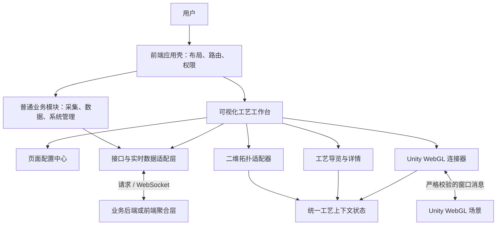
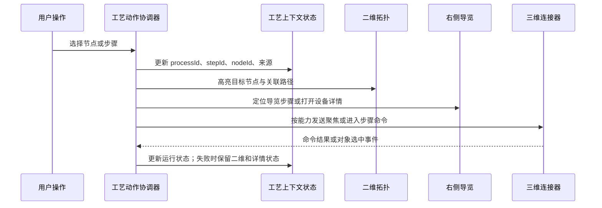
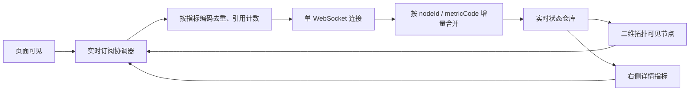

# 电力全流程数据采集与分析系统前端架构设计

**文档状态：** 架构设计，待前端工程初始化后执行  
**编制日期：** 2026-08-01  
**适用范围：** 门户、数据采集、数据管理、可视化、系统管理；重点覆盖“电力工艺”可视化页面。  
**依据：** 原型 `power-system-prototype-v3/index.html`、当前 Unity 工程 `WebDLPro`、既有 iframe 本地联调器 `DLPro/local-iframe-test`。

---

## 1. 结论与关键约束

本需求合理，推荐建设为“一套业务前端壳 + 配置驱动工艺页面 + 按需加载 Unity 网页图形场景”的架构。

原型已经定义了完整的信息架构：门户、数据采集、数据管理、可视化、系统管理；可视化下含总览大屏、9 个工艺域共 34 个工艺页面、5 个专题页面。普通模块采用统一的表单、表格、图表、详情页能力；工艺模块采用固定的“三栏工作台”能力：**左侧导航、中间三维场景与二维拓扑、右侧工艺导览/详情**。

以下约束必须在一期架构中落实：

1. **同一时刻只保留一个激活的 Unity 网页图形（WebGL）实例。** 当前燃气场景构建产物约为 `355.4 MiB`（数据包约 `300.1 MiB`、运行模块约 `54.6 MiB`、框架约 `0.7 MiB`）。多个 iframe 常驻会造成网络、内存和显存竞争，不能用页面缓存方式规避。
2. **场景能力按 `webgl`、`static-preview`、`empty` 三档交付。** 只有已通过资源预算、协议联调和节点映射校验的工艺域允许使用 `webgl`；未交付三维场景的页面必须保持二维拓扑与导览可用。
3. **工艺页面完全由配置驱动。** 新增燃煤、风电、光伏、变电等页面，只新增页面定义、拓扑定义、流程导览定义和场景登记，不复制页面组件。
4. **页面、拓扑、导览和场景映射按同一配置版本原子发布。** 发布前自动校验 `nodeId`、`stepId`、`routeId` 及其权限、详情、三维映射，不接受跨版本组合。
5. **三维、二维拓扑、右侧导览共享同一组稳定业务标识。** 例如 `nodeId`、`stepId`、`processId`；禁止用 Unity 层级名、图片文件名或显示文案作为接口参数。
6. **现有燃气 WebGL 桥接协议直接复用。** 当前已实现严格来源校验、实例标识校验及 `init`、`enterProcessStep`、`focusNode` 等消息；前端只新增统一连接器，不在业务组件中直接调用 `postMessage`。
7. **没有真实三维场景的工艺域不伪造 iframe。** 原型中的场景图片可作为“静态预览”降级模式；待对应 Unity 包交付后，仅通过配置切换到“网页图形”模式。

---

## 2. 现状核对与设计边界

### 2.1 已核对的原型范围

原型中的可视化导航包含以下工艺域和页面数量：

| 工艺域 | 页面 | 数量 |
| --- | --- | ---: |
| 燃煤发电 | 总览、输煤制粉、锅炉燃烧、汽机发电、辅助系统、集控调度 | 6 |
| 燃气发电 | 总览、进气处理、燃机发电 | 3 |
| 风力发电 | 总览、风机监控 | 2 |
| 光伏发电 | 总览、逆变器监控 | 2 |
| 变电 | 总览、升压站、换流站、开关站、降压站、变压器、断路器 | 7 |
| 配电 | 总览、配电站、配电柜、馈线、开关柜 | 5 |
| 用电 | 总览、楼宇配电、楼层配电、充电桩、充电站监控 | 5 |
| 微电网 | 总览、微电网调度 | 2 |
| 调度中心 | 总览、调度控制台 | 2 |
| **工艺页面合计** |  | **34** |
| 专题场景 | 监控与数据采集、分布式控制、可编程逻辑控制器、故障诊断、安全预警 | 5 |

说明：原型中“监控与数据采集（SCADA）”“分布式控制系统（DCS）”“可编程逻辑控制器（PLC）”使用英文缩写展示，正式页面沿用中文名称与缩写即可。

### 2.2 已核对的 Unity 能力

当前 `WebDLPro` 是 Unity 工程，已完成燃气发电场景的网页图形集成基础：

| 能力 | 当前状态 | 前端设计结论 |
| --- | --- | --- |
| 燃气三维场景 | 已有 WebGL 构建产物 | 作为首个真实接入的 `runtimeKey` |
| 父子页面通信 | 已有 `.jslib` 与 C# 桥接管理器 | 前端统一封装，不重写 Unity 协议 |
| 安全校验 | 校验父页面来源、父窗口、通道、版本、实例标识 | 前端必须传入精确 `parentOrigin`，不得使用通配来源 |
| 指令 | 初始化、尺寸、进入流程步骤、复位、聚焦节点、节点显隐、流动路线 | 形成三维连接器的首批命令白名单 |
| 事件 | 就绪、确认、命令结果、对象选中 | 三维对象选中可驱动拓扑与右侧详情同步 |
| 其他工艺域三维场景 | 当前未发现对应 WebGL 包 | 先以静态预览或空态承接，待真实包交付后切换配置 |

### 2.3 不在本设计中假设已存在的内容

- 真实后端接口、权限字段、实时数据主题和告警等级尚未提供；本设计定义前端契约与适配层，不虚构后端地址。
- 除燃气发电场景外，其余工艺域尚未确认有 Unity 包、模型映射和稳定节点标识；不承诺已实现三维联动。
- 原型中的二维拓扑目前是图片资产；正式版应升级为数据驱动拓扑，仍保留图片降级能力。

---

## 3. 总体技术架构

### 3.1 技术选型

| 层级 | 推荐技术 | 选择原因 |
| --- | --- | --- |
| 应用框架 | Vue 3（渐进式前端框架）+ TypeScript（静态类型脚本语言） | 组件化、类型约束完善，适合配置驱动的复杂工作台 |
| 工程构建 | Vite（前端构建工具） | 开发启动快、按路由拆包直接、适合独立前端工程 |
| 路由 | Vue Router（Vue 路由管理器） | 支持嵌套路由、权限元信息、页面级懒加载 |
| 状态 | Pinia（Vue 状态管理库） | 领域状态清晰，避免跨组件层层传参 |
| 接口层 | 基于 `fetch` 的轻量请求封装 | 统一鉴权、取消请求、错误转换和类型校验，避免业务层重复处理 |
| 图表与二维拓扑 | Apache ECharts（阿帕奇图表库）画布渲染 | 适合监控态展示、缩放、节点高亮和增量数据更新；通过适配器隔离具体图形库 |
| 三维容器 | 原生 iframe + 统一 WebGL 连接器 | 与既有 Unity WebGL、严格消息协议兼容 |
| 实时通道 | WebSocket（网页套接字）适配器 | 单连接复用、订阅去重、页面不可见时可降频 |
| 测试 | 单元测试、组件测试、端到端测试 | 配置、选择同步、消息协议、页面联动均可独立回归 |

不建议把普通前端页面写进 Unity 的 `Assets` 目录。建议在 `F:\WorkSpace\WebDLPro\power-data-web` 建立独立前端工程；该目录与 Unity 的 `Assets` 保持隔离，并随当前 `WebDLPro` Git 仓库统一管理。Unity 场景与前端应用仍通过构建产物部署和 iframe 消息协议解耦。

### 3.2 分层图



### 3.3 前端内部层次

| 层次 | 职责 | 禁止事项 |
| --- | --- | --- |
| 应用壳 | 登录态、主导航、左侧导航、主题、全局错误处理 | 不保存某个页面的三维运行细节 |
| 路由页面 | 装配页面配置、加载页面级数据、处理地址参数 | 不直接操作 iframe、图表实例或 WebSocket |
| 领域组件 | 工艺工作台、拓扑、导览、详情、数据表格 | 不写死具体工艺页面名称与资源地址 |
| 协调器 | 处理“选择节点/步骤/设备”等单一业务动作，并同步三块视图 | 不包含 DOM 渲染逻辑 |
| 状态仓库 | 保存可序列化的业务状态与缓存 | 不持有图表实例、iframe 窗口对象、定时器 |
| 基础设施适配器 | 请求、实时通道、拓扑渲染、Unity 通信、存储 | 不依赖页面组件 |

---

## 4. 信息架构与路由设计

### 4.1 一级导航

| 一级模块 | 路由前缀 | 页面类型 | 实现方式 |
| --- | --- | --- |
| 系统门户 | `/portal` | 系统入口卡片 | 通用卡片网格 |
| 数据采集 | `/collect` | 采集点、链路、策略、质量监控 | 通用表格、表单、详情抽屉 |
| 数据管理 | `/data` | 实时数据、业务统计 | 查询条件、图表、数据表格 |
| 可视化 | `/visual` | 总览大屏、工艺工作台、专题场景 | 独立视觉布局与全屏能力 |
| 系统管理 | `/system` | 设备、用户、角色、权限、低代码配置 | 通用后台管理页面 |

### 4.2 可视化路由

```text
/visual/dashboard                         # 总览大屏
/visual/process/:processPageId             # 34 个工艺页面共用一个页面组件
/visual/topic                              # 专题场景入口
/visual/topic/:topicId                     # 5 个专题详情页面
```

其中 `processPageId` 只接受配置中心登记的值，例如 `gas-overview`、`gas-turbine`、`coal-boiler`。路由守卫应在进入页面前校验该标识是否存在、用户是否有对应工艺域权限；无效标识进入“不存在/无权限”页面，而非拼接资源地址。

### 4.3 三栏工作台布局

桌面端使用固定工作区，不让整个页面随三维场景和拓扑内容滚动：

```text
┌──────────────────────────── 顶部导航：56px ───────────────────────────┐
├──── 左侧工艺树 ────┬───────────── 中央工作区 ─────────────┬── 右侧面板 ─┤
│ 工艺域与子页面     │ 面包屑 / 当前工艺标题                │ 工艺导览     │
│                    ├─────────────────────────────────────┤ 或设备详情 │
│                    │ Unity WebGL 场景 / 静态预览          │ 可独立滚动  │
│                    ├─────────────────────────────────────┤            │
│                    │ 二维网络拓扑                         │            │
└────────────────────┴─────────────────────────────────────┴────────────┘
```

| 视口范围 | 布局规则 |
| --- | --- |
| 宽度不小于 1440 像素 | 左栏 `236px`，右栏 `360px` 起，中间区自适应且不小于 `720px` |
| 1280 至 1439 像素 | 左栏收至 `208px`，右栏收至 `320px`，工艺导览支持折叠 |
| 小于 1280 像素 | 不强行压缩三维画布；右栏改为抽屉，左栏改为可收起导航；提示使用桌面端获得完整体验 |
| 小于 1024 像素 | 仅提供查看和基础导航，不承诺三维操控体验 |

中央工作区使用网格布局：三维区域优先保持 `16:9`，二维拓扑区域采用固定且可伸缩的容器高度；常规工艺页基准为 `clamp(270px, 30dvh, 320px)`，在画布内提供缩放、拖拽和全屏查看，不能以持续增高容器的方式让页面产生额外纵向滚动。三维容器与拓扑容器的详细布局、直连优先、连线避让、协议标签和性能要求，统一遵循[二维拓扑布局与交互规范](前端原子任务/拓扑图/二维拓扑布局与交互规范.md)。

---

## 5. 配置驱动模型

### 5.1 配置的职责边界

所有工艺页面只读取 `ProcessPageDefinition`（工艺页面定义）完成装配。页面定义由后端配置接口返回；首期可先随前端版本发布本地只读配置，后续再迁移到后台低代码配置。

| 配置域 | 关键字段 | 使用位置 |
| --- | --- | --- |
| 导航定义 | 工艺域、排序、父子关系、图标、权限码 | 顶部和左侧导航 |
| 页面定义 | `processPageId`、标题、面包屑、场景模式、资源键 | 路由页面装配 |
| 场景登记 | `runtimeKey`、入口地址、允许来源、超时、能力集 | WebGL 连接器 |
| 工艺流程 | `processId`、`stepId`、顺序、节点、上下游信息 | 右侧导览、三维指令 |
| 拓扑定义 | 节点、边、位置、样式、关联设备 | 二维拓扑 |
| 设备详情 | 指标模板、告警、说明、跳转动作 | 右侧详情抽屉/面板 |
| 数据绑定 | 指标编码、刷新策略、实时主题 | 数据适配器 |

### 5.2 页面定义示例

以下为数据结构说明，不是前端页面内的硬编码数据。所有标识使用稳定业务 ID，显示文案可独立调整。

```ts
interface ProcessPageDefinition {
  processPageId: string;       // 路由唯一键，如 gas-overview
  processId: string;           // 工艺流程唯一键，如 gas-power-generation
  title: string;               // 页面标题
  configVersion: string;       // 页面、拓扑、导览、映射的原子发布版本
  sceneMappingVersion?: string;// webgl 页期望匹配的 Unity 场景映射版本
  runtimeMode: 'webgl' | 'static-preview' | 'empty';
  runtimeKey?: string;         // 业务配置只能引用运行时键，不能包含运行时地址或来源
  topologyKey: string;         // 二维拓扑定义键
  guideKey: string;            // 右侧工艺导览定义键
  defaultStepId?: string;      // 首次进入时的流程步骤
  permissionCode: string;      // 页面访问权限
}

interface WebglRuntimeRegistration {
  runtimeKey: string;
  buildId: string;
  sceneMappingVersion: string;
  protocolVersion: number;
  frameOrigin: string;         // Unity 子页面的精确来源，供父页面校验并作为 targetOrigin
  allowedParentOrigin: string; // Unity 子页面唯一接受的父页面来源
  entryUrl: string;
  resourceVersion: string;
  commandCapabilities: string[];
  eventCapabilities: string[];
  resourceBudget: {
    transportSizeMiB: number;
    uncompressedSizeMiB: number;
    initialMemoryMiB: number;
    peakMemoryMiB: number;
    firstFrameTargetSeconds: number;
    targetDeviceProfile: string;
  };
}
```

燃气总览可声明为 `runtimeMode: 'webgl'` 并指向现有燃气包；未交付三维场景的燃煤、风电等页面先声明为 `static-preview`。等真实场景和节点映射完成后，只更改配置，不替换工作台组件。

### 5.3 统一标识规范

| 标识 | 含义 | 示例 | 不允许使用 |
| --- | --- | --- | --- |
| `processPageId` | 前端页面标识 | `gas-turbine` | 中文标题、文件名 |
| `processId` | 跨页面的工艺定义标识 | `gas-power-generation` | Unity 场景名 |
| `stepId` | 工艺导览步骤标识 | `hrsg` | 流程序号字符串 |
| `nodeId` | 设备或拓扑节点标识 | `unit.hrsg.1` | Unity 层级路径 |
| `routeId` | 介质或能量路径标识 | `route.exhaust-to-hrsg.1` | 管道模型名称 |
| `runtimeKey` | 一个可加载三维运行时的标识 | `gas-plant-v1` | 不含版本的 URL |
| `metricCode` | 实时指标标识 | `gas_turbine_01.temperature` | 页面内临时变量 |

已有 Unity 场景已按 `nodeId`、`stepId`、`processId` 接收指令并回传对象选中事件。前端配置必须与 Unity 配置共同维护映射表，并按 `configVersion` 原子发布。业务页面配置只能引用 `runtimeKey`；入口地址、来源、协议、能力和资源预算必须从受发布流程保护的只读运行时清单读取。发布前自动校验以下规则：

1. `runtimeMode: 'webgl'` 的页面必须具备已登记的 `runtimeKey`、`sceneMappingVersion`、精确 `frameOrigin`、`allowedParentOrigin`、资源预算和所需命令能力。
2. 每个可点击拓扑节点至少能映射到“详情、三维节点、或明确的无三维提示”中的一种。
3. 每个可点击流程步骤必须关联有效的 `stepId`，其关联节点和路径不得引用当前版本外的定义。
4. 配置版本不一致、存在孤立标识、运行时清单缺失或超过资源预算时，页面不得发布为 `webgl`，应降级为静态预览或空态。
5. 每个拓扑设备节点必须登记受控 `iconKey`、四态 `deviceStatus` 与 `statusUpdatedAt`；图元只能使用 `Docs/前端原子任务/拓扑图/icons_3d` 中成套的拟物化 Cisco 风格 SVG，状态缺失、无效或超时时不得默认显示正常。

---

## 6. 工艺工作台组件架构

### 6.1 组件树

```text
VisualizationRuntimeHost            # 位于可视化布局层，唯一持有 iframe
└─ ProcessWorkbenchPage
   ├─ ProcessBreadcrumb
   ├─ ProcessScenePanel
   │  ├─ RuntimeViewportSlot        # 仅提供宿主 iframe 的显示区域
   │  ├─ StaticScenePreview         # 静态预览降级
   │  ├─ SceneLoadingState
   │  └─ SceneErrorState
   ├─ TopologyPanel
   │  ├─ TopologyCanvas
   │  ├─ TopologyToolbar
   │  └─ NodeTooltip
   ├─ ProcessSidePanel
   │  ├─ ProcessGuide
   │  ├─ DeviceDetail
   │  └─ AlarmSummary
   └─ ProcessActionCoordinator      # 无界面协调器
```

### 6.2 单一选择动作

用户从三维、拓扑或流程导览任一位置选中设备/步骤时，必须走同一动作入口：



协调器必须携带 `source`（来源）和 `correlationId`（关联标识）：

- 来源为 `webgl` 的对象选中事件，只更新前端状态和二维/详情，不再把同一个选中命令回发给 Unity，避免循环。
- 来源为 `guide` 的步骤选择，优先发送 `enterProcessStep`；三维不可用时，仍更新拓扑和详情，并明确显示“当前为二维/静态预览模式”。
- 多次点击同一节点时按幂等动作处理，不重复加载场景、不重复订阅数据。
- 来源为 `topology` 的节点选择必须立即保留二维选中描边和路径高亮；三维已就绪且声明 `focusNode` 能力时，再下发聚焦命令，使镜头定位目标模型并叠加三维描边。聚焦失败不得撤销二维选中结果。
- `selectedNodeId`（选中状态）与 `deviceStatus`（设备状态）属于两个独立维度：状态更新只能改变二维图元和三维模型外观，不得移动镜头、改变选中节点或重置路径高亮；选中描边不能覆盖设备状态。

### 6.3 工艺上下文状态

`processContextStore` 只保存可序列化数据，建议最小模型如下：

| 字段 | 说明 |
| --- | --- |
| `processPageId`、`processId` | 当前页面与工艺 |
| `selectedStepId`、`selectedNodeId` | 当前导览步骤与设备 |
| `selectedUnitId` | 当前机组；无机组概念时为空 |
| `topologySelection` | 拓扑高亮集合与路径集合 |
| `sceneStatus` | 未加载、加载中、就绪、降级、异常、已释放 |
| `sceneCapabilities` | Unity 就绪后声明的可用命令 |
| `latestCommand` | 最近命令的关联标识、状态、错误码 |
| `metricsSnapshot` | 当前页面可见指标的快照，不保存无界历史 |

图表实例、iframe 的 `contentWindow`、`ResizeObserver`（尺寸观察器）、定时器、待发送消息队列等运行时对象由各适配器私有管理，并在组件卸载时释放；它们不能写入 Pinia 状态。

### 6.4 二维拓扑图元与设备状态

拓扑中的设备节点必须使用 `Docs/前端原子任务/拓扑图/icons_3d` 目录下的拟物化 Cisco 风格 SVG 图元。每种设备图元必须具有并只具有“正常（`normal`）、告警（`alarm`）、故障（`fault`）、离线（`offline`）”四种设备状态资产；选择、悬停、搜索和禁用属于独立交互层，不得覆盖设备状态。

状态由实时领域服务标准化后按稳定 `nodeId` 增量下发。状态未上报、状态值非法或超过实时协议约定有效期时必须归一为离线；前端不得依据缺失数据、指标数值或展示文案伪造正常、告警或故障状态。图元键与状态映射、发布校验和测试要求以[图元与设备状态规范](前端原子任务/拓扑图/图元与设备状态规范.md)为唯一依据。

### 6.5 二维拓扑与三维场景联动

二维拓扑、设备详情、工艺导览与三维模型必须通过同一稳定 `nodeId` 映射。二维图元点击、导览步骤选择和三维对象点击都使用同一个工艺动作协调器；二维发起选择时，二维立即叠加选中描边，三维在具备能力时聚焦并叠加描边；三维发起选择时仅反向同步前端状态，禁止把同一次选择回发为聚焦命令。

四态设备状态同时驱动二维图元与三维模型：正常使用默认模型材质；告警为半透明红黄色调；故障为半透明红色闪烁；离线为半透明灰色调。状态效果与选中描边必须分层叠加，且状态变更不得触发镜头移动。三维状态切换必须复用受控材质变体、材质属性块（`MaterialPropertyBlock`）或等效参数，禁止按状态更新克隆材质或模型。

网页图形协议在既有 `focusNode` 聚焦能力基础上新增 `setNodeVisualState`（设置节点视觉状态）能力；它仅接收 `nodeId`、四态 `deviceStatus` 和 `statusUpdatedAt`。前端只在能力协商成功、状态有变化且时间戳更新时下发；同一节点在同一动画帧的多条更新只保留最新一条，避免高频实时消息形成无界队列。完整的交互顺序、视觉映射、契约和验收要求以[二维拓扑与三维场景联动规范](前端原子任务/拓扑图/二维拓扑与三维场景联动规范.md)为唯一依据。

### 6.6 场景运行时宿主

`VisualizationRuntimeHost` 位于可视化布局层，是全站唯一持有 iframe、浏览器监听器和 WebGL 运行时资源的宿主；`ProcessWorkbenchPage` 仅申请或释放某个 `runtimeKey` 的使用权，不能直接挂载或销毁 iframe。这样在同一 `runtimeKey` 的工艺子页之间切换时，页面卸载不影响已就绪场景；离开可视化模块或切换运行时时，宿主统一释放资源。

运行时状态机固定为：`idle → creating → handshaking → ready → switching → releasing → disposed`，任一阶段失败转入 `failed`，并由工艺页面降级为静态预览或空态。每次创建都生成新的 `instanceId`；所有异步回调、命令回执、超时和实时场景事件必须二次校验该实例标识，旧实例消息一律丢弃。

---

## 7. Unity WebGL iframe 集成设计

### 7.1 统一连接器职责

`WebglRuntimeConnector`（网页图形运行时连接器）仅由 `VisualizationRuntimeHost` 使用，是唯一能够与 iframe 交互的模块。它负责：

- 根据 `runtimeKey` 向只读运行时清单获取入口、`frameOrigin`、`allowedParentOrigin`、协议、能力和资源版本；业务配置和路由参数均不得覆盖这些字段。
- 在设置 iframe 地址前注册消息监听器，生成新的 `instanceId` 和会话标识；业务组件不能直接生成 iframe。
- 将 `allowedParentOrigin` 作为 Unity 启动参数，将 `frameOrigin` 作为入站来源与 `postMessage` 的精确 `targetOrigin`。
- 监听 `message` 事件并同时校验来源、`event.source`、通道、协议版本、实例标识、消息类型。
- 完成 `ready → init → ack` 握手，核对 `runtimeKey`、`buildId`、`sceneMappingVersion`、协议版本与资源摘要；不匹配立即释放当前 iframe 并降级。
- 将 Unity 对象选择、指令结果、运行异常转为前端领域事件。
- 页面隐藏、切换、卸载时取消请求、清空待确认表、解除监听；所有回调按当前 `instanceId` 过滤，避免旧实例影响当前页面。

### 7.2 运行时复用策略

| 切换情形 | 处理策略 | 原因 |
| --- | --- | --- |
| 同一 `runtimeKey` 内切换燃气总览、进气处理、燃机发电 | 页面向 `VisualizationRuntimeHost` 申请同一运行时使用权；宿主保留单 iframe，连接器发送步骤/节点命令 | 避免页面卸载误销毁已就绪场景，也避免重复下载与初始化 |
| 切换到另一个三维场景包 | 宿主进入 `releasing`，发送可确认的 `dispose`；收到 `disposed` 或释放超时后，清理实例资源并挂载新 iframe | 防止多个 WebGL 上下文占用显存，并确保旧实例不会残留回调 |
| 从工艺页面切至普通页面 | 宿主释放运行时；仅保存可序列化选中态 | 普通页面不应保留三维渲染循环 |
| 三维加载、握手、版本核对或释放失败 | 清理当前实例后切到静态预览或结构化空态，二维拓扑和导览继续可用 | 保证业务可读性与可诊断性 |

不采用 Vue 的组件保活功能保存多个 WebGL 页面。组件保活只能保存 DOM，不能可靠释放 Unity 的 JavaScript 堆、WebAssembly 内存和图形资源，反而会恶化长时间运行稳定性。

### 7.3 通信契约与版本握手

当前 Unity 协议通道为 `power3d-unity`，版本为 `1`。其既有 `init`、流程进入、节点聚焦、节点显隐、路径流动、对象选中、初始化回执和命令回执能力可直接作为改造基线；`ready` 消息当前尚未携带版本与资源摘要，以下字段为 WebGL 模板改造后的强制契约。

| 分类 | 消息类型 | 必填载荷/关联规则 |
| --- | --- | --- |
| 前端命令 | `init`、`resize`、`enterProcessStep`、`resetScene`、`focusNode`、`setNodeVisualState`、`setNodeVisibility`、`setRouteFlow`、`dispose` | 每条命令以自身 `messageId` 作为请求标识；`focusNode` 必须携带 `nodeId`、`selectionId` 并聚焦、描边目标模型；`setNodeVisualState` 只接收 `nodeId`、四态 `deviceStatus`、`statusUpdatedAt`；`dispose` 必须停止场景回调并释放 Unity 实例 |
| Unity 事件 | `ready`、`ack`、`commandResult`、`objectSelected`、`disposed` | `ready` 返回 `runtimeKey`、`buildId`、`sceneMappingVersion`、`protocolVersion`、资源摘要、命令能力与事件能力；`objectSelected` 必须携带 `nodeId`、`selectionId`；`ack` / `commandResult` / `disposed` 均在 `payload.requestId` 回填原命令 `messageId` |

`ready` 必须将可调用的 `commandCapabilities` 与可接收的 `eventCapabilities` 分开声明，前端不得依据回传事件推断可发送命令。连接器只接受清单要求的命令和事件交集；版本、映射、协议或资源摘要不匹配时，立即进入降级状态。

每条消息必须包含：`channel`、`version`、`instanceId`、`messageId`、`type`、`payload`、`timestamp`。前端以发出命令的 `messageId` 建立有限大小的待确认表，并仅以回包 `payload.requestId` 关联；不能用回包重新生成的 `messageId` 关联。默认命令超时为 10 秒，握手超时为 15 秒。超时后仅对幂等命令重试一次，之后进入可恢复错误态。

### 7.4 安全边界

- `frameOrigin` 必须为运行时清单登记的精确协议、域名和端口；父页面向 Unity 发送消息时必须将其作为 `targetOrigin`，禁止使用 `*`。
- `allowedParentOrigin` 是 Unity 子页唯一接受的父页面来源；该值由运行时清单注入，不由路由、URL 参数或用户输入决定。
- 入站消息必须同时校验 `event.origin === frameOrigin`、`event.source === iframe.contentWindow`、通道、版本、实例标识及消息类型白名单。
- 业务配置只能引用 `runtimeKey`；iframe 地址、来源、协议、能力、资源版本和预算由受发布流程保护的只读运行时清单下发，页面参数不得覆盖。
- 生产环境同时配置父页面的精确 `frame-src` 与 Unity 子页的 `frame-ancestors`，并限制接口来源和 WebSocket 来源；`parentOrigin` 参数仅用于消息来源一致性校验，不构成单独授权边界。
- 部署优先采用前端宿主与 Unity WebGL 同源；无法同源时，WebGL 必须部署在受控的固定子域，并将来源、CSP 与响应头作为场景登记的一部分发布。
- 不向 Unity 传递登录令牌、用户敏感信息或任意脚本；三维只接收最小业务上下文和白名单命令。

---

## 8. 二维网络拓扑设计

### 8.1 渲染与数据解耦

二维网络拓扑使用“数据模型 + 渲染适配器”设计。首期适配器使用 Apache ECharts 的画布渲染；若未来需要拓扑编辑能力，可新增编辑器适配器，不改变页面、状态和后端数据契约。

```text
TopologyDefinition（节点、边、分组、坐标、样式）
                ↓
TopologyDataAdapter（实时状态合并、增量差异计算）
                ↓
TopologyRenderer（ECharts 实现）
                ↓
TopologyPanel（工具栏、缩放、选择、图例）
```

### 8.2 拓扑节点模型

| 字段 | 含义 |
| --- | --- |
| `nodeId` | 与三维和设备详情共用的稳定标识 |
| `nodeType` | 设备、控制器、平台、数据库、网络、外部系统等 |
| `position` | 人工维护的规范化坐标，避免运行时自动布局抖动 |
| `deviceStatus` | 正常、告警、故障、离线四态；缺失、非法或超时统一归一为离线 |
| `metricCodes` | 当前节点需要订阅的指标编码集合 |
| `sceneTarget` | 可选；映射三维聚焦的 `nodeId` 或 `stepId` |
| `detailKey` | 设备详情定义键 |
| `permissions` | 查看、聚焦、操作等权限 |

边模型除起终点外，至少包括 `routeId`、协议/介质类型、连通状态、流向、告警状态。拓扑节点点击不直接渲染设备详情，而是向工艺动作协调器发出 `selectNode(nodeId)`。

### 8.3 性能策略

- 只渲染当前页面拓扑；切换页面时销毁旧图表实例，不保留隐藏画布。
- 一期上线前以目标设备档位压测并固化每页的节点数、边数、每秒状态刷新数、拓扑首帧时间和内存上限；超过基线的页面不得直接复用默认渲染参数。
- 容器尺寸变化使用 `ResizeObserver`，合并到单次动画帧内调用图表尺寸更新。
- 实时状态使用按 `nodeId` 的增量合并，禁止每条消息重建全图数据。
- 图结构、图标和静态布局做版本化缓存；仅状态、数值、告警颜色参与高频更新。
- 单图节点较多时启用视窗裁剪、标签分级显示和最小缩放阈值；隐藏不可见标签，优先保障连线与告警状态。
- 入站实时消息按页面可见性订阅；页面隐藏或三维加载时暂停非关键指标刷新。

### 8.4 渲染能力分级与演进边界

一期二维拓扑定位为“查看、定位、状态高亮、告警提示”，不承担编辑、保存和协同设计。按图规模选择渲染能力：

| 拓扑规模与需求 | 推荐实现 | 约束 |
| --- | --- | --- |
| 常规监控拓扑、状态刷新、缩放与高亮 | ECharts Canvas 适配器 | 复用当前统一状态与数据模型 |
| 超大规模节点、密集连线 | ECharts 扩展视窗裁剪与标签分级 | 先完成性能基准测试，不因预期规模提前更换图引擎 |
| 拓扑编辑、连线编排、版本保存 | 独立编辑器适配器 | 不复用监控视图的渲染实例；编辑结果仍输出 `TopologyDefinition` |

页面组件和协调器只能依赖 `TopologyRenderer` 的选择、高亮、定位、更新和销毁能力，不得依赖 ECharts 专有 API。这样后续增加编辑器不会改变工艺页面、实时订阅和三维联动逻辑。

---

## 9. 工艺导览与设备详情设计

### 9.1 工艺导览

右侧导览不是静态文本，应由 `ProcessGuideDefinition`（工艺导览定义）渲染。每个步骤至少包含：

- `stepId`、名称、简要说明、顺序和所属段落。
- 关键设备标识集合、关联二维拓扑节点、默认三维动作。
- 上游/下游提示、工艺介质或电能方向、是否属于关键路径。
- 当前步骤的实时状态摘要、告警数和跳转目标。

工艺步骤的样式状态分为“未访问、当前、完成、告警、不可用”。“不可用”表示场景或数据尚未配置，不展示可点击但无反馈的按钮。

### 9.2 右侧面板状态规则

| 触发动作 | 默认右侧内容 |
| --- | --- |
| 进入工艺总览 | 工艺导览与上下游信息 |
| 点击导览步骤 | 该步骤说明、关键设备、状态摘要 |
| 点击拓扑节点 | 设备详情，并保留导览定位提示 |
| Unity 回传对象选中 | 设备详情；同步高亮相应导览步骤 |
| 出现告警 | 告警摘要优先显示，可一键返回关联设备/步骤 |
| 无配置或无权限 | 结构化空态与原因，不显示空白面板 |

设备详情使用可插拔区块：基本信息、实时指标、告警、趋势、通信状态、维护记录、实验室设备与市场设备对比。区块由权限和数据可用性决定显示，不以页面名称判断。

---

## 10. 数据访问与实时数据架构

### 10.1 接口边界

前端建立“服务接口层”，页面和组件只能调用领域服务，不能直接写请求地址。推荐的领域服务：

| 服务 | 负责内容 |
| --- | --- |
| `authService` | 登录、刷新、登出、当前用户与权限 |
| `navigationService` | 菜单、工艺页面定义、专题定义 |
| `processConfigService` | 流程、导览、拓扑、设备详情配置 |
| `deviceService` | 设备列表、设备详情、历史数据 |
| `realtimeService` | 实时指标、运行状态、告警订阅 |
| `systemService` | 用户、角色、设备模板、低代码配置 |

服务接口返回经过运行时字段校验后的数据；未知枚举、缺失关键标识、无效坐标等数据应转换为可观测错误，不直接传入渲染组件。

### 10.2 实时订阅规则



规则如下：

1. 每个浏览器标签页只维护一条实时 WebSocket 连接；断线采用带上限的指数退避重连。
2. 每次订阅携带页面实例、`configVersion` 与会话标识；切页后属于旧页面或旧配置的实时消息必须丢弃。
3. 重连后先重新获取当前订阅范围的状态快照，或按服务端序列号补齐增量，禁止旧缓存直接覆盖当前页面状态。
4. 相同 `metricCode` 只订阅一次，多个组件以引用计数共享结果。
5. 页面离开、抽屉关闭、节点不再可见时立即释放订阅；全局关键告警可由独立订阅保留。
6. 高频数据先在适配器内做节流和变化判断，再写入状态；禁止每个点位触发整页渲染。
7. 时间序列采用固定容量环形缓存，默认只保留当前图表窗口所需数据；历史查询通过按时间范围的接口获取。

### 10.3 业务范围上下文

多厂站、多区域、多机组接入时，`siteId`、`areaId`、`unitId` 属于统一业务范围上下文：可由路由参数恢复，并参与页面配置查询、权限校验、实时订阅、三维初始化和刷新恢复。它们不能仅保存在页面组件本地状态，也不能与 `nodeId`、`stepId` 混用。

---

## 11. 工程目录建议

建议初始化独立前端工程 `F:\WorkSpace\WebDLPro\power-data-web`，使用下列目录。目录按“业务域优先”组织，避免所有页面、组件、接口集中堆放。

```text
power-data-web/
├─ src/
│  ├─ app/                         # 应用初始化、路由、全局守卫、主题
│  ├─ layouts/                     # 门户布局、后台布局、可视化布局
│  ├─ modules/
│  │  ├─ portal/                   # 系统门户
│  │  ├─ collection/               # 数据采集
│  │  ├─ data-management/          # 数据管理
│  │  ├─ visualization/
│  │  │  ├─ dashboard/             # 总览大屏
│  │  │  ├─ process-workbench/     # 三栏工艺工作台
│  │  │  ├─ topics/                # 专题场景
│  │  │  └─ config/                # 页面、流程、导览、拓扑类型与读取器
│  │  └─ system-management/        # 系统管理
│  ├─ shared/
│  │  ├─ components/               # 无业务含义的通用组件
│  │  ├─ charts/                   # 图表与拓扑渲染适配器
│  │  ├─ webgl/                    # iframe 连接器、消息协议、运行时登记表
│  │  ├─ realtime/                 # WebSocket、订阅协调器、数据缓存
│  │  ├─ http/                     # 请求客户端、错误、运行时校验
│  │  ├─ stores/                   # 全局和跨域状态
│  │  └─ utils/                    # 无副作用工具函数
│  ├─ assets/                      # 图标、字体、本地静态预览资源
│  └─ styles/                      # 设计令牌、主题、全局样式
├─ public/                         # 不参与构建转换的静态文件
├─ tests/                          # 单元、组件、端到端测试
├─ docs/                           # 前端运行、联调与发布说明
└─ package.json
```

`shared/webgl` 与 `modules/visualization/process-workbench` 的边界必须明确：前者不知道燃气、燃煤等业务名，只依据运行时登记表加载与通信；后者不知道 Unity 的窗口细节，只发出“进入步骤/选择节点”等领域动作。

---

## 12. 性能与资源治理

### 12.1 性能预算

当前燃气 WebGL 包体较大，须先完成 Unity 资产优化，再把以下指标作为上线验收门槛。具体数值可根据部署网络和目标终端复核后调整，但不得不设预算直接上线。

| 指标 | 建议门槛 | 责任边界 |
| --- | --- | --- |
| 首个普通业务页面可交互 | 内网环境不超过 3 秒 | 前端 |
| 首个工艺页骨架与拓扑可用 | 不依赖 WebGL 成功；内网环境不超过 3 秒 | 前端 |
| 三维首帧 | 显示加载进度、失败可降级；按目标设备档位统计 | 前端 + Unity |
| WebGL 资源预算 | 传输体积、解压体积、初始/峰值运行内存、首帧时间、目标设备档位均须登记并验收 | Unity + 运维 |
| WebGL 常驻实例 | 1 个 | 前端 |
| 图表/拓扑实例 | 当前可见页面 1 个，卸载即释放 | 前端 |
| 实时连接 | 单浏览器标签页 1 条 | 前端 |
| 页面级资源 | 路由懒加载，不将所有工艺配置和预览图放入首包 | 前端 |
| 大型三维资产 | 逐场景拆分、压缩、按需托管 | Unity + 运维 |

### 12.2 具体措施

- 工艺页只预取当前工艺域的轻量配置；场景入口、拓扑定义、导览定义和标识映射按相同 `configVersion` 一起加载并校验，失败时不混用缓存版本。
- 三维场景加载时先显示页面骨架、流程导览和拓扑；三维失败不阻断用户查看关键业务信息。
- iframe 切换由 `VisualizationRuntimeHost` 管理：先执行可确认 `dispose`，再清理监听、待确认表和实例资源；不使用隐藏 iframe 池。
- 只向当前右侧详情和可见拓扑节点订阅实时数据，避免全厂点位全量订阅。
- 图表和拓扑更新使用差异数据；不在响应式状态中保存大规模原始点位数组。
- WebGL 静态资源使用版本目录或内容哈希，并根据带版本的资源设置长期缓存；发布清单必须显式记录压缩编码与资源版本，避免浏览器命中旧包。
- Unity 侧继续落实模型网格、贴图、材质和场景拆分优化；服务器压缩只能减少传输量，不能减少浏览器解压后的内存占用。

### 12.3 场景发布清单

每个 WebGL 运行时必须随发布物提供不可由业务页面改写的发布清单：`runtimeKey`、入口路径、`buildId`、资源版本与内容哈希、`sceneMappingVersion`、兼容协议版本、命令/事件能力、资源摘要、资源内容类型、压缩编码、缓存策略、`frameOrigin`、`allowedParentOrigin`、CSP `frame-ancestors`、回滚版本。部署服务必须按清单校验 `.wasm`、`.data`、`.js` 的内容类型和内容编码；前端仅加载经清单批准的版本。

---

## 13. 可用性、异常与权限

### 13.1 必备状态

所有工艺页面必须有以下状态组件：

| 状态 | 用户可见内容 | 可执行动作 |
| --- | --- | --- |
| 加载中 | 页面标题、骨架屏、场景加载进度 | 可取消等待或切换页面 |
| 三维握手中 | 连接状态和超时提示 | 可重试；拓扑和导览可用 |
| 三维不可用 | 静态预览/空态、错误关联标识 | 重试、查看拓扑、查看详情 |
| 数据延迟 | 最近更新时间、数据延迟提示 | 手动刷新、查看历史 |
| 无权限 | 清楚说明无对应工艺或操作权限 | 返回可访问页面 |
| 配置缺失 | 明确标识缺少场景/拓扑/导览配置 | 记录前端诊断信息 |

### 13.2 权限模型

路由、导航、设备详情字段、实时指标和三维控制命令应分层授权：

1. 页面访问权限：决定导航是否展示、路由能否进入。
2. 数据查看权限：决定实时指标、历史趋势和设备详情区块。
3. 场景操作权限：决定是否允许复位、流程下钻、视角聚焦等交互。
4. 高风险控制权限：若后续开放设备控制，不复用当前查看型消息协议，必须经过独立审批、二次确认、操作审计和后端授权。

---

## 14. 测试与验收策略

### 14.1 分层测试

| 测试层 | 覆盖重点 |
| --- | --- |
| 单元测试 | 配置校验、稳定标识映射、实时订阅去重、消息过滤、命令超时 |
| 组件测试 | 三栏布局、导览选择、拓扑高亮、详情切换、降级状态 |
| 接口契约测试 | 页面定义、拓扑定义、设备详情、实时消息字段 |
| iframe 联调测试 | 既有 `local-iframe-test` 的握手、来源校验、版本核对、回执关联与释放回归 |
| 端到端测试 | 从左侧导航进入燃气页，选择导览/拓扑/三维对象，三处状态一致 |
| 性能测试 | 目标设备档位下连续进入离开场景，观测传输、内存、显存、首帧、网络请求和帧率 |

### 14.2 关键验收用例

1. 访问 `gas-overview` 时，页面先展示导览与拓扑；Unity 就绪后完成 `ready → init → ack`，且 `ready` 中的 `runtimeKey`、`buildId`、映射版本、协议与资源摘要均与运行时清单匹配。
2. 点击“燃机发电”步骤时，三维收到 `enterProcessStep`，二维拓扑高亮对应节点和路径，右侧定位该步骤。
3. 在 Unity 中点击设备并回传 `objectSelected` 时，前端仅同步拓扑和详情，不产生重复回发命令。
4. 将 Unity 子页来源、父页允许来源或 CSP 配置为错误值时，双方不得建立通信，并展示可诊断错误态。
5. 连续切换同一燃气 `runtimeKey` 的子页面时，仅存在一个宿主 iframe；跨运行时或离开可视化模块时完成 `dispose → disposed`，监听、待确认命令、网络请求和显存占用均不累积。
6. 在没有真实 WebGL 包的工艺页，静态预览、二维拓扑和流程导览仍然可正常使用，且清楚标识三维状态。
7. WebGL 画布必须跟随宿主容器尺寸；`resize` 不得仅更新场景文本，且不同布局尺寸下不得出现固定画布裁切或黑边。
8. 每个拓扑页面在目标设备档位下达到已登记的节点、边、刷新频率、首帧与内存性能门槛。
9. 任何未知 `processPageId`、`stepId`、`nodeId`、协议版本、来源或旧 `instanceId` 均不得进入渲染和场景操作逻辑。

---

## 15. 实施顺序

| 阶段 | 目标 | 可交付结果 |
| --- | --- | --- |
| 第一阶段：工程骨架 | 初始化独立前端工程、路由、布局、登录态、设计令牌 | 门户与基础后台页面可运行 |
| 第二阶段：通信契约与发布清单 | 拆分运行时来源、完成版本握手、定义清单与自动校验 | 可冻结的协议和可审核的场景发布物 |
| 第三阶段：WebGL 生命周期模板 | 实现宿主状态机、画布自适应、`dispose`/`disposed` 与实例隔离 | 可重复进入离开的安全运行时模板 |
| 第四阶段：工艺工作台 | 实现三栏布局、配置读取、导览、二维拓扑适配器、静态预览 | 34 个工艺页可由配置访问 |
| 第五阶段：燃气真实集成 | 接入完成改造的燃气 WebGL 包，完成三处选择同步 | 燃气总览/进气/燃机三维联动通过闭环联调 |
| 第六阶段：实时数据 | 实现单标签页连接、版本化订阅、设备详情、告警和趋势 | 拓扑与详情实时更新 |
| 第七阶段：其他工艺域接入 | 按“Unity 包 + 节点映射 + 页面配置”逐域接入 | 每个工艺域独立验收、独立发布 |
| 第八阶段：治理与上线 | 性能优化、权限、日志、端到端回归、部署 | 达到上线预算与安全要求 |

燃气发电建议作为第一条完整闭环：它已有真实场景、三维节点、流程控制和本地 iframe 联调基础。燃煤、风电、光伏、变配电等后续域必须在提交 WebGL 包时一并提交“运行时发布清单、节点映射、流程步骤、拓扑定义、资源预算、配置版本”六项资料；只有通过自动校验与资源预算验收的工艺域才能切换为 `webgl`，其余页面保持静态预览或空态。

---

## 16. 待确认清单

以下事项不阻塞工程骨架，但阻塞燃气 WebGL 闭环与后续场景发布：

1. 正式前端工程的部署域名、Unity WebGL 的部署域名，以及是否同源部署。
2. 后端接口规范、鉴权方式、角色权限码、实时数据协议与告警等级。
3. 每个非燃气工艺域的 Unity 场景包、稳定 `nodeId`、`stepId`、`routeId` 映射表。
4. 二维网络拓扑是否仅查看，还是未来需要拓扑编辑；本设计一期按查看和交互高亮实现。
5. 大屏目标分辨率、浏览器版本、终端硬件基线和并发用户数，以便最终锁定 WebGL 包体与首帧预算。
6. 燃气运行时的正式 `runtimeKey`、`buildId`、场景映射版本、资源摘要、目标设备档位、版本目录/内容哈希及回滚版本。
7. 父页面 `frame-src`、Unity 子页 `frame-ancestors`、`.wasm/.data/.js` 内容类型与压缩编码的部署策略。

---

## 17. 与当前工程的衔接关系

本架构以现有 Unity 运行时协议为基线，并定义其进入燃气闭环前必须完成的模板改造：

- `Assets/Plugins/WebGL/Power3dUnityBridge.jslib` 已补齐 `ready` 的 `runtimeKey`、`buildId`、`sceneMappingVersion`、资源摘要及独立命令/事件能力声明；入站、出站和释放路径均保持精确父来源、父窗口、通道、协议、实例和白名单校验。
- `Assets/Scripts/UnityIframeBridgeManager.cs` 已增加 `dispose`、`disposed`、重复释放幂等保护，以及 `init`、`resize`、业务命令的原始 `requestId` 确认；释放后停止场景回调并请求浏览器桥接层退出 Unity 实例。
- `Builds/WebGL-HighlightFlow-Skybox/index.html` 与样式已移除固定 `960 × 600` 画布，改为填满 iframe 实际容器；页面公开幂等释放函数，并在页面离开时释放 Unity 实例。
- 本地回归环境已迁入 `F:\WorkSpace\WebDLPro\power-data-web\tests\local-iframe-regression`；原 `F:\WorkSpace\DLPro\local-iframe-test` 保持不动。新夹具覆盖握手、来源隔离、尺寸确认、释放、重复进入和伪造消息拒绝。

当前 WebGL 产物中的 `framework.js` 与 `.wasm` 仍是改造前构建。必须使用 Unity `2022.3.33f1c1` 执行 `PowerPlantWebGlBuild.BuildHighlightFlowWebGl` 重新生成产物，新的 `.jslib` 与 C# 生命周期代码才会进入正式运行包；在运行时发布清单补齐前，前端登记表继续保持为空并降级为静态预览。
- 现有原型的 `assets/scenes` 与 `assets/topos` 在没有真实场景/数据时，可通过静态预览适配器临时复用；正式上线逐步替换为 WebGL 场景和数据驱动拓扑。

该设计确保普通业务模块保持轻量、可维护；可视化模块在不复制页面代码的前提下支持持续扩展，同时把体积大、渲染重、生命周期复杂的 Unity WebGL 控制在可治理边界内。
