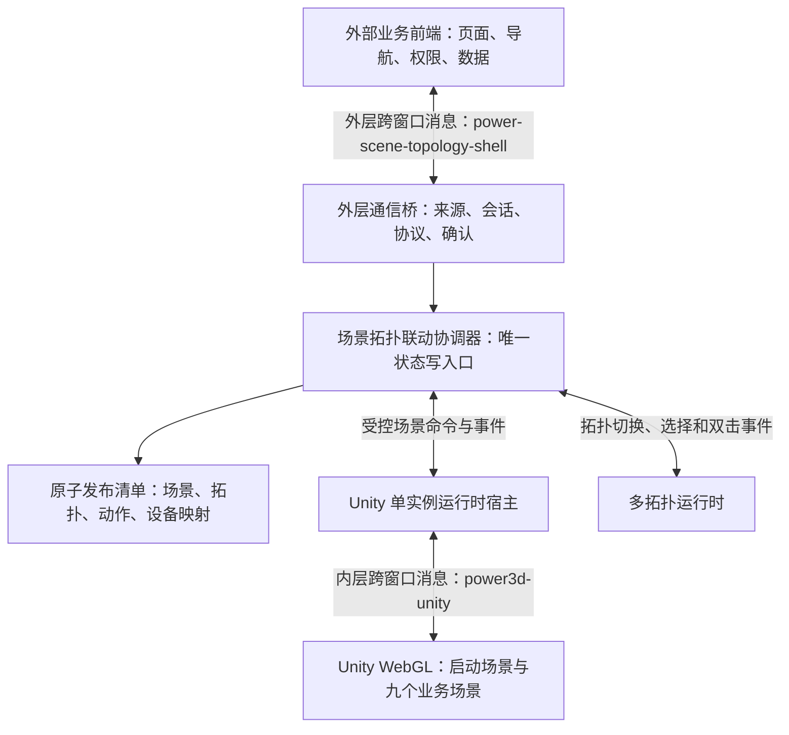
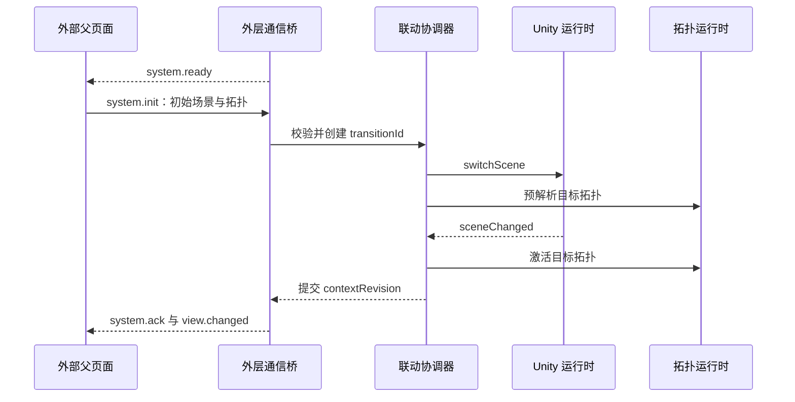
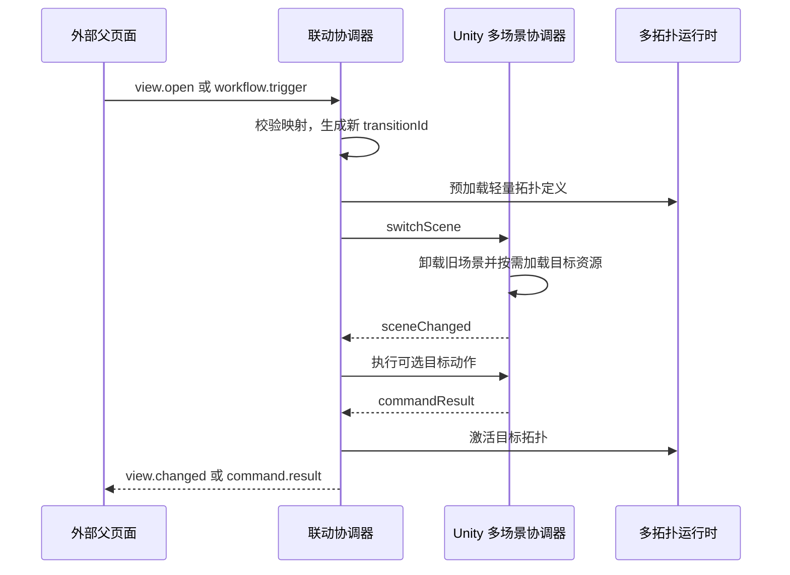
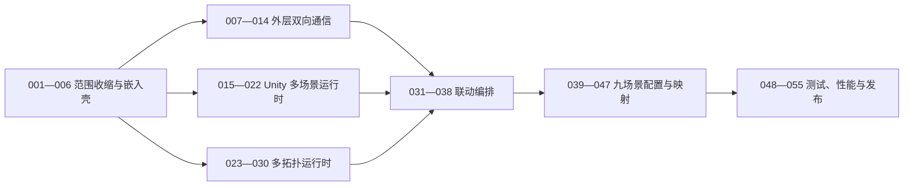

# 电力九场景三维与多拓扑嵌入模块前端架构设计

**文档状态：** 新职责范围基线，替代 2026-08-01 的全平台前端方案

**最后更新：** 2026-08-04

**适用工程：** `F:\WorkSpace\WebDLPro\power-data-web`、`F:\WorkSpace\WebDLPro` Unity 工程

**参考实现：** `F:\WorkSpace\DLPro` 中的内嵌框架（iframe）与跨窗口消息（postMessage）通信方案

---

## 1. 结论

当前需求合理，但必须把“多个场景一起打成一个包”解释为：**一个发布版本、一个 Unity 网页图形构建（WebGL）运行实例、一个常驻启动场景、九个按需加载的业务场景**，不能解释为九套重资源全部进入首屏必须完整下载的单一数据文件。

本前端不再承担门户、业务页面、导航、权限、设备详情、工艺导览、专题页面、后端接口和实时连接。它只交付一个可被其他前端通过内嵌框架加载的可视化子应用，内部仅保留：

1. 上方三维场景容器。
2. 下方二维拓扑容器。
3. 九个 Unity 场景的单实例切换。
4. 每个场景下多套拓扑的直接切换。
5. 外部前端、当前子应用、Unity 和拓扑之间的双向联动。
6. 拓扑节点双击后向外部前端上报设备标识 `deviceId`。

生产运行链路固定为：

```text
外部业务前端
  └─ 内嵌框架加载当前可视化子应用
       ├─ 三维场景容器
       │   └─ 内部 Unity WebGL 单实例
       └─ 多拓扑容器
```

九个场景使用现有稳定标识，不再扩展为 34 个前端页面：

| 场景 | `sceneId` | 当前资料状态 |
| --- | --- | --- |
| 燃煤发电 | `coal-power` | 待交付 Unity 场景、拓扑和动作映射 |
| 燃气发电 | `gas-power` | 已有三维、拓扑和通信基线，作为首条闭环 |
| 风力发电 | `wind-power` | 待交付 Unity 场景、拓扑和动作映射 |
| 光伏发电 | `solar-power` | 待交付 Unity 场景、拓扑和动作映射 |
| 变电站 | `substation` | 待交付 Unity 场景、拓扑和动作映射 |
| 配电网 | `distribution` | 待交付 Unity 场景、拓扑和动作映射 |
| 用能侧 | `consumption` | 待交付 Unity 场景、拓扑和动作映射 |
| 微电网 | `microgrid` | 待交付 Unity 场景、拓扑和动作映射 |
| 调度运行 | `dispatch` | 待交付 Unity 场景、拓扑和动作映射 |

---

## 2. 现状核对与调整边界

### 2.1 可直接复用的现有能力

| 能力 | 当前实现 | 调整结论 |
| --- | --- | --- |
| 前端技术栈 | Vue 3、类型脚本（TypeScript）、快速构建工具（Vite）、状态管理库（Pinia） | 保留 |
| 三维视口 | `ProcessScenePanel.vue` | 保留样式和视口登记思想，改名并移除页面语义 |
| Unity 单实例宿主 | `VisualizationRuntimeHost.vue` | 保留，固定只加载一个统一运行包 |
| Unity 安全连接器 | `runtime-connector.ts` | 保留，增加场景切换和场景事件 |
| Unity 内部协议 | `power3d-unity` 版本 1 | 保留为内层协议，不允许外部父页面直接使用 |
| 拓扑面板 | `TopologyPanel.vue` | 保留燃气总览视觉样式，标题改为配置驱动 |
| 拓扑画布 | `TopologyCanvas.vue` 和画布适配器 | 保留，增加多图切换和双击事件 |
| 关联标识 | `correlation-id.ts` | 保留，扩展会话和切换事务标识 |
| 本地联调器 | `tests/local-iframe-regression` | 保留并升级为“外部宿主页 → 当前子应用 → Unity 模拟页”三层夹具 |

### 2.2 必须整体移除的旧职责

- 门户、数据采集、数据管理和系统管理页面。
- 顶部栏、一级导航、左侧工艺树和前端业务路由。
- 34 个工艺页面和 5 个专题页面。
- 工艺导览、设备详情、告警摘要和右侧面板。
- 前端自身的登录、权限、后端领域服务和网页套接字（WebSocket）实时连接。
- “一个工艺页面对应一个运行时”的配置模型。
- 通过释放并重建 Unity 内嵌框架完成九场景切换的方案。

外部业务前端继续负责页面导航、菜单点击、权限、详情、业务数据和设备状态来源；当前子应用只接收经过协议校验的数据和动作。

### 2.3 当前代码与目标之间的关键缺口

1. 当前路由仍包含门户、总览、工艺页、专题和系统页面。
2. 当前工作台仍为左、中、右三栏布局，不能作为纯可视化子应用嵌入。
3. 当前页面配置只有一个 `topologyKey`，不支持一个场景下多套拓扑。
4. 当前拓扑只支持单击，不支持双击向父页面上报设备标识。
5. 当前没有“外部业务前端 ↔ 当前子应用”的通信实现。
6. 当前 Unity 构建设置只启用 `Assets/Scenes/SampleScene.unity`，没有九场景加载器。
7. 当前 Unity 协议没有 `switchScene`、`sceneChanged` 和场景加载进度能力。
8. 当前拓扑选择变化会重复调用 `setTopology`，导致无效重建节点索引和路径缓存；必须拆分拓扑定义更新与选择更新。

---

## 3. 目标总体架构



### 3.1 四个核心模块

| 模块 | 职责 | 禁止事项 |
| --- | --- | --- |
| 外层通信桥 | 与外部父页面握手、验证消息、确认命令、上报事件 | 不直接调用 Unity 或拓扑渲染器 |
| 场景拓扑联动协调器 | 校验动作、生成切换事务、编排 Unity 与拓扑、提交稳定状态 | 不操作窗口消息、画布绘制或 Unity 对象 |
| Unity 运行时宿主 | 唯一持有内部 Unity 内嵌框架、发送白名单命令、接收场景事件 | 不理解外部菜单和页面结构 |
| 多拓扑运行时 | 加载拓扑定义、切换当前拓扑、保存有限视图状态、处理单击与双击 | 不向外部父页面直接发送消息 |

### 3.2 两层通信必须完全隔离

| 层级 | 通信双方 | 通道 | 实例隔离 | 说明 |
| --- | --- | --- | --- | --- |
| 外层 | 外部业务前端 ↔ 当前可视化子应用 | `power-scene-topology-shell` | `instanceId + sessionId` | 面向场景、拓扑、动作和设备事件 |
| 内层 | 当前可视化子应用 ↔ Unity WebGL | `power3d-unity` | `instanceId` | 面向 Unity 场景加载和三维控制 |

两层消息必须先按 `channel` 分流，再进入各自连接器。外部父页面的消息不能进入 Unity 连接器的拒绝日志，更不能被转发为未经校验的 Unity 原始命令。

### 3.3 当前阶段保留内部 Unity 内嵌框架

当前前端已经完成 Unity 内嵌框架的单实例宿主、精确来源校验、尺寸观察、命令确认和释放逻辑。本轮继续保留这一层，不同时改成直接调用 Unity 加载器，原因如下：

1. 可以直接复用已经验证的安全和生命周期代码，降低九场景改造与外层通信同时变化的风险。
2. Unity 构建仍可独立部署、缓存和回滚，不与 Vue 子应用首包绑定。
3. 内嵌框架额外的窗口消息开销远小于 Unity 场景下载、解压、渲染和资源切换成本；性能治理重点应放在单实例、场景资源拆分和释放。
4. 外部父页面始终只面对当前可视化子应用一个通信入口，不感知内部是否使用内嵌框架。

如果后续真实性能数据证明内部内嵌框架成为瓶颈，可在保持外层协议和协调器接口不变的前提下替换为同页面 Unity 加载适配器；本轮不预先承担这项高风险重构。

---

## 4. 页面与容器设计

### 4.1 单一生产入口

生产只保留一个可嵌入入口，例如 `/embed`。本地开发可保留 `/dev/harness` 联调入口，但不得进入生产构建导航。

如果最终确认只有一个生产页面，可移除路由库（Vue Router）；在完成外部联调前，也可暂时保留单路由以降低本轮改造风险。

### 4.2 视口布局

页面填满父内嵌框架提供的可用区域，不显示顶部栏、侧边栏、面包屑和业务标题。默认采用上下两区布局，并沿用现有燃气总览的蓝色三维容器和深色青色拓扑容器样式。三维实际视口与拓扑内层必须共用同一可视化工作宽度并水平居中；超宽屏两侧只能保留壳层留白，不能让下方拓扑比 Unity 视口更宽。

```text
┌────────────────────────────────────────┐
│ 三维场景容器：16:9，受剩余高度约束     │
│ Unity 单实例画布、加载态、错误态、全屏 │
├────────────────────────────────────────┤
│ 多拓扑外层：占据其余高度                │
│ 同宽拓扑内层：标题、图例、画布、缩放   │
└────────────────────────────────────────┘
```

布局约束：

1. 根容器固定为 `100dvh`，禁止产生外层页面滚动条。
2. 三维高度等于“父容器可用宽度按 16:9 换算的高度”与“父容器高度减去拓扑最小可读高度”中的较小值；它不是 `1280×720` 等固定像素尺寸，也不设置固定像素上限。
3. 拓扑外层占据三维之外的剩余高度；其内层宽度必须等于三维实际视口宽度，标题、图例、画布和全屏入口与 Unity 左右边界对齐。超宽屏两侧未占用区域统一使用三维区纯黑基底，不渲染拓扑容器的青色背景。
4. 拓扑最小可读高度是响应式下限，用于保证五层控制网络和节点文本可读；当可用高度不足时应优先收缩三维视口，仍保持 16:9，不得压缩拓扑画布到不可读高度。
5. 两个常规态容器使用网格行分配剩余空间，不能用内容高度持续撑开页面。
6. 推荐父页面提供不小于 `1280 × 720` 的可用区域；高度不足时压缩到各自最小高度，低于最低可用高度时显示结构化“容器尺寸不足”。
7. 三维和拓扑全屏只在当前子应用内生效；父页面是否允许浏览器原生全屏由内嵌框架权限控制。拓扑全屏必须解除常规态“与三维同宽”的约束，改由当前子应用视口的响应式边距确定四边；标题、图例和状态摘要占用其自身高度，唯一画布填充其余全部高度，按 `Esc` 或关闭按钮退出。
8. 场景或拓扑切换期间使用统一遮罩，禁止用户在“旧场景 + 新拓扑”或“新场景 + 旧拓扑”组合上继续操作。

所有后续拓扑必须采用[拓扑容器与多图切换规范](前端原子任务/拓扑图/拓扑容器与多图切换规范.md)中的已确认制作基线：分层、连线证据、协议标签、节点图元、状态、选中描边、文字避让和画布性能均由明确配置与受控运行时状态驱动，不复制燃气专有业务数据。

---

## 5. 配置驱动模型

### 5.1 稳定标识

| 标识 | 含义 | 约束 |
| --- | --- | --- |
| `sceneId` | 九个业务场景标识 | 使用本设计固定的九个值 |
| `topologyId` | 某套拓扑的稳定标识 | 全局唯一，不使用图片文件名 |
| `actionId` | 外部菜单或子项对应的业务动作 | 外部只传动作标识，不直接传 Unity 方法名 |
| `nodeId` | 当前拓扑中的节点标识 | 在所属拓扑内唯一 |
| `deviceId` | 外部业务系统认可的设备标识 | 设备节点双击上报时必填 |
| `sceneNodeId` | Unity 场景内部对外暴露的稳定节点标识 | 不等于 Unity 层级路径或模型名 |
| `processId`、`stepId`、`routeId` | Unity 流程和路径标识 | 仅出现在受控动作映射中 |
| `instanceId` | 父页面中当前子应用实例标识 | 同一父页面多个实例不得重复 |
| `sessionId` | 当前子应用加载会话标识 | 每次加载重新生成，拒绝旧会话消息 |
| `transitionId` | 一次场景拓扑切换事务标识 | 新切换可废弃旧切换回调 |

### 5.2 核心类型示例

以下代码仅定义数据边界。正式实现必须对外部输入执行运行时字段校验，不能只依赖编译期类型。

```ts
/** 九个业务场景的稳定标识；不允许外部输入任意 Unity 场景名。 */
type SceneId =
  | 'coal-power'
  | 'gas-power'
  | 'wind-power'
  | 'solar-power'
  | 'substation'
  | 'distribution'
  | 'consumption'
  | 'microgrid'
  | 'dispatch'

/** 单个业务场景的只读登记项。 */
interface SceneDefinition {
  sceneId: SceneId
  title: string
  unitySceneKey: string
  defaultTopologyId: string
  topologyIds: readonly string[]
  supportedActionIds: readonly string[]
  sceneMappingVersion: string
  resourceVersion: string
}

/** 拓扑节点同时保存二维、外部设备和可选三维映射，三类标识不能混用。 */
interface TopologyNodeDefinition {
  nodeId: string
  title: string
  deviceId?: string
  sceneNodeId?: string
  iconKey: string
  x: number
  y: number
  deviceStatus: 'normal' | 'alarm' | 'fault' | 'offline'
}

/** 每套拓扑独立登记，可在同一场景内直接切换。 */
interface TopologyDefinition {
  topologyId: string
  sceneId: SceneId
  title: string
  configVersion: string
  nodes: readonly TopologyNodeDefinition[]
  edges: readonly TopologyEdgeDefinition[]
}

/** 外部子项只引用动作标识；具体 Unity 命令由受控映射决定。 */
interface ActionDefinition {
  actionId: string
  targetSceneId: SceneId
  targetTopologyId: string
  unityAction:
    | { type: 'none' }
    | { type: 'enterProcessStep'; processId: string; stepId: string; isolate: boolean }
    | { type: 'focusNode'; sceneNodeId: string; isolate: boolean }
    | { type: 'resetScene' }
}

/** 场景、拓扑、动作和映射必须作为一个版本原子发布。 */
interface SceneTopologyManifest {
  manifestVersion: string
  unityBuildId: string
  unityRuntimeKey: string
  scenes: readonly SceneDefinition[]
  topologies: readonly TopologyDefinition[]
  actions: readonly ActionDefinition[]
}
```

### 5.3 原子校验规则

发布前必须自动校验：

1. 九个 `sceneId` 各出现一次，不能缺失或重复。
2. 每个场景的默认拓扑必须属于自身 `topologyIds`。
3. 每个动作的目标场景、目标拓扑和 Unity 动作必须同时存在。
4. 每个可双击设备节点必须具备 `deviceId`。
5. 每个需要三维聚焦的节点必须具备有效 `sceneNodeId`。
6. 每个 `processId`、`stepId`、`routeId` 必须出现在对应 Unity 场景映射版本中。
7. 场景、拓扑、动作、设备映射和 Unity 构建版本不一致时禁止发布。
8. 外部配置不得包含 Unity 场景文件路径、层级路径、材质路径或任意脚本名称。

完整动作映射要求见[场景拓扑动作映射规范](前端原子任务/场景拓扑动作映射规范.md)。

---

## 6. 外层双向通信设计

外层通信沿用 `F:\WorkSpace\DLPro` 已验证的统一信封、精确来源、父窗口、实例标识、就绪握手和确认思想，但使用独立通道，并新增会话隔离、命令去重和切换顺序控制。

### 6.1 通用信封

```json
{
  "channel": "power-scene-topology-shell",
  "version": 1,
  "instanceId": "visual-shell-01",
  "sessionId": "本次子应用生成的会话标识",
  "messageId": "消息唯一标识",
  "replyTo": "响应消息所对应的原始消息标识",
  "type": "view.open",
  "timestamp": 0,
  "payload": {}
}
```

`replyTo` 仅在确认、结果和错误响应中出现。外部命令必须携带当前 `sessionId`；旧页面或旧会话消息一律拒绝。

### 6.2 外部命令与子应用事件

| 方向 | 类型 | 用途 |
| --- | --- | --- |
| 子应用 → 父页面 | `system.ready` | 外层通信桥、配置和基础容器已就绪 |
| 父页面 → 子应用 | `system.init` | 设置初始场景、初始拓扑和可选初始动作 |
| 子应用 → 父页面 | `system.ack` | 初始化成功并返回当前稳定上下文 |
| 父页面 → 子应用 | `view.open` | 原子打开指定场景和拓扑，可附带受控动作 |
| 父页面 → 子应用 | `workflow.trigger` | 按 `actionId` 触发流程并切换映射拓扑 |
| 父页面 → 子应用 | `device.states.update` | 可选批量更新二维和三维设备状态 |
| 父页面 → 子应用 | `state.get` | 获取当前稳定状态和能力快照 |
| 父页面 → 子应用 | `system.dispose` | 请求停止消息、拓扑和 Unity 运行时 |
| 子应用 → 父页面 | `view.changed` | 场景、拓扑和可选动作全部提交成功 |
| 子应用 → 父页面 | `topology.node.dblclick` | 拓扑节点双击，回传 `deviceId` |
| 子应用 → 父页面 | `scene.object.selected` | 可选上报 Unity 对象选择结果 |
| 子应用 → 父页面 | `command.result` | 命令完成、失败或被新命令取代 |
| 子应用 → 父页面 | `state.snapshot` | 返回当前上下文、状态和能力 |
| 子应用 → 父页面 | `system.error` | 结构化协议、配置、场景或拓扑错误 |

完整字段、示例和错误码以[外层内嵌框架双向通信协议](前端原子任务/外层内嵌框架双向通信协议.md)为唯一依据。

### 6.3 核心安全规则

1. 父页面必须先注册消息监听器，再设置当前子应用内嵌框架地址，避免丢失唯一一次 `system.ready`。
2. 子应用接收消息时必须同时校验 `event.origin`、`event.source === window.parent`、通道、版本、实例、会话和类型白名单。
3. 子应用发送消息时必须使用精确 `targetOrigin`，禁止使用通配符 `*`。
4. 查询参数中的 `parentOrigin` 只用于匹配，不构成授权；生产环境还必须配置部署白名单和内容安全策略（CSP）中的 `frame-ancestors`。
5. 外部消息不得携带访问令牌、密码、密钥、函数、文档对象模型（DOM）对象和二进制资源。
6. 消息体、数组长度、字符串长度、待确认表和去重缓存必须设置上限。

---

## 7. 内层 Unity 通信扩展

现有 `power3d-unity` 协议继续作为当前子应用与 Unity 内部运行时之间的唯一通信通道。统一运行包只创建一次，九场景切换不能释放并重建内嵌框架。

### 7.1 目标命令

| 命令 | 载荷 | 说明 |
| --- | --- | --- |
| `init` | 运行时、构建、映射版本 | 现有握手命令，保留 |
| `resize` | 宽、高、设备像素比 | 现有尺寸命令，保留并合并到动画帧 |
| `switchScene` | `sceneId`、`transitionId`、加载策略 | 新增；Unity 内部异步切换业务场景 |
| `enterProcessStep` | `processId`、`stepId`、可选 `unitId` | 触发当前场景流程 |
| `focusNode` | `sceneNodeId`、`selectionId`、`isolate` | 聚焦并描边三维设备 |
| `setNodeVisualState` | `sceneNodeId`、四态状态、更新时间 | 增量同步设备状态 |
| `setRouteFlow` | `routeId`、`enabled` | 控制已登记路径流动效果 |
| `resetScene` | 空载荷或受控视角标识 | 复位当前业务场景 |
| `dispose` | 释放原因 | 仅在整个子应用销毁时释放 Unity |

### 7.2 目标事件

| 事件 | 必填载荷 | 说明 |
| --- | --- | --- |
| `ready` | 构建、映射、能力和资源摘要 | 统一运行包就绪 |
| `sceneLoadProgress` | `sceneId`、`transitionId`、进度 | 仅用于可见加载反馈，不作为成功依据 |
| `sceneChanged` | `sceneId`、`transitionId`、场景版本 | 目标场景已完成加载和初始化 |
| `objectSelected` | `sceneId`、`sceneNodeId`、`selectionId` | 三维对象选中 |
| `commandResult` | 原请求标识、成功、错误码 | 所有场景和控制命令结果 |
| `disposed` | 原释放请求标识 | Unity 已停止回调并释放实例 |

### 7.3 Unity 内部职责

Unity 必须新增常驻启动场景和场景协调器：

```text
Bootstrap 启动场景
├─ UnityIframeBridgeManager：跨场景常驻
├─ MultiSceneCoordinator：加载、卸载、切换事务
├─ SceneCapabilityRegistry：场景能力登记
└─ LoadingOverlayController：切换反馈

九个业务场景
└─ IBusinessSceneController：统一初始化、流程、聚焦、复位和释放接口
```

桥接管理器和多场景协调器必须跨场景常驻。业务场景不得各自注册浏览器消息监听器，否则切换后会出现重复接收和内存泄漏。

---

## 8. 场景与拓扑联动事务

### 8.1 稳定状态模型

协调器只暴露以下稳定状态：

```ts
interface VisualizationContext {
  sceneId: SceneId
  topologyId: string
  actionId?: string
  selectedNodeId?: string
  selectedDeviceId?: string
  contextRevision: number
  transitionId?: string
  status: 'booting' | 'waiting-init' | 'ready' | 'switching' | 'failed' | 'disposing' | 'disposed'
}
```

所有窗口、内嵌框架、画布、计时器、待确认命令和加载句柄留在适配器内部，不写入状态管理库。

### 8.2 首次进入



### 8.3 同场景子项切换

外部点击当前场景的子项时，发送 `workflow.trigger` 和稳定 `actionId`。协调器按动作映射执行：

1. 验证动作属于当前或目标场景。
2. 预解析目标拓扑，但不立即暴露为可操作状态。
3. 当前场景不变时，不发送 `switchScene`，也不重建 Unity。
4. 向 Unity 发送映射后的流程、聚焦或复位命令。
5. Unity 命令成功后激活目标拓扑。
6. 提交新的 `contextRevision`，向父页面发送 `view.changed`。

### 8.4 跨场景切换



连续快速切换时采用“最后一次有效切换生效”规则。新 `transitionId` 创建后，旧事务的场景进度、命令结果和拓扑回调不得提交状态；旧请求向父页面返回 `superseded`。

### 8.5 失败处理

1. 目标配置无效：不操作 Unity 和拓扑，直接返回配置错误。
2. 拓扑预解析失败：不启动场景切换。
3. Unity 场景切换失败：保持切换遮罩，尝试恢复上一个稳定场景；恢复失败时进入结构化错误态。
4. 目标动作失败：场景和拓扑是否提交由动作定义中的失败策略决定，默认不提交新拓扑。
5. 父页面收到失败结果后可重试同一业务动作，但必须生成新的 `messageId`。

完整联动顺序见[多拓扑与 Unity 多场景联动规范](前端原子任务/拓扑图/多拓扑与Unity多场景联动规范.md)。

---

## 9. 多拓扑运行时设计

### 9.1 多图注册与切换

每个场景至少登记一套默认拓扑，可登记任意多套受版本控制的拓扑。当前只保留一个活动画布实例；拓扑切换时更新画布适配器的数据，不创建隐藏画布池。

```text
TopologyRegistry
  ├─ sceneId → topologyIds
  ├─ topologyId → TopologyDefinition
  └─ topologyId → 有限视图状态

TopologyRuntime
  ├─ 当前活动画布 1 个
  ├─ 预解析拓扑缓存：最近使用，有限容量
  └─ 视图状态缓存：缩放、平移、选择，有限容量
```

拓扑定义变化与选中状态变化必须分别监听：

- `topologyId` 或拓扑版本变化时才执行 `setTopology`。
- 仅选中节点或路径变化时只执行 `setSelection`。
- 设备状态增量只更新受影响节点，不重建全图路径。

### 9.2 单击与双击

| 操作 | 本地行为 | 对 Unity | 对外部父页面 |
| --- | --- | --- | --- |
| 单击节点 | 立即选中、描边、高亮路径 | 有 `sceneNodeId` 时发送 `focusNode` | 默认不上报 |
| 双击节点 | 保持单击选中结果 | 不重复发送相同聚焦命令 | 发送 `topology.node.dblclick`，`deviceId` 必填 |

不为区分单双击而固定延迟单击。双击产生的重复单击通过相同选择标识和幂等判断去重，避免重复聚焦或重复加载。

### 9.3 设备标识规则

- `nodeId` 表示某套拓扑中的可视化节点。
- `deviceId` 表示外部业务系统中的设备。
- `sceneNodeId` 表示 Unity 对外暴露的三维节点。
- 一个设备可出现在多套拓扑中，因此多个 `nodeId` 可以映射到同一个 `deviceId`。
- 概念分组节点可以没有 `deviceId`，但此类节点不得触发设备双击上报。

布局、缓存和交互细节见[拓扑容器与多图切换规范](前端原子任务/拓扑图/拓扑容器与多图切换规范.md)。

---

## 10. Unity 九场景单包设计

### 10.1 单包定义

目标交付物是一个可原子发布和回滚的版本目录：

```text
release/<version>/
├─ shell/                         # 当前 Vue 可视化子应用
├─ unity/
│  ├─ index.html                 # 统一 Unity WebGL 入口
│  ├─ Build/                     # 播放器、框架、运行模块和基础数据
│  ├─ SceneBundles/              # 按场景拆分的重资源
│  │  ├─ coal-power/
│  │  ├─ gas-power/
│  │  ├─ wind-power/
│  │  ├─ solar-power/
│  │  ├─ substation/
│  │  ├─ distribution/
│  │  ├─ consumption/
│  │  ├─ microgrid/
│  │  └─ dispatch/
│  └─ scene-catalog.json
└─ scene-topology-manifest.json
```

当前工程未安装可寻址资源系统（Addressables）。优先可先使用 Unity 资产包（AssetBundle）实现按场景资源拆分；如果后续引入可寻址资源系统，必须先建立版本、缓存、回滚和离线失败策略，不能只安装依赖后直接替换。

### 10.2 场景加载策略

1. `Bootstrap` 启动场景常驻，只包含桥接、场景协调、加载反馈和公共轻量资源。
2. 九个业务场景按需异步加载，同一时刻只保留一个活动业务场景。
3. 默认采用“先卸载旧场景，再加载目标场景”的低峰值内存策略；切换期间由遮罩保证视觉原子性。
4. 只有经过内存压测的轻量场景才允许“先加载新场景，再卸载旧场景”。
5. 公共材质、着色器和图集按共享依赖拆分，避免九个场景各自重复打包。
6. 场景卸载后释放其事件、协程、动画、渲染纹理和资源句柄；禁止每次切换无条件执行高开销全量垃圾回收。

### 10.3 构建清单

每次 Unity 发布必须生成：

- `unityBuildId`。
- 九个场景的 `sceneId → unitySceneKey` 映射。
- 每个场景资源版本、内容摘要和传输体积。
- 共享资源和场景资源依赖关系。
- 协议版本和命令、事件能力。
- 场景映射版本。
- 浏览器、目标硬件和内存基线。
- 回滚版本。

---

## 11. 工程目录建议

```text
power-data-web/src/
├─ app/
│  ├─ AppErrorBoundary.vue
│  └─ EmbeddedVisualizationShell.vue
├─ bridge/
│  ├─ host-protocol.ts            # 外层协议类型、白名单和运行时校验
│  ├─ host-bridge.ts              # 父页面来源、会话、确认和事件上报
│  └─ message-router.ts           # 先按通道分流外层与内层消息
├─ config/
│  ├─ identifiers.ts
│  ├─ scene-registry.ts
│  ├─ topology-registry.ts
│  ├─ action-registry.ts
│  ├─ scene-topology-manifest.ts
│  └─ validator.ts
├─ orchestration/
│  ├─ visualization-coordinator.ts
│  └─ visualization.store.ts
├─ runtime/
│  ├─ UnityRuntimeHost.vue
│  ├─ unity-runtime-connector.ts
│  └─ unity-protocol.ts
├─ topology/
│  ├─ TopologyPanel.vue
│  ├─ TopologyCanvas.vue
│  ├─ topology-runtime.ts
│  ├─ canvas-topology-adapter.ts
│  └─ topology-icon-registry.ts
├─ assets/topology/                # 正式图元资源，不再依赖 Docs 目录
├─ shared/
│  ├─ correlation-id.ts
│  └─ bounded-cache.ts
└─ styles/
```

---

## 12. 性能与资源治理

### 12.1 强制约束

| 项目 | 约束 |
| --- | --- |
| Unity 实例 | 始终最多 1 个 |
| Unity 业务场景 | 始终最多 1 个活动场景 |
| 拓扑画布 | 始终最多 1 个活动画布 |
| 隐藏内嵌框架池 | 禁止 |
| 隐藏画布池 | 禁止 |
| 待确认命令 | 有限容量，达到上限拒绝新命令 |
| 场景切换 | 新事务废弃旧回调，禁止迟到结果覆盖当前状态 |
| 拓扑重绘 | 合并到动画帧；选择变化不重建拓扑 |
| 设备状态 | 按节点增量合并，同一帧同一设备只保留最新值 |
| 资源缓存 | 按版本和容量淘汰，不使用无界映射表 |

### 12.2 性能验收重点

1. 子应用壳和拓扑必须先可用，不能等待 Unity 全部场景资源下载。
2. 九场景不能全部进入首屏数据文件；每个场景必须记录独立传输、解压、首帧和峰值内存数据。
3. 连续跨场景切换后，浏览器内存和显存不得持续单调增长。
4. 连续多拓扑切换后，动画帧、尺寸观察器、图元回调和画布缓存不得累积。
5. 高频外部设备状态先批量合并，再分别更新拓扑和 Unity，不得逐条触发全图和全场景刷新。
6. 父页面隐藏当前内嵌框架时，子应用应暂停非关键拓扑重绘并通知 Unity 降频；恢复可见后再同步最新状态。

---

## 13. 安全、异常与可观测性

### 13.1 权限边界

业务权限由外部父页面负责。当前子应用仍必须执行协议安全校验，但不能把“父页面已鉴权”当成信任任意消息的理由。

### 13.2 错误结构

所有外层错误至少包含：

```json
{
  "code": "scene.switch.failed",
  "message": "目标场景加载失败。",
  "stage": "switching-scene",
  "sceneId": "gas-power",
  "topologyId": "gas-power.overview",
  "actionId": null,
  "transitionId": "transition-001",
  "recoverable": true
}
```

错误日志只记录稳定标识、版本、阶段和关联标识，不记录外部消息完整载荷、访问令牌、Unity 层级路径和无界历史。

### 13.3 必备错误状态

- 等待父页面初始化。
- 配置或映射无效。
- Unity 启动失败。
- Unity 场景切换失败。
- 拓扑加载失败。
- 外部来源或协议被拒绝。
- 容器尺寸不足。
- 子应用正在释放或已释放。

---

## 14. 测试与验收

### 14.1 分层测试

| 测试层 | 覆盖内容 |
| --- | --- |
| 单元测试 | 外层和内层信封、载荷校验、映射校验、去重、超时、事务废弃 |
| 组件测试 | 两容器布局、多拓扑切换、单击、双击、全屏、错误态 |
| Unity 编辑器测试 | 九场景登记、加载、卸载、流程动作、聚焦、复位、释放 |
| 三层联调测试 | 外部宿主页 → 当前子应用 → Unity 模拟页 |
| 端到端测试 | 九场景初始进入、同场景子项、跨场景切换、设备双击上报 |
| 性能测试 | 首屏、场景切换、拓扑切换、长时间运行、内存和显存 |
| 安全测试 | 错误来源、错误窗口、旧会话、旧事务、未知类型、超大载荷 |

### 14.2 关键验收用例

1. 父页面在设置内嵌框架地址前注册监听，收到 `system.ready` 后完成 `system.init → system.ack`。
2. 初始指定九个场景中的任意一个及其合法拓扑，最终三维和拓扑一致。
3. 同场景切换拓扑时不重建 Unity 内嵌框架、不重新下载 Unity 播放器。
4. 同场景点击子项时，Unity 触发映射流程，拓扑切换到映射目标，最后只提交一次稳定状态。
5. 跨场景点击时，Unity 内部切换场景并切换目标拓扑，切换期间不存在可操作的错配组合。
6. 连续快速发送三个切换命令时，只提交最后一个；前两个返回 `superseded`。
7. 拓扑节点单击立即选中并聚焦三维；双击额外向父页面上报正确 `deviceId`，不重复聚焦。
8. Unity 选中对象时同步当前拓扑；同一次选择不回发聚焦命令形成循环。
9. 错误来源、窗口、通道、版本、实例、会话和旧事务消息均被拒绝。
10. 场景切换失败、拓扑加载失败和动作失败均返回结构化错误，并保持或恢复明确稳定状态。
11. 连续切换九场景和多拓扑后，Unity 实例、画布实例、监听器、计时器、内存和显存不持续累积。

---

## 15. 实施顺序



外层通信、Unity 多场景和多拓扑三条主线在稳定标识与清单模型完成后可并行实施。九场景配置彼此独立，可由多人并行制作；燃气发电先完成闭环，用于冻结协议和模板。

详细任务见[前端原子任务总览](前端原子任务/00-任务总览.md)。

---

## 16. 与当前工程的衔接

### 16.1 保留并重构

- `power-data-web/src/modules/visual/runtime/VisualizationRuntimeHost.vue`
- `power-data-web/src/services/webgl/runtime-connector.ts`
- `power-data-web/src/services/webgl/protocol.ts`
- `power-data-web/src/modules/visual/components/ProcessScenePanel.vue`
- `power-data-web/src/modules/visual/components/TopologyPanel.vue`
- `power-data-web/src/modules/visual/components/TopologyCanvas.vue`
- `power-data-web/src/services/topology/canvas-topology-adapter.ts`
- `power-data-web/src/config/process/identifiers.ts`
- `power-data-web/src/shared/utils/correlation-id.ts`
- `power-data-web/tests/local-iframe-regression`
- `Assets/Plugins/WebGL/Power3dUnityBridge.jslib`
- `Assets/Scripts/UnityIframeBridgeManager.cs`

### 16.2 删除或整体替换

- 门户、采集、数据、系统管理和专题模块。
- 旧三栏工作台、导航、导览和详情组件。
- `local-process-config.ts` 的 34 页面模型。
- 页面、权限、导览、详情、专题相关配置类型和校验。
- 前端自身的请求、实时订阅和图表服务。
- 固定本地端口的运行时登记。

### 16.3 Unity 必须新增

- `Bootstrap` 常驻启动场景。
- 九个业务场景文件和统一场景登记表。
- 多场景异步加载协调器。
- 统一业务场景控制接口。
- `switchScene`、`sceneLoadProgress`、`sceneChanged` 协议能力。
- 按场景拆分的重资源构建和发布清单。

当前工作区存在大量用户正在处理的 Unity 资源改动和前端未提交改动。实施代码任务时必须基于现状增量重构，禁止覆盖或回退无关修改。

---

## 17. 待确认清单

以下事项不阻塞架构和通信开发，但阻塞九场景最终验收：

1. 外部业务前端正式来源、当前子应用来源、Unity 子页来源及是否同源部署。
2. 九个 Unity 场景文件的正式名称和资源归属。
3. 每个场景的默认拓扑及可切换拓扑清单。
4. 外部页面每个菜单、按钮和子项对应的稳定 `actionId`。
5. 每个动作的目标场景、目标拓扑和 Unity 流程命令映射。
6. 每个拓扑设备节点的正式 `deviceId` 和可选 `sceneNodeId`。
7. 是否需要把 Unity 对象选择事件继续上报外部父页面；本设计默认支持但可按能力关闭。
8. 外部设备状态批量消息的字段、频率和最大批量。
9. 目标浏览器、终端硬件、可用内存、部署带宽和场景切换性能目标。
10. Unity 场景资源采用资产包还是引入可寻址资源系统。

在上述资料未完成前，不得根据中文标题、模型名称、图片或坐标关系猜测正式映射。
