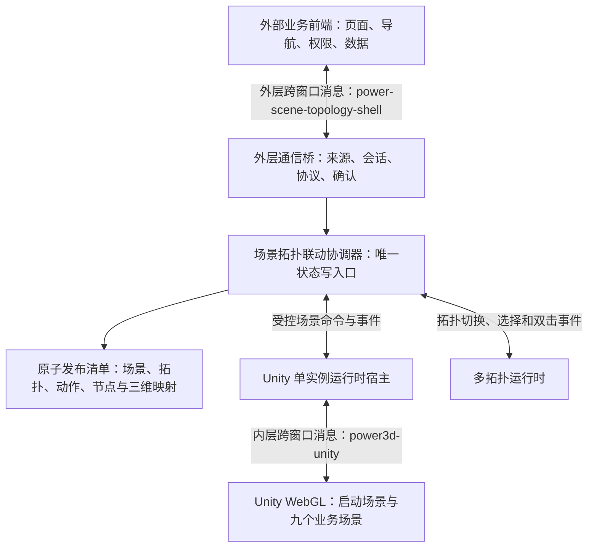
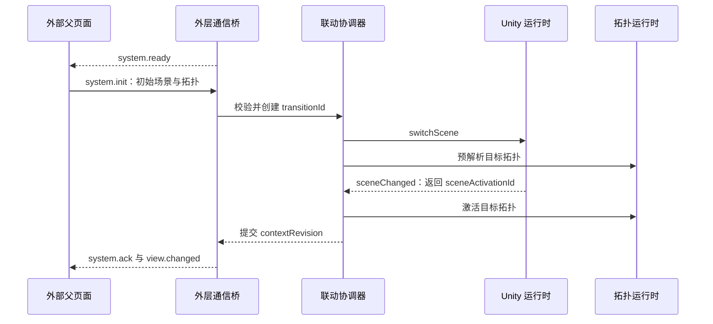
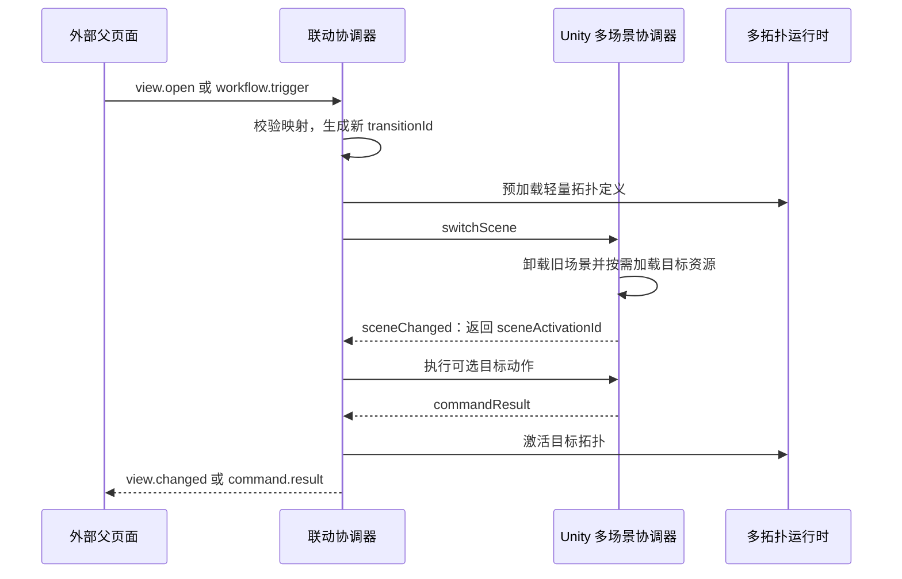
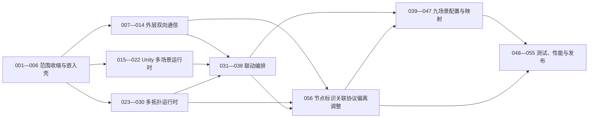

# 电力九场景三维与多拓扑嵌入模块前端架构设计

**文档状态：** 新职责范围基线，替代 2026-08-01 的全平台前端方案

**最后更新：** 2026-08-15

**适用工程：** `F:\WorkSpace\WebDLPro\power-data-web`、`F:\WorkSpace\WebDLPro` Unity 工程

**参考实现：** `F:\WorkSpace\DLPro` 中的内嵌框架（iframe）与跨窗口消息（postMessage）通信方案

---

## 1. 结论

当前需求合理，但必须把“多个场景一起打成一个包”解释为：**一个发布版本、一个 Unity 网页图形构建（WebGL）运行实例、一个常驻启动场景、九个按需加载的业务场景**，不能解释为九套重资源全部进入首屏必须完整下载的单一数据文件。

本前端不再承担门户、业务页面、导航、权限、设备详情、工艺导览、专题页面、后端接口和实时连接。它只交付一个可被其他前端通过内嵌框架加载的可视化子应用，内部仅保留：

1. 上方三维场景容器。
2. 下方二维拓扑容器。
3. 九个 Unity 场景的单实例切换。
4. 每个场景下多套拓扑的直接切换。
5. 外部前端、当前子应用、Unity 和拓扑之间的双向联动。
6. 拓扑节点双击后向外部前端上报稳定拓扑节点编号 `nodeId`；平台在自身系统内维护 `nodeId → 真实设备编号`，真实设备编号不进入本子应用。

生产运行链路固定为：

```text
外部业务前端
  └─ 内嵌框架加载当前可视化子应用
       ├─ 三维场景容器
       │   └─ 内部 Unity WebGL 单实例
       └─ 多拓扑容器
```

九个场景使用现有稳定标识，不再扩展为 34 个前端页面：

| 场景 | `sceneId` | 当前资料状态 |
| --- | --- | --- |
| 燃煤发电 | `coal-power` | 待交付 Unity 场景、拓扑和动作映射 |
| 燃气发电 | `gas-power` | 已有三维、拓扑和通信基线，作为首条闭环 |
| 风力发电 | `wind-power` | 待交付 Unity 场景、拓扑和动作映射 |
| 光伏发电 | `solar-power` | 待交付 Unity 场景、拓扑和动作映射 |
| 变电站 | `substation` | 待交付 Unity 场景、拓扑和动作映射 |
| 配电网 | `distribution` | 待交付 Unity 场景、拓扑和动作映射 |
| 用能侧 | `consumption` | 待交付 Unity 场景、拓扑和动作映射 |
| 微电网 | `microgrid` | 待交付 Unity 场景、拓扑和动作映射 |
| 调度运行 | `dispatch` | 待交付 Unity 场景、拓扑和动作映射 |

---

## 2. 现状核对与调整边界

### 2.1 可直接复用的现有能力

| 能力 | 当前实现 | 调整结论 |
| --- | --- | --- |
| 前端技术栈 | Vue 3、类型脚本（TypeScript）、快速构建工具（Vite）、状态管理库（Pinia） | 保留 |
| 三维视口 | `ProcessScenePanel.vue` | 保留样式和视口登记思想，改名并移除页面语义 |
| Unity 单实例宿主 | `VisualizationRuntimeHost.vue` | 保留，固定只加载一个统一运行包 |
| Unity 安全连接器 | `runtime-connector.ts` | 保留，增加场景切换和场景事件 |
| Unity 内部协议 | `power3d-unity` 版本 1 | 保留为内层协议，不允许外部父页面直接使用 |
| 拓扑面板 | `TopologyPanel.vue` | 保留燃气总览视觉样式，标题改为配置驱动 |
| 拓扑画布 | `TopologyCanvas.vue` 和画布适配器 | 保留，增加多图切换和双击事件 |
| 关联标识 | `correlation-id.ts` | 保留，扩展会话和切换事务标识 |
| 本地联调器 | `tests/local-iframe-regression` | 保留并升级为“外部宿主页 → 当前子应用 → Unity 模拟页”三层夹具 |

### 2.2 必须整体移除的旧职责

- 门户、数据采集、数据管理和系统管理页面。
- 顶部栏、一级导航、左侧工艺树和前端业务路由。
- 34 个工艺页面和 5 个专题页面。
- 工艺导览、设备详情、告警摘要和右侧面板。
- 前端自身的登录、权限、后端领域服务和网页套接字（WebSocket）实时连接。
- “一个工艺页面对应一个运行时”的配置模型。
- 通过释放并重建 Unity 内嵌框架完成九场景切换的方案。

外部业务前端继续负责页面导航、菜单点击、权限、详情、业务数据和设备状态来源；当前子应用只接收经过协议校验的数据和动作。

设备关联采用“节点编号直连”边界：我方交付并直接运行的**结构清单**固定 `sceneId`、`topologyId`、`nodeId`、可选 `sceneNodeId`、节点双击能力、动作和 Unity 映射。平台读取 `nodeId` 后，在平台内部维护 `nodeId → 真实设备编号`；平台不得向我方清单注入 `deviceId`、`deviceMappings`、`platformBindingCount` 或其他绑定事实，我方也不得保存、推断或回传真实设备编号。

结构清单是壳的唯一运行事实源，可以随我方不可变发布包提供，也可以从我方拥有且受控的静态部署地址只读获取；无论采用哪种交付方式，内容都不得因平台设备绑定而变化。当前燃气合作方包固定读取包内同源 `scene-topology-manifest.json`，不得把启动地址配置为平台设备绑定或运行时清单接口。`resourceKey` 或其他场景后续采用的受控静态清单地址必须来自部署配置，外层消息和普通查询参数不得传入任意地址。最新会议结论取代2026-08-11关于“两阶段清单”和“平台动态注入设备编号”的旧确认，完整偏离与迁移范围见[任务-056：节点标识关联协议偏离调整](前端原子任务/08-任务-056-节点标识关联协议偏离调整.md)。

### 2.3 范围收缩前的代码差距（历史快照）

1. 当时路由仍包含门户、总览、工艺页、专题和系统页面。
2. 当时工作台仍为左、中、右三栏布局，不能作为纯可视化子应用嵌入。
3. 当时页面配置只有一个 `topologyKey`，不支持一个场景下多套拓扑。
4. 当时拓扑只支持单击，不支持双击向父页面上报节点编号。
5. 当时没有“外部业务前端 ↔ 当前子应用”的通信实现。
6. 当时 Unity 构建设置只启用 `Assets/Scenes/SampleScene.unity`，没有九场景加载器。
7. 当时拓扑选择变化会重复调用 `setTopology`，导致无效重建节点索引和路径缓存；必须拆分拓扑定义更新与选择更新。

上述内容仅说明原子任务的拆分依据，不能作为当前实现结论。截至2026-08-15，路由已收缩为唯一 `/embed` 嵌入壳；多拓扑、节点双击上报、外层通信、单画布选择更新和 Unity 单实例九场景加载器均已落地。Unity 构建设置以 `Assets/Scenes/Bootstrap.unity` 为启动场景，并登记九个业务场景；结构版本4正式网页图形已验证场景切换、失败恢复、聚焦、清除交互描边、本地快照序号迟到隔离和动态状态清除。`task064-clear-selection-20260813-1610` 是 0813 联动包使用的三维历史构建；当前用户确认的完整视觉与交互基线是 `Builds/Releases/燃气发电场景与拓扑图联动包0813`，不得只以前者代替整包验收。任务-056的节点编号核心链路、递归旧职责拒绝、正向发布摘要、同源结构清单、持续集成、产物门禁、运行时同源独立访问和内置浏览器回归已经通过；当前只待合作方真实消息、状态和三维联调验收按80%计，其余八个场景的业务资料和映射仍独立待补。

---

## 3. 目标总体架构



### 3.1 四个核心模块

| 模块 | 职责 | 禁止事项 |
| --- | --- | --- |
| 外层通信桥 | 与外部父页面握手、验证消息、确认命令、上报事件 | 不直接调用 Unity 或拓扑渲染器 |
| 场景拓扑联动协调器 | 校验动作、生成切换事务、编排 Unity 与拓扑、提交稳定状态 | 不操作窗口消息、画布绘制或 Unity 对象 |
| Unity 运行时宿主 | 唯一持有内部 Unity 内嵌框架、发送白名单命令、接收场景事件 | 不理解外部菜单和页面结构 |
| 多拓扑运行时 | 加载拓扑定义、切换当前拓扑、保存有限视图状态、处理单击与双击 | 不向外部父页面直接发送消息 |

### 3.2 两层通信必须完全隔离

| 层级 | 通信双方 | 通道 | 实例隔离 | 说明 |
| --- | --- | --- | --- | --- |
| 外层 | 外部业务前端 ↔ 当前可视化子应用 | `power-scene-topology-shell` | `instanceId + sessionId` | 面向场景、拓扑、动作和节点事件 |
| 内层 | 当前可视化子应用 ↔ Unity WebGL | `power3d-unity` | `instanceId` | 面向 Unity 场景加载和三维控制 |

两层消息必须先按 `channel` 分流，再进入各自连接器。外部父页面的消息不能进入 Unity 连接器的拒绝日志，更不能被转发为未经校验的 Unity 原始命令。

### 3.3 当前阶段保留内部 Unity 内嵌框架

当前前端已经完成 Unity 内嵌框架的单实例宿主、精确来源校验、尺寸观察、命令确认和释放逻辑。本轮继续保留这一层，不同时改成直接调用 Unity 加载器，原因如下：

1. 可以直接复用已经验证的安全和生命周期代码，降低九场景改造与外层通信同时变化的风险。
2. Unity 构建仍可独立部署、缓存和回滚，不与 Vue 子应用首包绑定。
3. 内嵌框架额外的窗口消息开销远小于 Unity 场景下载、解压、渲染和资源切换成本；性能治理重点应放在单实例、场景资源拆分和释放。
4. 外部父页面始终只面对当前可视化子应用一个通信入口，不感知内部是否使用内嵌框架。

如果后续真实性能数据证明内部内嵌框架成为瓶颈，可在保持外层协议和协调器接口不变的前提下替换为同页面 Unity 加载适配器；本轮不预先承担这项高风险重构。

---

## 4. 页面与容器设计

### 4.1 单一生产入口

生产只保留一个可嵌入入口，例如 `/embed`。本地开发可保留 `/dev/harness` 联调入口，但不得进入生产构建导航。

如果最终确认只有一个生产页面，可移除路由库（Vue Router）；在完成外部联调前，也可暂时保留单路由以降低本轮改造风险。

### 4.2 视口布局

页面填满父内嵌框架提供的可用区域，不显示顶部栏、侧边栏、面包屑和业务标题。默认采用上下两区布局，并沿用现有燃气总览的蓝色三维容器和深色青色拓扑容器样式。三维实际视口与拓扑内层必须共用同一可视化工作宽度并水平居中；超宽屏两侧只能保留壳层留白，不能让下方拓扑比 Unity 视口更宽。

```text
┌────────────────────────────────────────┐
│ 三维场景容器：16:9，受剩余高度约束     │
│ Unity 单实例画布、加载态、错误态、全屏 │
├────────────────────────────────────────┤
│ 多拓扑外层：占据其余高度                │
│ 同宽拓扑内层：标题、图例、画布、缩放   │
└────────────────────────────────────────┘
```

布局约束：

1. 根容器固定为 `100dvh`，禁止产生外层页面滚动条。
2. 三维高度等于“父容器可用宽度按 16:9 换算的高度”与“父容器高度减去拓扑响应式预留行高度”中的较小值；它不是 `1280×720` 等固定像素尺寸，也不设置固定像素上限。
3. 拓扑外层占据三维之外的剩余高度；其内层宽度必须等于三维实际视口宽度，标题、图例、画布和全屏入口与 Unity 左右边界对齐。超宽屏两侧未占用区域统一使用三维区纯黑基底，不渲染拓扑容器的青色背景。
4. 拓扑预留行高度包含标题、状态、内边距和画布，不等于画布报错阈值；0813包以外层 `600×600` 作为最小部署尺寸，合法最小外层中的拓扑画布可低至约 `500×108` 并启用极低画布缩放。外层低于部署阈值时显示结构化“容器尺寸不足”。
5. 两个常规态容器使用网格行分配剩余空间，不能用内容高度持续撑开页面。
6. 推荐父页面提供不小于 `1280 × 720` 的可用区域；高度不足时压缩到各自最小高度，低于最低可用高度时显示结构化“容器尺寸不足”。
7. 三维和拓扑全屏必须使用同一套浏览器原生全屏接口：分别把三维视口或拓扑面板登记为当前全屏元素，从平台容器直接进入浏览器顶层全屏。父平台及中间每层内嵌框架必须声明 `allow="fullscreen"` 或等效权限；缺少权限时保持常规态并报告接入配置问题，禁止降级为只能覆盖平台容器的固定定位遮罩。拓扑全屏时标题、图例和状态摘要占用其自身高度，唯一画布填充其余全部高度，并通过浏览器原生 `Esc` 或关闭按钮退出。
8. 场景或拓扑切换期间使用统一遮罩，禁止用户在“旧场景 + 新拓扑”或“新场景 + 旧拓扑”组合上继续操作。

所有后续拓扑必须采用[拓扑容器与多图切换规范](前端原子任务/拓扑图/拓扑容器与多图切换规范.md)中的已确认制作基线：分层、连线证据、协议标签、节点图元、状态、选中描边、文字避让和画布性能均由明确配置与受控运行时状态驱动，不复制燃气专有业务数据。节点视觉尺寸由画布宽高、最密层节点数和相邻层净距共同计算，常规图标约28—40像素，紧凑及极低画布允许继续缩小；选中框只围绕图标盒，路由安全边界和点击边界才合并图标与下方文字。点击区域独立保持至少40×40像素，重叠时取距离节点中心最近者。

连线按稳定边标识排序，默认从两端图标真实边界尝试任意角度直线。直线只有在穿过第三方完整节点边界、与已接受路径共线重叠或发生非端点交叉时才绕行；候选依次为一个拐点、两个拐点，同一拐点数选择总长度最短者，最后才回退通道路由。斜线协议标签沿线段法线偏移并保持水平，参与完整节点、其他标签、导视区和画布边界碰撞检测。布局和路由只在拓扑、画布尺寸或路由规则版本变化时计算，选择、设备状态、缩放和平移不得触发逐帧碰撞搜索。

### 4.3 2026-08-13 燃气联动验收基线

当前已获用户确认的视觉与交互基线固定为 `Builds/Releases/燃气发电场景与拓扑图联动包0813`，包内发布标识为 `gas-power-platform-release-5550-20260813-2015`。中文目录是平台联调交付位置，包内发布标识用于清单、日志和资源一致性校验；两者指向同一份交付物。`5544`、`5548`、`5549` 仅保留为分项或内部回归证据，不能替代当前交付基线。

| 验收对象 | 当前冻结结果 |
| --- | --- |
| 拓扑集合 | 总览23节点/22连线；燃气轮机16/13；余热锅炉13/6；蒸汽轮机15/10 |
| 过滤视图 | 三个关键环节都引用 `topology.gas-power.overview`，完整复用总图真实层级与节点坐标，只隐藏无关节点和连线 |
| 节点视觉 | 拟物化 Cisco 风图元为主体；文字位于图标边框下方；不额外绘制右上角状态圆点；常规图标约28—40像素，命中区至少40×40像素 |
| 连线路由 | 任意角度直线优先；仅在穿过第三方完整节点边界、共线重叠或非端点交叉时按最少拐点、最短长度绕行 |
| 二维到三维 | 节点单击先提交二维选择，再对显式 `sceneNodeId` 发送 `focusNode`；三维失败不回滚二维选择 |
| 空白清除 | 空白单击先清除二维节点和关联边，再发送 `clearSelection`；只取消三维交互描边，不改变镜头、流程、显隐或告警描边 |
| 总览复位 | `action.gas-power.overview` 必须先等待三维运行时（Unity）成功进入 `overview`，再恢复23/22总拓扑；失败时保持上一稳定组合 |
| 实例与全屏 | 全程复用一个三维内嵌框架和一个拓扑画布；常规态同宽，二者都使用浏览器原生全屏，退出后不重建实例 |

燃气总图五层纵坐标冻结为 `8、28、50、69、88`；企业层和隔离区层横坐标均为 `24、50、76`，厂级层为 `14、38、62、86`，单元层为 `12、30、44、59、74、89`，现场层为 `6、18、30、44、59、74、89`。这些坐标是燃气回归夹具，不是其他八场景的默认业务数据；后续场景只复用布局算法、路由规则和交互协议，节点、层级、坐标、连线及三维映射必须来自各自正式资料。

该包未交付按 `nodeId` 关联的真实四态状态、完整三维节点映射或其余八个业务场景。上述缺口继续由对应清单、状态和九场景任务验收，不得因燃气视觉与聚焦链路已通过而推定完成。

基线继承顺序固定如下：后续燃气联调包必须先保持 0813 包的布局、连线、全屏、四图切换、聚焦描边、空白清除和总览复位；再叠加节点编号协议和四态能力。新能力不得以回退 0813 视觉交互为代价。下一联调包的业务节点必须声明节点双击能力并上报自身 `nodeId`，但仍只保留已登记的三个 `sceneNodeId` 聚焦映射。可上报节点不等于存在三维聚焦或三维状态目标，不得为其余节点猜测模型映射。

---

## 5. 配置驱动模型

### 5.1 稳定标识

| 标识 | 含义 | 约束 |
| --- | --- | --- |
| `sceneId` | 九个业务场景标识 | 使用本设计固定的九个值 |
| `topologyId` | 某套拓扑的稳定标识 | 全局唯一，不使用图片文件名 |
| `actionId` | 外部菜单或子项对应的业务动作 | 外部只传动作标识，不直接传 Unity 方法名 |
| `nodeId` | 联动资源中的稳定逻辑节点标识 | 在同一 `resourceKey` 内全局唯一；双击、状态和平台内部绑定均以此为关联键 |
| `deviceId` | 平台内部真实设备编号 | 不进入我方清单、消息、缓存或发布产物，仅由平台内部与 `nodeId` 关联 |
| `sceneNodeId` | Unity 场景内部对外暴露的稳定节点标识 | 不等于 Unity 层级路径或模型名 |
| `processId`、`stepId`、`routeId` | Unity 流程和路径标识 | 仅出现在受控动作映射中 |
| `instanceId` | 父页面中当前子应用实例标识 | 同一父页面多个实例不得重复 |
| `sessionId` | 当前子应用加载会话标识 | 每次加载重新生成，拒绝旧会话消息 |
| `transitionId` | 一次场景拓扑切换事务标识 | 新切换可废弃旧切换回调 |

具体字符格式、唯一性范围、Unity 对象命名、二维与三维显式映射、燃气遗留标识及破坏性改名规则，统一见[场景模型节点与拓扑节点命名规范](前端原子任务/场景模型节点与拓扑节点命名规范.md)。架构只认显式标识和映射，不因文本相同自动关联二维与三维节点。

### 5.2 核心类型示例

以下代码仅定义数据边界。正式实现必须对外部输入执行运行时字段校验，不能只依赖编译期类型。

```ts
/** 九个业务场景的稳定标识；不允许外部输入任意 Unity 场景名。 */
type SceneId =
  | 'coal-power'
  | 'gas-power'
  | 'wind-power'
  | 'solar-power'
  | 'substation'
  | 'distribution'
  | 'consumption'
  | 'microgrid'
  | 'dispatch'

/** 单个业务场景的只读登记项。 */
interface SceneDefinition {
  sceneId: SceneId
  title: string
  unitySceneKey: string
  defaultTopologyId: string
  topologyIds: readonly string[]
  supportedActionIds: readonly string[]
  sceneMappingVersion: string
  resourceVersion: string
}

/**
 * 结构清单固定逻辑节点和可选三维节点；真实设备编号始终留在平台内部。
 * deviceStatus 是无实时数据时的发布基线，不代表平台当前真实设备状态。
 */
interface TopologyNodeDefinition {
  nodeId: string
  title: string
  sceneNodeId?: string
  iconKey: string
  x: number
  y: number
  deviceStatus: 'normal' | 'alarm' | 'fault' | 'offline'
  doubleClickBehavior: 'emit-node' | 'none'
}

/** 流程视图只保存总图筛选集合；坐标覆盖默认由总图投影生成，不重复保存独立布局或其他事实。 */
interface TopologyFilterDefinition {
  sourceTopologyId: string
  visibleNodeIds: readonly string[]
  visibleEdgeIds: readonly string[]
  /** 为兼容当前完整投影类型保留；默认值必须逐节点等于总图坐标，只有正式资料要求换位时才允许改变。 */
  nodeLayoutOverrides: readonly { nodeId: string; x: number; y: number }[]
}

/** 每套拓扑独立登记，可在同一场景内直接切换。 */
interface TopologyDefinition {
  topologyId: string
  sceneId: SceneId
  title: string
  configVersion: string
  nodes: readonly TopologyNodeDefinition[]
  edges: readonly TopologyEdgeDefinition[]
  /** 存在时 nodes 和 edges 必须为空，运行时从 sourceTopologyId 一次投影。 */
  filter?: TopologyFilterDefinition
}

/** 外部子项只引用动作标识；具体 Unity 命令由受控映射决定。 */
interface ActionDefinition {
  actionId: string
  targetSceneId: SceneId
  targetTopologyId: string
  unityAction:
    | { type: 'none' }
    | { type: 'enterProcessStep'; processId: string; stepId: string; isolate: boolean }
    | { type: 'focusNode'; sceneNodeId: string; isolate: boolean }
    | { type: 'resetScene' }
}

/**
 * 结构字段由我方原子发布并由壳直接运行；平台只读 nodeId，不能改写清单。
 */
interface SceneTopologyManifest {
  resourceKey?: string
  manifestVersion: string
  unityBuildId: string
  unityRuntimeKey: string
  scenes: readonly SceneDefinition[]
  topologies: readonly TopologyDefinition[]
  actions: readonly ActionDefinition[]
}
```

当前只保留结构清单校验入口。门禁必须拒绝 `deviceId`、`deviceMappings`、`platformBindingCount` 等旧绑定字段，校验 `nodeId` 在同一 `resourceKey` 内全局唯一，并验证 `nodeId → 可选 sceneNodeId` 与 `sceneNodeId → nodeId` 唯一闭环。旧三入口、基础/运行时双清单对照和平台注入版运行时清单属于迁移前历史实现；生产壳直接消费我方不可变结构清单，平台只读取 `nodeId` 并在平台内部维护真实设备映射。

### 5.3 原子校验规则

校验只有一个结构清单阶段：

1. 九个 `sceneId` 各出现一次；默认拓扑、动作目标、`sceneNodeId` 和 Unity 映射版本必须完整一致。
2. 清单不得包含 `deviceId`、`deviceMappings`、`platformBindingCount` 或平台绑定修订；业务节点必须声明 `doubleClickBehavior: 'emit-node'`，说明、分组和层级标题不得伪装成业务节点。
3. `nodeId` 在同一 `resourceKey` 内全局唯一；关键流程过滤视图必须复用总图同一 `nodeId`，不得复制定义。
4. 每个 `nodeId` 最多映射一个 `sceneNodeId`，每个场景内同一 `sceneNodeId` 最多反向映射一个 `nodeId`。
5. 每个 `processId`、`stepId`、`routeId` 必须出现在对应 Unity 场景映射版本中。
6. 动作映射、结构清单版本和 Unity 构建不一致时禁止加载；不得根据标题、坐标、图标、模型名称或数组顺序补全映射。
7. 外部配置不得包含 Unity 场景文件路径、层级路径、材质路径或任意脚本名称。

完整动作映射要求见[场景拓扑动作映射规范](前端原子任务/场景拓扑动作映射规范.md)。

---

## 6. 外层双向通信设计

外层通信沿用 `F:\WorkSpace\DLPro` 已验证的统一信封、精确来源、父窗口、实例标识、就绪握手和确认思想，但使用独立通道，并新增会话隔离、命令去重和切换顺序控制。

### 6.1 通用信封

```json
{
  "channel": "power-scene-topology-shell",
  "version": 1,
  "instanceId": "visual-shell-01",
  "sessionId": "本次子应用生成的会话标识",
  "messageId": "消息唯一标识",
  "replyTo": "响应消息所对应的原始消息标识",
  "type": "view.open",
  "timestamp": 0,
  "payload": {}
}
```

`replyTo` 仅在确认、结果和错误响应中出现。外部命令必须携带当前 `sessionId`；旧页面或旧会话消息一律拒绝。

### 6.2 外部命令与子应用事件

| 方向 | 类型 | 用途 |
| --- | --- | --- |
| 子应用 → 父页面 | `system.ready` | 外层通信桥、配置、已校验清单、唯一拓扑运行时与 Unity 运行时均在页面加载后 15 秒期限内就绪 |
| 父页面 → 子应用 | `system.init` | 设置初始场景、初始拓扑和可选初始动作 |
| 子应用 → 父页面 | `system.ack` | 初始化成功并返回当前稳定上下文 |
| 父页面 → 子应用 | `view.open` | 原子打开指定场景和拓扑，可附带受控动作 |
| 父页面 → 子应用 | `workflow.trigger` | 按 `actionId` 触发流程并切换映射拓扑 |
| 父页面 → 子应用 | `device.states.update` | 按 `nodeId` 下发当前联动资源的完整四态快照；二维应用决定外层结果，三维按静态映射尽力同步 |
| 父页面 → 子应用 | `state.get` | 获取当前稳定状态和能力快照 |
| 父页面 → 子应用 | `system.dispose` | 请求停止消息、拓扑和 Unity 运行时 |
| 子应用 → 父页面 | `view.changed` | 场景、拓扑和可选动作全部提交成功 |
| 子应用 → 父页面 | `topology.node.dblclick` | 拓扑节点双击，回传 `sceneId + topologyId + nodeId` |
| 子应用 → 父页面 | `scene.object.selected` | 可选上报 Unity 对象选择结果 |
| 子应用 → 父页面 | `command.result` | 命令完成、失败或被新命令取代 |
| 子应用 → 父页面 | `state.snapshot` | 返回当前上下文、状态和能力 |
| 子应用 → 父页面 | `system.error` | 结构化协议、配置、场景或拓扑错误 |

完整字段、示例和错误码以[外层内嵌框架双向通信协议](前端原子任务/外层内嵌框架双向通信协议.md)为唯一依据。

### 6.3 节点状态快照成功边界

1. `device.states.update.items` 是当前 `resourceKey` 全部已上报节点的完整快照，不是跨批次增量补丁；每份合法快照都必须直接整体替换旧节点状态表。命令名称为兼容现有协议暂不修改，但状态项关联键固定为 `nodeId`。`sourceRevision` 只用于日志和诊断，服务重启后可变小，禁止用它判断新旧或拒绝快照。
2. 新快照未包含的旧节点状态必须从实时覆盖中移除，二维节点恢复发布基线或“状态待接入”展示，不得保留旧颜色，也不得自行推断为离线。
3. 壳始终有限保存最新一份完整快照，最多500项；当前二维拓扑只投影自身已登记节点，场景或拓扑切换后从该快照重新投影，平台不因切换重复推送。
4. 同批重复 `nodeId` 防御性按最后一项生效；未知 `nodeId` 直接忽略。只要清单、状态快照和二维应用成功，外层仍返回 `command.result: { success: true, status: 'completed' }`。
5. 壳按结构清单中的 `nodeId → 可选 sceneNodeId` 派生当前场景的三维目标；没有三维映射的节点只更新二维，不属于失败。
6. Unity 未就绪、不支持、超时、节点拒绝或部分失败只进入固定容量内部诊断，不回滚二维状态、不延迟或改写外层成功回执，也不触发外层失败或整批重发。
7. Unity 恢复就绪或场景重新激活后，只允许按当前最新完整快照补同步三维状态，不得重放已被后续合法快照替换的旧批次。
8. 只有信封或载荷非法、超过协议上限、结构清单无效、二维状态事务无法提交或运行时已释放，才允许将该外层状态命令返回失败。
9. 只有平台明确发送 `offline` 才显示离线；平台当前以设备全部采集测点超过60秒未更新作为离线判定，壳不得根据快照缺失、消息超时或三维失败自行判断。
10. 平台没有任何节点状态时不发送状态命令，也不发送 `items: []`；结构清单仍可独立正常启动。
11. 平台每5秒检查状态内容；同一壳会话最多一条状态命令在途，等待回执上限10秒。超时或网络异常后的下一次发送必须使用新 `messageId` 并重新读取最新完整快照；显式不可恢复失败、旧会话和壳释放不得继续重发旧载荷。

### 6.4 核心安全规则

1. 父页面必须先注册消息监听器，再设置当前子应用内嵌框架地址，避免丢失唯一一次 `system.ready`。
2. 子应用接收消息时必须同时校验 `event.origin`、`event.source === window.parent`、通道、版本、实例、会话和类型白名单。
3. 子应用发送消息时必须使用精确 `targetOrigin`，禁止使用通配符 `*`。
4. 嵌入模式下查询参数中的 `parentOrigin` 只用于匹配，不构成授权；`event.origin` 和 `event.source` 仍必须严格校验。独立直接访问不创建外层通信桥，但不影响同源清单和 Unity 运行。当前受控内网阶段默认使用运行时同源模式，不要求在构建或部署前登记固定平台来源，也不把严格的内容安全策略（CSP）嵌入祖先限制作为上线前置条件；服务启动环境可按内网边界选择放宽或收紧。固定来源和精确 `frame-ancestors`（可嵌入父页面来源）仅在后续外网部署或安全加固阶段启用。
5. 外部消息不得携带访问令牌、密码、密钥、函数、文档对象模型（DOM）对象和二进制资源。
6. 消息体、数组长度、字符串长度、待确认表和去重缓存必须设置上限。
7. 子应用在来源、窗口、基础信封、实例和会话通过后，必须先将 `messageId` 登记到当前会话最近256条滑动窗口，再校验类型和载荷；重复标识只允许首次重复留下有限诊断，随后全部静默结束，不执行命令，也不回放第二份结果。
8. 外层普通命令最多64条待确认；`device.states.update` 另设单槽位，同一会话前一份完整快照未结算时，第二个新标识只返回一次容量失败，普通查询和释放仍可进入全局待确认表。
9. 普通命令、状态命令和内层释放统一受10秒总截止控制。释放成功或超时结果必须先按 `replyTo` 发送一次，再解除监听和清空计时器；迟到初始化、业务结果和内层释放完成不得复活会话或补发结果。

---

## 7. 内层 Unity 通信扩展

现有 `power3d-unity` 协议继续作为当前子应用与 Unity 内部运行时之间的唯一通信通道。统一运行包只创建一次，九场景切换不能释放并重建内嵌框架。

### 7.1 目标命令

| 命令 | 载荷 | 说明 |
| --- | --- | --- |
| `init` | 运行时、构建、映射版本 | 现有握手命令，保留 |
| `resize` | 宽、高、设备像素比 | 现有尺寸命令，保留并合并到动画帧 |
| `switchScene` | `sceneId`、`transitionId`、`sceneMappingVersion`、`forceReload` | Unity 内部异步切换业务场景；普通事务传 `false`，超时补偿传 `true` 并强制重建同名物理场景，但不重建 Unity 内嵌框架实例 |
| `enterProcessStep` | `processId`、`stepId`、可选 `unitId` | 触发当前场景流程 |
| `focusNode` | `sceneNodeId`、`selectionId`、`isolate` | 聚焦并描边三维节点 |
| `setNodeVisualState` | `sceneNodeId`、四态状态、壳内 `snapshotSequence`、`statusUpdatedAt`、`sourceRevision` | 由最新外层完整快照派生；壳内快照序号用于隔离异步迟到写入，平台时间和来源修订只作诊断，不得阻止合法快照覆盖；三维失败不改变外层回执 |
| `clearNodeVisualState` | `sceneNodeId`、壳内 `snapshotSequence` | 完整快照中节点缺失时撤销动态四态覆盖并恢复场景登记的基础视觉；不得将清除伪装为 `normal`，与设置命令共用本地序号门禁 |
| `setRouteFlow` | `routeId`、`enabled` | 控制已登记路径流动效果 |
| `resetScene` | 空载荷或受控视角标识 | 复位当前业务场景 |
| `dispose` | 释放原因 | 仅在整个子应用销毁时释放 Unity |

### 7.2 目标事件

| 事件 | 必填载荷 | 说明 |
| --- | --- | --- |
| `ready` | 构建、映射、能力和资源摘要 | 统一运行包就绪 |
| `sceneLoadProgress` | `sceneId`、`transitionId`、进度 | 仅用于可见加载反馈，不作为成功依据 |
| `sceneChanged` | `requestId`、`sceneId`、`transitionId`、`sceneActivationId`、`success=true` | 目标场景已完成加载、初始化和物理提交；激活标识用于隔离同名场景往返后的迟到事件 |
| `objectSelected` | 且仅允许 `sceneId`、`sceneNodeId`、`sceneActivationId` | 三维对象选中；去重使用信封 `messageId`，禁止携带对象名称、二维节点或任意扩展字段 |
| `commandResult` | 原请求标识、成功、错误码；场景失败但自动恢复成功时额外携带 `sceneActivationId` | 所有场景和控制命令结果；恢复激活标识只表示旧稳定场景已生成新的物理实例 |
| `disposed` | 原释放请求标识 | Unity 已停止回调并释放实例 |

### 7.3 Unity 内部职责

Unity 必须新增常驻启动场景和场景协调器：

```text
Bootstrap 启动场景
├─ UnityIframeBridgeManager：跨场景常驻
├─ MultiSceneCoordinator：加载、卸载、切换事务
├─ SceneCapabilityRegistry：场景能力登记
└─ LoadingOverlayController：切换反馈

九个业务场景
└─ IBusinessSceneController：统一初始化、流程、聚焦、复位和释放接口
```

桥接管理器和多场景协调器必须跨场景常驻。业务场景不得各自注册浏览器消息监听器，否则切换后会出现重复接收和内存泄漏。

---

## 8. 场景与拓扑联动事务

### 8.1 稳定状态模型

协调器只暴露以下稳定状态：

```ts
interface VisualizationContext {
  sceneId: SceneId
  topologyId: string
  actionId?: string
  sceneActivationId: string | null
  selectedNodeIds: readonly string[]
  selectedRouteIds: readonly string[]
  selectedSceneNodeId: string | null
  selectionSource: 'host' | 'topology' | 'unity' | null
  contextRevision: number
  transitionId?: string
  status: 'booting' | 'waiting-init' | 'ready' | 'switching' | 'failed' | 'disposing' | 'disposed'
}
```

所有窗口、内嵌框架、画布、计时器、待确认命令和加载句柄留在适配器内部，不写入状态管理库。

### 8.2 首次进入



### 8.3 同场景子项切换

外部点击当前场景的子项时，发送 `workflow.trigger` 和稳定 `actionId`。协调器按动作映射执行：

1. 验证动作属于当前或目标场景。
2. 预解析目标拓扑，但不立即暴露为可操作状态。
3. 当前场景不变时，不发送 `switchScene`，也不重建 Unity。
4. 向 Unity 发送映射后的流程、聚焦或复位命令。
5. Unity 命令成功后激活目标拓扑。
6. 提交新的 `contextRevision`，向父页面发送 `view.changed`。

### 8.4 跨场景切换



连续快速切换时采用“最后一次有效切换生效”规则。新 `transitionId` 创建后，旧事务的场景进度、命令结果和拓扑回调不得提交状态；旧请求向父页面返回 `superseded`。

### 8.5 失败处理

1. 目标配置无效：不操作 Unity 和拓扑，直接返回配置错误。
2. 拓扑预解析失败：不启动场景切换。
3. Unity 场景切换失败：保持切换遮罩，尝试恢复上一个稳定场景；恢复失败时进入结构化错误态。
4. 目标动作失败：场景和拓扑是否提交由动作定义中的失败策略决定，默认不提交新拓扑。
5. 父页面收到失败结果后可重试同一业务动作，但必须生成新的 `messageId`。

外层命令超时后，补偿事务必须携带 `forceReload=true` 重新加载上一稳定场景。只有 Unity 物理场景、唯一拓扑画布均恢复成功，并取得恢复后的新 `sceneActivationId`，协调器才可恢复旧稳定上下文；目标切换失败但 Unity 已自动恢复旧场景时，失败结果同样必须透传该恢复激活标识。无法证明物理恢复完成时必须进入结构化错误态，不能继续暴露可能错配的旧上下文。

完整联动顺序见[多拓扑与 Unity 多场景联动规范](前端原子任务/拓扑图/多拓扑与Unity多场景联动规范.md)。

---

## 9. 多拓扑运行时设计

### 9.1 多图注册与切换

每个场景至少登记一套默认总拓扑，可登记任意多套受版本控制的流程视图。流程视图只声明来源总图、显式可见节点和显式可见连线；注册表加载时一次投影节点、连线、真实层级和总图坐标。当前类型要求的 `nodeLayoutOverrides` 由总图按节点标识生成，不由各流程分别拉伸；只有业务资料明确要求换位时才允许带依据地改变坐标。运行中不复制或嵌套扫描总图，只保留一个活动画布实例；拓扑切换时更新画布适配器的数据，不创建隐藏画布池。

流程视图必须直接引用同场景总图，禁止嵌套引用另一流程视图。其可见边两端必须同时可见；默认情况下每个可见节点必须连接到至少一条可见边，业务资料明确要求展示的孤立节点必须列入受控孤立集合。所有可见节点必须具有从总图投影或有正式依据覆盖的唯一坐标；违反任一规则、复制本地节点/连线/层级，或依标题、坐标、模型名推断链路时，清单整体拒绝加载。

```text
TopologyRegistry
  ├─ sceneId → topologyIds
  ├─ topologyId → TopologyDefinition
  └─ topologyId → 有限视图状态

TopologyRuntime
  ├─ 当前活动画布 1 个
  ├─ 预解析拓扑缓存：最近使用，有限容量
  └─ 视图状态缓存：缩放、平移、选择，有限容量
```

拓扑定义变化与选中状态变化必须分别监听：

- `topologyId`、拓扑版本、画布尺寸或路由规则版本变化时才重建布局与路径缓存。
- 仅选中节点或路径变化时只执行 `setSelection`。
- 节点状态在数据语义上整体替换快照；渲染层比较新旧快照，只局部更新新增、变化或被移除的节点，不重建全图路径。
- 缩放和平移只更新视图变换并重绘，命中测试使用同一逆变换和已缓存的至少40×40像素命中边界，不重新扫描配置或计算碰撞。
- 完整快照是跨场景和跨拓扑状态恢复的唯一权威来源：切换后不等待平台重推，当前活动拓扑和物理 Unity 实例都从最新快照重投影；有限派生缓存淘汰后按权威节点状态表重建，快照中缺失的节点恢复清单配置基线。
- 物理场景失败回退或十秒超时补偿完成后，必须先提交新的 `sceneActivationId`（物理场景激活标识），再重投影最新快照；重投影失败只记内部诊断，不改变已经提交的二维状态和外层失败回执。`clearNodeVisualState`（清除三维节点动态状态）按节点与快照序号实现内层幂等；外层回执丢失后的下一次发送必须重新读取最新完整快照并使用新的 `messageId`（消息唯一标识），不得复用原标识。

### 9.2 单击与双击

| 操作 | 本地行为 | 对 Unity | 对外部父页面 |
| --- | --- | --- | --- |
| 单击节点 | 立即选中、描边、高亮路径 | 有 `sceneNodeId` 时发送 `focusNode` | 默认不上报 |
| 双击节点 | 保持单击选中结果 | 不重复发送相同聚焦命令 | 发送 `topology.node.dblclick`，`nodeId` 必填 |
| 单击画布空白 | 清除二维节点及关联路径选择 | 发送 `clearSelection`，只清除三维交互描边 | 默认不上报 |

不为区分单双击而固定延迟单击。双击产生的重复单击通过相同选择标识和幂等判断去重，避免重复聚焦或重复加载。

### 9.3 节点关联规则

- `nodeId` 表示联动资源内的稳定逻辑节点，并作为双击、状态和平台内部设备绑定的唯一外部关联键。
- `deviceId` 只存在于平台内部，不进入我方结构清单、组件、状态缓存、消息或发布产物。
- `sceneNodeId` 表示 Unity 对外暴露的三维节点。
- 平台读取结构清单中的 `nodeId` 并自行维护 `nodeId → 真实设备编号`，绑定变化不改变我方清单。
- 关键流程过滤视图引用总图同一 `nodeId`；同一联动资源内不得重复定义逻辑节点编号。
- 壳只维护我方静态 `nodeId → 可选 sceneNodeId`；每个场景内同一 `sceneNodeId` 最多反向对应一个 `nodeId`。

布局、缓存和交互细节见[拓扑容器与多图切换规范](前端原子任务/拓扑图/拓扑容器与多图切换规范.md)。

---

## 10. Unity 九场景单包设计

### 10.1 单包定义

目标交付物是一个可原子发布和回滚的版本目录：

```text
release/<version>/
├─ shell/                         # 当前 Vue 可视化子应用
├─ unity/
│  ├─ index.html                 # 统一 Unity WebGL 入口
│  ├─ Build/                     # 播放器、框架、运行模块和基础数据
│  ├─ webgl-protocol-capabilities.json # 构建成功后生成的版本化内层协议能力声明
│  ├─ SceneBundles/              # 按场景拆分的重资源
│  │  ├─ coal-power/
│  │  ├─ gas-power/
│  │  ├─ wind-power/
│  │  ├─ solar-power/
│  │  ├─ substation/
│  │  ├─ distribution/
│  │  ├─ consumption/
│  │  ├─ microgrid/
│  │  └─ dispatch/
│  └─ scene-catalog.json
└─ scene-topology-manifest.json
```

燃气联调包的入口必须区分平台交付与内部回归：合作方联调包和正式包的根路径 `index.html` 在嵌入时保留平台传入的父来源、实例标识和协议版本，并在同一内嵌窗口中直接进入 `/shell/embed`；直接打开时允许省略这些参数，页面仍可独立加载同源资源。不得再嵌套一层我方宿主或代替平台发送 `system.init`（系统初始化）。平台先注册消息监听器，收到 `system.ready`（系统就绪）后再发送初始化命令。只有 `local-test`（本地测试包）可使用同源根宿主自动初始化。平台构建默认不得生成 `self-test.html`；只有内部验证构建显式启用开关时，才允许额外生成自测页。测试控件不得进入平台目录，也不得因此新增第二个 Unity 实例或第二个拓扑画布。

后续发布统一执行[测试包与正式包输出标准](前端原子任务/测试包与正式包输出标准.md)。构建器必须显式区分 `local-test`（本地测试包）、`partner-integration`（合作方联调包）和 `standalone-formal`（正式包）；后两类均采用“平台服务与我方可视化服务独立部署，平台以内嵌框架加载我方入口”的模式，并允许服务脱离平台直接访问。当前受控内网阶段默认运行时同源模式由当前页面来源派生 Unity 和结构清单，平台父来源只在 iframe（内嵌框架）通信时由查询参数提供，不要求预先提供或固化平台实际来源。固定来源模式及其 HTTPS（安全超文本传输协议）和精确嵌入祖先门禁保留给后续外网部署或安全加固。禁止将 `0.0.0.0` 当成浏览器地址，也禁止由平台在部署后修改摘要脚本或 Unity 压缩资源。

每个发布目录必须同时生成 `release-manifest.json`（发布摘要）和 `artifact-integrity.json`（产物完整性清单）。前者记录包类型、部署模式、独立来源、结构版本、Unity发布标识、节点与连线数量、可上报节点数量、已包含能力和明确排除能力；不得输出平台内部设备编号或绑定策略。后者对除自身外的全部文件记录字节数与安全哈希算法（SHA-256）摘要。构建成功前和部署后均须复核目录，任一文件集合、大小或摘要变化都表示产物已被原位修改，必须重新构建新发布标识，不能继续沿用旧目录。

当前工程未安装可寻址资源系统（Addressables）。优先可先使用 Unity 资产包（AssetBundle）实现按场景资源拆分；如果后续引入可寻址资源系统，必须先建立版本、缓存、回滚和离线失败策略，不能只安装依赖后直接替换。

### 10.2 场景加载策略

1. `Bootstrap` 启动场景常驻，只包含桥接、场景协调、加载反馈和公共轻量资源。
2. 九个业务场景按需异步加载，同一时刻只保留一个活动业务场景。
3. 默认采用“先卸载旧场景，再加载目标场景”的低峰值内存策略；切换期间由遮罩保证视觉原子性。
4. 只有经过内存压测的轻量场景才允许“先加载新场景，再卸载旧场景”。
5. 公共材质、着色器和图集按共享依赖拆分，避免九个场景各自重复打包。
6. 场景卸载后释放其事件、协程、动画、渲染纹理和资源句柄；禁止每次切换无条件执行高开销全量垃圾回收。

### 10.3 构建清单

每次 Unity 发布必须生成：

- `unityBuildId`。
- 九个场景的 `sceneId → unitySceneKey` 映射。
- 每个场景资源版本、内容摘要和传输体积。
- 共享资源和场景资源依赖关系。
- 协议版本和命令、事件能力。
- 场景映射版本。
- 浏览器、目标硬件和内存基线。
- 回滚版本。

### 10.4 Unity 网页图形离线数据缓存防错规则

Unity 的 `webGLDataCaching`（网页图形离线数据缓存）必须保持关闭，项目设置值固定为 `0`。构建入口必须在调用 `BuildPipeline.BuildPlayer`（播放器构建管线）前显式设置 `PlayerSettings.WebGL.dataCaching = false`，并在构建完成、失败或异常后恢复当前编辑器会话原值；不得依赖操作者手工取消勾选。

关闭离线数据缓存只禁止 Unity 主播放器资源被浏览器长期写入站点持久化缓存，不影响带唯一版本号发布目录中的脚本、样式、清单和场景资源包采用 HTTP（超文本传输协议）缓存。出现旧版本占用、切换异常或网页程序集启动内存不足时，先关闭旧测试页和旧 Unity 实例，并清理对应站点数据；不得通过重新开启离线数据缓存处理内存问题。

关闭 Unity 编辑器或关闭浏览器标签页，只能释放当前进程或当前页的运行期内存，不能证明 `webGLDataCaching` 已关闭，也不会自动删除浏览器先前写入的站点持久化数据。每次网页图形发布前必须同时检查项目设置为 `0`、构建日志确认入口已强制设为 `false`、目标浏览器已关闭旧 Unity 页面；发生异常后还必须清理目标站点数据并重新打开新版本地址复验。上述四项缺少任一项时，不得将“已关闭 Unity”作为缓存问题已经解决的结论。

当前燃气构建内存基线为初始 `256MB`、几何自动增长、单次增长上限 `64MB`、最大 `768MB`。最大值只约束运行期增长，不会在启动时直接占用 `768MB`。每次调整内存或缓存设置后，必须重新构建，并验证启动、握手、燃气场景资源加载与连续切换。

### 10.5 局域网明文 HTTP 构建策略

合作方联调包和正式包都是独立服务，实际部署可能位于没有证书的受控局域网；服务通过 `0.0.0.0`（所有网卡监听）接收请求，浏览器使用启动日志列出的实际 IPv4 地址访问。Unity 场景包加载器会从当前服务来源下载 `SceneBundles`，因此 WebGL 播放器不能继续使用“禁止明文 HTTP”的默认设置。

构建入口必须在调用 `BuildPipeline.BuildPlayer`（播放器构建管线）之前临时设置 `PlayerSettings.insecureHttpOption = InsecureHttpOption.AlwaysAllowed`（允许明文 HTTP），把该策略编译进合作方联调包和正式包；构建成功、失败或异常退出时必须恢复编辑器原值，项目设置文件不因构建永久改写。该设置只放开 Unity 自身的 HTTP 资源请求，不改变外层 `postMessage`（跨窗口消息）、来源校验、内容安全策略或 HTTPS 部署能力。

每个交付包必须通过以下回归：使用实际局域网 IPv4 地址打开根入口，确认燃气三维模型、23/22 总拓扑和场景资源包均加载；控制台不得出现 `Insecure connection not allowed`（禁止不安全连接）或 `Non-secure network connections disabled`（已禁用非安全网络连接）。关闭离线数据缓存、HTTP 构建策略和启动日志地址必须同时记录，不能只以浏览器能打开根 HTML 作为通过依据。

当前源码生成的版本化协议元数据采用结构版本4，并与同一 Unity 发布标识绑定。它必须声明内层信封协议版本1、`sceneChanged` 结构版本2、场景失败恢复结构版本1、`setNodeVisualState` 结构版本3、`clearNodeVisualState` 结构版本1，以及完整的 `commandCapabilities`（命令能力）集合：`init`、`resize`、`switchScene`、`enterProcessStep`、`resetScene`、`focusNode`、`clearSelection`、`setNodeVisualState`、`clearNodeVisualState`、`setRouteFlow`、`setNodeVisibility`、`dispose`。其中 `clearSelection` 只取消拓扑选择产生的三维交互描边，不得复用 `resetScene` 或改变场景、流程、显隐、镜头和告警描边。

结构版本4还必须声明下列必填字段集合：

- `sceneChanged`：`requestId`、`sceneId`、`transitionId`、`sceneActivationId`、`success`。
- `switchScene`：`sceneId`、`transitionId`、`sceneMappingVersion`、`forceReload`。
- 场景失败自动恢复结果：`requestId`、`success`、`sceneActivationId`。
- `setNodeVisualState`：`sceneNodeId`、`visualState`、`snapshotSequence`、`statusUpdatedAt`、`sourceRevision`。`snapshotSequence` 为壳会话内单调正整数，也是唯一参与迟到隔离的字段；平台时间和修订号仅用于诊断。
- `clearNodeVisualState`：`sceneNodeId`、`snapshotSequence`。它与设置命令共用节点水位，防止旧设置在清除后迟到而重新染色。

元数据只能在Unity播放器成功构建后写入，并随同一暂存目录原子固化。前端发布门禁只允许结构版本、完整命令能力和必填字段均匹配的Unity基线继续打包。2026-08-13生成的 `task061-webgl-switch-ack-fixed-20260813-0036` 与 `task064-clear-selection-20260813-1610` 均为不含动态状态快照序号的历史基线；`task038-state-clear-v4-20260813-232422` 已按结构版本4构建并通过当时门禁，平台包 `gas-power-platform-task038-v4-5551-20260813-2330` 的根入口无测试控件且目录不含自测页。上述结构版本4证据继续证明Unity状态能力和发布隔离，但不证明最新 `nodeId` 双击、状态主键、单结构清单和真实模型四态端到端链路；新协议验收归任务-056。

---

## 11. 工程目录建议

```text
power-data-web/src/
├─ app/
│  ├─ AppErrorBoundary.vue
│  └─ EmbeddedVisualizationShell.vue
├─ bridge/
│  ├─ host-protocol.ts            # 外层协议类型、白名单和运行时校验
│  ├─ host-bridge.ts              # 父页面来源、会话、确认和事件上报
│  └─ message-router.ts           # 先按通道分流外层与内层消息
├─ config/
│  ├─ identifiers.ts
│  ├─ scene-registry.ts
│  ├─ topology-registry.ts
│  ├─ action-registry.ts
│  ├─ scene-topology-manifest.ts
│  └─ validator.ts
├─ orchestration/
│  ├─ visualization-coordinator.ts
│  └─ visualization.store.ts
├─ runtime/
│  ├─ UnityRuntimeHost.vue
│  ├─ unity-runtime-connector.ts
│  └─ unity-protocol.ts
├─ topology/
│  ├─ TopologyPanel.vue
│  ├─ TopologyCanvas.vue
│  ├─ topology-runtime.ts
│  ├─ canvas-topology-adapter.ts
│  └─ topology-icon-registry.ts
├─ assets/topology/                # 正式图元资源，不再依赖 Docs 目录
├─ shared/
│  ├─ correlation-id.ts
│  └─ bounded-cache.ts
└─ styles/
```

---

## 12. 性能与资源治理

### 12.1 强制约束

| 项目 | 约束 |
| --- | --- |
| Unity 实例 | 始终最多 1 个 |
| Unity 业务场景 | 始终最多 1 个活动场景 |
| 拓扑画布 | 始终最多 1 个活动画布 |
| 隐藏内嵌框架池 | 禁止 |
| 隐藏画布池 | 禁止 |
| 待确认命令 | 有限容量，达到上限拒绝新命令 |
| 场景切换 | 新事务废弃旧回调，禁止迟到结果覆盖当前状态 |
| 拓扑重绘 | 合并到动画帧；选择变化不重建拓扑 |
| 设备状态 | 每份合法完整快照直接原子替换；`sourceRevision` 只用于诊断。渲染层仅局部更新差异节点，禁止跨批保留已从新快照消失的旧状态 |
| 三维状态同步 | 按当前活动场景和最新完整快照派生有限目标；不得按外层修订号或时间戳拒绝合法快照，场景控制器变化和整体释放时清空旧队列 |
| 资源缓存 | 按版本和容量淘汰，不使用无界映射表 |

### 12.2 性能验收重点

1. 子应用壳和拓扑必须先可用，不能等待 Unity 全部场景资源下载。
2. 九场景不能全部进入首屏数据文件；每个场景必须记录独立传输、解压、首帧和峰值内存数据。
3. 连续跨场景切换后，浏览器内存和显存不得持续单调增长。
4. 连续多拓扑切换后，动画帧、尺寸观察器、图元回调和画布缓存不得累积。
5. 外部全量节点状态快照先整体替换有限状态表，再以新旧差异更新拓扑；存在 `sceneNodeId` 映射的当前节点使用受限队列尽力同步 Unity，不得逐条触发全图和全场景刷新，也不得让三维失败阻塞外层回执。
6. 父页面隐藏当前内嵌框架时，子应用应暂停非关键拓扑重绘并通知 Unity 降频；恢复可见后再同步最新状态。

---

## 13. 安全、异常与可观测性

### 13.1 权限边界

业务权限由外部父页面负责。当前子应用仍必须执行协议安全校验，但不能把“父页面已鉴权”当成信任任意消息的理由。

### 13.2 错误结构

所有外层错误至少包含：

```json
{
  "code": "scene.switch.failed",
  "message": "目标场景加载失败。",
  "stage": "switching-scene",
  "sceneId": "gas-power",
  "topologyId": "gas-power.overview",
  "actionId": null,
  "transitionId": "transition-001",
  "recoverable": true
}
```

错误日志只记录稳定标识、版本、阶段和关联标识，不记录外部消息完整载荷、访问令牌、Unity 层级路径和无界历史。

### 13.3 必备错误状态

- 等待父页面初始化。
- 配置或映射无效。
- Unity 启动失败。
- Unity 场景切换失败。
- 拓扑加载失败。
- 外部来源或协议被拒绝。
- 容器尺寸不足。
- 子应用正在释放或已释放。

---

## 14. 测试与验收

### 14.1 分层测试

| 测试层 | 覆盖内容 |
| --- | --- |
| 单元测试 | 外层和内层信封、载荷校验、映射校验、去重、超时、事务废弃 |
| 组件测试 | 两容器布局、多拓扑切换、单击、双击、全屏、错误态 |
| Unity 编辑器测试 | 九场景登记、加载、卸载、流程动作、聚焦、复位、释放、强制同场景重载、失败恢复激活标识、对象选择最小负载和迟到状态阻断 |
| 三层联调测试 | 外部宿主页 → 当前子应用 → Unity 模拟页 |
| 端到端测试 | 九场景初始进入、同场景子项、跨场景切换、节点双击上报 |
| 性能测试 | 首屏、场景切换、拓扑切换、长时间运行、内存和显存 |
| 安全测试 | 错误来源、错误窗口、旧会话、旧事务、未知类型、超大载荷 |

### 14.2 关键验收用例

1. 父页面在设置内嵌框架地址前注册监听，收到 `system.ready` 后完成 `system.init → system.ack`。
2. 初始指定九个场景中的任意一个及其合法拓扑，最终三维和拓扑一致。
3. 同场景切换拓扑时不重建 Unity 内嵌框架、不重新下载 Unity 播放器。
4. 同场景点击子项时，Unity 触发映射流程，拓扑切换到映射目标，最后只提交一次稳定状态。
5. 跨场景点击时，Unity 内部切换场景并切换目标拓扑，切换期间不存在可操作的错配组合。
6. 连续快速发送三个切换命令时，只提交最后一个；前两个返回 `superseded`。
7. 拓扑节点单击立即选中并聚焦三维；双击额外向父页面上报正确 `nodeId`，不重复聚焦。
8. Unity 选中对象时同步当前拓扑；同一次选择不回发聚焦命令形成循环。
9. 错误来源、窗口、通道、版本、实例、会话和旧事务消息均被拒绝。
10. 场景切换失败、拓扑加载失败和动作失败均返回结构化错误，并保持或恢复明确稳定状态。
11. 连续切换九场景和多拓扑后，Unity 实例、画布实例、监听器、计时器、内存和显存不持续累积。
12. 我方结构清单和发布产物不包含 `deviceId`、`deviceMappings` 或 `platformBindingCount`；`nodeId` 在单个 `resourceKey` 内全局唯一。
13. 任意后到的合法完整快照都会直接替换上一份，即使 `sourceRevision` 因平台重启而变小；消失节点恢复基线，未知节点被忽略且外层仍成功。
14. 存在静态 `sceneNodeId` 映射的节点会尝试同步对应三维目标；Unity 全部失败、部分失败、超时或能力缺失时，二维状态仍生效且只产生一次成功的外层回执。
15. 同一壳实例最多存在一条未完成的设备状态命令；超时或网络异常后的下一次发送使用新 `messageId`，会话变化和释放立即废弃旧重试。

---

## 15. 实施顺序



外层通信、Unity 多场景和多拓扑三条主线在稳定标识与清单模型完成后可并行实施。九场景配置彼此独立，可由多人并行制作；燃气发电先完成闭环，用于冻结视觉与交互模板。因旧设备编号注入模型已进入多个模块，任务-056必须在新的合作方联调包之前完成；旧设备编号测试不能关闭节点编号协议验收。

详细任务见[前端原子任务总览](前端原子任务/00-任务总览.md)。

---

## 16. 与当前工程的衔接

### 16.1 保留并重构

- `power-data-web/src/modules/visual/runtime/VisualizationRuntimeHost.vue`
- `power-data-web/src/services/webgl/runtime-connector.ts`
- `power-data-web/src/services/webgl/protocol.ts`
- `power-data-web/src/modules/visual/components/ProcessScenePanel.vue`
- `power-data-web/src/modules/visual/components/TopologyPanel.vue`
- `power-data-web/src/modules/visual/components/TopologyCanvas.vue`
- `power-data-web/src/services/topology/canvas-topology-adapter.ts`
- `power-data-web/src/config/process/identifiers.ts`
- `power-data-web/src/shared/utils/correlation-id.ts`
- `power-data-web/tests/local-iframe-regression`
- `Assets/Plugins/WebGL/Power3dUnityBridge.jslib`
- `Assets/Scripts/UnityIframeBridgeManager.cs`

### 16.2 删除或整体替换

- 门户、采集、数据、系统管理和专题模块。
- 旧三栏工作台、导航、导览和详情组件。
- `local-process-config.ts` 的 34 页面模型。
- 页面、权限、导览、详情、专题相关配置类型和校验。
- 前端自身的请求、实时订阅和图表服务。
- 固定本地端口的运行时登记。

### 16.3 Unity 必须新增

- `Bootstrap` 常驻启动场景。
- 九个业务场景文件和统一场景登记表。
- 多场景异步加载协调器。
- 统一业务场景控制接口。
- `switchScene`、`sceneLoadProgress`、`sceneChanged` 协议能力。
- 按场景拆分的重资源构建和发布清单。

当前工作区存在大量用户正在处理的 Unity 资源改动和前端未提交改动。实施代码任务时必须基于现状增量重构，禁止覆盖或回退无关修改。

---

## 17. 待确认清单

以下事项不阻塞架构和通信开发，但阻塞九场景最终验收：

1. 外部业务前端正式来源、当前子应用来源、Unity 子页来源及是否同源部署。
2. 九个 Unity 场景文件的正式名称和资源归属。
3. 每个场景的默认拓扑及可切换拓扑清单。
4. 外部页面每个菜单、按钮和子项对应的稳定 `actionId`。
5. 每个动作的目标场景、目标拓扑和 Unity 流程命令映射。
6. 开发、测试和生产环境的实际平台主机、反向代理路径、允许来源及部署验收记录。
7. 平台读取结构清单中 `nodeId` 的具体入口、刷新时机和失败提示由双方联调确认；该事项不改变我方节点协议。
8. 是否需要把 Unity 对象选择事件继续上报外部父页面；本设计默认上报 `sceneId + sceneNodeId + nodeId`，可按能力关闭。
9. 目标浏览器、终端硬件、可用内存、部署带宽和场景切换性能目标。
10. Unity 场景资源采用资产包还是引入可寻址资源系统。

在上述资料未完成前，不得根据中文标题、模型名称、图片或坐标关系猜测正式映射。
