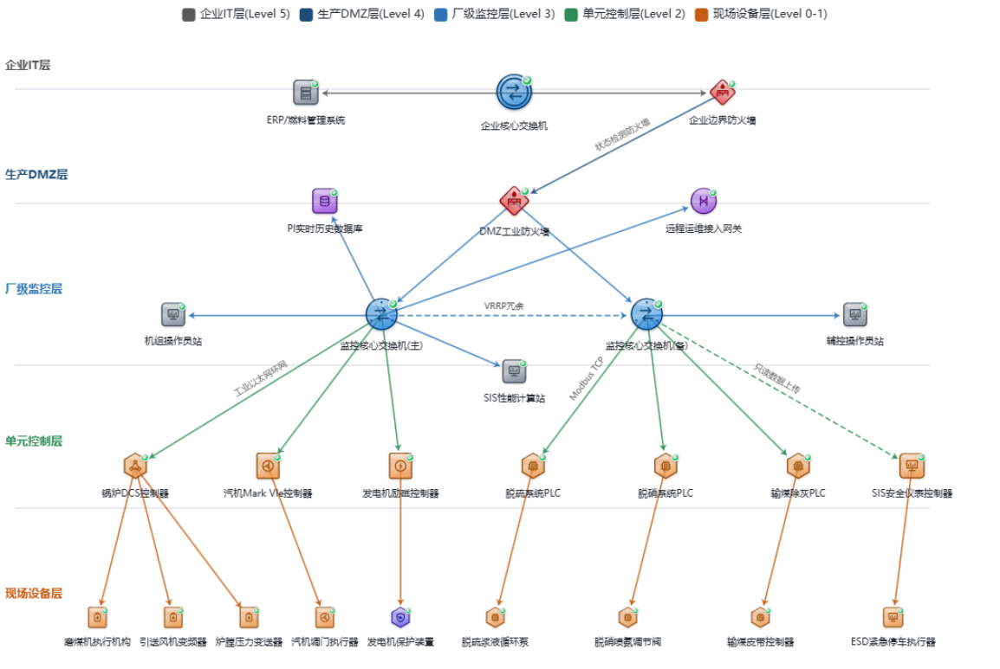
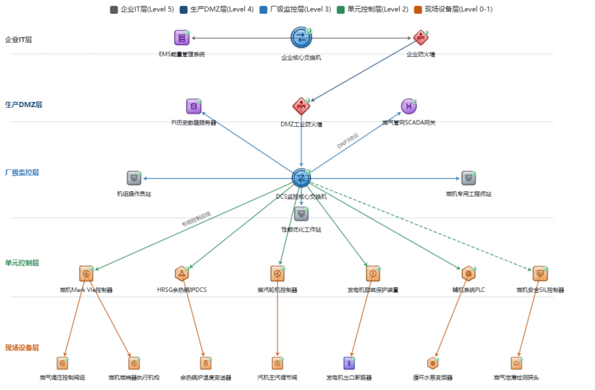
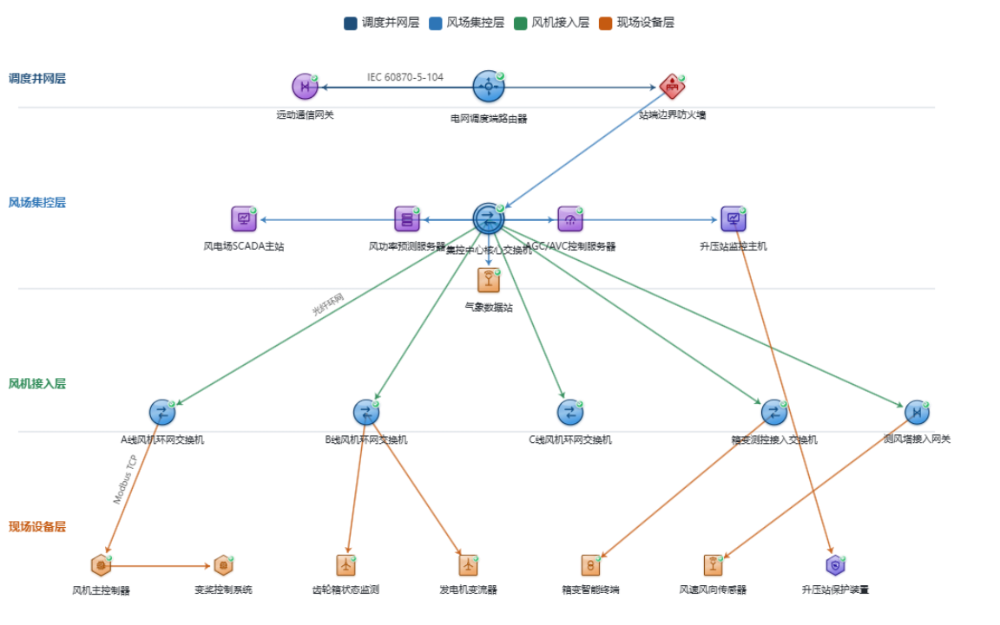
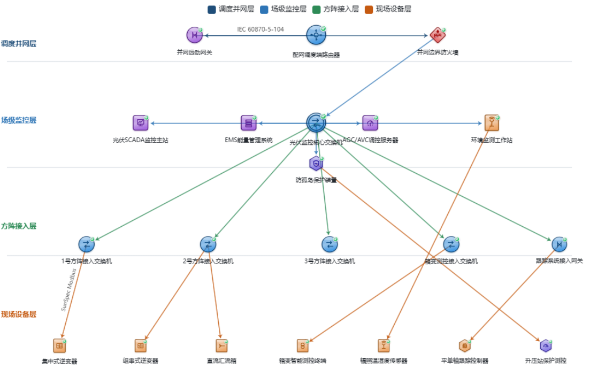
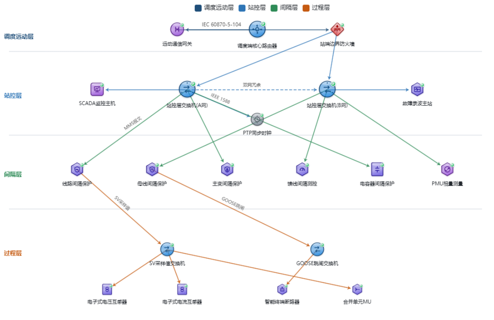
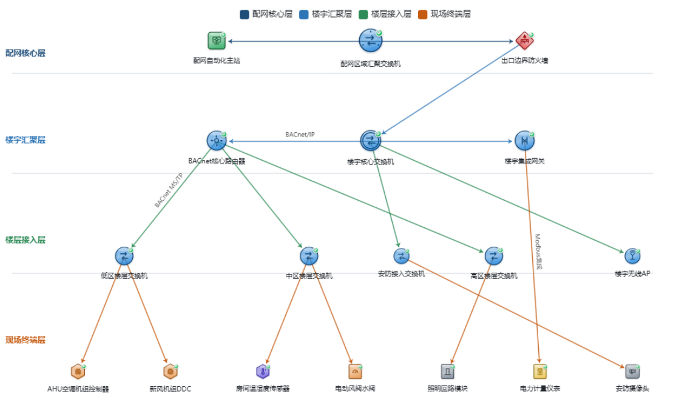
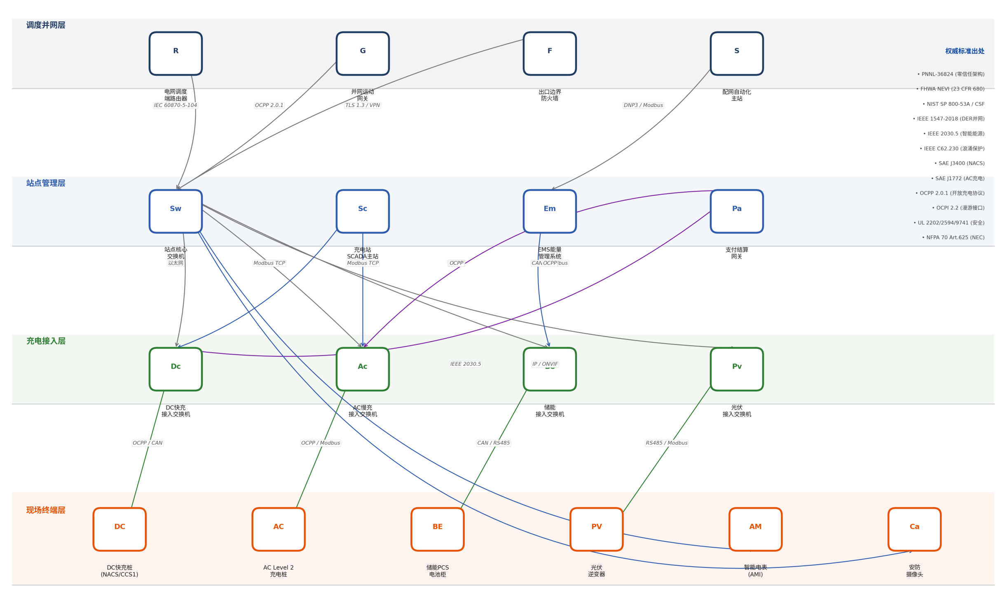
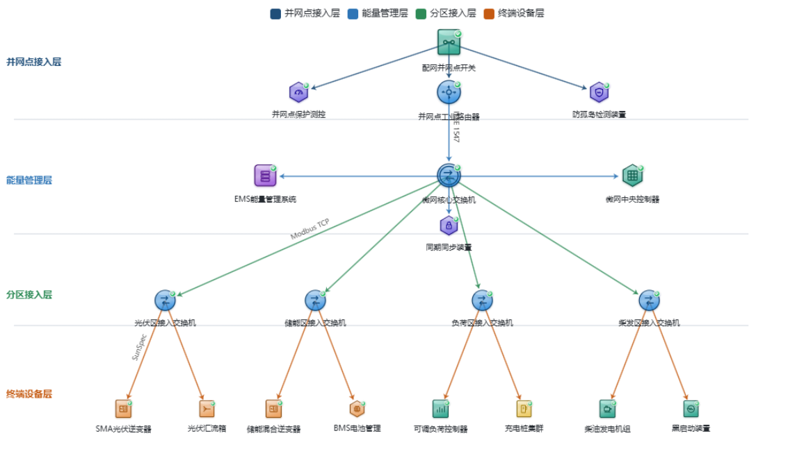

# 通用拓扑图图元与三维模型映射

> 本文档已排除第一张“电力系统全链路总网络拓扑（发-输-变-配-用-微网）”，仅整理第二至第九张拓扑图。

## 读取与实现规则

1. 原表首列“网络层级”只用于分组，不参与图元与模型的顺序对应。
2. 总表的第一业务列是“图中标注设备”，即总拓扑图的图元名称。
3. 总表的第二业务列是“关联工艺流程设备”，即关联三维模型；同一层级内按顺序与图元一一对应。模型数量少于图元数量时，只与前面等量图元对应，其余图元记为无模型。
4. 关联三维模型在源文档中为红字时，`是否聚焦描边`为`是`，交互效果为聚焦并描边。
5. 关联三维模型在源文档中为黑字时，`是否聚焦描边`为`否`，不绑定任何交互效果。
6. 图元没有对应模型时，`关联三维模型`记为`无`，不绑定任何交互效果。
7. 原表第四列“现场设备（网络拓扑）”仅作为设备或型号补充说明，不参与交互判定，也不强行与模型逐项绑定。
8. 关键环节子表的“图中标注设备”定义该关键环节子拓扑必须展示的节点集合，节点顺序按子表原始层级与列内顺序保留。
9. 关键环节子表的“关联工艺流程设备”定义该关键环节涉及的三维模型集合；节点与模型的具体绑定必须复用所属总拓扑的“图元与三维模型映射”，不得按子表行数或位置重新建立映射。
10. 关键环节子表只新增展示范围，不覆盖总表中的文字颜色和交互规则；红色模型聚焦描边，黑色模型无交互。
11. 源文档没有为关键环节子拓扑提供独立连线表。生成子拓扑时，必须先使用所属章节的名称差异表将图片名称归一为总表图元名称，再筛选已核验且两端都在该关键环节展示节点集合内的总拓扑连接，不得自行补线。

## 常用术语

- 运营技术（OT）：面向工业设备与生产过程的监控、控制技术。
- 分布式控制系统（DCS）：用于连续工业过程的分散控制系统。
- 可编程逻辑控制器（PLC）：用于工业逻辑和顺序控制的控制器。
- 监控与数据采集系统（SCADA）：用于远程监视、控制和数据采集的系统。
- 能量管理系统（EMS）：用于能源监测、优化与调度的系统。
- 隔离区（DMZ）：位于不同安全区域之间的缓冲网络区域。
- 安全仪表系统（SIS）与安全完整性等级（SIL）：用于风险降低的安全控制系统及其等级。
- 余热蒸汽发生器（HRSG）：燃气联合循环机组中的余热锅炉。
- 自动发电控制（AGC）与自动电压控制（AVC）：分别用于有功功率和电压无功调节。
- 同步相量测量单元（PMU）：用于同步测量电力系统相量的装置。
- 采样值（SV）、面向通用对象的变电站事件（GOOSE）与合并单元（MU）：数字化变电站过程层常用通信数据和设备。
- 楼宇自动化与控制网络协议（BACnet）、空气处理机组（AHU）与直接数字控制器（DDC）：楼宇自控常用协议和设备。
- 开放充电点协议（OCPP）、功率转换系统（PCS）、电池管理系统（BMS）与高级计量基础设施（AMI）：充电及储能系统常用协议和设备。

## 连接数据读取规则

- 每一行表示一条独立连接，不得因起点或终点相同而合并。
- `图示箭头`只记录图片中的视觉箭头，不自动等同于真实业务通信方向；未获得额外资料前，业务方向均按`待确认`处理。
- `线条`只记录原图颜色和实线/虚线，不自行推断安全等级、协议或控制语义。
- 连线相交但没有连接点时，只视为视觉交叉，不新增节点或连接。
- 协议或关系标签按原图保留；斜杠连接的多个协议不推断为“任选”“并行”或“协议栈”。
- 边的起点、终点使用图片显示名称；图片与原表名称不一致时必须增加别名映射，禁止用原表名称覆盖图片原文。

## 章节、图片与连接表对应关系

| 文档顺序 | 拓扑章节 | 图片文件 | 连接标识前缀 | 校验说明 |
|---:|---|---|---|---|
| 2 | 燃煤火力发电厂OT网络拓扑 | `02_燃煤火力发电厂OT网络拓扑.png` | `二-边` | 按源文档第二节 |
| 3 | 燃气联合循环（CCGT）发电厂OT网络拓扑 | `03_燃气联合循环发电厂OT网络拓扑.png` | `三-边` | 与用户提供的校验图一致 |
| 4 | 陆上风电场集控网络拓扑 | `04_陆上风电场集控网络拓扑.png` | `四-边` | 按源文档第四节 |
| 5 | 地面集中式光伏电站网络拓扑 | `05_地面集中式光伏电站网络拓扑.png` | `五-边` | 按源文档第五节 |
| 6 | 数字化变电站网络拓扑 | `06_数字化变电站网络拓扑.png` | `六-边` | 按源文档第六节 |
| 7 | 配用电-楼宇自控网络拓扑 | `07_配用电-楼宇自控网络拓扑.png` | `七-边` | 按源文档第七节 |
| 8 | 配用电-充电站网络拓扑 | `08_配用电-充电站网络拓扑.png` | `八-边` | 按源文档第八节 |
| 9 | 工商业微电网网络拓扑 | `09_工商业微电网网络拓扑.png` | `九-边` | 按源文档第九节 |

## 关键环节子拓扑索引

| 所属总拓扑 | 关键环节标识 | 关键环节名称 | 数据来源 |
|---|---|---|---|
| 燃煤火力发电厂OT网络拓扑 | 2.1 | 燃烧系统 | 源文档同名子表 |
| 燃煤火力发电厂OT网络拓扑 | 2.2 | 汽水循环系统 | 源文档同名子表 |
| 燃煤火力发电厂OT网络拓扑 | 2.3 | 发电输出 | 源文档同名子表 |
| 燃气联合循环（CCGT）发电厂OT网络拓扑 | 3.1 | 燃气轮机系统 | 源文档同名子表 |
| 燃气联合循环（CCGT）发电厂OT网络拓扑 | 3.2 | 余热锅炉系统 | 源文档同名子表 |
| 燃气联合循环（CCGT）发电厂OT网络拓扑 | 3.3 | 蒸汽轮机系统 | 源文档同名子表 |
| 陆上风电场集控网络拓扑 | 4.1 | 风能捕获 | 源文档同名子表 |
| 陆上风电场集控网络拓扑 | 4.2 | 动能转换 | 源文档同名子表 |
| 地面集中式光伏电站网络拓扑 | 5.1 | 直流汇流 | 源文档同名子表 |
| 地面集中式光伏电站网络拓扑 | 5.2 | 逆变转换 | 源文档同名子表 |

## 二、燃煤火力发电厂OT网络拓扑

### 图元与三维模型映射

| 网络层级 | 层内顺序 | 图元名称 | 关联三维模型 | 模型原文字色 | 是否聚焦描边 |
|---|---:|---|---|---|---|
| 企业IT层 (Level 5) | 1 | ERP/燃料管理系统 | 无 | 无 | 否 |
| 企业IT层 (Level 5) | 2 | 企业核心交换机 | 无 | 无 | 否 |
| 企业IT层 (Level 5) | 3 | 企业边界防火墙 | 无 | 无 | 否 |
| 生产DMZ层 (Level 4) | 1 | PI实时历史数据库 | 无 | 无 | 否 |
| 生产DMZ层 (Level 4) | 2 | DMZ工业防火墙 | 无 | 无 | 否 |
| 生产DMZ层 (Level 4) | 3 | 远程运维接入网关 | 无 | 无 | 否 |
| 厂级监控层 (Level 3) | 1 | 机组操作员站 | 无 | 无 | 否 |
| 厂级监控层 (Level 3) | 2 | 监控核心交换机(主) | 无 | 无 | 否 |
| 厂级监控层 (Level 3) | 3 | 监控核心交换机(备) | 无 | 无 | 否 |
| 厂级监控层 (Level 3) | 4 | 辅控操作员站 | 无 | 无 | 否 |
| 厂级监控层 (Level 3) | 5 | SIS性能计算站 | 无 | 无 | 否 |
| 单元控制层 (Level 2) | 1 | 锅炉DCS控制器 | 锅炉(炉膛/过热器/再热器/省煤器/空预器/汽包)、送风机/风管 | 红色 | 是 |
| 单元控制层 (Level 2) | 2 | 汽机DCS控制器 | 汽轮机(高压缸/中压缸/低压缸) | 红色 | 是 |
| 单元控制层 (Level 2) | 3 | 发电机励磁控制器 | 发电机(定子/转子/励磁系统) | 红色 | 是 |
| 单元控制层 (Level 2) | 4 | 脱硫系统PLC | 脱硫塔/吸收塔/浆液循环泵 | 黑色 | 否 |
| 单元控制层 (Level 2) | 5 | 脱硝系统PLC | 脱硝反应器/喷氨系统/催化剂 | 黑色 | 否 |
| 单元控制层 (Level 2) | 6 | 输煤除灰PLC | 输煤皮带/磨煤机/除灰系统 | 黑色 | 否 |
| 单元控制层 (Level 2) | 7 | SIS安全仪表控制器 | 锅炉/汽轮机/发电机安全联锁 | 红色 | 是 |
| 现场设备层 (Level 0-1) | 1 | 磨煤机执行机构 | 无 | 无 | 否 |
| 现场设备层 (Level 0-1) | 2 | 引送风机变频器 | 无 | 无 | 否 |
| 现场设备层 (Level 0-1) | 3 | 炉膛压力变送器 | 无 | 无 | 否 |
| 现场设备层 (Level 0-1) | 4 | 汽机调门执行器 | 无 | 无 | 否 |
| 现场设备层 (Level 0-1) | 5 | 发电机保护装置 | 无 | 无 | 否 |
| 现场设备层 (Level 0-1) | 6 | 脱硫浆液循环泵 | 无 | 无 | 否 |
| 现场设备层 (Level 0-1) | 7 | 脱硝喷氨调节阀 | 无 | 无 | 否 |
| 现场设备层 (Level 0-1) | 8 | 输煤皮带控制器 | 无 | 无 | 否 |
| 现场设备层 (Level 0-1) | 9 | ESD紧急停车执行器 | 无 | 无 | 否 |

### 关键环节子拓扑

> 以下各表只定义子拓扑的`展示节点集合`和`三维模型集合`。节点与模型的具体绑定关系统一查询本章总表，不得按子表中的行或位置重新配对。

#### 2.1 燃烧系统

| 网络层级 | 展示节点集合（按原表顺序） | 三维模型集合 |
|---|---|---|
| 厂级监控层 (Level 3) | 机组操作员站 监控核心交换机(主) 监控核心交换机(备) 辅控操作员站 SIS性能计算站 | 无 |
| 单元控制层 (Level 2) | 锅炉DCS控制器 SIS安全仪表控制器 | 锅炉(燃烧器/炉膛/空预器)、送风机/风管【红色，聚焦描边】 锅炉/汽轮机/发电机安全联锁【红色，聚焦描边】 |
| 现场设备层 (Level 0-1) | 磨煤机执行机构 引送风机变频器 炉膛压力变送器 ESD紧急停车执行器 | 无 |

#### 2.2 汽水循环系统

| 网络层级 | 展示节点集合（按原表顺序） | 三维模型集合 |
|---|---|---|
| 厂级监控层 (Level 3) | 机组操作员站 监控核心交换机(主) 监控核心交换机(备) 辅控操作员站 SIS性能计算站 | 无 |
| 单元控制层 (Level 2) | 汽机DCS控制器 SIS安全仪表控制器 | 汽轮机(高压缸/中压缸/低压缸)【红色，聚焦描边】 锅炉/汽轮机/发电机安全联锁【红色，聚焦描边】 |
| 现场设备层 (Level 0-1) | 汽机调门执行器 ESD紧急停车执行器 | 无 |

#### 2.3 发电输出

| 网络层级 | 展示节点集合（按原表顺序） | 三维模型集合 |
|---|---|---|
| 厂级监控层 (Level 3) | 机组操作员站 监控核心交换机(主) 监控核心交换机(备) 辅控操作员站 SIS性能计算站 | 无 |
| 单元控制层 (Level 2) | 汽机DCS控制器 发电机励磁控制器 SIS安全仪表控制器 | 汽轮机(高压缸/中压缸/低压缸)【红色，聚焦描边】 发电机(定子/转子/励磁系统)【红色，聚焦描边】 锅炉/汽轮机/发电机安全联锁【红色，聚焦描边】 |
| 现场设备层 (Level 0-1) | 汽机调门执行器 发电机保护装置 ESD紧急停车执行器 | 无 |

### 现场设备与型号补充

> 以下内容保持源文档第四列的原始顺序，仅作资料说明，不参与图元—模型映射及交互判定。

#### 单元控制层 (Level 2)

1. 锅炉DCS控制器（不采数）：
2. 1.霍尼韦尔 PKS
3. 2.横河 CENTUM
4. 汽机DCS控制器：
5. 1.西门子 T3000
6. 2.艾默生 Ovation
7. 发电机控制器（不采数）：
8. ABB Symphony Plus

### 拓扑连接关系

> 本节连接端点采用图片显示名称。原表名称不一致时，通过下表关联，禁止把两者误判为两个节点。

#### 图片显示名称与原表图元名称差异

| 图片显示名称 | 原表图元名称 |
|---|---|
| 汽机Mark VIe控制器 | 汽机DCS控制器 |
| 汽机阀门执行器 | 汽机调门执行器 |

| 连接标识 | 起点 | 终点 | 图示箭头 | 线条 | 协议或关系标签 | 核验状态 |
|---|---|---|---|---|---|---|
| 二-边01 | 企业核心交换机 | ERP/燃料管理系统 | 起点→终点 | 灰色实线 | 无 | 已核验 |
| 二-边02 | 企业核心交换机 | 企业边界防火墙 | 起点→终点 | 灰色实线 | 无 | 已核验 |
| 二-边03 | 企业边界防火墙 | DMZ工业防火墙 | 起点→终点 | 蓝色实线 | 状态检测防火墙 | 已核验 |
| 二-边04 | PI实时历史数据库 | 监控核心交换机(主) | 起点→终点 | 蓝色实线 | 无 | 已核验 |
| 二-边05 | DMZ工业防火墙 | 监控核心交换机(主) | 起点→终点 | 蓝色实线 | 无 | 已核验 |
| 二-边06 | DMZ工业防火墙 | 监控核心交换机(备) | 起点→终点 | 蓝色实线 | 无 | 已核验 |
| 二-边07 | 监控核心交换机(主) | 远程运维接入网关 | 起点→终点 | 蓝色实线 | 无 | 已核验 |
| 二-边08 | 监控核心交换机(主) | 机组操作员站 | 起点→终点 | 蓝色实线 | 无 | 已核验 |
| 二-边09 | 监控核心交换机(主) | SIS性能计算站 | 起点→终点 | 蓝色实线 | 无 | 已核验 |
| 二-边10 | 监控核心交换机(主) | 监控核心交换机(备) | 起点→终点 | 蓝色虚线 | 虚拟路由冗余协议（VRRP）冗余 | 已核验 |
| 二-边11 | 监控核心交换机(备) | 辅控操作员站 | 起点→终点 | 蓝色实线 | 无 | 已核验 |
| 二-边12 | 监控核心交换机(主) | 锅炉DCS控制器 | 起点→终点 | 绿色实线 | 工业以太网环网 | 已核验 |
| 二-边13 | 监控核心交换机(主) | 汽机Mark VIe控制器 | 起点→终点 | 绿色实线 | 无 | 已核验 |
| 二-边14 | 监控核心交换机(主) | 发电机励磁控制器 | 起点→终点 | 绿色实线 | 无 | 已核验 |
| 二-边15 | 监控核心交换机(备) | 脱硫系统PLC | 起点→终点 | 绿色实线 | 基于传输控制协议的Modbus协议（Modbus TCP） | 已核验 |
| 二-边16 | 监控核心交换机(备) | 脱硝系统PLC | 起点→终点 | 绿色实线 | 无 | 已核验 |
| 二-边17 | 监控核心交换机(备) | 输煤除灰PLC | 起点→终点 | 绿色实线 | 无 | 已核验 |
| 二-边18 | 监控核心交换机(备) | SIS安全仪表控制器 | 起点→终点 | 绿色虚线 | 只读数据上传 | 已核验 |
| 二-边19 | 锅炉DCS控制器 | 磨煤机执行机构 | 起点→终点 | 橙色实线 | 无 | 已核验 |
| 二-边20 | 锅炉DCS控制器 | 引送风机变频器 | 起点→终点 | 橙色实线 | 无 | 已核验 |
| 二-边21 | 锅炉DCS控制器 | 炉膛压力变送器 | 起点→终点 | 橙色实线 | 无 | 已核验 |
| 二-边22 | 汽机Mark VIe控制器 | 汽机阀门执行器 | 起点→终点 | 橙色实线 | 无 | 已核验 |
| 二-边23 | 发电机励磁控制器 | 发电机保护装置 | 起点→终点 | 橙色实线 | 无 | 已核验 |
| 二-边24 | 脱硫系统PLC | 脱硫浆液循环泵 | 起点→终点 | 橙色实线 | 无 | 已核验 |
| 二-边25 | 脱硝系统PLC | 脱硝喷氨调节阀 | 起点→终点 | 橙色实线 | 无 | 已核验 |
| 二-边26 | 输煤除灰PLC | 输煤皮带控制器 | 起点→终点 | 橙色实线 | 无 | 已核验 |
| 二-边27 | SIS安全仪表控制器 | ESD紧急停车执行器 | 起点→终点 | 橙色实线 | 无 | 已核验 |

名称差异与图示说明：

- 图片标注“汽机阀门执行器”，原表标注“汽机调门执行器”；连线端点采用图片名称，模型映射仍保留原表名称。
- 图片标注“汽机Mark VIe控制器”，原表标注“汽机DCS控制器”；连线端点采用图片名称，模型映射仍保留原表名称。
- 图片中的`PI实时历史数据库 → 监控核心交换机(主)`箭头方向与常见服务器接入画法不同；生成时可按图复现，但不得据此认定真实数据流方向。
- 主、备交换机之间的图片标签仅表示虚拟路由冗余协议（VRRP）冗余；真实业务方向未在图片中定义。

## 三、燃气联合循环（CCGT）发电厂OT网络拓扑

### 图元与三维模型映射

| 网络层级 | 层内顺序 | 图元名称 | 关联三维模型 | 模型原文字色 | 是否聚焦描边 |
|---|---:|---|---|---|---|
| 企业IT层 (Level 5) | 1 | EMS能量管理系统 | 无 | 无 | 否 |
| 企业IT层 (Level 5) | 2 | 企业核心交换机 | 无 | 无 | 否 |
| 企业IT层 (Level 5) | 3 | 企业防火墙 | 无 | 无 | 否 |
| 生产DMZ层 (Level 4) | 1 | PI历史数据服务器 | 无 | 无 | 否 |
| 生产DMZ层 (Level 4) | 2 | DMZ工业防火墙 | 无 | 无 | 否 |
| 生产DMZ层 (Level 4) | 3 | 燃气管网SCADA网关 | 无 | 无 | 否 |
| 厂级监控层 (Level 3) | 1 | 机组操作员站 | 无 | 无 | 否 |
| 厂级监控层 (Level 3) | 2 | DCS监控核心交换机 | 无 | 无 | 否 |
| 厂级监控层 (Level 3) | 3 | 燃机专用工程师站 | 无 | 无 | 否 |
| 厂级监控层 (Level 3) | 4 | 性能优化工作站 | 无 | 无 | 否 |
| 单元控制层 (Level 2) | 1 | 燃机Mark VIe控制器 | 燃气轮机(压气机/燃烧室/透平) | 红色 | 是 |
| 单元控制层 (Level 2) | 2 | HRSG余热锅炉DCS | 余热锅炉(高/中/低压蒸发器/过热器) | 红色 | 是 |
| 单元控制层 (Level 2) | 3 | 蒸汽轮机控制器 | 蒸汽轮机(高压缸/中压缸/低压缸) | 红色 | 是 |
| 单元控制层 (Level 2) | 4 | 发电机励磁保护装置 | 发电机(定子/转子/励磁系统) | 红色 | 是 |
| 单元控制层 (Level 2) | 5 | 辅机系统PLC | 循环水泵/冷却水泵/润滑油系统 | 红色 | 是 |
| 单元控制层 (Level 2) | 6 | 燃机安全SIL控制器 | 燃气轮机安全保护系统 | 红色 | 是 |
| 现场设备层 (Level 0-1) | 1 | 燃气调压控制阀组 | 燃气调压站/过滤分离器 | 黑色 | 否 |
| 现场设备层 (Level 0-1) | 2 | 燃机燃烧器执行机构 | 燃气轮机燃烧器/燃料喷嘴 | 黑色 | 否 |
| 现场设备层 (Level 0-1) | 3 | 余热锅炉温度变送器 | 余热锅炉各受热面/汽包 | 黑色 | 否 |
| 现场设备层 (Level 0-1) | 4 | 汽机主汽调节阀 | 汽轮机主汽门/调节汽门 | 黑色 | 否 |
| 现场设备层 (Level 0-1) | 5 | 发电机出口断路器 | 发电机出口开关 | 黑色 | 否 |
| 现场设备层 (Level 0-1) | 6 | 循环水泵变频器 | 循环水泵本体 | 黑色 | 否 |
| 现场设备层 (Level 0-1) | 7 | 燃气泄漏检测探头 | 燃气管道/阀门 | 黑色 | 否 |

### 关键环节子拓扑

> 以下各表只定义子拓扑的`展示节点集合`和`三维模型集合`。节点与模型的具体绑定关系统一查询本章总表，不得按子表中的行或位置重新配对。

#### 3.1 燃气轮机系统

| 网络层级 | 展示节点集合（按原表顺序） | 三维模型集合 |
|---|---|---|
| 生产DMZ层 (Level 4) | 燃气管网SCADA网关 | 无 |
| 厂级监控层 (Level 3) | 机组操作员站 DCS监控核心交换机 燃机专用工程师站 性能优化工作站 | 无 |
| 单元控制层 (Level 2) | 燃机Mark VIe控制器 发电机励磁保护装置 辅机系统PLC 燃机安全SIL控制器 | 燃气轮机(压气机/燃烧室/透平)【红色，聚焦描边】 发电机(定子/转子/励磁系统)【红色，聚焦描边】 循环水泵/冷却水泵/润滑油系统【红色，聚焦描边】 燃气轮机安全保护系统【红色，聚焦描边】 |
| 现场设备层 (Level 0-1) | 燃气调压控制阀组 燃机燃烧器执行机构 余热锅炉温度变送器 汽机主汽调节阀 发电机出口断路器 循环水泵变频器 燃气泄漏检测探头 | 无 |

#### 3.2 余热锅炉系统

| 网络层级 | 展示节点集合（按原表顺序） | 三维模型集合 |
|---|---|---|
| 生产DMZ层 (Level 4) | 燃气管网SCADA网关 | 无 |
| 厂级监控层 (Level 3) | 机组操作员站 DCS监控核心交换机 燃机专用工程师站 性能优化工作站 | 无 |
| 单元控制层 (Level 2) | HRSG余热锅炉DCS | 余热锅炉(高/中/低压蒸发器/过热器)【红色，聚焦描边】 循环水泵/冷却水泵/润滑油系统【红色，聚焦描边】 |
| 现场设备层 (Level 0-1) | 燃气调压控制阀组 燃机燃烧器执行机构 余热锅炉温度变送器 汽机主汽调节阀 发电机出口断路器 循环水泵变频器 燃气泄漏检测探头 | 无 |

> `循环水泵/冷却水泵/润滑油系统`在总表中绑定`辅机系统PLC`，但该节点不在本关键环节展示节点集合内。该模型仍属于本环节展示范围，不向`HRSG余热锅炉DCS`建立新绑定。

#### 3.3 蒸汽轮机系统

| 网络层级 | 展示节点集合（按原表顺序） | 三维模型集合 |
|---|---|---|
| 生产DMZ层 (Level 4) | 燃气管网SCADA网关 | 无 |
| 厂级监控层 (Level 3) | 机组操作员站 DCS监控核心交换机 燃机专用工程师站 性能优化工作站 | 无 |
| 单元控制层 (Level 2) | 蒸汽轮机控制器 发电机励磁保护装置 辅机系统PLC | 蒸汽轮机(高压缸/中压缸/低压缸)【红色，聚焦描边】 发电机(定子/转子/励磁系统)【红色，聚焦描边】 |
| 现场设备层 (Level 0-1) | 燃气调压控制阀组 燃机燃烧器执行机构 余热锅炉温度变送器 汽机主汽调节阀 发电机出口断路器 循环水泵变频器 燃气泄漏检测探头 | 无 |

> `辅机系统PLC`在本子拓扑中展示，但其总表绑定模型`循环水泵/冷却水泵/润滑油系统`不属于本关键环节模型集合，因此不触发模型聚焦。

### 现场设备与型号补充

> 以下内容保持源文档第四列的原始顺序，仅作资料说明，不参与图元—模型映射及交互判定。

#### 单元控制层 (Level 2)

1. 燃机Mark VIe控制器：
2. GE Mark VIe
3. 燃气发电机（不采数）：
4. ABB Symphony Plus

### 拓扑连接关系

> 用户提供的校验图与本章节高分辨率原图一致：单台DCS监控核心交换机，并包含燃气管网SCADA网关。

| 连接标识 | 起点 | 终点 | 图示箭头 | 线条 | 协议或关系标签 | 核验状态 |
|---|---|---|---|---|---|---|
| 三-边01 | 企业核心交换机 | EMS能量管理系统 | 起点→终点 | 灰色实线 | 无 | 已核验 |
| 三-边02 | 企业核心交换机 | 企业防火墙 | 起点→终点 | 灰色实线 | 无 | 已核验 |
| 三-边03 | 企业防火墙 | DMZ工业防火墙 | 起点→终点 | 蓝色实线 | 无 | 已核验 |
| 三-边04 | DMZ工业防火墙 | DCS监控核心交换机 | 起点→终点 | 蓝色实线 | 无 | 已核验 |
| 三-边05 | DCS监控核心交换机 | PI历史数据服务器 | 起点→终点 | 蓝色实线 | 无 | 已核验 |
| 三-边06 | DCS监控核心交换机 | 燃气管网SCADA网关 | 起点→终点 | 蓝色实线 | 分布式网络协议第3版（DNP3） | 已核验 |
| 三-边07 | DCS监控核心交换机 | 机组操作员站 | 起点→终点 | 蓝色实线 | 无 | 已核验 |
| 三-边08 | DCS监控核心交换机 | 燃机专用工程师站 | 起点→终点 | 蓝色实线 | 无 | 已核验 |
| 三-边09 | DCS监控核心交换机 | 性能优化工作站 | 起点→终点 | 蓝色实线 | 无 | 已核验 |
| 三-边10 | DCS监控核心交换机 | 燃机Mark VIe控制器 | 起点→终点 | 绿色实线 | 专用控制总线 | 已核验 |
| 三-边11 | DCS监控核心交换机 | HRSG余热锅炉DCS | 起点→终点 | 绿色实线 | 无 | 已核验 |
| 三-边12 | DCS监控核心交换机 | 蒸汽轮机控制器 | 起点→终点 | 绿色实线 | 无 | 已核验 |
| 三-边13 | DCS监控核心交换机 | 发电机励磁保护装置 | 起点→终点 | 绿色实线 | 无 | 已核验 |
| 三-边14 | DCS监控核心交换机 | 辅机系统PLC | 起点→终点 | 绿色实线 | 无 | 已核验 |
| 三-边15 | DCS监控核心交换机 | 燃机安全SIL控制器 | 起点→终点 | 绿色虚线 | 无 | 已核验 |
| 三-边16 | 燃机Mark VIe控制器 | 燃气调压控制阀组 | 起点→终点 | 橙色实线 | 无 | 已核验 |
| 三-边17 | 燃机Mark VIe控制器 | 燃机燃烧器执行机构 | 起点→终点 | 橙色实线 | 无 | 已核验 |
| 三-边18 | HRSG余热锅炉DCS | 余热锅炉温度变送器 | 起点→终点 | 橙色实线 | 无 | 已核验 |
| 三-边19 | 蒸汽轮机控制器 | 汽机主汽调节阀 | 起点→终点 | 橙色实线 | 无 | 已核验 |
| 三-边20 | 发电机励磁保护装置 | 发电机出口断路器 | 起点→终点 | 橙色实线 | 无 | 已核验 |
| 三-边21 | 辅机系统PLC | 循环水泵变频器 | 起点→终点 | 橙色实线 | 无 | 已核验 |
| 三-边22 | 燃机安全SIL控制器 | 燃气泄漏检测探头 | 起点→终点 | 橙色实线 | 无 | 已核验 |

## 四、陆上风电场集控网络拓扑

### 图元与三维模型映射

| 网络层级 | 层内顺序 | 图元名称 | 关联三维模型 | 模型原文字色 | 是否聚焦描边 |
|---|---:|---|---|---|---|
| 调度并网层 | 1 | 远动通信网关 | 无 | 无 | 否 |
| 调度并网层 | 2 | 电网调度端路由器 | 无 | 无 | 否 |
| 调度并网层 | 3 | 站端边界防火墙 | 无 | 无 | 否 |
| 风场集控层 | 1 | 风电场SCADA主站 | 无 | 无 | 否 |
| 风场集控层 | 2 | 风功率预测服务器 | 无 | 无 | 否 |
| 风场集控层 | 3 | 集控中心核心交换机 | 无 | 无 | 否 |
| 风场集控层 | 4 | AGC/AVC控制服务器 | 无 | 无 | 否 |
| 风场集控层 | 5 | 升压站监控主机 | 无 | 无 | 否 |
| 风场集控层 | 6 | 气象数据站 | 无 | 无 | 否 |
| 风机接入层 | 1 | A线风机环网交换机 | A线风机群通信 | 红色 | 是 |
| 风机接入层 | 2 | B线风机环网交换机 | B线风机群通信 | 红色 | 是 |
| 风机接入层 | 3 | C线风机环网交换机 | C线风机群通信 | 红色 | 是 |
| 风机接入层 | 4 | 箱变测控接入交换机 | 箱式变电站群 | 红色 | 是 |
| 风机接入层 | 5 | 测风塔接入网关 | 测风塔传感器 | 红色 | 是 |
| 现场设备层 | 1 | 风机主控制器 | 风力发电机组(叶片/轮毂/机舱) | 黑色 | 否 |
| 现场设备层 | 2 | 变桨控制系统 | 风机叶片变桨轴承/电机 | 红色 | 是 |
| 现场设备层 | 3 | 齿轮箱状态监测 | 齿轮箱(行星轮/平行轴) | 红色 | 是 |
| 现场设备层 | 4 | 发电机变流器 | 发电机(永磁同步/双馈) | 红色 | 是 |
| 现场设备层 | 5 | 箱变智能终端 | 箱式变电站(变压器/高低压柜) | 红色 | 是 |
| 现场设备层 | 6 | 风速风向传感器 | 风机机舱/测风塔 | 红色 | 是 |
| 现场设备层 | 7 | 升压站保护装置 | 升压站变压器/断路器/母线 | 黑色 | 否 |

### 关键环节子拓扑

> 以下各表只定义子拓扑的`展示节点集合`和`三维模型集合`。节点与模型的具体绑定关系统一查询本章总表，不得按子表中的行或位置重新配对。

#### 4.1 风能捕获

| 网络层级 | 展示节点集合（按原表顺序） | 三维模型集合 |
|---|---|---|
| 风场集控层 | 风电场SCADA主站 风功率预测服务器 集控中心核心交换机 AGC/AVC控制服务器 | 无 |
| 风机接入层 | A线风机环网交换机 测风塔接入网关 | A线风机群通信【红色，聚焦描边】 测风塔传感器【红色，聚焦描边】 |
| 现场设备层 | 风机主控制器 变桨控制系统 风速风向传感器 | 风力发电机组(叶片/轮毂/机舱)【黑色，无交互】 风机叶片变桨轴承/电机【红色，聚焦描边】 风机机舱/测风塔【红色，聚焦描边】 |

#### 4.2 动能转换

| 网络层级 | 展示节点集合（按原表顺序） | 三维模型集合 |
|---|---|---|
| 风场集控层 | 风电场SCADA主站 风功率预测服务器 集控中心核心交换机 AGC/AVC控制服务器 升压站监控主机 | 无 |
| 风机接入层 | B线风机环网交换机 箱变测控接入交换机 | B线风机群通信【红色，聚焦描边】 箱式变电站群【红色，聚焦描边】 |
| 现场设备层 | 变桨控制系统 齿轮箱状态监测 发电机变流器 箱变智能终端 升压站保护装置 | 风机叶片变桨轴承/电机【红色，聚焦描边】 齿轮箱(行星轮/平行轴)【红色，聚焦描边】 发电机(永磁同步/双馈)【红色，聚焦描边】 箱式变电站(变压器/高低压柜)【红色，聚焦描边】 升压站变压器/断路器/母线【黑色，无交互】 |

### 现场设备与型号补充

> 以下内容保持源文档第四列的原始顺序，仅作资料说明，不参与图元—模型映射及交互判定。

#### 风场集控层

1. AGC/AVC控制服务器：
2. 1.GE Mark VIe
3. 2.巴赫曼 MPC240/W
4. 3.菲尼克斯 AXCF3152

### 拓扑连接关系

> 本节连接端点采用图片显示名称。原表名称不一致时，通过下表关联，禁止把两者误判为两个节点。

#### 图片显示名称与原表图元名称差异

| 图片显示名称 | 原表图元名称 |
|---|---|
| 风机接入网关 | 测风塔接入网关 |

| 连接标识 | 起点 | 终点 | 图示箭头 | 线条 | 协议或关系标签 | 核验状态 |
|---|---|---|---|---|---|---|
| 四-边01 | 电网调度端路由器 | 远动通信网关 | 起点→终点 | 深蓝色实线 | 远动通信协议（IEC 60870-5-104） | 已核验 |
| 四-边02 | 电网调度端路由器 | 站端边界防火墙 | 起点→终点 | 深蓝色实线 | 远动通信协议（IEC 60870-5-104） | 已核验 |
| 四-边03 | 站端边界防火墙 | 集控中心核心交换机 | 起点→终点 | 蓝色实线 | 无 | 已核验 |
| 四-边04 | 集控中心核心交换机 | 风电场SCADA主站 | 起点→终点 | 蓝色实线 | 无 | 已核验 |
| 四-边05 | 集控中心核心交换机 | 风功率预测服务器 | 起点→终点 | 蓝色实线 | 无 | 已核验 |
| 四-边06 | 集控中心核心交换机 | AGC/AVC控制服务器 | 起点→终点 | 蓝色实线 | 无 | 已核验 |
| 四-边07 | 集控中心核心交换机 | 升压站监控主机 | 起点→终点 | 蓝色实线 | 无 | 已核验 |
| 四-边08 | 集控中心核心交换机 | 气象数据站 | 起点→终点 | 橙色实线 | 无 | 已核验 |
| 四-边09 | 集控中心核心交换机 | A线风机环网交换机 | 起点→终点 | 绿色实线 | 光纤环网 | 已核验 |
| 四-边10 | 集控中心核心交换机 | B线风机环网交换机 | 起点→终点 | 绿色实线 | 无 | 已核验 |
| 四-边11 | 集控中心核心交换机 | C线风机环网交换机 | 起点→终点 | 绿色实线 | 无 | 已核验 |
| 四-边12 | 集控中心核心交换机 | 箱变测控接入交换机 | 起点→终点 | 绿色实线 | 无 | 已核验 |
| 四-边13 | 集控中心核心交换机 | 风机接入网关 | 起点→终点 | 绿色实线 | 无 | 已核验 |
| 四-边14 | A线风机环网交换机 | 风机主控制器 | 起点→终点 | 橙色实线 | 基于传输控制协议的Modbus协议（Modbus TCP） | 已核验 |
| 四-边15 | 风机主控制器 | 变桨控制系统 | 起点→终点 | 橙色实线 | 无 | 已核验 |
| 四-边16 | B线风机环网交换机 | 齿轮箱状态监测 | 起点→终点 | 橙色实线 | 无 | 已核验 |
| 四-边17 | B线风机环网交换机 | 发电机变流器 | 起点→终点 | 橙色实线 | 无 | 已核验 |
| 四-边18 | 箱变测控接入交换机 | 箱变智能终端 | 起点→终点 | 橙色实线 | 无 | 已核验 |
| 四-边19 | 风机接入网关 | 风速风向传感器 | 起点→终点 | 橙色实线 | 无 | 已核验 |
| 四-边20 | 升压站监控主机 | 升压站保护装置 | 起点→终点 | 橙色实线 | 无 | 已核验 |

名称差异与待确认项：

- 图片标注“风机接入网关”，原表标注“测风塔接入网关”；连接端点采用图片名称，模型映射仍保留原表名称。
- `风机主控制器 → 变桨控制系统`是现场设备之间的横向连接，不是A线风机环网交换机直接连接变桨控制系统。
- `升压站监控主机 → 升压站保护装置`跨过风机接入层，应保留为直接连接。
- C线风机环网交换机在图片中没有继续连接现场设备。

## 五、地面集中式光伏电站网络拓扑

### 图元与三维模型映射

| 网络层级 | 层内顺序 | 图元名称 | 关联三维模型 | 模型原文字色 | 是否聚焦描边 |
|---|---:|---|---|---|---|
| 调度并网层 | 1 | 并网远动网关 | 无 | 无 | 否 |
| 调度并网层 | 2 | 配网调度端路由器 | 无 | 无 | 否 |
| 调度并网层 | 3 | 并网边界防火墙 | 无 | 无 | 否 |
| 场级监控层 | 1 | 光伏SCADA监控主站 | 无 | 无 | 否 |
| 场级监控层 | 2 | EMS能量管理系统 | 无 | 无 | 否 |
| 场级监控层 | 3 | 光伏监控核心交换机 | 无 | 无 | 否 |
| 场级监控层 | 4 | AGC/AVC调控服务器 | 无 | 无 | 否 |
| 场级监控层 | 5 | 环境监测工作站 | 无 | 无 | 否 |
| 场级监控层 | 6 | 防孤岛保护装置 | 无 | 无 | 否 |
| 方阵接入层 | 1 | 1号方阵接入交换机 | 1号光伏方阵、集中式逆变器 | 红色 | 是 |
| 方阵接入层 | 2 | 2号方阵接入交换机 | 2号光伏方阵、组串式逆变器、直流汇流箱 | 红色 | 是 |
| 方阵接入层 | 3 | 3号方阵接入交换机 | 3号光伏方阵 | 黑色 | 否 |
| 方阵接入层 | 4 | 箱变测控接入交换机 | 箱式变电站群 | 红色 | 是 |
| 方阵接入层 | 5 | 跟踪系统接入网关 | 光伏跟踪支架群 | 黑色 | 否 |
| 现场设备层 | 1 | 集中式逆变器 | 无 | 无 | 否 |
| 现场设备层 | 2 | 组串式逆变器 | 无 | 无 | 否 |
| 现场设备层 | 3 | 直流汇流箱 | 无 | 无 | 否 |
| 现场设备层 | 4 | 箱变智能测控终端 | 无 | 无 | 否 |
| 现场设备层 | 5 | 辐照温湿度传感器 | 无 | 无 | 否 |
| 现场设备层 | 6 | 平单轴跟踪控制器 | 无 | 无 | 否 |
| 现场设备层 | 7 | 升压站保护测控 | 无 | 无 | 否 |

### 关键环节子拓扑

> 以下各表只定义子拓扑的`展示节点集合`和`三维模型集合`。节点与模型的具体绑定关系统一查询本章总表，不得按子表中的行或位置重新配对。

#### 5.1 直流汇流

| 网络层级 | 展示节点集合（按原表顺序） | 三维模型集合 |
|---|---|---|
| 场级监控层 | 光伏SCADA监控主站 EMS能量管理系统 光伏监控核心交换机 AGC/AVC调控服务器 环境监测工作站 | 无 |
| 方阵接入层 | 2号方阵接入交换机 箱变测控接入交换机 跟踪系统接入网关 | 2号光伏方阵、组串式逆变器、直流汇流箱【红色，聚焦描边】 箱式变电站群【红色，聚焦描边】 光伏跟踪支架群【黑色，无交互】 |
| 现场设备层 | 组串式逆变器 直流汇流箱 箱变智能测控终端 辐照温湿度传感器 平单轴跟踪控制器 | 无 |

#### 5.2 逆变转换

| 网络层级 | 展示节点集合（按原表顺序） | 三维模型集合 |
|---|---|---|
| 场级监控层 | 光伏SCADA监控主站 EMS能量管理系统 光伏监控核心交换机 AGC/AVC调控服务器 环境监测工作站 防孤岛保护装置 | 无 |
| 方阵接入层 | 1号方阵接入交换机 2号方阵接入交换机 箱变测控接入交换机 | 1号光伏方阵、集中式逆变器【红色，聚焦描边】 2号光伏方阵、组串式逆变器、直流汇流箱【红色，聚焦描边】 箱式变电站群【红色，聚焦描边】 |
| 现场设备层 | 集中式逆变器 组串式逆变器 直流汇流箱 箱变智能测控终端 | 无 |

### 拓扑连接关系

| 连接标识 | 起点 | 终点 | 图示箭头 | 线条 | 协议或关系标签 | 核验状态 |
|---|---|---|---|---|---|---|
| 五-边01 | 配网调度端路由器 | 并网远动网关 | 起点→终点 | 深蓝色实线 | 远动通信协议（IEC 60870-5-104） | 已核验 |
| 五-边02 | 配网调度端路由器 | 并网边界防火墙 | 起点→终点 | 深蓝色实线 | 远动通信协议（IEC 60870-5-104） | 已核验 |
| 五-边03 | 并网边界防火墙 | 光伏监控核心交换机 | 起点→终点 | 蓝色实线 | 无 | 已核验 |
| 五-边04 | 光伏监控核心交换机 | 光伏SCADA监控主站 | 起点→终点 | 蓝色实线 | 无 | 已核验 |
| 五-边05 | 光伏监控核心交换机 | EMS能量管理系统 | 起点→终点 | 蓝色实线 | 无 | 已核验 |
| 五-边06 | 光伏监控核心交换机 | AGC/AVC调控服务器 | 起点→终点 | 蓝色实线 | 无 | 已核验 |
| 五-边07 | 光伏监控核心交换机 | 环境监测工作站 | 起点→终点 | 蓝色实线 | 无 | 已核验 |
| 五-边08 | 光伏监控核心交换机 | 防孤岛保护装置 | 起点→终点 | 橙色实线 | 无 | 已核验 |
| 五-边09 | 光伏监控核心交换机 | 1号方阵接入交换机 | 起点→终点 | 绿色实线 | 无 | 已核验 |
| 五-边10 | 光伏监控核心交换机 | 2号方阵接入交换机 | 起点→终点 | 绿色实线 | 无 | 已核验 |
| 五-边11 | 光伏监控核心交换机 | 3号方阵接入交换机 | 起点→终点 | 绿色实线 | 无 | 已核验 |
| 五-边12 | 光伏监控核心交换机 | 箱变测控接入交换机 | 起点→终点 | 绿色实线 | 无 | 已核验 |
| 五-边13 | 光伏监控核心交换机 | 跟踪系统接入网关 | 起点→终点 | 绿色实线 | 无 | 已核验 |
| 五-边14 | 1号方阵接入交换机 | 集中式逆变器 | 起点→终点 | 橙色实线 | 太阳能设备通信规范及Modbus协议（SunSpec Modbus） | 已核验 |
| 五-边15 | 2号方阵接入交换机 | 组串式逆变器 | 起点→终点 | 橙色实线 | 无 | 已核验 |
| 五-边16 | 2号方阵接入交换机 | 直流汇流箱 | 起点→终点 | 橙色实线 | 无 | 已核验 |
| 五-边17 | 箱变测控接入交换机 | 箱变智能测控终端 | 起点→终点 | 橙色实线 | 无 | 已核验 |
| 五-边18 | 环境监测工作站 | 辐照温湿度传感器 | 起点→终点 | 橙色实线 | 无 | 已核验 |
| 五-边19 | 跟踪系统接入网关 | 平单轴跟踪控制器 | 起点→终点 | 橙色实线 | 无 | 已核验 |
| 五-边20 | 防孤岛保护装置 | 升压站保护测控 | 起点→终点 | 橙色实线 | 无 | 已核验 |

待确认项：

- `环境监测工作站 → 辐照温湿度传感器`与`防孤岛保护装置 → 升压站保护测控`均跨过方阵接入层，生成时必须保持直接连接，不能就近吸附到交换机。
- 3号方阵接入交换机在图片中没有继续连接现场设备。

## 六、数字化变电站网络拓扑

### 图元与三维模型映射

| 网络层级 | 层内顺序 | 图元名称 | 关联三维模型 | 模型原文字色 | 是否聚焦描边 |
|---|---:|---|---|---|---|
| 调度远动层 | 1 | 远动通信网关 | 无 | 无 | 否 |
| 调度远动层 | 2 | 调度端核心路由器 | 无 | 无 | 否 |
| 调度远动层 | 3 | 站端边界防火墙 | 无 | 无 | 否 |
| 站控层 | 1 | SCADA监控主机 | 无 | 无 | 否 |
| 站控层 | 2 | 站控层交换机(A网) | 无 | 无 | 否 |
| 站控层 | 3 | 站控层交换机(B网) | 无 | 无 | 否 |
| 站控层 | 4 | 故障录波主站 | 无 | 无 | 否 |
| 站控层 | 5 | PTP同步时钟 | 无 | 无 | 否 |
| 间隔层 | 1 | 线路间隔保护 | 输电线路(架空线/电缆) | 红色 | 是 |
| 间隔层 | 2 | 母线间隔保护 | 变电站母线 | 红色 | 是 |
| 间隔层 | 3 | 主变间隔保护 | 主变压器(本体/套管/有载调压) | 红色 | 是 |
| 间隔层 | 4 | 馈线间隔测控 | 配电馈线(出线开关柜) | 红色 | 是 |
| 间隔层 | 5 | 电容器间隔保护 | 电容器组(电容器/电抗器) | 红色 | 是 |
| 间隔层 | 6 | PMU相量测量 | 线路/母线/变压器相量 | 红色 | 是 |
| 间隔层 | 7 | 行波故障定位装置 | 无 | 无 | 否 |
| 间隔层 | 8 | 断路器保护 | 无 | 无 | 否 |
| 过程层 | 1 | SV采样值交换机 | 采样值传输网络 | 黑色 | 否 |
| 过程层 | 2 | GOOSE跳闸交换机 | GOOSE跳闸网络 | 黑色 | 否 |
| 过程层 | 3 | 电子式电压互感器 | 母线/线路电压测量 | 黑色 | 否 |
| 过程层 | 4 | 电子式电流互感器 | 线路/变压器电流测量 | 黑色 | 否 |
| 过程层 | 5 | 智能终端断路器 | 断路器(分合闸控制) | 黑色 | 否 |
| 过程层 | 6 | 合并单元MU | 互感器二次信号合并 | 黑色 | 否 |

### 现场设备与型号补充

> 以下内容保持源文档第四列的原始顺序，仅作资料说明，不参与图元—模型映射及交互判定。

#### 间隔层

1. 线路间隔保护：
2. GE D072-L90
3. 母线间隔保护
4. 主变间隔保护
5. SEL D45-SEL387E
6. SEL D29-SEL487V
7. SEL D50-SEL787L
8. ABB D17-REX521
9. SEL D51-SEL787Z
10. 馈线间隔测控
11. GE D01-F35:C1
12. 电容器间隔保护
13. PMU相量测量
14. SEL D52-SEL734B
15. 行波故障定位装置
16. SEL D381-TWFL
17. SEL D382-TWFL
18. 断路器保护
19. GE D04-C60

### 拓扑连接关系

| 连接标识 | 起点 | 终点 | 图示箭头 | 线条 | 协议或关系标签 | 核验状态 |
|---|---|---|---|---|---|---|
| 六-边01 | 调度端核心路由器 | 远动通信网关 | 起点→终点 | 蓝色实线 | 远动通信协议（IEC 60870-5-104） | 已核验 |
| 六-边02 | 调度端核心路由器 | 站端边界防火墙 | 起点→终点 | 蓝色实线 | 无 | 已核验 |
| 六-边03 | 站端边界防火墙 | 站控层交换机(A网) | 起点→终点 | 浅蓝色实线 | 无 | 已核验 |
| 六-边04 | 站端边界防火墙 | 站控层交换机(B网) | 起点→终点 | 浅蓝色实线 | 无 | 已核验 |
| 六-边05 | 站控层交换机(A网) | SCADA监控主机 | 起点→终点 | 蓝色实线 | 无 | 已核验 |
| 六-边06 | 站控层交换机(A网) | 站控层交换机(B网) | 起点→终点 | 蓝色虚线 | 双网冗余；业务语义为无向冗余 | 已核验 |
| 六-边07 | 站控层交换机(B网) | 故障录波主站 | 起点→终点 | 蓝色实线 | 无 | 已核验 |
| 六-边08 | 站控层交换机(A网) | 线路间隔保护 | 起点→终点 | 绿色实线 | 制造报文规范网络（MMS网络） | 已核验 |
| 六-边09 | 站控层交换机(A网) | 主变间隔保护 | 起点→终点 | 绿色实线 | 无 | 已核验 |
| 六-边10 | 站控层交换机(A网) | PTP同步时钟 | 起点→终点 | 绿色实线 | 精确时钟同步标准（IEEE 1588） | 已核验 |
| 六-边11 | 站控层交换机(B网) | PTP同步时钟 | 起点→终点 | 绿色实线 | 无 | 已核验 |
| 六-边12 | PTP同步时钟 | 母线间隔保护 | 起点→终点 | 绿色实线 | 无 | 已核验 |
| 六-边13 | PTP同步时钟 | 电容器间隔保护 | 起点→终点 | 绿色实线 | 无 | 已核验 |
| 六-边14 | 站控层交换机(B网) | 馈线间隔测控 | 起点→终点 | 绿色实线 | 无 | 已核验 |
| 六-边15 | 站控层交换机(B网) | PMU相量测量 | 起点→终点 | 绿色实线 | 无 | 已核验 |
| 六-边16 | 线路间隔保护 | SV采样值交换机 | 起点→终点 | 橙色实线 | 采样值（SV） | 已核验 |
| 六-边17 | 母线间隔保护 | GOOSE跳闸交换机 | 起点→终点 | 橙色实线 | 面向通用对象的变电站事件网络（GOOSE网络） | 已核验 |
| 六-边18 | SV采样值交换机 | 电子式电压互感器 | 起点→终点 | 橙色实线 | 无 | 已核验 |
| 六-边19 | SV采样值交换机 | 电子式电流互感器 | 起点→终点 | 橙色实线 | 无 | 已核验 |
| 六-边20 | SV采样值交换机 | 合并单元MU | 起点→终点 | 橙色实线 | 无 | 已核验 |
| 六-边21 | GOOSE跳闸交换机 | 智能终端断路器 | 起点→终点 | 橙色实线 | 无 | 已核验 |

名称差异与待确认项：

- 原表中的“行波故障定位装置”和“断路器保护”未出现在图片的可见节点中，仅保留为表格来源资料，不得进入图片拓扑节点集，也不得自动补线。
- `六-边11`至`六-边13`已按箭头尖端重新核验，端点和方向明确。
- 双网冗余连接的业务语义为无向，不应因图示箭头而实现为单向通信。

## 七、配用电-楼宇自控网络拓扑

### 图元与三维模型映射

| 网络层级 | 层内顺序 | 图元名称 | 关联三维模型 | 模型原文字色 | 是否聚焦描边 |
|---|---:|---|---|---|---|
| 配网核心层 | 1 | 配网自动化主站 | 无 | 无 | 否 |
| 配网核心层 | 2 | 配网区域汇聚交换机 | 无 | 无 | 否 |
| 配网核心层 | 3 | 出口边界防火墙 | 无 | 无 | 否 |
| 楼宇汇聚层 | 1 | BACnet核心路由器 | 无 | 无 | 否 |
| 楼宇汇聚层 | 2 | 楼宇核心交换机 | 无 | 无 | 否 |
| 楼宇汇聚层 | 3 | 楼宇集成网关 | 无 | 无 | 否 |
| 楼层接入层 | 1 | 低区楼层交换机 | 低区楼层设备群 | 红色 | 是 |
| 楼层接入层 | 2 | 中区楼层交换机 | 中区楼层设备群 | 红色 | 是 |
| 楼层接入层 | 3 | 安防接入交换机 | 安防设备群(摄像头/门禁) | 红色 | 是 |
| 楼层接入层 | 4 | 高区楼层交换机 | 高区楼层设备群 | 红色 | 是 |
| 楼层接入层 | 5 | 楼宇无线AP | 移动终端/无线传感器 | 红色 | 是 |
| 现场终端层 | 1 | AHU空调机组控制器 | 空调机组(风机/盘管/过滤器) | 黑色 | 否 |
| 现场终端层 | 2 | 新风机组DDC | 新风机组(风机/过滤器/热回收) | 黑色 | 否 |
| 现场终端层 | 3 | 房间温湿度传感器 | 房间空调末端/环境 | 黑色 | 否 |
| 现场终端层 | 4 | 电动风阀水阀 | 风管风阀/水管阀门 | 黑色 | 否 |
| 现场终端层 | 5 | 照明回路模块 | 照明灯具/回路 | 黑色 | 否 |
| 现场终端层 | 6 | 电力计量仪表 | 配电回路/用电设备 | 黑色 | 否 |
| 现场终端层 | 7 | 安防摄像头 | 安防监控区域 | 黑色 | 否 |

### 现场设备与型号补充

> 以下内容保持源文档第四列的原始顺序，仅作资料说明，不参与图元—模型映射及交互判定。

#### 配网核心层

1. 楼宇自动化主站：
2. ALC OFBBC

#### 楼宇汇聚层

1. 网关：
2. ALC G5CE
3. 路由器：
4. ALC LGR1000

### 拓扑连接关系

| 连接标识 | 起点 | 终点 | 图示箭头 | 线条 | 协议或关系标签 | 核验状态 |
|---|---|---|---|---|---|---|
| 七-边01 | 配网区域汇聚交换机 | 配网自动化主站 | 起点→终点 | 蓝色实线 | 无 | 已核验 |
| 七-边02 | 配网区域汇聚交换机 | 出口边界防火墙 | 起点→终点 | 蓝色实线 | 无 | 已核验 |
| 七-边03 | 出口边界防火墙 | 楼宇核心交换机 | 起点→终点 | 浅蓝色实线 | 无 | 已核验 |
| 七-边04 | 楼宇核心交换机 | BACnet核心路由器 | 起点→终点 | 蓝色实线 | 楼宇自动化与控制网络互联网协议（BACnet/IP） | 已核验 |
| 七-边05 | 楼宇核心交换机 | 楼宇集成网关 | 起点→终点 | 蓝色实线 | 无 | 已核验 |
| 七-边06 | BACnet核心路由器 | 低区楼层交换机 | 起点→终点 | 绿色实线 | 楼宇自动化与控制网络主从令牌传递协议（BACnet MS/TP） | 已核验 |
| 七-边07 | BACnet核心路由器 | 中区楼层交换机 | 起点→终点 | 绿色实线 | 无 | 已核验 |
| 七-边08 | BACnet核心路由器 | 高区楼层交换机 | 起点→终点 | 绿色实线 | 无 | 已核验 |
| 七-边09 | 楼宇核心交换机 | 安防接入交换机 | 起点→终点 | 绿色实线 | 无 | 已核验 |
| 七-边10 | 楼宇核心交换机 | 楼宇无线AP | 起点→终点 | 绿色实线 | 无 | 已核验 |
| 七-边11 | 低区楼层交换机 | AHU空调机组控制器 | 起点→终点 | 橙色实线 | 无 | 已核验 |
| 七-边12 | 低区楼层交换机 | 新风机组DDC | 起点→终点 | 橙色实线 | 无 | 已核验 |
| 七-边13 | 中区楼层交换机 | 房间温湿度传感器 | 起点→终点 | 橙色实线 | 无 | 已核验 |
| 七-边14 | 中区楼层交换机 | 电动风阀水阀 | 起点→终点 | 橙色实线 | 无 | 已核验 |
| 七-边15 | 高区楼层交换机 | 照明回路模块 | 起点→终点 | 橙色实线 | 无 | 已核验 |
| 七-边16 | 楼宇集成网关 | 电力计量仪表 | 起点→终点 | 橙色实线 | Modbus标准 | 已核验 |
| 七-边17 | 安防接入交换机 | 安防摄像头 | 起点→终点 | 橙色实线 | 无 | 已核验 |

## 八、配用电-充电站网络拓扑

### 图元与三维模型映射

| 网络层级 | 层内顺序 | 图元名称 | 关联三维模型 | 模型原文字色 | 是否聚焦描边 |
|---|---:|---|---|---|---|
| 调度并网层 | 1 | 电网调度端路由器 | 无 | 无 | 否 |
| 调度并网层 | 2 | 并网远动网关 | 无 | 无 | 否 |
| 调度并网层 | 3 | 出口边界防火墙 | 无 | 无 | 否 |
| 调度并网层 | 4 | 配网自动化主站 | 无 | 无 | 否 |
| 站点管理层 | 1 | 站点核心交换机 | 无 | 无 | 否 |
| 站点管理层 | 2 | 充电站SCADA主站 | 无 | 无 | 否 |
| 站点管理层 | 3 | EMS能量管理系统 | 无 | 无 | 否 |
| 站点管理层 | 4 | 支付结算网关 | 无 | 无 | 否 |
| 充电接入层 | 1 | DC快充接入交换机 | DC快充桩群通信汇聚 (OCPP / CAN) | 红色 | 是 |
| 充电接入层 | 2 | AC慢充接入交换机 | AC Level 2桩群通信汇聚 (OCPP / Modbus) | 红色 | 是 |
| 充电接入层 | 3 | 储能接入交换机 | 储能系统通信汇聚 (CAN / RS485) | 红色 | 是 |
| 充电接入层 | 4 | 光伏接入交换机 | 光伏逆变器群通信汇聚 (RS485 / Modbus) | 红色 | 是 |
| 现场终端层 | 1 | DC快充桩 (NACS/CCS1) | DC快充枪本体 (液冷/风冷 / 150~350kW) | 黑色 | 否 |
| 现场终端层 | 2 | AC Level 2充电桩 | AC慢充桩本体 (J1772/NACS / 7~19.2kW) | 黑色 | 否 |
| 现场终端层 | 3 | 储能PCS电池柜 | 储能电池柜 (PCS+BMS / 锂电池) | 黑色 | 否 |
| 现场终端层 | 4 | 光伏逆变器 | 光伏组件方阵 / 汇流箱 / 逆变器 | 黑色 | 否 |
| 现场终端层 | 5 | 智能电表 (AMI) | 关口双向计量表 (Revenue-grade Metering) | 黑色 | 否 |
| 现场终端层 | 6 | 安防摄像头 | 视频监控与安防系统 (IP/ONVIF) | 黑色 | 否 |

### 拓扑连接关系

#### 图片节点简称

| 图片简称 | 规范名称 | 网络层级 |
|---|---|---|
| R | 电网调度端路由器 | 调度并网层 |
| G | 并网远动网关 | 调度并网层 |
| F | 出口边界防火墙 | 调度并网层 |
| S | 配网自动化主站 | 调度并网层 |
| Sw | 站点核心交换机 | 站点管理层 |
| Sc | 充电站SCADA主站 | 站点管理层 |
| Em | EMS能量管理系统 | 站点管理层 |
| Pa | 支付结算网关 | 站点管理层 |
| Dc | DC快充接入交换机 | 充电接入层 |
| Ac | AC慢充接入交换机 | 充电接入层 |
| 无清晰简称 | 储能接入交换机 | 充电接入层 |
| Pv | 光伏接入交换机 | 充电接入层 |
| DC | DC快充桩 (NACS/CCS1) | 现场终端层 |
| AC | AC Level 2充电桩 | 现场终端层 |
| BE | 储能PCS电池柜 | 现场终端层 |
| PV | 光伏逆变器 | 现场终端层 |
| AM | 智能电表 (AMI) | 现场终端层 |
| Ca | 安防摄像头 | 现场终端层 |

#### 已核验连接

| 连接标识 | 起点 | 终点 | 图示箭头 | 线条 | 协议或关系标签 | 核验状态 |
|---|---|---|---|---|---|---|
| 八-边01 | 电网调度端路由器 | 站点核心交换机 | 起点→终点 | 灰色曲线 | 远动通信协议（IEC 60870-5-104） | 已核验 |
| 八-边02 | 并网远动网关 | 站点核心交换机 | 起点→终点 | 灰色实线 | 开放充电点协议（OCPP 2.0.1） | 已核验 |
| 八-边03 | 出口边界防火墙 | 站点核心交换机 | 起点→终点 | 灰色实线 | 传输层安全协议1.3/虚拟专用网络（TLS 1.3/VPN） | 已核验 |
| 八-边04 | 配网自动化主站 | EMS能量管理系统 | 起点→终点 | 灰色曲线 | 分布式网络协议第3版/Modbus协议（DNP3/Modbus） | 已核验 |
| 八-边05 | 充电站SCADA主站 | DC快充接入交换机 | 起点→终点 | 蓝色实线 | 基于传输控制协议的Modbus协议（Modbus TCP） | 已核验 |
| 八-边06 | 充电站SCADA主站 | AC慢充接入交换机 | 起点→终点 | 蓝色实线 | 基于传输控制协议的Modbus协议（Modbus TCP） | 已核验 |
| 八-边07 | EMS能量管理系统 | 储能接入交换机 | 起点→终点 | 蓝色实线 | 开放充电点协议（OCPP 2.0.1） | 已核验 |
| 八-边08 | DC快充接入交换机 | DC快充桩 (NACS/CCS1) | 起点→终点 | 绿色实线 | 开放充电点协议/控制器局域网（OCPP/CAN） | 已核验 |
| 八-边09 | AC慢充接入交换机 | AC Level 2充电桩 | 起点→终点 | 绿色实线 | 开放充电点协议/Modbus协议（OCPP/Modbus） | 已核验 |
| 八-边10 | 储能接入交换机 | 储能PCS电池柜 | 起点→终点 | 绿色实线 | 控制器局域网/串行通信标准（CAN/RS485） | 已核验 |
| 八-边11 | 光伏接入交换机 | 光伏逆变器 | 起点→终点 | 绿色实线 | 串行通信标准/Modbus协议（RS485/Modbus） | 已核验 |
| 八-边12 | 站点核心交换机 | DC快充接入交换机 | 起点→终点 | 灰色实线 | 无 | 已核验 |
| 八-边13 | 站点核心交换机 | AC慢充接入交换机 | 起点→终点 | 灰色实线 | 无 | 已核验 |
| 八-边14 | 站点核心交换机 | 储能接入交换机 | 起点→终点 | 灰色实线 | 无 | 已核验 |
| 八-边15 | 站点核心交换机 | 光伏接入交换机 | 起点→终点 | 灰色实线 | 无 | 已核验 |
| 八-边16 | 站点核心交换机 | 智能电表 (AMI) | 起点→终点 | 蓝色曲线 | 智能能源应用协议（IEEE 2030.5） | 已核验 |
| 八-边17 | 站点核心交换机 | 安防摄像头 | 起点→终点 | 蓝色曲线 | 互联网协议/开放网络视频接口论坛协议（IP/ONVIF） | 已核验 |
| 八-边18 | EMS能量管理系统 | AC慢充接入交换机 | 起点→终点 | 紫色曲线 | 开放充电点协议（OCPP） | 已核验 |
| 八-边19 | 支付结算网关 | AC慢充接入交换机 | 起点→终点 | 紫色结算曲线 | 无 | 已核验 |
| 八-边20 | EMS能量管理系统 | 支付结算网关 | 起点→终点 | 紫色曲线 | 无 | 已核验 |

> `八-边18`至`八-边20`的端点和方向由用户对照原图确认。

#### 待确认连接

无。

#### 图片右侧标准出处

以下内容属于拓扑元数据，不是节点：

- PNNL-36824：零信任架构。
- FHWA NEVI（23 CFR 680）：美国国家电动汽车基础设施要求。
- NIST SP 800-53A / CSF：美国国家标准与技术研究院安全评估与网络安全框架。
- IEEE 1547-2018：分布式能源并网标准。
- IEEE 2030.5：智能能源应用协议。
- IEEE C62.230：浪涌保护相关标准。
- SAE J3400：北美充电标准。
- SAE J1772：交流充电标准。
- OCPP 2.0.1：开放充电点协议。
- OCPI 2.2：开放充电点接口，面向充电漫游。
- UL 2202/2594/9741：充电与安全相关标准。
- NFPA 70 Art.625：美国国家电气规范中的电动汽车供电设备条款。

## 九、工商业微电网网络拓扑

### 图元与三维模型映射

| 网络层级 | 层内顺序 | 图元名称 | 关联三维模型 | 模型原文字色 | 是否聚焦描边 |
|---|---:|---|---|---|---|
| 并网点接入层 | 1 | 配网并网点开关 | 无 | 无 | 否 |
| 并网点接入层 | 2 | 并网点保护测控 | 无 | 无 | 否 |
| 并网点接入层 | 3 | 并网点工业路由器 | 无 | 无 | 否 |
| 并网点接入层 | 4 | 防孤岛检测装置 | 无 | 无 | 否 |
| 能量管理层 | 1 | EMS能量管理系统 | 无 | 无 | 否 |
| 能量管理层 | 2 | 微网核心交换机 | 无 | 无 | 否 |
| 能量管理层 | 3 | 微网中央控制器 | 无 | 无 | 否 |
| 能量管理层 | 4 | 同期同步装置 | 无 | 无 | 否 |
| 分区接入层 | 1 | 光伏区接入交换机 | 光伏发电子系统 | 黑色 | 否 |
| 分区接入层 | 2 | 储能区接入交换机 | 储能子系统 | 黑色 | 否 |
| 分区接入层 | 3 | 负荷区接入交换机 | 可控/不可控负荷群 | 黑色 | 否 |
| 分区接入层 | 4 | 柴发区接入交换机 | 柴油发电子系统 | 黑色 | 否 |
| 终端设备层 | 1 | SMA光伏逆变器 | 光伏组件方阵 | 红色 | 是 |
| 终端设备层 | 2 | 光伏汇流箱 | 光伏组件串 | 红色 | 是 |
| 终端设备层 | 3 | 储能混合逆变器 | 储能电池组(锂电池/铅酸) | 红色 | 是 |
| 终端设备层 | 4 | BMS电池管理 | 储能电池单体/模组 | 红色 | 是 |
| 终端设备层 | 5 | 可调负荷控制器 | 空调/照明/产线可调负荷 | 红色 | 是 |
| 终端设备层 | 6 | 充电桩集群 | 电动汽车充电 | 红色 | 是 |
| 终端设备层 | 7 | 柴油发电机组 | 柴油发电机本体 | 红色 | 是 |
| 终端设备层 | 8 | 黑启动装置 | 柴油发电机/储能(黑启动电源) | 红色 | 是 |

### 现场设备与型号补充

> 以下内容保持源文档第四列的原始顺序，仅作资料说明，不参与图元—模型映射及交互判定。

#### 终端设备层

1. SMA光伏逆变器：
2. SMA SB4.0-1AV-41/4KW
3. 储能逆变器：
4. SMA SI6.0H-13/4.6KW
5. 可调负荷控制器：
6. 1.艾默生 CPE400
7. 2.艾默生 CPE205

### 拓扑连接关系

| 连接标识 | 起点 | 终点 | 图示箭头 | 线条 | 协议或关系标签 | 核验状态 |
|---|---|---|---|---|---|---|
| 九-边01 | 配网并网点开关 | 并网点保护测控 | 起点→终点 | 蓝色实线 | 无 | 已核验 |
| 九-边02 | 配网并网点开关 | 并网点工业路由器 | 起点→终点 | 蓝色实线 | 无 | 已核验 |
| 九-边03 | 配网并网点开关 | 防孤岛检测装置 | 起点→终点 | 蓝色实线 | 无 | 已核验 |
| 九-边04 | 并网点工业路由器 | 微网核心交换机 | 起点→终点 | 蓝色虚线 | 分布式能源并网与互操作标准（IEEE 1547） | 已核验 |
| 九-边05 | 微网核心交换机 | EMS能量管理系统 | 起点→终点 | 蓝色实线 | 无 | 已核验 |
| 九-边06 | 微网核心交换机 | 微网中央控制器 | 起点→终点 | 蓝色实线 | 无 | 已核验 |
| 九-边07 | 微网核心交换机 | 同期同步装置 | 起点→终点 | 蓝色实线 | 无 | 已核验 |
| 九-边08 | 微网核心交换机 | 光伏区接入交换机 | 起点→终点 | 绿色实线 | 基于传输控制协议的Modbus协议（Modbus TCP） | 已核验 |
| 九-边09 | 微网核心交换机 | 储能区接入交换机 | 起点→终点 | 绿色实线 | 无 | 已核验 |
| 九-边10 | 微网核心交换机 | 负荷区接入交换机 | 起点→终点 | 绿色实线 | 无 | 已核验 |
| 九-边11 | 微网核心交换机 | 柴发区接入交换机 | 起点→终点 | 绿色实线 | 无 | 已核验 |
| 九-边12 | 光伏区接入交换机 | SMA光伏逆变器 | 起点→终点 | 橙色实线 | 太阳能设备通信规范（SunSpec） | 已核验 |
| 九-边13 | 光伏区接入交换机 | 光伏汇流箱 | 起点→终点 | 橙色实线 | 无 | 已核验 |
| 九-边14 | 储能区接入交换机 | 储能混合逆变器 | 起点→终点 | 橙色实线 | 无 | 已核验 |
| 九-边15 | 储能区接入交换机 | BMS电池管理 | 起点→终点 | 橙色实线 | 无 | 已核验 |
| 九-边16 | 负荷区接入交换机 | 可调负荷控制器 | 起点→终点 | 橙色实线 | 无 | 已核验 |
| 九-边17 | 负荷区接入交换机 | 充电桩集群 | 起点→终点 | 橙色实线 | 无 | 已核验 |
| 九-边18 | 柴发区接入交换机 | 柴油发电机组 | 起点→终点 | 橙色实线 | 无 | 已核验 |
| 九-边19 | 柴发区接入交换机 | 黑启动装置 | 起点→终点 | 橙色实线 | 无 | 已核验 |

> 专业校核说明：原图竖排文字被连线和节点名称遮挡，容易误读为“IEC-1547”。结合可辨认字形及微电网并网语境，应还原为电气电子工程师学会第1547号标准（IEEE 1547）。该标准规定分布式能源与电力系统的并网和互操作要求，此处作为并网标准关系标签，不代表具体通信协议。参考：[电气电子工程师学会标准协会的IEEE 1547-2018标准说明](https://standards.ieee.org/ieee/1547/5915/)。

## 数据使用约束

- 只依据`是否聚焦描边`字段决定交互；不得根据设备名称、层级或第四列型号自行推断交互。
- 同一层级内的`层内顺序`来自源表，调整顺序会破坏图元与三维模型的对应关系。
- `关联三维模型`为`无`或`是否聚焦描边`为`否`时，图元均不应触发三维模型聚焦、描边或其他交互。
- 每个图片中可见的图元生成一个节点；仅出现在原表、未出现在图片中的设备只保留为来源资料，不得生成节点。
- 图片名称与原表名称不一致时只生成一个节点，并通过别名映射关联，不得生成两个同义节点。
- 网络层级按各拓扑映射表自上而下排列；同层节点优先按`层内顺序`从左到右排列，精确位置以原图为视觉参考。
- 默认生成`核验状态=已核验`的连接；`已核验连接，箭头待确认`可生成方向未知的连接；`部分待确认`和`待确认`不得进入正式拓扑。
- `图示箭头`仅用于复现图片，不代表业务通信一定单向；若业务逻辑需要方向，必须另行提供依据。
- 虚线、实线和颜色应按连接表复现，但不得把颜色自行解释为安全域、协议类型或优先级。
- 图片简称、协议标签、标准出处和第四列设备型号均为元数据，不得误建为拓扑节点。
- 连线交叉且没有显式连接点时不得创建隐含节点；同端点的不同协议或不同线型连接也不得自动去重。
